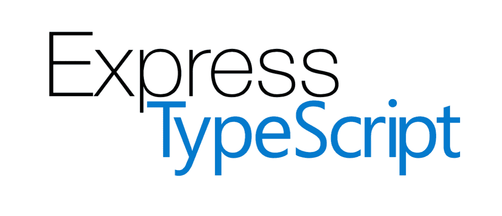
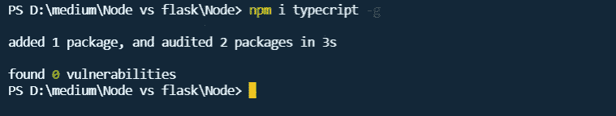
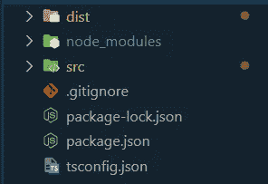
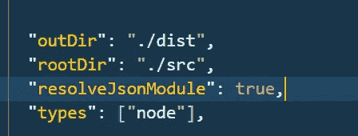
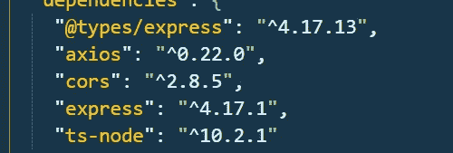
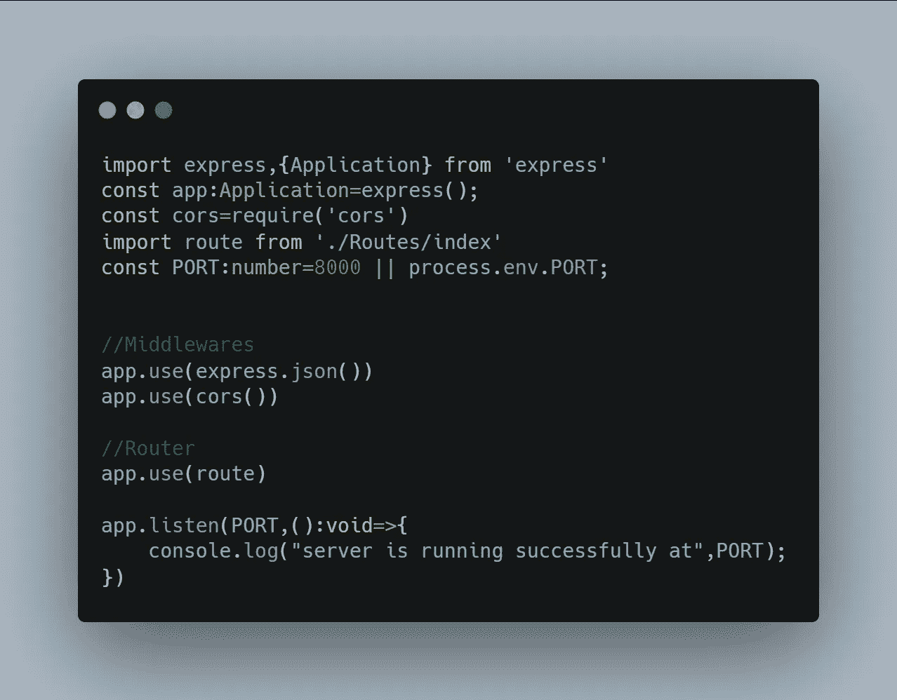
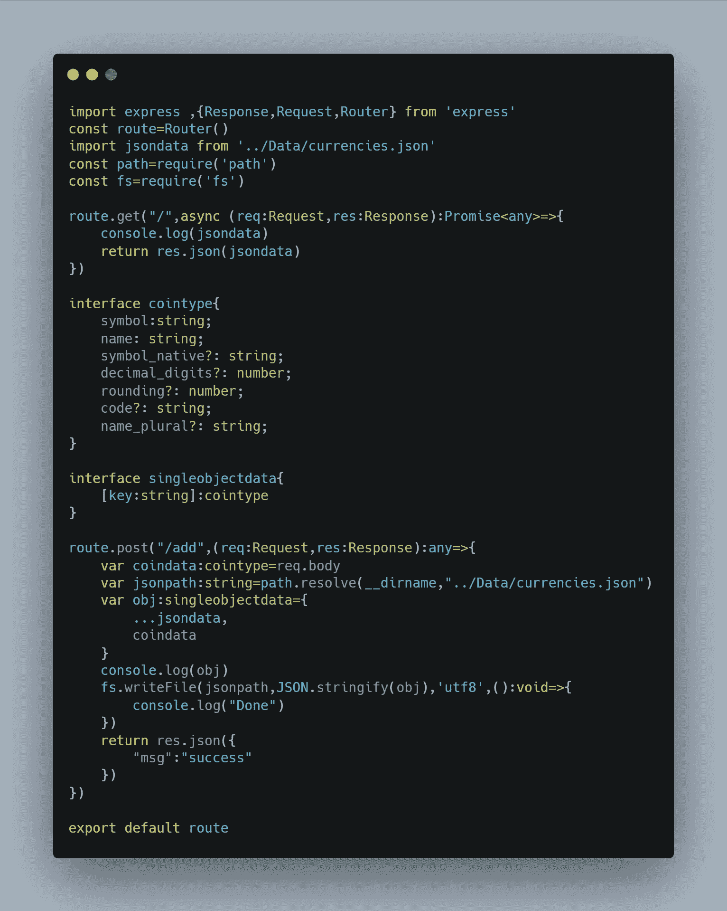

# Express with TypeScript:创建 REST API

> 原文：<https://javascript.plainenglish.io/express-with-typescript-8732e9dc7e2b?source=collection_archive---------4----------------------->



在本文中，我们将使用 Express 和 TypeScript 创建一个处理 JSON 数据的 REST API。你们应该熟悉 Express 和 JavaScript。让我们看看如何用 TypeScript 和 Express 创建一个 API。

## 让我们把工作分成小块

*   在项目中安装和初始化 TypeScript
*   创建带有类型批注的空 Express 项目
*   初始化路线
*   编译和运行

## 1.在项目中安装和初始化 TypeScript

这里我们需要从 npm 注册表安装一个 TypeScript 模块。我们正在全球范围内安装 TypeScript，这样我们就可以在其他项目中使用它，一旦我们的项目被编译，就与这个模块无关了。所以不要把它安装在你的项目中。



```
npm i typescript -g
```

现在我们可以通过创建一个 **tsconfig** 文件来初始化 TypeScript。您可以手动创建它，也可以使用下面的命令创建一个带有默认值的 **tsconfig** 文件。

```
tsconfig — init
```



然后我们必须对 **tsconfig.json** 文件做一些修改。



上面的改动是要做的。 *outDir* 表示输出目录，我们的编译将被放置在那里。然后, *rootDir* 表示 TypeScript 编译器的输入文件，也就是您的 TypeScript 文件。我们将 resolveJsonModule 标志设为 true，因为我们将在 API 中导入 JSON 文件。最后，类型被称为节点。

## 2.创建带有类型批注的空 Express 项目

TypeScript 已成功初始化，现在我们可以安装所需的模块。



安装所有的模块，当我们在代码中使用它们的时候，我会解释这些模块。我们正在安装一个名为@types/Express 的额外模块，以获取 Express 中使用的默认方法类型。在 src 目录中创建一个 index.ts 文件，并初始化 Express 应用程序。



## 3.初始化路线和功能

我们的应用程序已经创建并成功运行在端口 8000 上，然后我们可以初始化分配给它的路由和功能。请求和响应具有在 Express 中声明的默认类型。



## 4.编译和运行

我们写的 TypeScript 代码必须编译成 JavaScript。JavaScript 代码可以使用 node 运行。

> ThermalStressCracking 热应力龟裂

上面的脚本编译代码，编译后的 js 将放在 tsconfig.js 中提到的 outDir 中，文件结构是一样的。所以你很容易明白是怎么回事。

并且有一个直接运行 ts 文件的快捷方式。您可以使用 ts-node 模块直接运行 TypeScript 文件，而无需编译它。

> ts 节点。/src/索引. ts

[](https://github.com/NaveenkumarMD/Express-with-typescript) [## GitHub-NaveenkumarMD/Express-with type script

### 通过在 GitHub 上创建一个帐户，为 NaveenkumarMD/Express-with type script 开发做出贡献。

github.com](https://github.com/NaveenkumarMD/Express-with-typescript) 

最后，我们的项目准备好了。您可以查看 GitHub repo 以获取源代码。如果有任何疑问，请在 Github 上创建问题。

*更多内容看*[***plain English . io***](http://plainenglish.io/)