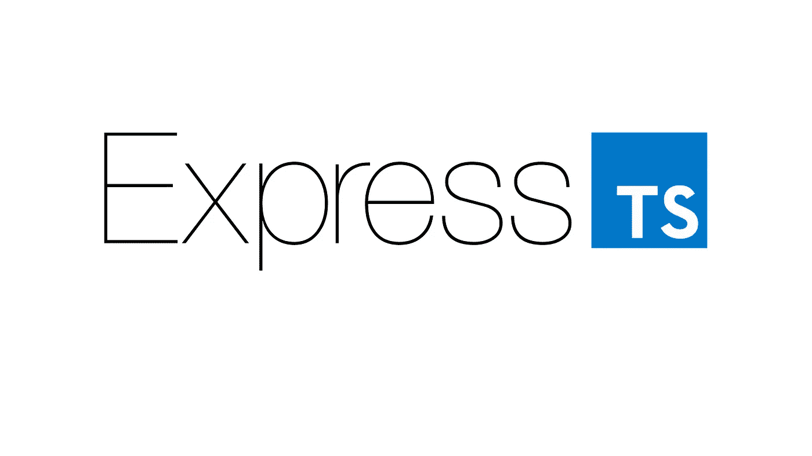

# Express with TypeScript(和 ES 模块—编译、构建)

> 原文：<https://javascript.plainenglish.io/express-with-typescript-and-es-modules-compilation-build-44f175150073?source=collection_archive---------2----------------------->



Express 是 Node.js 后端开发中最流行的库之一。今天，我们将介绍如何为 Express framework 添加 TypeScript 支持。

如果你不熟悉 Express，想看快速教程，可以看看我的另一个故事《快速入门》。

[](/express-js-getting-started-basic-routing-938d8b629fe2) [## 快速入门和基本路线

### 什么是 Express.js？Express.js & installation 入门，并学习如何使用实现基本路由…

javascript.plainenglish.io](/express-js-getting-started-basic-routing-938d8b629fe2) 

**要求**

*   Node.js 需要安装在您的系统上。

## 初始化

让我们创建一个空文件夹并初始化我们的 **package.json** 文件

```
mkdir ExpressApp && cd ExpressApp
```

在我们的应用程序文件夹初始化之后，我们需要初始化 npm

```
npm init -y
```

安装 Express

```
yarn add express
```

安装 TypeScript 和所需类型

```
yarn add -D typescript ts-node @types/node @types/express
```

在添加了所有必需的包之后，现在我们可以初始化我们的 TypeScript 配置文件了

```
yarn tsc --init
```

成功初始化您的 typescript 配置后，它将为您创建 **tsconfig.json** 文件。

为了能够在 Node.js 中使用 es 模块并构建应用程序，需要进行一些更改

我已经添加了带有解释的配置文件。

如果你想了解更多关于 tsconfig 文件的信息，你可以看看这里的。

到目前为止，我们已经初始化了所有需要的东西！现在我们可以继续前进，用 TypeScript 创建我们的 Express 应用程序了！

## 快速开发

在安装了所有必需的包并设置了 TypeScript 配置之后，就该用 TypeScript 创建 Express 应用程序了。

```
touch src/app.ts
```

**src/app.ts**

```
*import express*, { *Application* , *Request*, *Response*} *from* 'express';

*const* app: *Application* = *express*()

*const* port: *number* = 8000

app.get('/', (req: *Request*, res: *Response*) => {
  res.send('Hello world!')
})

app.listen(port, *function* () {
  console.log(`App is listening on port ${port} !`)
})
```

有了 ES 模块和 TypeScript 的支持，我们就可以启动我们的服务器了！

在`package.json`中添加一个新脚本作为

```
"dev": "ts-node ./src/app.ts"
```

您可以使用以下命令运行该脚本

```
yarn devor npm run dev
```

之后，你可以看看 [http://localhost:8000/](http://localhost:8000/) ，你会在你的浏览器上看到 **Hello World** ！

## 生产构建和编译

还有一些其他有用的主题，如编译和创建生产版本。在您成功构建您的应用程序之后，它就可以在生产中使用了！编译您的 typescript 代码会将其转换为常规的普通 JavaScript 代码。

为了能够将您的代码编译成 JavaScript，您可以使用下面的脚本

```
"build": "tsc --project ."
```

这将把您的代码构建到我们在 tsconfig.json 文件中指定的`dist`文件夹中。您可以签出该文件，它将类似于这个 app.js 文件。

```
*import* express *from* 'express';
*const* app = *express*();
*const* port = 8000;
app.get('/', (req, res) => {
    res.send('Hello world!');
});
app.listen(port, *function* () {
    console.log(`App is listening on port ${port} !`);
});
```

您现在可以开始在生产中使用这些代码了！

为了能够始终进行干净的构建，您可以使用下面的命令

```
"build": "rm -rf ./dist && tsc --project ."
```

这将删除已经在另一个构建中创建的`dist`文件夹，并创建一个新的构建。

完成这些步骤后，在本地主机上运行生产构建代码非常容易。

我们应该将另一个脚本添加到 package.json 文件中，以便能够在 localhost 中运行生产构建。

```
"start:prod": "yarn build && node ./dist/app.js"
```

该命令将创建一个新的生产构建，并开始从 dist 文件夹运行它。

这就是使用 TypeScript 设置 Express 应用程序并在节点应用程序中使用 ES 模块所需的全部内容！

您可以从这里找到 Express 和 TypeScript 的样板文件:

[](https://github.com/hadnazzar/Express-typescript-esmodule) [## hadnazzar/Express-type script-es module

### 将 Express 与 Typescript 和 ES 模块一起使用。通过以下方式为 hadnazzar/Express-typescript-es module 开发做出贡献…

github.com](https://github.com/hadnazzar/Express-typescript-esmodule) 

*如果你觉得这篇文章很有帮助，你* [***可以通过使用我的推荐链接注册一个***](https://medium.com/@melihyumak) **[***中级会员来访问类似的***](https://melihyumak.medium.com/membership) *。***

***跟我上*** [**推特**](https://twitter.com/hadnazzar)


Subscribe for more on [Youtube](https://www.youtube.com/c/TechnologyandSoftware?sub_confirmation=1)

# 编码快乐！

梅利赫

*更多内容请看*[*plain English . io*](http://plainenglish.io/)