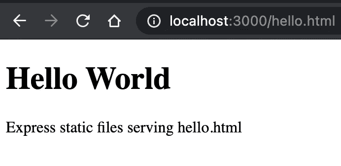
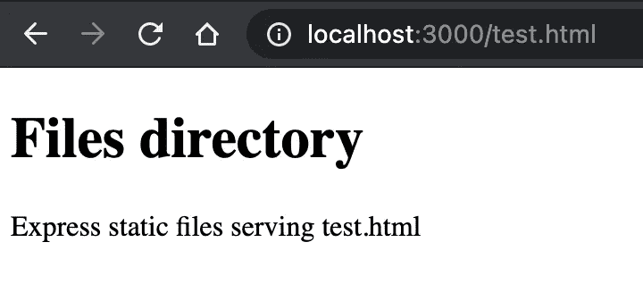
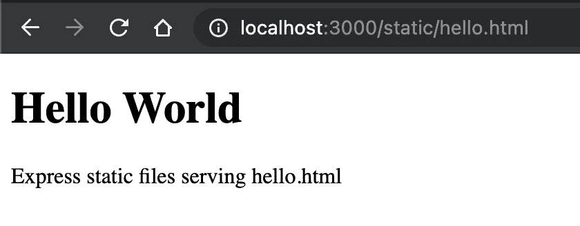

# 如何使用 Express 提供静态文件:分步指南

> 原文：<https://javascript.plainenglish.io/expressjs-serving-static-files-e0efdda3731c?source=collection_archive---------5----------------------->


Express

## 为什么使用 Express 提供静态文件？

在 web 开发中，从服务器端提供静态文件非常重要。这些是创建您的 web 应用程序的文件。静态文件可以是图像、CSS、JavaScript、HTML、pdf 和许多其他文件类型。

如果您刚刚开始使用 Express 进行开发，我建议您阅读我的另一篇文章:

[](/express-js-getting-started-basic-routing-938d8b629fe2) [## 快速入门和基本路线

### 什么是 Express.js？Express.js & installation 入门，并学习如何使用实现基本路由…

javascript.plainenglish.io](/express-js-getting-started-basic-routing-938d8b629fe2) 

## 如何在 Express.js 中提供静态文件

Express 中有一个内置的中间件，使我们能够通过指定特定的路径和选项来提供静态文件。如下图所示:

```
express.static(root, [options])
```

**express.static** 中间件将**根目录**作为服务静态资产的第一个参数。**选项**是另一个参数。关于静态文件如何送达，可以在官方 [express.static](http://expressjs.com/en/4x/api.html#express.static) 网站找到更多信息。

## express.static 示例

在名为`public`的目录中提供静态文件。

```
app.use(express.static('public'))
```

现在，我们可以访问`public`文件夹中的静态文件，如下所示:

```
http://localhost:3000/images/woof.jpg
http://localhost:3000/css/styles.css
http://localhost:3000/js/app.js
http://localhost:3000/images/background.png
http://localhost:3000/hello.html
```

让我们在您的本地 express 应用程序上测试它。

`public/hello.html`

```
<!DOCTYPE *html*>
<html>
    <body>
        <h1>Hello World</h1>
        <p>Express static files serving hello.html</p>
    </body>
</html>
```

现在，让我们将 **express.static** 中间件添加到我们的应用程序中，如下所示。

`index.js`

```
app.use(express.static('public'))
```

打开[http://localhost:3000/hello . html](http://localhost:3000/hello.html)，可以看到`hello.html`文件。



Express 在我们添加到应用程序的静态目录中查找文件。所以这个目录的名字不包含在**的 URL 中。在教程的后面，我们将看到如何为静态文件夹定义路径。但是首先，我们应该寻找如何服务多个目录。**

## 服务多个目录

要在应用程序中提供多个目录，可以向 Express 应用程序添加另一个目录。假设我们想要为`files`目录中的资产提供服务。将下面的代码添加到您的应用程序中。

```
app.use(express.static('public'))**app.use(express.static('files'))**
```

现在，我们添加新的静态中间件来服务文件目录中的资产。

`files/test.html`

```
<!DOCTYPE *html*>
<html>
    <body>
        <h1>Files directory</h1>
        <p>Express static files serving test.html</p>
    </body>
</html>
```

打开[http://localhost:3000/test . html](http://localhost:3000/hello.html)可以看到`test.html`文件



正如您现在看到的，我们的应用程序提供了`test.html`文件。

**注意:**当您服务多个目录时，Express 将按照您设置的静态目录的顺序提供服务。因此，如果您在两个不同的服务文件夹中有相同的文件名，Express 将查找`express.static`的使用顺序并提供第一个匹配的。这可能会对您的文件造成一些问题，因此在这种情况下，我们可以创建**虚拟目录**来提供服务！

## 指定路由—虚拟目录

为了能够使用定义的路由提供静态文件，我们可以在 Express 应用程序中指定路径。

```
app.use('/static', express.static('public'))
```

正如您所注意到的，我们没有创建任何名为 **static** 的文件夹，但是我们可以在 Express 中指定一个路由，并添加`express.static`中间件来服务公共目录中的文件。您可以根据您的目的和使用案例来命名它。

我们添加到公共目录的文件现在可以通过以下方式访问:

```
http://localhost:3000/static/images/woof.jpg
http://localhost:3000/static/css/styles.css
http://localhost:3000/static/js/app.js
http://localhost:3000/static/images/background.png
http://localhost:3000/static/hello.html
```

现在，让我们从静态路径打开`hello.html`文件，如下所示。



**注意:**记住，express.static 中间件是相对于启动 Node.js 应用程序的目录的。对于您想要服务的目录，使用绝对路径更安全。

```
*const* path = require("path");app.use('/static', express.static(path.join(__dirname, 'public')))
```

现在你可以快递任何你想要的东西。

这里是另一个`woof.jpg.`的例子


**带选项的示例**

最后但同样重要的是，你可以看看官方 Express 文档中的[选项。](http://expressjs.com/en/resources/middleware/serve-static.html)

```
var options = {
  dotfiles: 'ignore',
  etag: false,
  extensions: ['htm', 'html'],
  index: false,
  maxAge: '1d',
  redirect: false,
  setHeaders: function (res, path, stat) {
    res.set('x-timestamp', Date.now())
  }
}

app.use(express.static('public', options))
```

仅此而已！我将继续为 Express 添加新的教程，并在这里编辑以供参考。

如果您对本教程有任何问题，请在下面发表评论，或者随时分享您的成功故事。

谢谢你读到这里！

以下是本教程的 GitHub repo:

[](https://github.com/hadnazzar/express-lessons) [## hadnazzar/express-课程

### 在 GitHub 上创建一个帐户，为 hadnazzar/express-lessons 的开发做出贡献。

github.com](https://github.com/hadnazzar/express-lessons) 

*如果你觉得这篇文章很有帮助，你可以通过使用我的推荐链接注册一个* [***中级会员来访问类似的***](https://melihyumak.medium.com/membership) *。*

***关注我的*** [**推特**](https://twitter.com/hadnazzar)


Subscribe for more on [Youtube](https://www.youtube.com/c/TechnologyandSoftware?sub_confirmation=1)

# 编码快乐！

梅利赫

*更多内容请看*[*plain English . io*](http://plainenglish.io/)