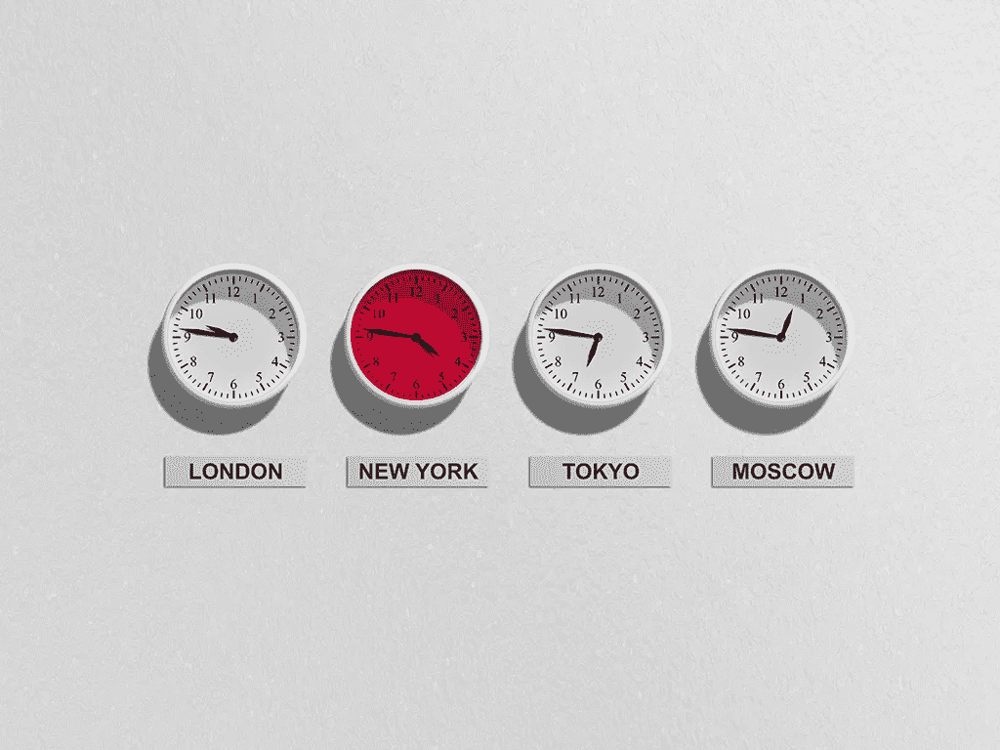

# 扩展日期管道以角度显示 PST 时间

> 原文：<https://javascript.plainenglish.io/extend-datepipe-to-show-pst-time-in-angular-cd713a7c1ad?source=collection_archive---------13----------------------->



最近，我接到一个要求，要将 UTC 时间显示为 PST 时间。我知道这很容易做到，但我不想用瞬间，也不想用一些第三方库来改变它。

所以，我最终使用偏移手动转换了它。因为我想只将日期转换为 PST 时区，所以很容易做到。

这是我创建的管道，用于使用偏移将来自数据库的所有 UTC 数据转换为 PST。

```
import { Pipe, PipeTransform } from '[@angular/core](http://twitter.com/angular/core)';
import * as _moment from 'moment-timezone';
import { DatePipe } from '[@angular/common](http://twitter.com/angular/common)';[@Pipe](http://twitter.com/Pipe)({
  name: 'pstTime'
})
export class PstTimePipe extends DatePipe implements PipeTransform {transform(date: any, format?: any): any {
    let dateObj: Date = typeof date == 'string' ? new Date(date) : date;
    let offset = 7 * 60 * 60 * 1000;
    dateObj.setTime(dateObj.getTime() - offset);
    return super.transform(dateObj, format, null, null) + ' PST';
  }}
```

它会显示日期为`Jul 31, 2019, 11:30 PM PST`，这正是我所要求的。

当然，您可以进一步扩展它，使其更具动态性，以支持任何时区。但就目前而言，这做到了，我对此很满意。

谢谢！

*多内容于* [***通俗易懂***](http://plainenglish.io/)