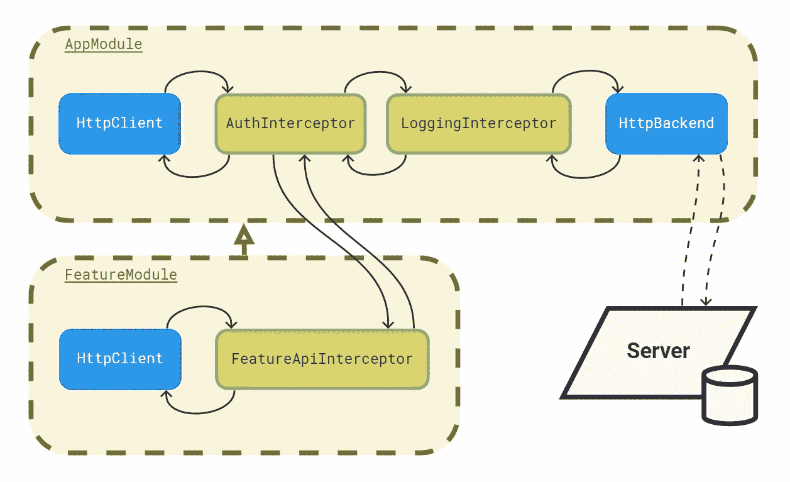

# 在 Angular 中分层扩展 HTTP 拦截器

> 原文：<https://javascript.plainenglish.io/extending-http-interceptors-hierarchically-in-angular-4ca4d25af475?source=collection_archive---------6----------------------->

您是否曾经希望将您的应用程序分割成业务模块(特性模块),以便它们每个都有自己的特性逻辑 http 拦截器集，然而它们是如此的分离，以至于它们仍然可以使用公共的逻辑拦截器，而无需了解或参考它。

也许不同的团队从事不同的功能，有不同的角度项目*(我希望他们不是在构建一个巨大的不可维护的整体)*，这些项目输出独立测试的模块，这些模块被延迟加载到主应用程序中。也许是其他类似的用例🤔…

在每个 http 请求上只需要对特性模块做一些特别的事情，但是仍然需要应用通用的拦截器，那些完成 REST api 端点的 URL 的拦截器，以及添加定制头的拦截器。如果有拦截器的话🤨特性模块开发团队不应该真的需要知道核心模块的工作方式。这类似于[控制的反转](https://en.wikipedia.org/wiki/Inversion_of_control)。

Angular 的工作方式(从 Angular v11 开始)是，惰性加载模块的拦截器要么被忽略，要么被单独应用。

为了更深入地了解原因，我们来解释一下:因为一个[惰性加载模块创建了一个子注入器](https://angular.io/guide/providers#limiting-provider-scope-by-lazy-loading-modules)，所以提供的拦截器是这个子注入器包含的一个集合。因此，如果`HttpClientModule`的导入只保留给父模块，它们会被*忽略*，因为当从父注入器注入服务`HttpClient`时，它看不到子注入器中的拦截器集。另一方面，如果`HttpClientModule`在子模块中被重新导入，那么它们就会被*隔离*，这样就创建了一个新的服务实例，它只能看到同一个注入器中的一组拦截器，而看不到父模块中的拦截器。

一旦制定了用例并解释了为什么不能开箱即用，仍然有一种方法可以避免这种行为，那就是告诉 Angular 的`HttpClient`服务如何看到两组拦截器。

首先，让我们借助一个简单的，即使不一定真实或有效的例子，只是为了描绘一个实现。

以 Angular CLI 样板代码为例，让我们建立我们需要的东西，并在此基础上继续构建。

显示在`AppComponent`中的`title`需要通过 http 请求获取，我们将使用一个*角度服务*来实现:

有一个懒惰加载的`FeatureComponent`，它显示一个标题，这个标题也被获取。它将和`AppComponent`一样:

这两个标题在不同路径的同名文本文件`title.txt`中，所以我们将使用一个*服务*来完成这个任务，并通过*拦截器*来调整所述路径:

为了简单起见，*应用标题*文件驻留在`assets/`文件夹中，我们将在*拦截器*中预先放置路径:

*特性标题*文件在路径`assets/feature/`中，但是由于我们计划“继承”*拦截器*应用程序，我们将只在*特性拦截器*中添加`feature/`部分:

两个*拦截器*都在它们各自的*模块*中提供，但是我们只在根`AppModule`中导入`HttpClientModule`:

在我们的`FeatureModule`中，我们将导入一个特殊的`InterceptorInheritanceModule`来代替。不过还有另一个区别，接下来提供的`HTTP_INTERCEPTORS`与`@angular/common/http`中的*注入令牌*不同。它的必要性在于“子”和“父”*拦截器*之间的依赖关系，因此我们需要为两个集合使用不同的令牌。为了保持一致，它们的名称是相同的。它的宣言随后出现:

请记住，这整个概念只适用于多个*注入器*，也就是延迟加载模块，因此在导入`RouterModule`时，会有`FeatureModule`的延迟加载:

最后，所有的部分都准备好了，我们的特殊`InterceptorInheritanceModule`，整个问题解决方案的本质。我们将提供应用*拦截器*和“真实的”`HTTP_INTERCEPTORS`令牌所需的内置*服务*，以及合并两组*拦截器*的策略:

我们的例子完成了🎉。完整代码可在 [github](https://github.com/miguel-leon/extend-interceptors) 获得。我们可以运行它，并在浏览器中看到对`/assets/title.txt`和`/assets/feature/title.txt`的两个正确请求。

最后，记住解决方案中使用的一些 api 是 angular 的“私有”API，即`ɵHttpInterceptingHandler`和`injector.parent`。它们在版本 11 中工作，但将来可能会改变。

到目前为止，Angular 的 github 中还有一个[未解决的问题，这篇文章的存在是为了让我们更深入地了解为什么我们想要以这种方式设计*拦截器*，所以也许在未来我们可以只使用内置的“公共”api。](https://github.com/angular/angular/issues/36974)