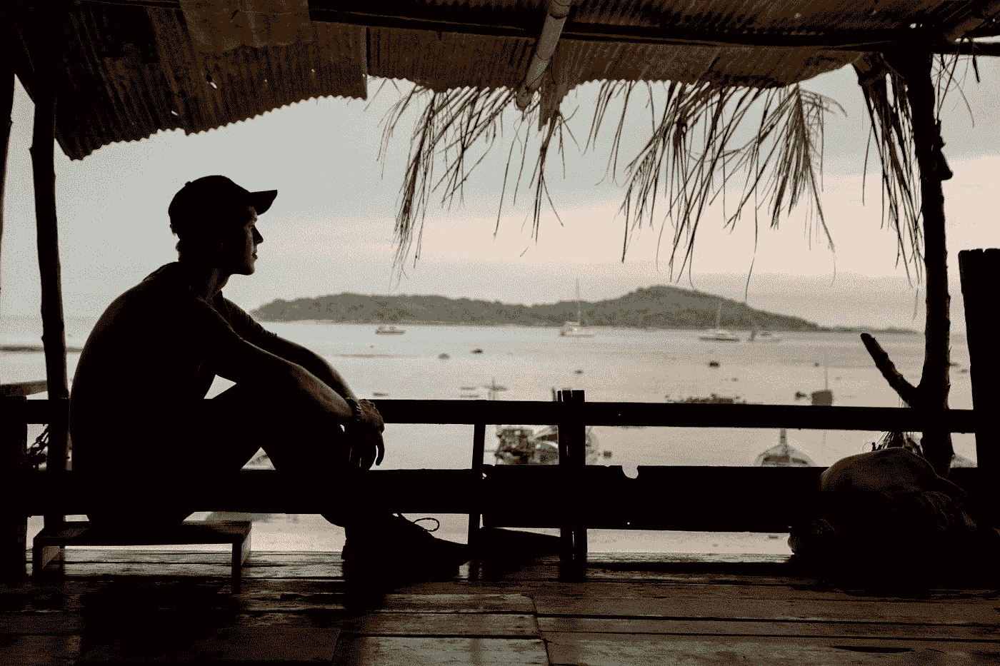
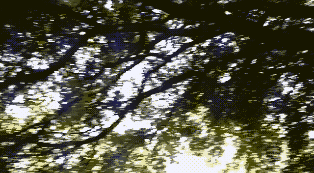

# 农场生活:一个 25 岁年轻人的生活经验

> 原文：<https://javascript.plainenglish.io/faang-to-farming-life-lesson-from-a-25-year-old-66f56818f7b6?source=collection_archive---------5----------------------->

从编程—务农—编程—创业的旅程。

[📷](https://unsplash.com/@williamrouse?utm_source=medium&utm_medium=referral)

你有多少次想过，如果你有足够的勇气和决心去冒一定的风险，而不是选择安全的道路，你的生活会有多么不同？

好吧，到底是什么阻止了你？

首先，你希望追求的梦想往往会与社会对你的期望相矛盾，这可能会阻止你去追求它们。

但是，既然这关系到你的生命，你为什么要在乎别人的看法呢？

我们大多数人都生活在个人的泡泡里——周围都是和我们有相同观点、习惯和生活方式的人——因为这样感觉安全舒适。

但是问问你自己，这是最好的生活方式吗？

我们所有人都应该偶尔走出自己的舒适区，因为新的经历及其结果可能会丰富我们的生活。

例如，我度过了快乐、无忧无虑的青春期，并准备在一家 FAANG 公司获得一份成功的工作。但是大学毕业后，我决定背包穿越印度——这是我长久以来的梦想。

> "旅行对偏见、偏执和狭隘是致命的，因此我们许多人非常需要旅行。"
> 
> ―马克·吐温，

我们中的许多人害怕追随自己的梦想，因为它们往往太大了，以至于实现它们似乎非常不现实。但是要记住: ***再远的路程也是从一小步开始*** 。

事实上，有时即使是对你来说微不足道的小事也可能完全改变你或别人的生活。

我们经常被劝阻去追寻我们的梦想，因为它们在一开始似乎是不可实现的。但是问问你自己:如果我不去尝试，我还有机会实现我的梦想吗？

能够旅行并发现自己的新事物是美好的。独自旅行能以你从未想过的方式改变你的生活。

独自旅行对我来说并不新鲜。我已经做了一段时间了。这一次，我想了解印度农民面临的真正问题。

我有这种感觉，我们正在做一些非常错误的事情。你猜怎么着？我是对的！

# 遇到一个让你忘记烦恼的人，是一件很美好的事。

我想找到一个解决农民自杀率上升的方法，所以我开始研究这个问题。我很快发现我们培育食物的方法是错误的！

农民使用杀虫剂和化肥，这增加了投入成本，并导致低回报或无回报——在许多情况下是损失。

为了让事情继续下去，农民会借一笔贷款，但他肯定无法偿还，因此需要从其他地方借款。这最终导致了极其可怕的事情发生。

没有办法解决吗？我是唯一一个试图这样做的人吗？我很好奇。

我很快发现我并不孤单。有人想出了解决这种情况的切实可行的办法。他不仅承诺将投入成本降至零，还承诺增加农民收入。所以我努力去见他。

你可能会想到，我的大多数朋友和家人都警告过我不要这么做。毕竟，为什么有人会浪费时间去做对他们的职业没有好处的事情呢？

我敬爱的父亲对我寄予厚望，但对这个决定非常失望。他认为我的努力是浪费时间，不知道我通过学习种植灌木能得到什么！

> 群山在召唤，我必须离开。
> 
> **—约翰·缪尔**

我不理会他们的批评。相反，我奋力向前追求这个目标，在几个月内，我实现了我想要的。

# 你在寻找的，正在寻找你！

Meet the man, [Padma Shri Subhash Palekar](https://en.wikipedia.org/wiki/Subhash_Palekar)

他知道我所有问题的答案。我决定陪着他，在他手下学习。

我们会参观 T2 使用他的方法并取得成功的农场。

Accompanying Subash Palekar — How I got to travel with him is another story

我学到了我能学到的一切。我尽我所能吸收一切。我以前读过所有的书，看过所有可用的视频，现在是时候使用它们了。

Classroom

我去了一些我完全不知道的地方，那些地方的名字我甚至不能正确发音。有时候我一周都不能洗澡。对于一个无法忍受尘垢的人来说，这是我容忍度的巨大转变。

我遇到了财力最少但心地最慷慨的人。他们慷慨地与我分享他们拥有的一切。

> “世界很大，我想在天黑前好好看看。”
> 
> ―约翰·缪尔

我曾经睡在陌生人家里；很多时候，很多时候他们连我的名字都不问，我也不问他们的。他们会喂我。我们聊了很多，然后第二天早上我就走了。

每天早上从不同的地方看日出会让我充满一种独特的宁静和愉悦。

The most juicy grapes I ever tasted.

The most beautiful tree I ever saw was in a barren region. The branches were arranged to form an umbrella-like structure.

我意识到，人际关系不是由血缘创造的，而是由你对他人的接受创造的。

Kiran, Sudhanshu, Anand, Me, Vinay

以这种方式生活让我每天都感到强大。我意识到在生活中有多重要，不一定要看起来强大，而是要感觉自己强大。

我意识到*当你拥抱一个真正的人时，他们会成为你的盟友。你可以和任何人建立终身关系，他们不一定是血亲。*

# 生活因为我们遇到的人而变得美好。

我最终见到了他。他表现出简单和正直。他散发出一种我很少在其他男人身上看到的热情。他独一无二，自给自足。他渴望分享他所知道的一切。

我们讨论了一系列话题。临走前，他让我分享我的联系方式。

你曾经参观过野生动物园或丛林吗？或者一片森林？你有没有想过谁给土壤施肥，谁控制害虫？如果你研究得更多，你会发现大自然并不是这样的。事实上，昆虫是万物的重要组成部分——没有它们，我们都会灭亡。

Subash Palekar 人使用的自然耕作方法简单且与自然和谐一致。你必须培养一个微生物丰富的环境。大部分工作是由微生物和蚯蚓完成的。

森林是如何熬过夏天的？有人在灌溉森林吗？不——所有的覆盖物都变成了腐殖质——从土壤中的空气中吸收水分。我把它简单化了，其实还有更多— [你可以在这里了解更多。](https://zbnf.org.in/)

I lost 20 pounds and burnt hard during the voyage, but it was worth it all when I finally got into conversation with him.

Subash Palekar 的自然农业(SPNF)方法得到了印度政府的正式认可，并在 2018-19 年变成了政策。当这一切发生时，我和他在一起，我是胜利的一部分。

在我遇到他之后，我意识到我可以用我的计算机专业知识来解决现实世界的问题。但是在过去的 2-3 年里，我没有接触过任何计算机方面的东西。我知道我必须休息一下。

我决定学习所有必要的技术技能，然后继续旅行。但我不是唯一一个计划被疫情和封锁打乱的人。

# ***要知道你不能让时间倒流——现在是你所拥有的一切。***

在我的社交圈里，我以电脑奇才而闻名。如果其他熟人需要电脑帮助，他们会联系我。

这种认同感是如此强烈，以至于我几乎能感觉到它像一件斗篷一样包裹着我。无论我去哪里，它都会跟着我，无论我是在学校，还是在聚会，或者只是和朋友出去玩。

这件斗篷在我毕业时也跟着我，我努力不告诉人们我所知道的一切，但是他们很快就发现了它。

我的讲师们很快就喜欢上了我。我变得更受同龄人的喜爱。我曾经教过贫困学生 DS 和算法课程，大部分来自非 CS 背景。

尽管我很早就发现上大学不值得花时间，但我还是继续在整个课程期间游手好闲，因为我不想向其他人解释为什么我没有追求自己擅长的东西。

在我十几岁的时候，我在计算机安全方面投入了大量的精力。我贪婪地阅读了我能找到的每一本安全书籍。那时候互联网还是个稀罕物——我会去网吧下载资源。

我最近发现凯文·米特尼克在我的 LinkedIn 联系中——我在 2011 年和他联系过。它带来了太多的旧回忆——我过去常常想象自己像他一样出名。没有比年轻的傻瓜更傻的了。

His works were a source of inspiration for me

我告诉你这些只是想让你知道我对电脑和每一件与电脑相关的小事都很着迷。

# 回顾过去是可以的，但不要盯着过去看。

在中断了两年半之后，我又回到了电脑行业。

重新开始感觉像一个 50 多岁的人，和高中生坐在一起，因为他没有完成学业。

旅行结束后，我记得曾和一个人坐在一起，他会给我打电话解决每一个技术难题。他在尝试设置 Alexa 时正在观看 YouTube 视频。我偷偷溜进去说，“老兄，我可以帮忙，”他回答说，“哦，我差点忘了你擅长电脑。”

在我看来，我就像是“曾经？”—我仍然是。但我挣扎过。多年不接触任何技术设备已经让我付出了代价——我对这些东西已经生疏了。我对任何技术的反应都不如以前好了。

我觉得我不如以前了。我再也感觉不到以前的那种感觉了。我感到赤裸和脆弱。

我不在的时候，很多事情都变了——科技世界里的事情比现实世界里的变化要快得多。

当你迷失时，你需要的不是慰藉，而是路线图。我做了一个，我在网上收集了所有我需要的资源——当我说全部的时候——我是认真的。我知道什么对我有用，什么对我没用。虽然这需要更多的时间，但这是值得的。

在我十几岁的时候，我经常弄坏东西，但这次我在学着建造它们。我感谢所有那些通过课程、书籍、博客分享他们所知的人。正是因为他们，我才能够再次回到电脑前。

每个人都应该做的一件事是对基本面进行足够的投资*。*

*如果 ***基本面*** 到位，一切都会进展顺利。生活的方方面面都是如此。*

*我以前编程只是为了好玩，从来没有把它当成一种改变人们生活的方式。我的旅行改变了我对世界的看法。这对我的编程产生了积极的影响。*

*现在我把它看作是解决问题的工具——我们人类创造的问题。*

*我觉得这才是一个新人应该如何看待编程。他们不应该将编写代码视为填补银行存款余额的一种方式，而应该视为改变人们生活的一种手段。*

*编程的奇妙之处在于，你可以调整电路中的几个电子，从而改变全世界数百万人的生活。*

*这就是我现在对编程的看法。*

*作为一名程序员，你可以改变人们的生活——利用它。*

# *如果你不快乐，什么都不值得*

*有人可能会问，这一切值得吗？放弃法昂去追求如此奇怪的东西是个错误吗？毕竟，如今谁会涉足农业呢？*

*好吧，虽然我作为一个电脑奇才的身份令人欣慰，但它从来没有解放过 。*

*我有意识地选择死亡，死于旧我，这样新的东西就会出现。*

****我迷失了自己才发现自己。****

> *当我放下我是什么，我就成为我可能成为的样子。*
> 
> *——老子*

*这是我一直在寻找的吗？也许不是，但它为进一步的探索奠定了基础——我想在未来的生活中做的事情。*

*我的目标是了解这个国家的农业状况，并向其他人提出解决方案。我在这方面取得了一些成功；我坚持我的策略，最终带着新的想法和印象回家，这些想法和印象改变了我的生活，并使我以新的方式思考。*

*那些经历和我从旅途中获得的知识是我在白领工作中永远学不到的。*

*我给人们的生活带来了一场革命吗？不要！也许我们有时需要的是一个解决方案，而不是一场革命——一个解决个人问题的方案。*

*也许我们大多数人都不想变得富有，我们想要的只是财务独立。但不知不觉中我们追求金钱，为了追求幸福浪费了一生。我们应该专注于财富的积累，而不是谋生。*

*如果我们能够超越自身的生存来思考问题，我们大多数人都会成为解决方案的一部分，而不是问题的一部分。*

*人们可能仍然感到困惑，为什么有人可以过上舒适的生活，却要做如此怪异的事情。*

*答案很简单——我们都是凡人。*

**

*Your time on the planet is defined by that spark! You were dead before you were born, and you will be dead for a long time after you die.*

*你最终会死，你所做的工作不会长久。*

*做对自己有意义的工作。如果你是一个聪明的人，你的生活应该让你周围的人受益。*

*我们的生命就像我们称之为创造的浩瀚宇宙中的一个火花，我们终将燃尽。生命是有限的时间和精力——充分利用它。*

*这些见解帮助我重新进入了我一直想要但从未拥有的生活，而且是在我没有寻找的时候发生的。*

# *要吸取的教训。*

## ***寻求清晰胜于自信***

*在追寻梦想的同时，你几乎肯定会遇到你当初没有预见到的困难。但是你不应该担心这些不可避免的挑战，因为有一样东西会帮助你度过难关——清晰。*

*自信可以带你去某个地方，但它不会带你去任何地方。*

## *学会沟通*

*印度是一个每 50 公里就有不同穿着和说话方式的地方。身处一个你不懂语言，他们也不懂你的语言的地方可能会令人畏惧——在这种情况下，你的 ***连接*** 的能力会有所帮助。*

*如果你知道如何用 ***连接*** ，那么语言就不是问题。*

*表达就是交流——交流是语言的全部。*

*语言对成功至关重要:事实上，你与人交谈的方式可能意味着成功与失败的区别。基于这个原因，我们必须学会如何利用语言。*

## *如果你从失败中学到了什么，它就成了一个教训；否则，这仍然是一个错误。*

*失败是生活的一部分，弱点是人类的一部分。无论你怎么努力，你都无法避开他们。*

## *知道志愿服务的乐趣*

*学会不考虑自己而去做一些事情。 ***做这件事没有问对我有什么好处？****

*你生命中最快乐的时刻是你不去追求它的时候。*

## *离开这个区域*

*从日常工作中定期休息可以帮助你保持精力充沛，做出更好的决定。*

## *不要低估自己。不要高估这个世界。*

*实现你的梦想没有你想象的那么难。如果你相信自己，一步一步来，你会成功的。*

*不要害怕实现你的梦想:你只有一次生命，让它充满爱、快乐、意义和灵感。如果你内心清晰，那么没有什么目标是无法实现的。*

## *学会信任*

*信任并不意味着别人必须按照你希望他们的方式行事。信任某人意味着让自己变得脆弱。允许自己对生活脆弱，允许生活发生在你身上。*

# *迷你课程*

*   *冒一次险。冒险可以不可思议地改善你的生活。*
*   *不要低估自己。*
*   *相信人性。*
*   *实现你的梦想并没有你想象的那么难。如果你有清晰的思路，一步一步地前进，你就会成功。*
*   *当我们离开自己的舒适区，被迫去处理新的、不熟悉的情况时，我们对自己了解得最多。*
*   *你是不可替代的。每个人都有所贡献。让这深深地印在你的心里。*
*   *永远不要成为问题的一部分；永远成为解决方案的一部分。*

# *感谢信*

*我想利用这最后的机会说声谢谢。*

*感谢您的光临！如果没有像你这样的人，我不可能做我现在所做的事情。*

*万分感谢*你*。*

*这些照片是在我的旅程即将结束时拍摄的，那时我第一次见到了 Subash Palekar。我在去见他之前丢了手机。我不仅丢了手机，还丢了过去两年旅行中所有的联系人、笔记和照片。*

*凭借一部 10 美元的功能手机，我能够完成我剩下的旅程。*

*Sudhanshu、Anand 和 Kiran 好心地给我发了旅行的照片。*

**更多内容看*[***plain English . io***](http://plainenglish.io/)*