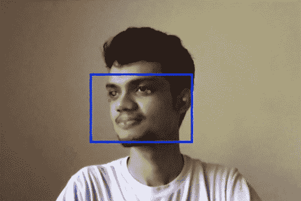

# 使用 TensorFlow.js 在浏览器中进行人脸检测

> 原文：<https://javascript.plainenglish.io/face-detection-in-the-browser-using-tensorflow-js-facb2304ed91?source=collection_archive---------4----------------------->

## 使用 TensorFlow.js 中的 Blazeface 模型进行简单的人脸检测。



TensorFlow.js 是在你的浏览器中运行 ML 模型的一个很好的工具，并且附带了许多预先训练好的模型供我们使用。今天，我将使用 Blazeface 模型从浏览器的网络摄像头中检测人脸。

使用这个，你可以裁剪图像以只得到人脸，检测人脸以标记图像中的人，或者这可以是人脸识别的第一步。

我们可以将流程分为 3 个步骤:

1.  访问网络摄像头视频源
2.  执行面部检测
3.  显示结果

要运行这段代码，最好有一个支持热重装的本地服务器设置。我喜欢在 VS 代码上使用服务器插件。

所以让我们开始吧！

The video version if you prefer that !

## 访问网络摄像头视频源

第一步是访问网络摄像头及其视频源。

我们将使用浏览器的 MediaDevices 界面，该界面允许您访问连接的媒体设备，如相机、麦克风，甚至屏幕共享。

首先用基本的样板代码创建**index.html**文件。

我在主体中添加了一个视频标签，我们可以用它来查看来自网络摄像头的视频输出。

现在让我们创建另一个名为 **script.js** 的文件，我们将在其中编写 JavaScript 代码并将其包含在 index.html 中。我把它加在了 body 标签的后面。脚本可以包含在 head 标记中，但是将它包含在 body 标记之后可以确保脚本只在 HTML 呈现之后运行。

在这里，我们获取视频标签元素，并将其存储在变量 video 中。函数 setupCamera 调用 getUserMedia API，我们指定视频尺寸。我还在这里设置了音频为假，因为我们不需要它。

getUserMedia 函数使用 MediaStream 对象返回一个承诺，我们将该对象分配给 video 元素的 srcObject 属性。最后，在最后，这个函数被调用。

现在运行这个启动你的服务器或在浏览器中打开 index.html 文件。您的浏览器将请求访问摄像头的许可，允许它，您应该会在屏幕上看到网络摄像头馈送。

## 执行面部检测

为了检测人脸，我们将使用 TensorFlow.js 中的 [Blazeface](https://github.com/tensorflow/tfjs-models/tree/master/blazeface) 模型。这是一个轻量级模型，用于检测图像中的人脸。

首先，让我们使用脚本标签将 TensorFlow.js 库和 Blazeface 模型导入到我们的**index.html**文件中。

```
<script src="https://cdn.jsdelivr.net/npm/@tensorflow/tfjs"></script>
<script src="https://cdn.jsdelivr.net/npm/@tensorflow-models/blazeface"></script>
```

确保在导入 **script.js** 之前添加以上标签。这是为了确保我们的脚本只在加载了所需的依赖项之后才运行。

接下来，创建一个变量模型，并在其中加载 Blazeface 模型。

```
let model;
model = blazeface.load();
```

接下来，让我们在脚本中创建一个函数 detectFaces，它将执行面部检测并给出输出。

```
const detectFaces = async () => {
  const prediction = await model.estimateFaces(video, false);   
  console.log(prediction);
};
```

现在，如果您调用 detectFaces 并运行一切，您将得到一个错误。这是因为 blazeface.load()是异步的，加载需要一些时间。但是在加载 Blazeface 之前会调用 detectFaces。

因此，为了解决这个问题，我们将首先等待从网络摄像头加载视频。完成后，我们等待模型加载，然后调用 detectFaces 函数。在加载视频提要时，我们可以监听一个名为 *loadeddata* 的事件监听器。

因此，结合以上所有内容，最终的 **script.js** 文件应该是这样的:

现在，如果您检查您的控制台，您应该能够看到预测对象，看起来像这样:

```
[
    {
        "topLeft": [
            186.164306640625,
            229.93507385253906
        ],
        "bottomRight": [
            400.3614807128906,
            372.7312927246094
        ],
        "landmarks": [
            [
                249.68140237033367,
                275.46426653862
            ],
            [
                326.18556171655655,
                271.4667320251465
            ],
            [
                285.10335087776184,
                312.4013841152191
            ],
            [
                290.80926552414894,
                337.9300758242607
            ],
            [
                218.2365596294403,
                286.3128364086151
            ],
            [
                371.4763283729553,
                279.08667623996735
            ]
        ],
        "probability": [
            0.9811193943023682
        ]
    }
]
```

预测变量是对象的列表，其中每个对象对应于检测到的面部。在每个物体内部，你可以找到左上角和右下角的坐标，以及对应眼睛、耳朵、鼻子和嘴巴的 6 个面部标志。

接下来，我们将使用这些坐标来绘制面部周围的矩形。

## 显示结果

这一步非常简单。简单地遍历预测数组，为面部标志画一个矩形或点。

我们可以使用 HTML 画布来实现这一点。因此，在 index.html 文件中创建一个新的 canvas 标记，并赋予它与视频提要的宽度和高度相匹配的宽度和高度。此外，我们不再需要显示视频标记的内容，因此将其 CSS 显示属性设置为 none。

完成上述操作后，你的 index.html 应该看起来像这样:

接下来，在 script.js 文件中，创建另一个变量来保存画布对象，并为画布创建一个 2d 上下文。接下来，首先需要在画布上绘制当前视频，然后是矩形和面部标志。这可以使用 HTML canvas 的 drawImage 和 rect 函数来完成。

此外，detectFaces 函数现在只被调用一次。要将输出视为视频，我们需要不断调用它，根据您想要的帧速率，每秒调用 24 次或 30 次。所以为了继续调用它，我们可以使用 setInterval 函数。

最后，您的 **script.js** 文件看起来会像这样:

希望这篇文章是有帮助的。在 [Twitter](https://twitter.com/adarsh_menon_) 、 [LinkedIn](https://www.linkedin.com/in/adarsh-menon-/) 上与我联系，并查看我的 [YouTube 频道](https://youtube.com/adarshmenon)。

*更多内容请看*[*plain English . io*](http://plainenglish.io/)