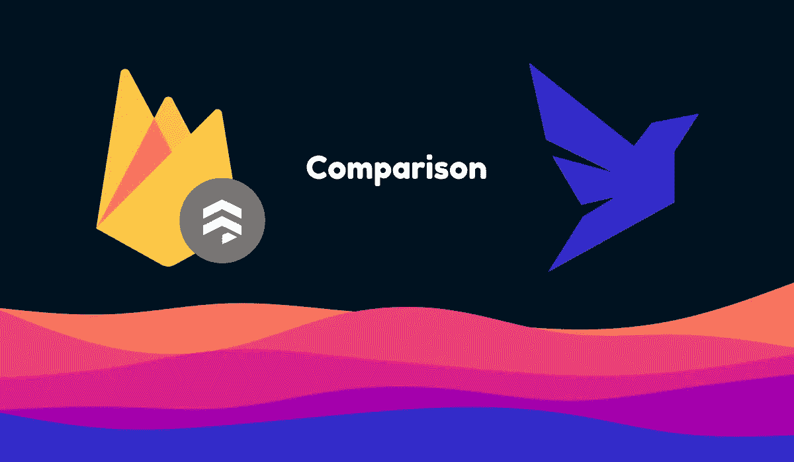

# Firestore 用户的动物群和 FQL

> 原文：<https://javascript.plainenglish.io/fauna-and-fql-for-firestore-users-dff6f8404eb8?source=collection_archive---------0----------------------->



## 了解动物群和 Firestore 之间的差异，以及如何从 Firestore 迁移到动物群

Fauna 和 Firestore 是非常相似的数据库，都提供即时可伸缩性和相当简单的查询方式，但仍有一些关键的区别。在这篇文章中，我们将看看这些差异，以及如何从 Firestore 迁移到动物群和动物群的查询语言(FQL)。您可能希望迁移，因为 Fauna 的查询语言、灵活性或多区域功能。即使您还不知道是否要迁移，本文也会提供一些关于差异的信息。

# 背景

[Firestore](https://cloud.google.com/firestore) 是谷歌在 2017 年创建的数据库。它是前两个数据库 Firebase Realtime DB 和 Cloud Datastore 的继承者。它被归入 Firebase 类别组，提供与不同 Firebase 服务的集成，尽管它也通过 Google Cloud 提供。Firestore 的主要卖点是它易于使用，即使没有服务器，并且具有实时功能。它还提供基于读取、数据存储和写入的简单定价。


Firestore logo

[动物群](https://fauna.com/)是由几位前 Twitter 工程师在 2012 年开发的数据库，用于解决现有 NoSQL 数据库的可扩展性问题。如果你不想学习另一种查询语言，那么 Fauna 提供了一种简单的查询语言 FQL 和 GraphQL 服务。在没有后端的情况下，也可以很容易地使用动物群，并专注于在尽可能保持可扩展性的同时做到这一点。

凡世通和动物群有许多相似的特征和一些关键的区别。它们都在云机器上抽象，以提供使用它们的简单方式，甚至在跨区域复制上抽象。它们都提供客户端 SDK 和实时功能。他们的查询语言有点不同，因为 Fauna 有一个更全面的设置，允许您通过他们的查询语言在数据库上进行某些计算。这可以通过减少往返查询的需求来提高速度。Firestore 的查询语言主要由 CRUD 函数组成。另一个关键区别是，在查询能力和可伸缩性方面，Fauna 更加灵活。现在您已经了解了每个数据库的背景以及它们之间的区别，让我们更深入地了解一下。

# 比较

## 查询语言

既然我们已经强调了查询语言中的一些差异，让我们更仔细地看看这些差异。Firestore 有两种不同的数据查询方式，函数链接和通过参数传递数据。在 V9 更新之前，Firestore 的 SDK 主要使用函数链。例如，一个基本的读取查询可能如下所示:

```
const data = (await db.collection("cities").doc("SF").get()).data()
```

上面的例子通过链接方法函数来访问主数据库对象，然后是集合和文档。如果您使用服务器端 SDK，它仍然是这样工作的。然而，在客户端 web SDK 的更新版本中，有一种通过将选项作为参数传递来进行查询的方法。

```
const data = (await getDoc(doc(db, "collectionName", "documentName"))).data()
```

Fauna 只有一个通用 SDK 和一个查询风格，类似于 Firestore V9 SDK 的一个更强大的版本。要执行操作，需要在其他函数中嵌套不同的函数。例如，要阅读文档，您可以这样做:

```
const data = (await db.query(
    q.Get(q.Ref(q.Collection('collectionName'), 'documentName'))
)).data
```

每个函数的命名空间都在 q 下面。这个例子中使用的函数不止这些。想要完整的列表，你可以看看《动物群》的备忘单。如前所述，Fauna 还提供了一个 GraphQL API，但为了简洁起见，我就不赘述了。

这两种查询语言都很容易使用，并且您可以使用这两种语言做您需要的大多数事情，尽管 Fauna 的提供了更多在数据库上运行事情的方法来防止往返。

## 指数

索引是 Firestore 和动物群有很大不同的地方。Firestore 选择的方法是自动为文档中的所有字段创建索引，并允许使用这些索引进行查询，而不必担心它们。对于包含多个字段的索引，您必须手动创建一个复合查询。这种方法使查询变得容易，但最终会增加用户的成本，因为 Firestore 即使在不需要索引时也会创建索引，这会占用更多的存储空间。

相比之下，虽然它提供了一个易于使用的仪表板和 FQL 函数来创建索引，但它让您手动创建索引。动物群还为索引提供了更多的功能，比如交叉集合索引。

## 交易和一致性

Firestore 和 Fauna 都提供非常一致的数据库操作。动物群使用[卡尔文](https://cs.yale.edu/homes/thomson/publications/calvin-sigmod12.pdf)，这使它能够在全球复制数据，具有很强的一致性。Firestore 不使用高级复制系统，尽管它仍然提供强大的一致性。一致事务的最大区别是，如前所述，Fauna 允许您直接在数据库上做更多的事情。这使得您可以在服务器响应数据的过程中减少数据变化的时间。因此，在这种情况下，就可靠地运行开箱即用的一致事务而言，动物群无疑更好，但在这种情况下，两者都相当好。

## 定价

Firestore 和 Fauna 的定价在某些方面相似，但在其他方面却有很大不同。它们都按读取、写入和存储进行定价，尽管 Fauna 也对计算操作进行定价，计算操作是在它们的服务器上完成的操作。两者都提供免费层，所以你可以尝试任何一个，不需要支付任何费用。

Firestore costs 定价因您所在的地区而异。对于典型的单区域配置，Firestore 的读取成本为每百万文档 0.36 美元，写入成本为每百万文档 1.08 美元，存储成本为每千兆字节 0.108 美元。对于多区域配置，Firestore 的读取成本为每百万文档 0.6 美元，写入成本为每百万文档 1.8 美元，存储成本为每千兆字节 0.18 美元。

因为默认情况下，动物群是全球性的，所以它有更一致的定价，尽管如果您将所有数据存储在欧洲，动物群的所有成本会乘以 1.2 倍，如果您将一些数据存储在欧洲，则会乘以 1.1 倍。每百万个文档读取成本为 0.45 美元，每百万个文档写入成本为 2.25 美元，每百万次计算操作成本为 2.03 美元，每千兆字节存储成本为 0.23 美元。

从上面可以看出，它们的成本相当接近。动物在表面上可能更贵，但只是有时更贵。这是因为 Fauna 提供了内置压缩和更便宜的查询等功能。最终，你需要根据自己的需求做更多的研究，找出哪种更便宜。

## 限制

这两个数据库在吞吐量和大小上都有一些限制。对于 Firestore，文档有多种限制。一个是文档必须是 1mb 或更小，并且每秒钟不能改变超过一次。另一个问题是，每秒钟对数据库执行的写操作不能超过 10，000 次，这些写操作总共包含的数据不能超过 10 兆字节。此外，文档结构图中的嵌套数据最大深度为 20，尽管您可以通过将它转换为 JSON 字符串来解决这个问题。在他们的[限制](https://firebase.google.com/docs/firestore/quotas#limits)页面上显示了许多其他限制，但这些限制与大多数人最相关。动物群也有限制，尽管更少。文档大小上限为 8 兆字节，事务大小上限为 16 兆字节，索引条目必须保持在 64，000 字节以下。更多信息，你可以看看他们的[限制](https://docs.fauna.com/fauna/current/api/limits)页面。

## 结论

动物群和 Firestore 在许多方面非常相似，但在其他方面有着重要的不同。两者都很容易使用，虽然动物群可能更强大。如果你以前使用过 Firestore 并且对动物群感兴趣，请继续阅读为以前的 Firestore 用户设计的 FQL(动物群查询语言)介绍。

# 来自 Firestore 的 FQL 介绍

正如您在比较的查询语言部分所看到的，这两个数据库的查询方式之间可能有相当多的差异，尤其是如果您习惯于使用函数链 Firestore SDK 的话。幸运的是，FQL 是相当直观的，所以你应该不会有太多的学习困难。一个基本的 FQL 查询只是`db.query()`，没有传递任何东西给它。为了处理查询，你将不同的函数传递给查询函数，比如`q.Get`或`q.Create`，为了将正确的信息传递给那些操作，比如什么文档，你嵌套了像`q.Ref`和`q.Collection`这样的函数。对于习惯 Firestore 只在文档上运行`.get()`的人来说，这听起来可能有些冗长，但它可以更优雅，并且您可以做更多。

## 创建文档

Fauna 提供了一个功能`q.Create`，可以像 Firestore 的`add`功能一样创建文档。您只需传递一个集合和数据，它将返回对新文档的引用以及新文档的数据。

```
const result = await db.query(
    q.Create(
        q.Collection("collectionName"),
        {       
            data: {
                field: "fieldValue",
                fruit: "bananas"
            },     
        },
    )
)
// Get reference to result
console.log(result.ref)
// Get new result data
console.log(result.data)
```

Firestore 的对等物是

```
const result = await addDoc(collection(db, "collectionName"), {
    field: "fieldValue",
    fruit: "bananas"
});// Get reference to result
console.log(result);
```

这适用于在不指定 id 的情况下创建文档，但是您也可以通过使用带有集合和 ID 的`q.Ref`而不是`q.Collection`来更新现有文档。

## 获取文档

如果您只是通过 ID 和集合名称获取文档，那么实现起来非常简单。

```
const data = (await db.query(
    q.Get(q.Ref(q.Collection("collectionName"), "documentName"))
)).data
```

正如您所看到的，有一个查询函数包含一个 get 查询，并向其传递了一个 ref。这相当于

```
const data = (await db.collection("collectionName").doc("documentName").get()).data()
```

或者

```
const data = (await getDoc(doc(db, "collectionName", "documentName"))).data()
```

## 设置/更新文档

为此，Fauna 提供了两种内置方法，`q.Replace`用于破坏性替换，而`q.Update`用于在不改变整个文档的情况下更新特定字段。这等同于 Firestore `set`和`update`功能。

```
await db.query(
    q.Replace(
        q.Ref(q.Collection("collectionName"), "documentName"),
        {        
            data: {
                field: "fieldValue", fruit: "still bananas"
            }
        }
    )
)
await db.query(
    q.Update(
        q.Ref(q.Collection("collectionName"), "documentName"),
        {        
            data: {
                fruit: "still bananas"
            }
        }
    )
)
```

这相当于

```
// v8 web or Nodeawait db.collection("collectionName").doc("documentName").set({
    field: "fieldValue",
    fruit: "still bananas"
});await db.collection("collectionName").doc("documentName").update({
    fruit: "still bananas"
});// v9 webawait setDoc(doc(db, "collectionName", "documentName"), {
    field: "fieldValue",
    fruit: "still bananas"});await updateDoc(doc(db, "collectionName", "documentName"), {
    fruit: "still bananas"
});
```

目前，如果您想用`merge: true`模拟`set`的行为，如果文档不存在，则创建一个文档，您可以使用运行查询来检查文档是否存在，如果不存在，则使用`q.If`创建文档。

## 删除文档

删除一个有动物群的文档就像获取一个文档一样，但是用`q.Delete`代替`q.Get`。

```
await client.query(
    q.Delete(q.Ref(q.Collection("collectionName"), "documentName"))
);
```

这相当于

```
// v8 web or nodeawait db.collection("collectionName").doc("documentName").delete()// v9 webawait updateDoc(doc(db, "collectionName", "documentName"))
```

# 结论

动物群是 Firestore 的一个很好的替代品，具有更强大的查询 API 和其他优势。它们是非常相似的数据库，很容易从 Firestore 迁移到动物群。我希望这篇文章已经启发了你动物群和 Firestore 之间的区别，以及 FQL 代码如何转化为 Firestore 代码，感谢您的阅读。

*更多内容看*[***plain English . io***](http://plainenglish.io)