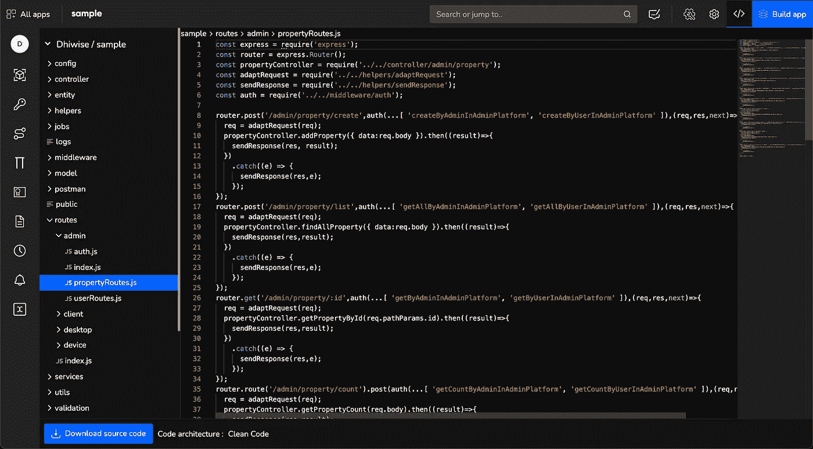

# Node.js 干净代码架构的特性

> 原文：<https://javascript.plainenglish.io/features-of-node-js-clean-code-architecture-569cc396479f?source=collection_archive---------2----------------------->

## 如何使我们的代码能够适应时间的变化

# 建筑简介

软件体系结构主要是在一个有目的和有效的系统中安排的软件组件的结构。软件架构的目标是最小化构建和维护软件系统所需的人力。软件开发周期中最耗费精力的过程之一是适应变化。在软件开发中，处理系统变更的主要方法是在软件的各层之间创建关注点的分离。这就是罗伯特·塞西尔·马丁创造的干净代码架构大放异彩的地方。

以下是使用来自节点应用程序的代码片段实现干净的代码架构的好处。

# 框架独立性

使用框架进行大量操作很容易使我们的代码严重依赖我们正在使用的框架。在我们的代码和底层框架之间创建一个紧密的耦合会导致将来改变框架的困难。例如，如果你想从“快递”移动到“风帆”

要解决这个问题:

1.  我们尽可能地限制我们在框架上的可靠性。
2.  我们通过在框架和项目代码之间使用一个*适配器设计模式*来做到这一点。
3.  同样的方法也用于修改响应对象。

在 MERN 堆栈应用中，我们创建了一个 adaptRequest()函数，作为 express 框架和应用代码(即{内层代码})之间的*中间适配器*。请查看我下面的示例片段。

Parsing framework’s req/res object to a common req/res object

# 独立于数据库

我们使用类似的适配器设计模式使您的代码{在内层}独立于我们正在使用的数据库。

基本上，我们可以创建一个包含所有通用数据库操作的 DB 服务接口。然后为我们希望在您的项目中使用的每种类型的数据库实现一个 DB 服务。举个例子，假设我们需要在一个项目中使用多个异构数据库(比如 DynamoDB 和 MongoDB ),我们将为我们正在使用的每个数据库创建 Db 服务，并简单地将 Db 服务(DynamoDbService.js)作为依赖注入传递给需要在该数据库(DynamoDB)上执行操作的服务(比如 FileUploadService.js)。

您可以通过将 dbConnectionInstance 作为 DB 服务的依赖项来传递，从而更进一步。从而使您能够通过简单地更改 dbConnectionInstance，在项目中建立/切换 DB 连接。
*(我们建议只有当您必须从一个应用程序连接到多个数据库实例时才这样做。)*

# 避免因第三方库而导致的重大变更

1.  第三方库通常是开发周期较长的项目中变更的原因。
2.  从找到一个更好的替代库到升级现有库的所有过程都可能导致代码被更改，并经常破坏代码。
3.  同样，我们的适配器设计模式可以在这里实现，以解决这个问题。
4.  我们只需创建一个服务(比如 ThirdPartyLib.js ),并在其中导入第三方库，用您自己的函数包装第三方函数，并在必要时添加任何额外的逻辑。然后在任何我们需要使用第三方方法的地方使用这个库。

# 依赖注入

依赖注入，依赖注入，依赖注入——您可能已经听过这个词很多次了。但是什么是依赖注射呢？

“依赖注入”是一个 25 美元的术语，表示一个 5 美分的概念……依赖注入意味着给一个对象它的实例变量。真的。就这样。— [[3]](http://jamesshore.com/v2/blog/2006/dependency-injection-demystified)

为什么我们首先要使用依赖注入？

1.  创建可测试性
    依赖注入是一种非常有用的测试技术，因为它允许依赖被嘲笑或剔除。[【4】](https://stackoverflow.com/questions/130794/what-is-dependency-injection)
2.  实现松散耦合
    松散耦合的明显好处在于，它提供了在不修改底层业务逻辑的情况下改变依赖关系的灵活性。这为我们提供了更大的能力，在开发和测试过程中尝试新的替代方法，而不用冒内层代码改变的风险。

# 创建干净的代码样板

尽管使用干净的代码架构创建项目有很多好处，但是创建样板代码一直是一项艰巨的任务。您在网上获取的示例代码对学习非常有用；然而，创建一个真实的应用程序与它有很大的不同。一个简单的方法是使用一个新的在线代码生成平台 [DhiWise](https://hubs.la/H0TFtyP0) 。

您可以使用表格视图添加模型，单击构建应用程序，从组合框中选择干净的代码架构，然后嘣！

You can view the generated application’s code online or dl the source code.

# 文献学

1.  [清洁代码-鲍勃叔叔系列讲座](https://www.youtube.com/watch?v=7EmboKQH8lM)
2.  [开发人员掌握的干净代码架构演示](https://github.com/dev-mastery/comments-api)
3.  [Howardamann 的干净代码演示应用程序](https://github.com/howardmann/clean-node)
4.  [依赖性注射液去神秘化](https://www.jamesshore.com/v2/blog/2006/dependency-injection-demystified)
5.  罗伯特·马丁(鲍勃大叔)的干净代码博客
6.  [关于 DI 溢出栈溢出的讨论](https://stackoverflow.com/questions/130794/what-is-dependency-injection)
7.  [Dhiwise-pro 代码平台](https://hubs.la/H0T7djs0)