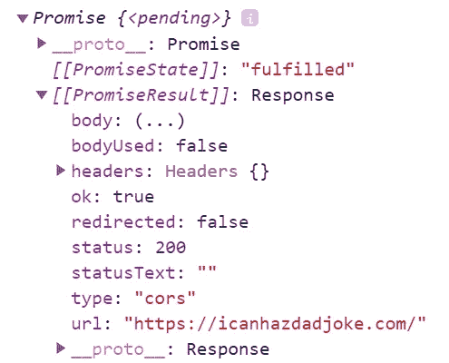
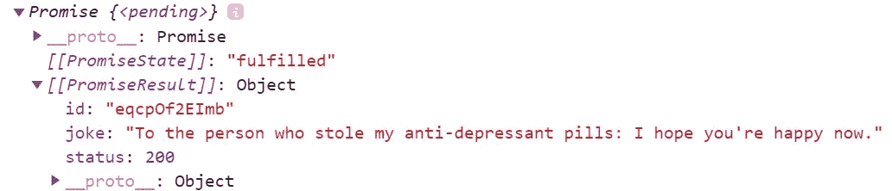
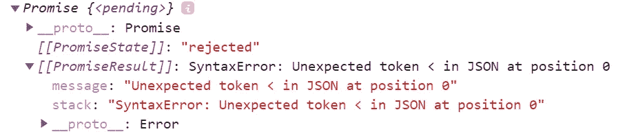
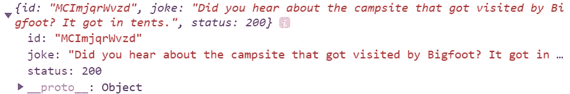

# Fetch() API 用 3 个简单的步骤解释

> 原文：<https://javascript.plainenglish.io/fetch-api-in-three-simple-steps-explanation-276979dc8798?source=collection_archive---------7----------------------->

## JavaScript 中获取 API 的初学者指南

在这个简短的指南中，我将向您介绍 fetch()方法。虽然互联网上有很多关于如何使用 API 和从 API 中获取数据的有用和可靠的信息，但我编写了这本初学者指南，以演示当 fetch 方法的特定部分被执行时会发生什么，并弥合在 script.js 文件中编写的内容和在任何浏览器的开发人员控制台中显示的内容之间的差距。

让我们把手弄脏吧！


Photo by [Jeremy Bishop](https://unsplash.com/@jeremybishop?utm_source=medium&utm_medium=referral) on [Unsplash](https://unsplash.com?utm_source=medium&utm_medium=referral)

和往常一样，让我们看看官方的 [MDN Web 文档](https://developer.mozilla.org/en-US/docs/Web/API/WindowOrWorkerGlobalScope/fetch)并通读一遍:

> [WindowOrWorkerGlobalScope](https://developer.mozilla.org/en-US/docs/Web/API/WindowOrWorkerGlobalScope)mixin 的 fetch()方法启动从网络获取资源的过程，返回一个承诺，一旦响应可用，该承诺就会实现。承诺解析为代表对您的请求的响应的[响应](https://developer.mozilla.org/en-US/docs/Web/API/Response)对象。promise 不拒绝 HTTP 错误——它只拒绝网络错误。您必须使用 then 处理程序来检查 HTTP 错误。

虽然这个定义可能看起来有点复杂，但它概述了我们应该熟悉的关键术语，到本文结束时，您将能够理解所有这些术语。以下是这些关键术语:

*   资源
*   反应
*   承诺
*   满足或拒绝

以下是 fetch()方法语法:

```
const fetchResponsePromise = fetch(resource [,init])
```

Resource —它定义了您想要获取的资源/大多数情况下，它只是一个到远程资源的链接。

Init(可选)—包含要应用于请求的任何自定义设置的对象。默认情况下，fetch 方法发送一个 GET 请求。

# **准备就绪！**

出于学习的目的，我们将使用一个名为[icanhazdadjocke](https://icanhazdadjoke.com/api)的公共 API。这个 API 可以用作获取随机笑话、特定笑话或搜索各种格式的笑话的 API。

创建一个简单的标准 HTML 文档，并在 script.js 文件中编写以下代码，为我们打算按照 API 文档的指示获取的所有请求设置一个自定义用户代理头:

```
// API path/ link to search for random jokes
const resource = 'https://icanhazdadjoke.com'
// this is a config var to fetch data per API instructions/needs to go to header
const init = {
headers: {
Accept: 'application/json',
}}
```

常见的提取请求如下所示:

```
fetch("a string to a URL to get data")
.then(function(response) {return response.json();})
.then(function(json){ 
// Use the data inside of "json" to do some magic manipulation!})
```

好了，让我们把这个获取请求分解成三个简单的步骤，就像我之前承诺的那样！

# **第一步。答应回应。**

在您的 JavaScript 文件中编写以下代码，在浏览器控制台中运行该代码，并在控制台中查看输出。

```
const result = fetch(resource, init)
console.log(result);
```



我们调用“fetch()”并传递一个指向数据源的 URL 和 init config data 作为从 API 获取数据的参数。令人惊讶的是，如果您一直向下展开这个响应，这个响应没有任何内容！？没有笑话，没有 JSON 格式的数据，什么都没有，这看起来不像我们基于 API 文档所期望的。发生这种情况是因为这个函数调用返回了一个对象，这个对象表示数据源返回给我们的内容，而不是实际的内容。这个对象叫做 Promise—*Promise {<pending>}*，有以下参数:*[[Promise result]]:Response*和*[[Promise estate]]:"已履行"*；“已完成”表示响应成功。当出现问题时，会弹出一个*【拒绝】*状态来对抗*[[promise estate]]*，我稍后会演示。

# **第二步。转换数据。**

好吧，如果我们对这些数据无能为力，那还有什么意义呢？合理的解决方案是将这些数据转换成对我们有用的东西。在浏览器控制台中键入并运行以下代码:

```
const init = {
headers: {
Accept: 'application/json',
}}const result = fetch(resource, init)
.then(function (res) {return console.log(res.json());})
```



一旦我们从“fetch()”接收到这个响应对象，我们就对该对象调用“then()”方法，并将该对象作为参数传递给回调函数。在回调函数中，我们对对象做任何我们需要的事情，但是大多数时候我们使用内置的“json()”方法将它转换成 JSON。然后我们返回 JSON 响应。我们还需要返回从响应中获取并转换成 JSON 的内容，以便在第二个“then()”方法中使用这些数据。总的来说，第一个“then()”方法的目的是在将内容转换成我需要的格式(在本例中是 JSON 格式)后，从原始响应中返回内容。

看看这个返回的*Promise {<pending>}*对象，它有一个*[[Promise result]]:Object*，而不是一个 *"Response"* ，就像在**步骤 1** ，*[[Promise estate]]:" fulfilled "*表示没有问题，更重要的是，它实际上显示了一个 ID 和一个笑话本身，取决于您从 API 得到的一个随机笑话，您的输出可能如下所示:

```
id: “nOfNJY89EBd”
joke: “Without geometry life is pointless.”
status: 200
```

恭喜你。最初的响应被转换成 JSON 类型的对象，该对象具有 API 文档指出的属性，我们很好！

就像我之前承诺的，我们能模仿被拒绝的反应吗？编写下面的代码(-1 代替 init var 头中的 JSON 或者任何你想刹车的东西)。如果这样做，它返回*【拒绝】*状态。

```
const init = {
headers: {
Accept: 'application/-1',}}const result = fetch(resource, init)
.then(function (res) {return console.log(res.json());})
```



# **第三步。做实际的事情。**

我们已经知道，第一个“then()”方法将 response 转换成 JSON 类型的对象，这应该允许我们进行一些操作。我们如何做到这一点？我们用第二种“then()”方法！我们接受参数中的 JSON 类型对象，并将其传递给第二个回调函数，在那里我们可以编写任何想要的东西来操作从 API 接收的数据。为了简单起见，让我们打印一个我们从这个公共 API 收到的随机笑话——为此，在第二个“then()”方法中编写 console.log(data)。

```
const result = fetch(resource, init)
.then(function (res) {return res.json();})
.then (function(data) {return console.log(data)})
```

根据您收到的笑话，您的输出可能如下所示。有用！



Photo by [Anthony Duran](https://unsplash.com/@fightmorefilms?utm_source=medium&utm_medium=referral) on [Unsplash](https://unsplash.com?utm_source=medium&utm_medium=referral)

为了使输出更具可读性，我们可以添加一个字符串“这是一个来自公共 API 的随机玩笑:“(这里是一个随机玩笑)。

```
const result = fetch(resource, init)
.then(function (res) {return res.json();})
.then (function(data) {return console.log("This is a random joke from public API: " + data.joke)})
```

如果你觉得这些信息有用，请随时关注我。希望你喜欢这个关于 JavaScript 中 Fetch 的简短指南，请保持关注！

*更多内容尽在*[***plain English . io***](http://plainenglish.io/)