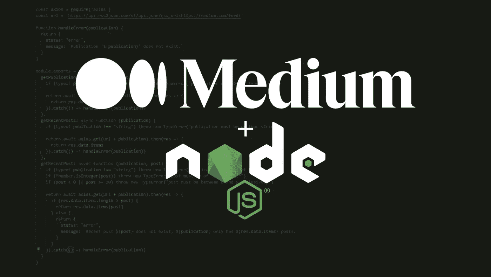

# 使用 Node.js 库获取中型帖子

> 原文：<https://javascript.plainenglish.io/fetch-medium-posts-data-using-node-js-library-da5d3f18751e?source=collection_archive---------10----------------------->

## 中型图书馆，用于访问配置文件、出版物和主题的最新帖子



Medium 的公共 API 是只写的，不提供获取内容的 API。我创建了 Node.js 库，以便能够从概要文件、出版物和主题中获取内容。不幸的是，这仅限于最近的 10 篇帖子。然而，它允许用户通过 JavaScript 获取他们最近的内容，并根据自己的喜好使用它——例如，在网站上展示。

## 它是如何工作的？

访问数据的唯一方式是使用他们的 RSS 提要。因此，`[https://api.rss2json.com/](https://api.rss2json.com/v1/api.json?rss_url=)`用于将从 RSS 提要中检索到的数据转换成 JSON，这样就可以对其进行操作，并通过库发送回用户。它可以获取个人资料/出版物/主题信息和多达 10 个最新的职位。

开发人员有一个小而紧凑的库，他们可以导入该库来获取各种媒体内容，而不必担心将 RSS 转换为 JSON 或任何数据验证。

## 装置

```
npm install @giuseppecampanelli/medium-api
```

## 使用

导入库:

```
const medium = require('@giuseppecampanelli/medium-api')
```

获取个人资料的最近帖子:

```
medium.profile.getRecentPosts('giuseppecampanelli').then(res => {
  // handle result
})
```

## 方法(出版物和主题类似)

*   ***简介*** 。getProfile(用户名)
*   ***简介*** 。getRecentPosts(用户名)
*   ***简介*** 。getRecentPost(用户名，帖子)

更详细的文档可以在 [GitHub 库](https://github.com/giuseppecampanelli/medium-api)中找到。请随意贡献& [赞助商](https://github.com/sponsors/giuseppecampanelli)我的开源项目:)