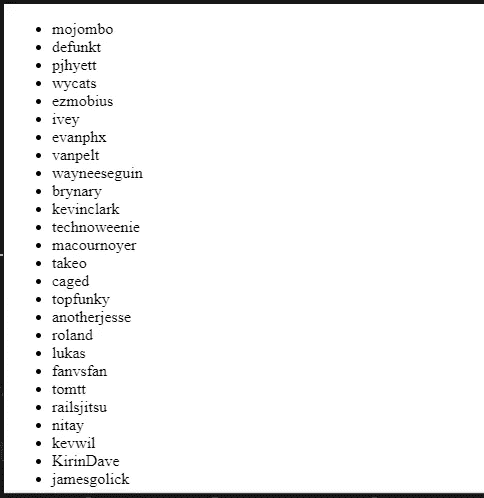

# 在 React 中使用 UseEffect 提取数据

> 原文：<https://javascript.plainenglish.io/fetching-data-with-useeffect-in-react-604ed53edffe?source=collection_archive---------9----------------------->

## 通过真实的例子了解 React UseEffect。


Image created with ❤️️ By [author.](https://mehdiouss315.medium.com/)

# 介绍

React 提供了一系列挂钩，允许您向组件添加特性。这些钩子是 JavaScript 函数，你可以从 React 包中导入，UseState 和 UseEffect 是你应该知道的重要函数。

在本文中，我们将了解 React 中的 UseEffect 挂钩，以及如何使用它从 API 获取数据。让我们开始吧。

# 钩子的使用效果是什么？

React 中的钩子`useEffect()`让我们在处理功能组件时执行有用的操作，比如从 API 获取数据或处理 DOM。

钩子`useEffect()`接受一个回调函数，这个函数默认情况下会在每次重新渲染和组件挂载时运行。

为了使用钩子`useEffect`，你必须首先从 React 包中导入它。

这里有一个例子:

```
import React, **{ useEffect }** from 'react';
```

现在你可以毫无问题地在你的代码上使用钩子了。看看下面的例子:

```
**useEffect**(**()=>{**
  document.body.style.background = "blue";
**}**);
```

正如你在上面看到的，函数`useEffect`将一个回调函数作为它的第一个参数，它将在每次重新渲染时运行。它将主体的背景设置为蓝色。

为了避免在每次渲染后执行效果回调，我们提供了第二个参数，一个空数组:

```
**useEffect**(**()=>{**
  document.body.style.background = "blue";
**},[]**);
```

这告诉`useEffect`只在坐骑上运行一次。

# 使用 UseEffect 提取数据

钩子`useEffect`的另一个用例是从 API 获取数据。我们将使用这个钩子从 Github 用户 API 获取数据。

Github 用户 API 给了我们该网站前 30 名用户的名单。我们将尝试使用 promises ( `.then()`)通过钩子`useEffect`获取这些用户的登录信息。

看看下面的例子:

```
import React , { **useState , useEffect** } from 'react';
import ReactDOM from 'react-dom'; const App = ()=>{
 *// The API URL.* const APIurl = 'https://api.github.com/users';*// useState.* const [users, setUsers] = **useState([])**;*// useEffect.* useEffect(()=>{
  fetch(APIurl)
   .then(**res** => **res.json()**)
   .then(**data** => **setUsers(data)**);
},[]);return(
<>
 <ul> {users.**map**(user => (
  **<li key={user.id}>{user.login}</li>**
 ))} </ul>
</>
)
}*// Rendering the component with the render method.* ReactDOM.render(
 <App />,
 document.getElementById('root')
);
```

*输出:*



We get the first 30 users' login lists.

也可以用 async/await 代替 promises。但是请注意，用 async/await 语法处理承诺需要创建一个单独的函数，因为效果回调不能是异步的。

下面是使用 async/await 的同一个示例:

```
import React , { useState , useEffect } from 'react';
import ReactDOM from 'react-dom';const App = ()=>{
// The API URL.
  const APIurl = '[https://api.github.com/users'](https://api.github.com/users');// useState.
  const [users, setUsers] = useState([]);// useEffect.
  **useEffect**(()=>{
    **getUser()**;}
    ,[]);// Separate function.
  **async** function **getUser**() {
    const response = **await** fetch(APIurl);
    const data = **await** response.json();
    **setUsers**(data);
  }return(
    <>
    <ul>
      {users.map(user => (
        <li key={user.id}>{user.login}</li>
      ))}
    </ul>
    </>
  )
}// Rendering the component with the render method.
ReactDOM.render(
  <App />,
  document.getElementById('root')
);
```

如你所见，这就是你如何用`useEffect().`获取数据

# 结论

钩子`useEffect`是你必须知道的重要且有用的 React 钩子之一。而且这个钩子基本上是给功能组件添加特性和执行效果。我鼓励你练习更多的例子，因为这是变得更好的唯一方法。

感谢您阅读本文，希望您觉得有用。

# 更多阅读

*如果你对 JavaScript 和 web 开发相关的更有用的内容感兴趣，也可以* [*订阅*](https://mehdiouss.ck.page/) *我的快讯。*

*下面是另一篇有用的文章，请点击链接查看:*

[](https://medium.com/javascript-in-plain-english/the-web-storage-api-in-javascript-explained-with-examples-85a5fac65155) [## 举例说明 JavaScript 中的 Web 存储 API

### 通过示例了解 JavaScript 中的 web 存储 API。

medium.com](https://medium.com/javascript-in-plain-english/the-web-storage-api-in-javascript-explained-with-examples-85a5fac65155)