# 我不能没有的 Figma 插件

> 原文：<https://javascript.plainenglish.io/figma-plugins-i-cannot-live-without-44764e4ee17f?source=collection_archive---------8----------------------->

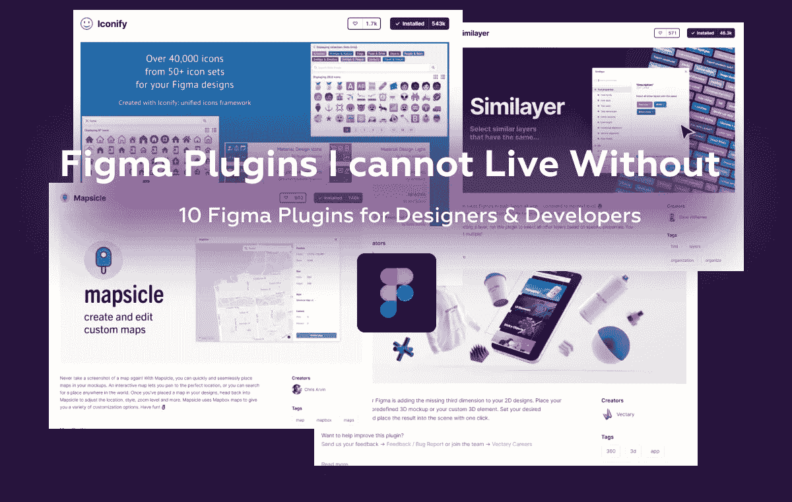

## 面向设计师和开发人员的 10 个 Figma 插件

无论你是设计师还是开发者，你肯定听说过 Figma。这是一个免费的工具，允许使用核心功能轻松创建设计模型和原型，但也有一个令人惊叹的插件生态系统，供第三方开发者集成他们的 API 或扩展基本功能。

# [**1。图标化**](https://www.figma.com/community/plugin/735098390272716381/Iconify)

每个人都喜欢图标，因为它们已经成为每个设计的重要组成部分。使用 iconify，您可以从许多免费图标集中搜索某个图标，并在几秒钟内将 SVG 集成到设计中。

> 提示:使用相同系列或相似风格(粗细)的图标。

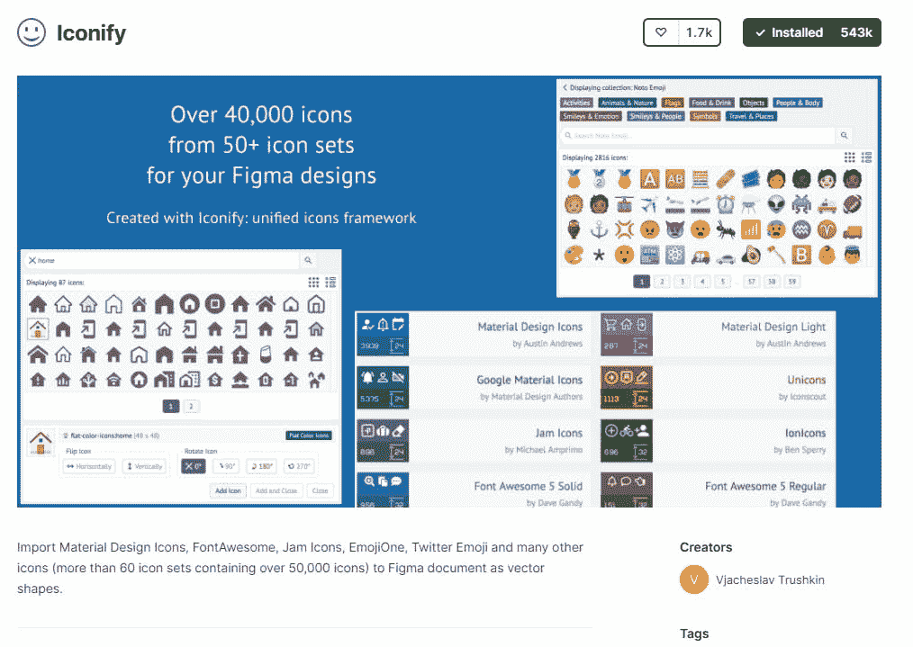

Iconify Figma Plugin

# [2。去飞溅](https://www.figma.com/community/plugin/738454987945972471/Unsplash)

美丽和高质量的图像有助于大大改善网站的外观，Unsplash 是图像资产的首选网站之一。这个扩展将 Unsplash 集成到 Figma 中，以在帧上即时设置图像。

> 提示:如果你右击插件中的一张图片并选择多个框架，你可以选择不同的图片同时插入到选定的框架中。

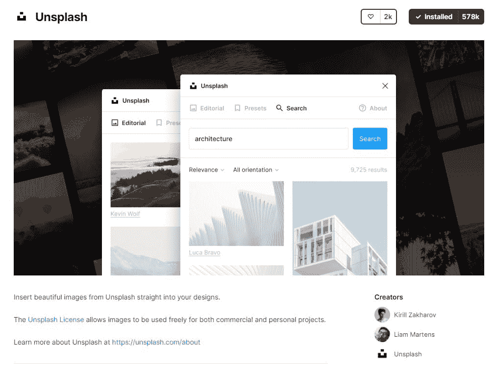

# [3。LogoFetch](https://www.figma.com/community/plugin/827609259425497670/LogoFetch)

这个插件非常适合下载某个品牌的图像资源，并将它们集成到你的设计中。

> 提示:如果你需要 SVG 格式的标志，你可以使用[矢量标志](https://www.figma.com/community/plugin/854152902511629627/Vector-Logos)。

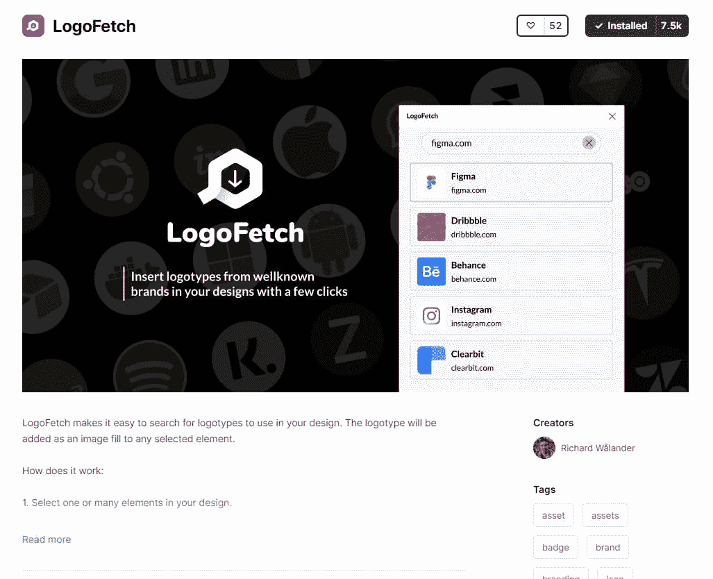

# [4。相似者](https://www.figma.com/community/plugin/735733267883397781/Similayer)

如果您正在创建一个设计系统，并且添加了许多图标，而开发人员想要下载所有图标，该怎么办？Similayer 提供了大量同时选择多个图层的选项，非常方便。

> 提示:您可以选择多个属性来同时查找相似的图层。

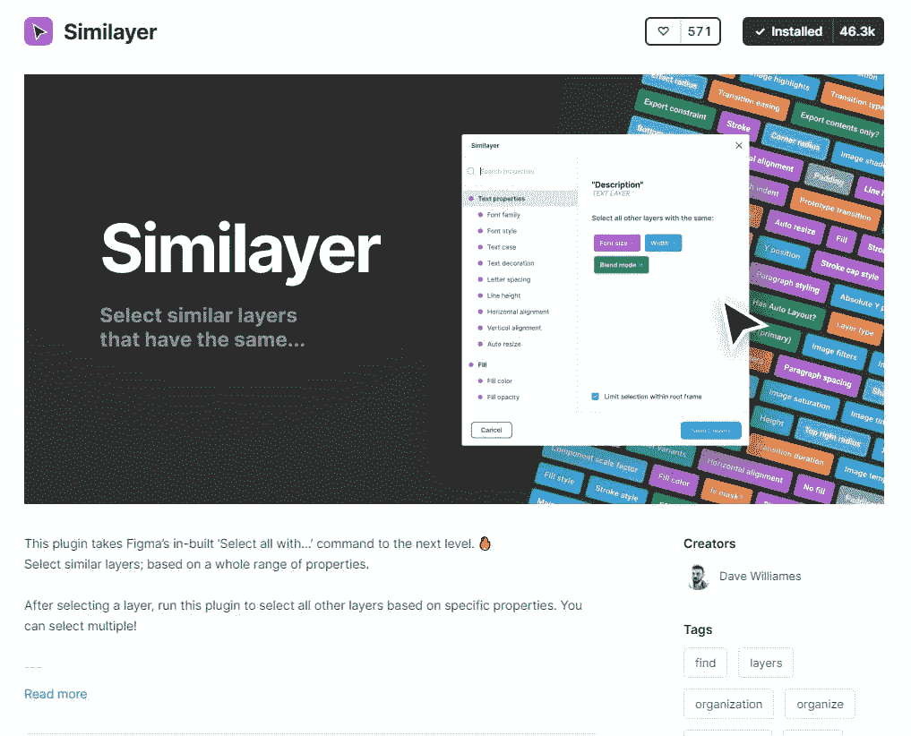

# [5。Lorem Ipsum](https://www.figma.com/community/plugin/736000994034548392/Lorem-ipsum)

每个人都知道 Lorem Ipsum 是什么，您可以快速填充文本部分来测试整体外观和大小。

> 提示:即使你正在写一个线框，也要为你正在设计的产品使用合适的文本。

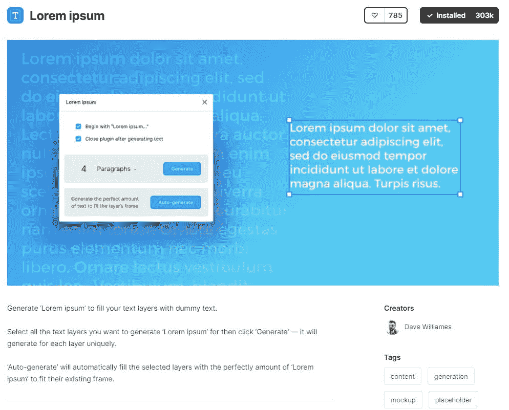

# [6。超级整洁](https://www.figma.com/community/plugin/731260060173130163/Super-Tidy)

组织和重新排序选定的帧在几秒钟内，它有助于保持您的屏幕整洁。

> 提示:如果您从插件菜单中选择运行自定义>首选项，您可以自定义网格间距。

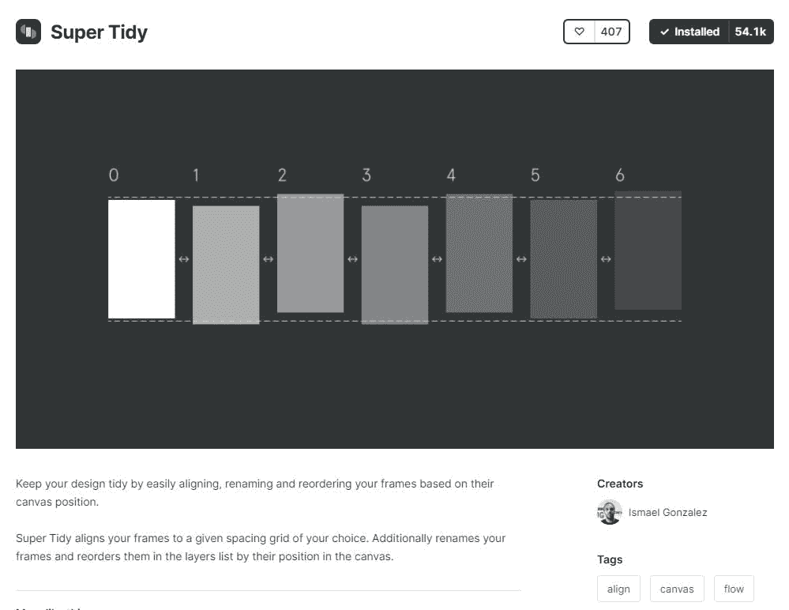

# [7。用户界面界面](https://www.figma.com/community/plugin/769664006254845172/UI-Faces)

好看的用户图片触手可及。类似于 Unsplash，但这是围绕人的形象。

> 提示:另一个选择是[头像](https://www.figma.com/community/plugin/739659977030056719/Avatars)，尽管你不能像在 UI 界面中那样过滤某些属性。

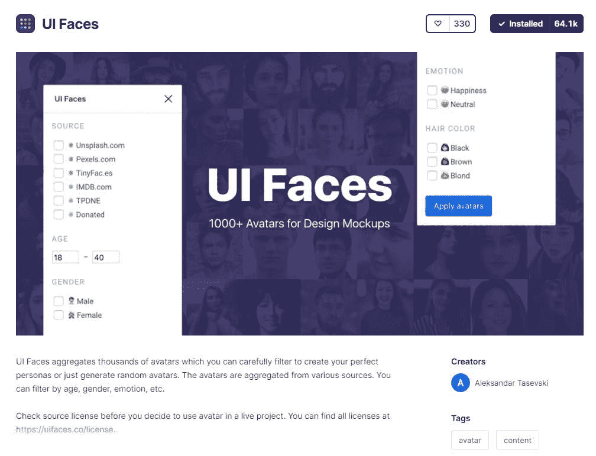

# [8。地图](https://www.figma.com/community/plugin/736458162635847353/Mapsicle)

将高度可定制的 [Mapbox API](https://www.mapbox.com/) 与 Figma 集成。您可以从现有的样式中生成地图，以便在开发中重用。

> 提示:你可以使用用 [Mapbox Studio](https://www.mapbox.com/mapbox-studio/) 创建的自定义地图样式。

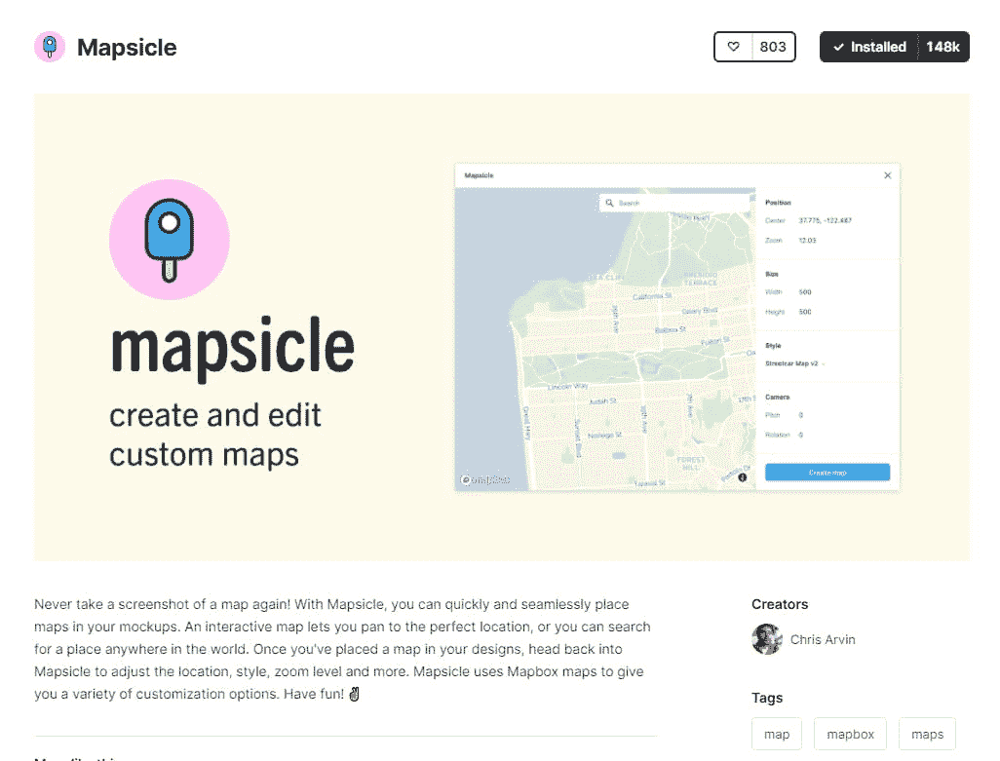

# [9。顺风 CSS](https://www.figma.com/community/plugin/738806869514947558/Tailwind-CSS)

这是更多的开发者熟悉这个实用的 CSS 框架，你可以从 config JSON 加载所有的定制风格到 Figma。

> 提示:你可以用 [Shuffle](https://shuffle.dev/) 生成 Tailwind HTML 代码。

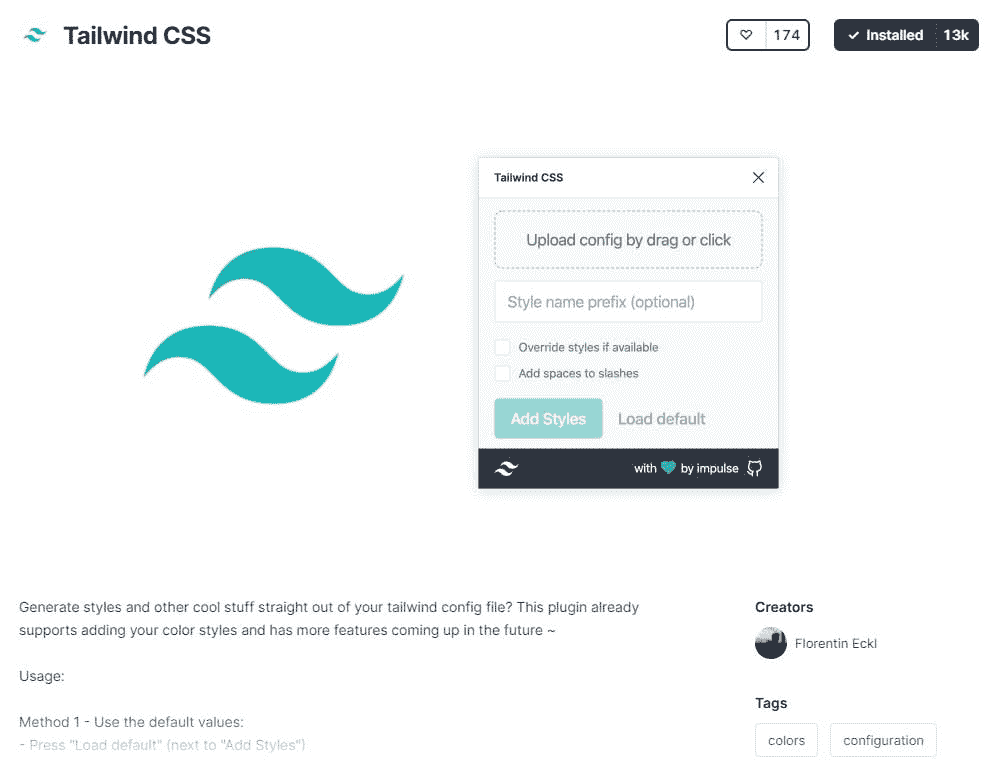

# [10。矢量 3D 元素](https://www.figma.com/community/plugin/769588393361258724/Vectary-3D-Elements)

随着越来越多的网站将互动 3D 体验作为其主要的品牌方向，3D 在 2021 年风靡一时，Vectary 3D 帮助建模经验较少的设计师将 3D 元素作为图像整合到他们的设计中。

> 提示:如果你是一名开发者，你必须试试 ThreeJS。

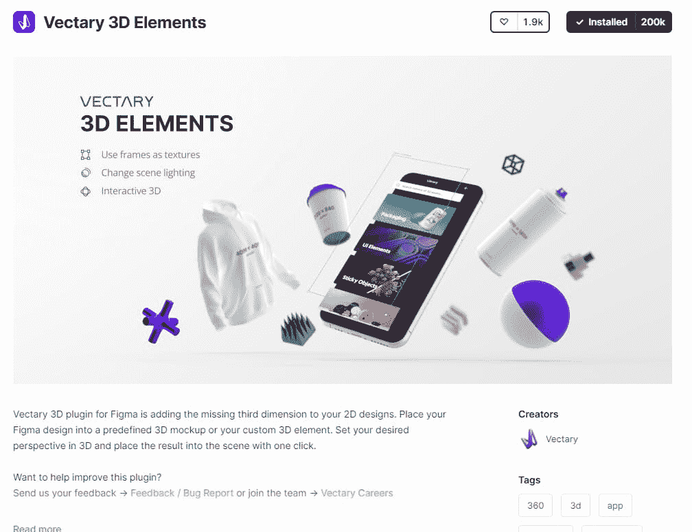

> 我希望你喜欢这篇短文，如果你把💜这就去。
> 
> 对于设计和开发项目，请在 [alexstreza.dev](https://alexstreza.dev/) 查看我的网站联系信息。

*更多内容请看*[***plain English . io***](http://plainenglish.io/)