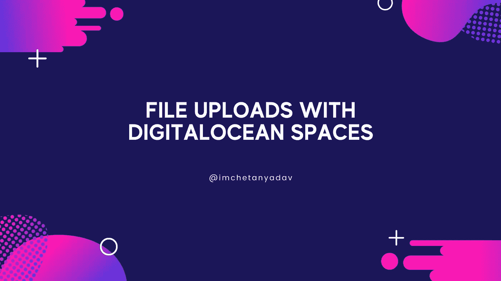

# 使用数字海洋空间上传文件

> 原文：<https://javascript.plainenglish.io/file-uploads-with-digitalocean-spaces-1d35742f1b5c?source=collection_archive---------2----------------------->



在本教程中，我们将学习如何设置文件上传到数字海洋空间。

我们将使用 Node.js 作为服务器，React 作为前端。不浪费任何时间，让我们开始吧。

# 安装软件包

*   DigitalOcean spaces 使用 AWS，因此我们将使用`aws-sdk`包上传文件，使用`formidable-serverless`包在服务器上检索发送的文件。使用下面的命令添加包。

```
npm install --save aws-sdk formidable-serverless// ORyarn add aws-sdk formidable-serverless
```

# 配置 AWS

*   要使用 Spaces API，您需要[从](https://www.digitalocean.com/docs/spaces/how-to/manage-access/#access-keys) [API 页面](https://cloud.digitalocean.com/settings/api/tokens)为您的空间创建一个访问密钥和秘密密钥。
*   通过配置访问密钥、密钥和端点设置，将 AWS 包配置为与 S3 API 一起使用。端点值应该是`${REGION}.digitaloceanspaces.com`，其中`${REGION}`是您的空间所在的数字海洋数据中心区域(例如`nyc3`)。

```
import aws *from* "aws-sdk";const s3 = new aws.S3({
  endpoint: "nyc3.digitaloceanspaces.com",
  accessKeyId: process.env.SPACES_ACCESS_KEY,
  secretAccessKey: process.env.SPACES_SECRET_KEY,
});
```

# 前端添加上传按钮

*   为了简单起见，我会直接将选择的文件传递给服务器，而不需要确认它，但是您可以将它存储到状态，然后单击提交按钮传递给服务器。

```
<input
  type="file"
  {/* Specify this if you want user to only upload specific file types */}
  accept={fileTypes}
  onChange={async (e) => {
    *if* (e.target.files.length > 0) {
      // Update UI to show file is uploading
      const file = e.target.files[0];

      // Create FormData and pass picked file with other necessary details
      const formData = new FormData();
      formData.append("file", file);
      formData.append("id", userId); *try* {
        const uploadFileRes = *await* fetch("/api/uploadFile", {
          method: "POST",
          body: formData,
        }); const uploadFileData = *await* uploadFileRes.json();
        // Retrieve url and show it to user?
        // Update UI to show file has been uploaded
      } *catch* (e) {
        console.log(e);
        // Update UI to show file upload failed
      }
    }
  }}
/>
```

# 检索文件并上传到服务器上的数字海洋

*   在服务器上，我们将使用`formidable-serverless`包从`request`对象中检索文件和其他细节。使用 S3 `upload`方法将文件上传到数字海洋空间。

```
import formidable *from* "formidable-serverless";const form = new formidable.IncomingForm();
form.uploadDir = "./";
form.keepExtensions = true;form.parse(req, async (err, fields, files) => {
  *if* (err || !fields.id) *return* res.status(500); // Read file
  const file = fs.readFileSync(files.file.path);

  s3.upload({
    Bucket: "bucket-name", // Add bucket name here
    ACL: "public-read", // Specify whether anyone with link can access the file
    Key: `${fields.id}/${files.file.name}`, // Specify folder and file name
    Body: file,
  }, {
    partSize: 10 * 1024 * 1024,queueSize: 10,
  }).send((err, data) => {
    *if* (err) *return* res.status(500); // Unlink file
    fs.unlinkSync(files.file.path); *//* Return file url or other necessary details *return* res.send({
      url: data.Location
    });
  });
});
```

*   把所有的放在一起

```
import aws *from* "aws-sdk";
import formidable *from* "formidable-serverless";const s3 = new aws.S3({
  endpoint: "nyc3.digitaloceanspaces.com",
  accessKeyId: process.env.SPACES_ACCESS_KEY,
  secretAccessKey: process.env.SPACES_SECRET_KEY,
});const form = new formidable.IncomingForm();
form.uploadDir = "./";
form.keepExtensions = true;form.parse(req, async (err, fields, files) => {
  *if* (err || !fields.id) *return* res.status(500); // Read file
  const file = fs.readFileSync(files.file.path);

  s3.upload({
    Bucket: "bucket-name", // Add bucket name here
    ACL: "public-read", // Specify whether anyone with link can access the file
    Key: `${fields.id}/${files.file.name}`, // Specify folder and file name
    Body: file,
  }, {
    partSize: 10 * 1024 * 1024,queueSize: 10,
  }).send((err, data) => {
    *if* (err) *return* res.status(500); // Unlink file
    fs.unlinkSync(files.file.path); *//* Return file url or other necessary details *return* res.send({
      url: data.Location
    });
  });
});
```

本教程到此为止。希望对你有帮助。在 [Instagram](https://www.instagram.com/imchetanyadav/) 和 [Twitter](https://twitter.com/im_chetanyadav/) 上关注我，获取更多信息。