# 觉得回调很混乱？他们只不过是…

> 原文：<https://javascript.plainenglish.io/find-callbacks-confusing-they-are-nothing-but-ce3df3601fc5?source=collection_archive---------9----------------------->

## 为回访建立一个坚实的心理模型！

[📷](https://www.pexels.com/@igor-14869791?utm_content=attributionCopyText&utm_medium=referral&utm_source=pexels)

回调是 JavaScript 中经常出现的一个重要术语。它们使得承诺和异步/等待成为可能，并且是异步 JavaScript 的一个重要特性。它们也为使用 JavaScript 进行函数式编程铺平了道路。

有一百万篇博客都是关于复试的，为什么你还要读另一篇呢？在本帖中，我们将尝试开发一个正确的心智模型，并检查几个用例。

在开始之前，我想提醒您，在 JavaScript 中，每个函数都是一个一级对象。每个函数都是一个对象，可以像任何其他对象(字符串、数字等)一样使用。).

这使我们能够

*   将其赋给其他对象的变量和属性
*   将它作为参数传递给函数
*   作为函数的值返回

在另一个函数中使用函数作为参数是 JavaScript 中回调的基础。

# 回调只是传递给其他函数的函数。

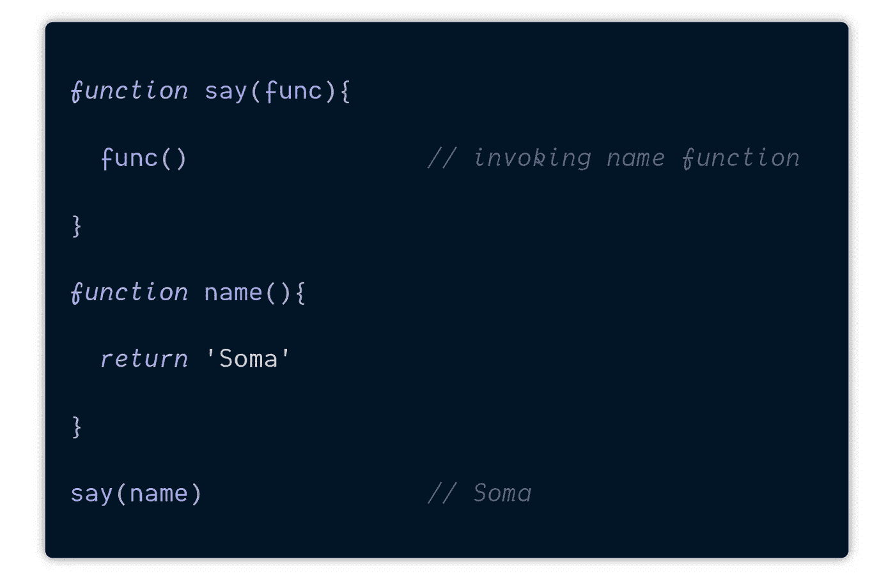

在这个例子中，`name()`函数作为一个参数被传递给`say()` 函数并进入它的内部。

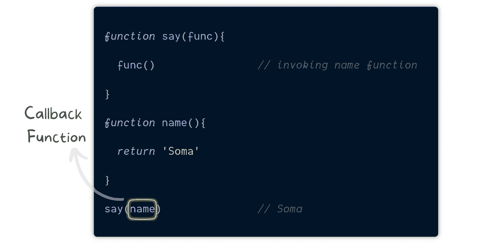

因此，每当我们将一个函数传递给另一个函数并在那个函数中执行它时，我们称之为 ***回调*** 。

那就是所有的那一个 ***回调*** 就是。它只是程序员为彼此交流代码而创造的一个术语。

值得注意的是，回调函数并不是立即被调用的。它在所包含的函数体内的特定点被“回调”(因此得名)。

如果回调被称为事后调用，可能就不会那么令人困惑了，但是你能做什么呢？我们暂时被这个术语困住了，我们最多能做的就是彻底理解它。

另一方面，接受其他函数作为参数的函数在我们的例子中称为 ***高阶函数*** *—* say()。

****高阶函数*** 包含回调函数执行时*的逻辑。这两者的结合使我们能够扩展我们的功能。**

*很多时候我们不需要独立的函数，在这种情况下我们使用匿名函数。我们可以传入匿名函数而不是命名函数。*

*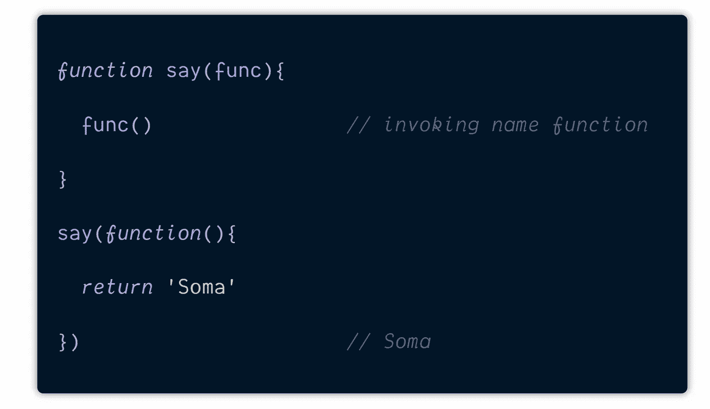*

*我们可以利用箭头功能使它看起来更光滑。*

*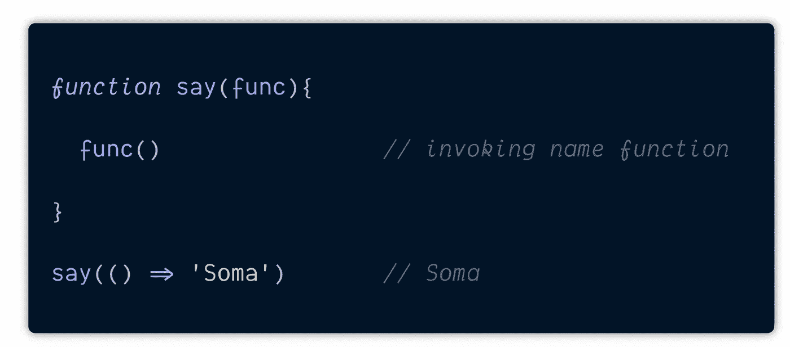*

# *你的方式不是唯一的方式。*

*这是我的问题！*

## ****我们需要这样写代码吗？****

*我们可以这样写上面的代码来做同样的事情:*

*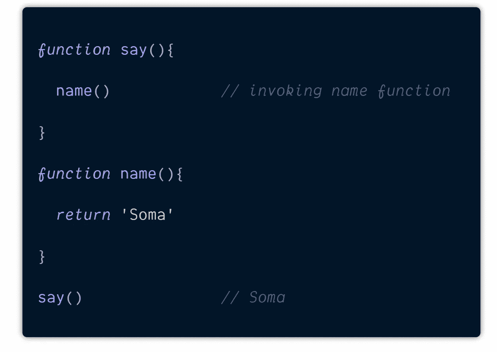*

*This still works.*

*阅读起来也容易多了！那为什么我们在 JavaScript 中使用回调来做事情呢？*

****我们需要用回调来完成事情吗？****

*在你继续之前慢慢来——试着想出你需要它的情况。*

# *任何事物都有它的用途，直到它的用途被达到*

*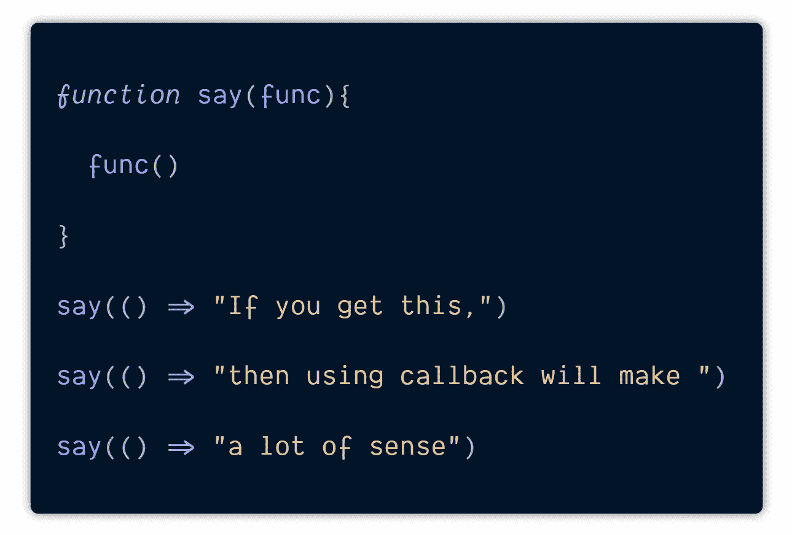*

*没有将回调作为参数传递的可能性，您的 say 将被绑定到一致执行`name()`,因为它在您的函数代码中是固定的。*

*当你在做一些简单的事情时，在一个函数中调用另一个函数是有意义的。尽管如此，当事情变得复杂时，我们会使用回调。*

*回调和更高阶的函数简化了我们的代码并保持它的干爽——不要重复你自己。*

*回调可以防止长时间运行的操作被阻塞。您传递一个回调函数，在函数操作完成后运行。在处理它时，代码将控制返回到主事件循环，而不是阻塞。*

*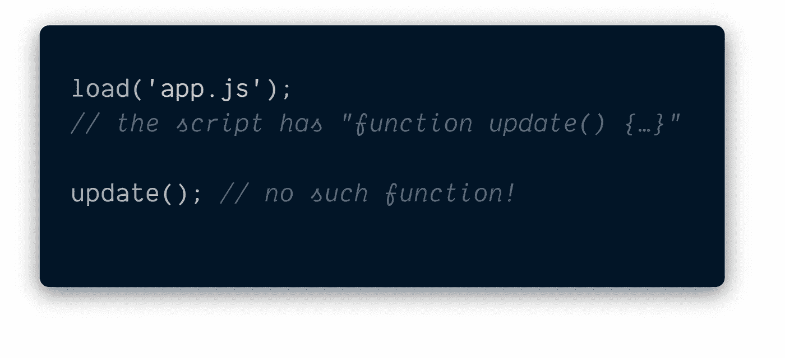*

*让我们添加一个 ***回调*** 函数作为 ***load*** 的第二个参数，它应该在脚本加载时执行，现在如果我们想从脚本中调用新函数，我们应该在回调中编写:*

*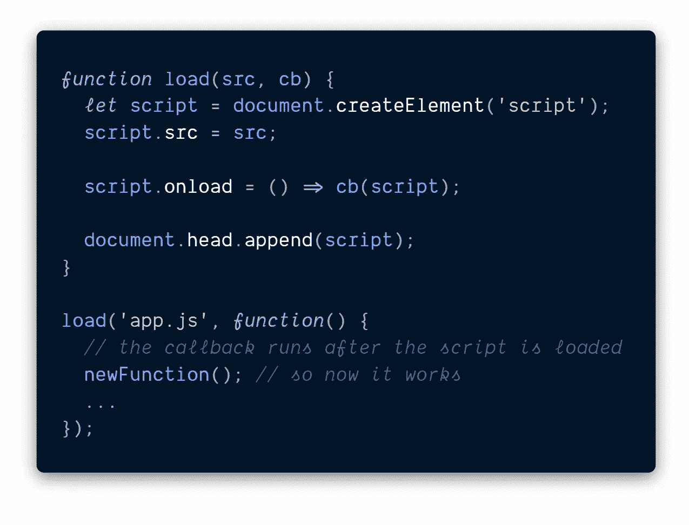*

*这样做使我们能够用 JavaScript 进行基本的异步编程。JavaScript 是单线程的——一次只能做一件事。在最基本的层面上，JavaScript 中的异步编程是通过回调来完成的。*

# *顺便说一下，回调被调用成为:同步和异步回调。*

*理解他们是如何工作的对于避免混乱是至关重要的。*

**同步回调*在使用回调的高阶函数执行期间*被执行。我们之前看到的例子都是*同步回调。***

*JavaScript 主机环境提供了许多功能，允许您调度*异步*动作。换句话说，我们现在开始的行动，后来才结束。*

*例如，一个这样的功能是`**setTimeout**` **功能**。*

*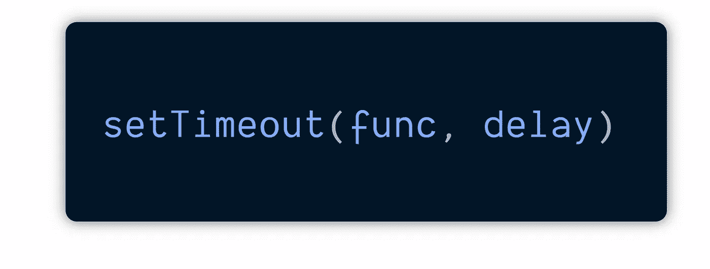*

*它将在特定时间—毫秒或秒(*)后运行特定代码块或代码函数( ***func*** )。**

**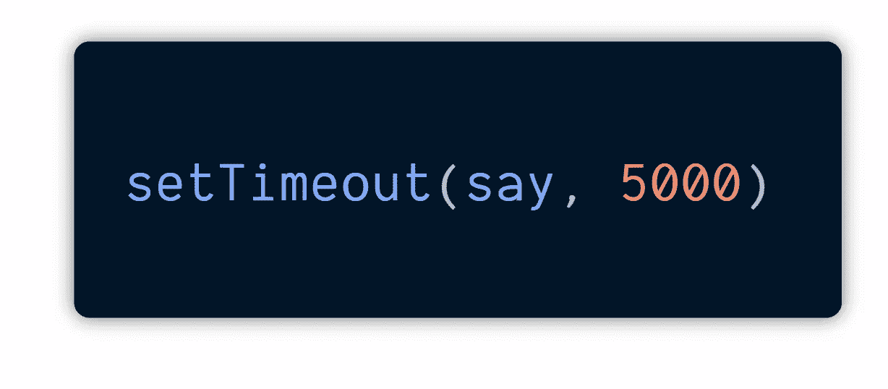**

**We pass in five thousand, which is five seconds, and the first argument is a function we want to execute after 5secs.**

**我们可以用匿名函数做同样的事情。**

**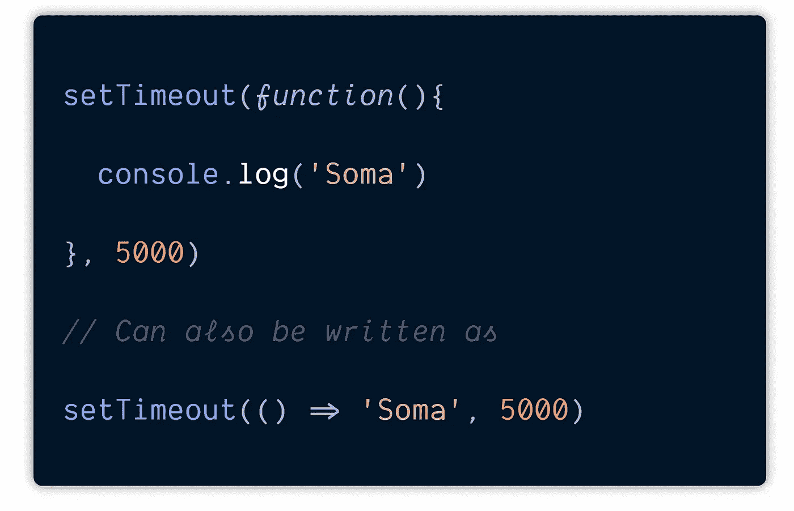**

**客户端 JavaScript 程序几乎都是事件驱动的。这意味着，它们通常会等待用户做一些事情，然后对用户的动作做出响应，而不是运行某种预定的计算。**

**当用户按下键盘上的键、移动鼠标、单击鼠标按钮或触摸触摸屏设备时，web 浏览器会生成一个事件。**

****事件驱动的 JavaScript** 程序在指定的上下文中为指定类型的事件注册回调函数，当指定的事件发生时，web 浏览器调用这些函数。**

***这些回调函数被称为事件处理器或事件监听器*，它们被注册到`addEventListener()`**

**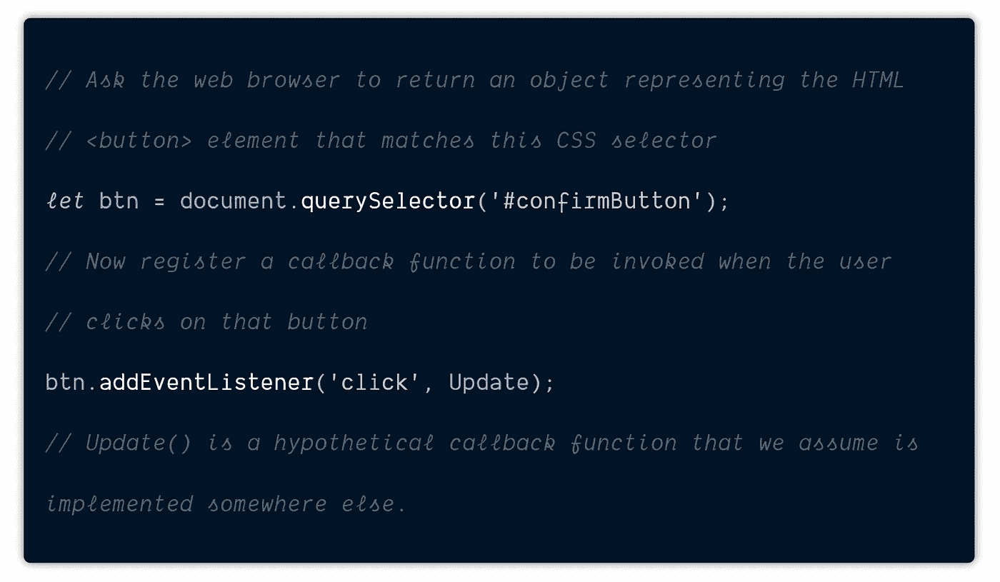**

**当使用 Node.js 在后端工作时，回调大放异彩。可以说回调是 Node.js 的基础。**

**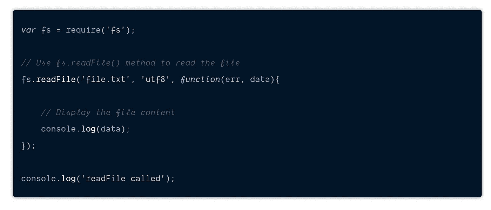****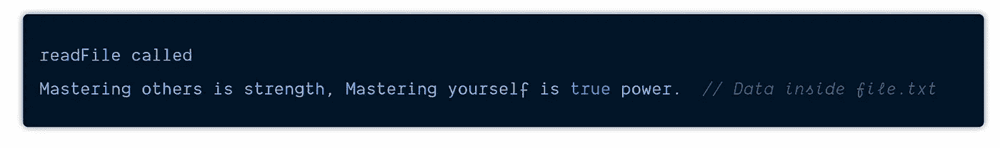**

**When the fs.readFile() is done reading the file, it invokes the callback function, giving us the data inside the file. Meanwhile, the execution thread continues down the line.**

**当`fs.readFile()`读取完文件后，它调用回调函数，给我们提供文件中的数据。同时，执行线程继续运行。这就是我们所说的无阻塞的含义。**

**回调给了你一个接口，你可以说，“当你完成了那件事，做所有这些。”我们可以像这样以嵌套形式使用回调:**

**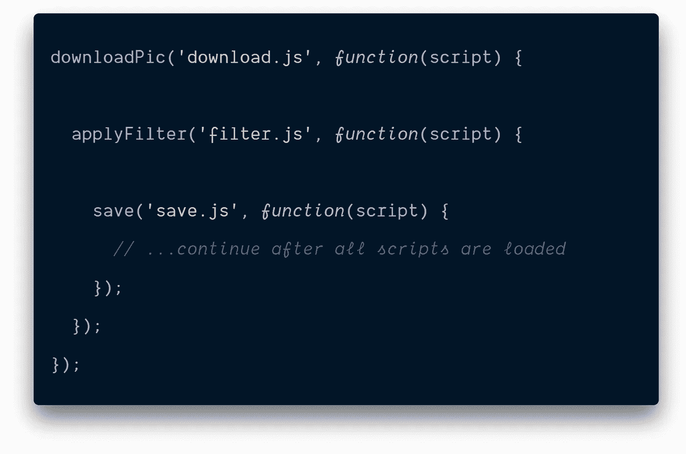**

**After the outer `downloadPic()` is complete, the callback initiates the inner one.**

# **末日金字塔**

**乍一看，这是一种可行的异步编码方式。的确如此。对于一个或两个嵌套调用来说，这看起来没什么问题，但是对于一个接一个的多个异步操作来说，我们会有这样的代码:**

**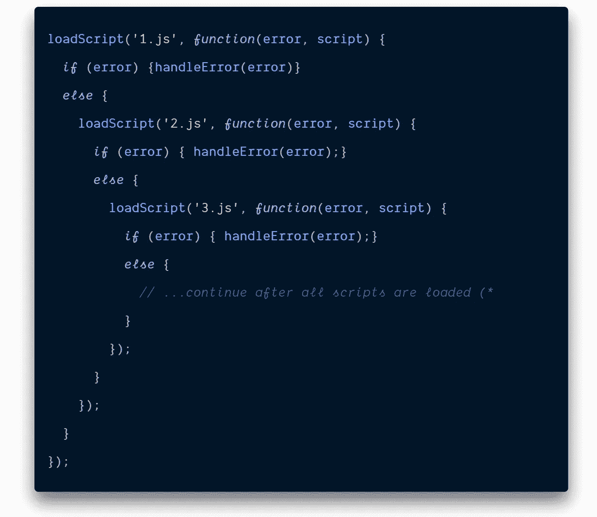**

**随着调用变得更加嵌套，代码变得更加深奥，管理起来也越来越困难。这有时被称为“ ***”或“末日金字塔”*****

**当您一次只等待一个操作或者当响应返回时您只有一项工作要做时，回调非常有用。尽管如此，当您需要管理多个异步依赖项或者有几个不相关的任务等待相同的数据时，承诺变得非常有用。**

** [## 纠结于 JavaScript 中的承诺？

### 结束你的痛苦。了解如何在现有代码中使用承诺。现实生活中的例子将帮助你掌握…

javascript.plainenglish.io](/struggling-with-promises-in-javascript-7808ec1303cc) 

# 摘要

*   传递给另一个函数的函数称为回调。
*   接受一个函数的外部函数是我们的高阶函数
*   回调和高阶函数简化了我们的代码
*   保持干燥
*   顺便说一下，回调被调用成为:*同步*和*异步*回调。
*   在函数返回之前会调用一个**同步**回调——而接收回调的 API 会保留在堆栈上。一个例子可能是一个`list.foreach(callback)`；当`foreach()`返回时，您会期望在每个元素上调用回调。
*   一个**异步**或**延迟**回调在一个函数返回后，在另一个线程的堆栈上被调用。延迟的机制包括线程和主循环(其他名称包括事件循环、调度程序、执行程序)。
*   异步回调在 IO 相关的 API 中很流行，比如`fs.readFile`。您可能期望当`readFile()`返回时，回调可能还没有被调用，因为它正在等待读操作完成。
*   我们可以将一个回调函数嵌套在另一个回调函数中，但是这样做会增加代码的可读性，并导致我们称之为末日金字塔的结果。
*   承诺提供了一种更好的方法来管理多个异步依赖项，或者您有几个不相关的任务在等待相同的数据。

# 感谢信

我想利用这最后的机会说声谢谢。

感谢您的光临！如果没有像你们这样的人跟随并带着这种信念阅读我的帖子，我将无法做我现在做的事情。

我希望你能 [**加入我的**](https://polymathsomnath.medium.com/subscribe) **[**我的未来博客**](https://polymathsomnath.medium.com/subscribe) 中的** 并留下来，因为我认为我们这里有一些很棒的东西。我希望在未来的许多年里，我能在你的职业生涯中帮助你！

下次见。再见！

*更多内容请看*[*plain English . io*](http://plainenglish.io/)**