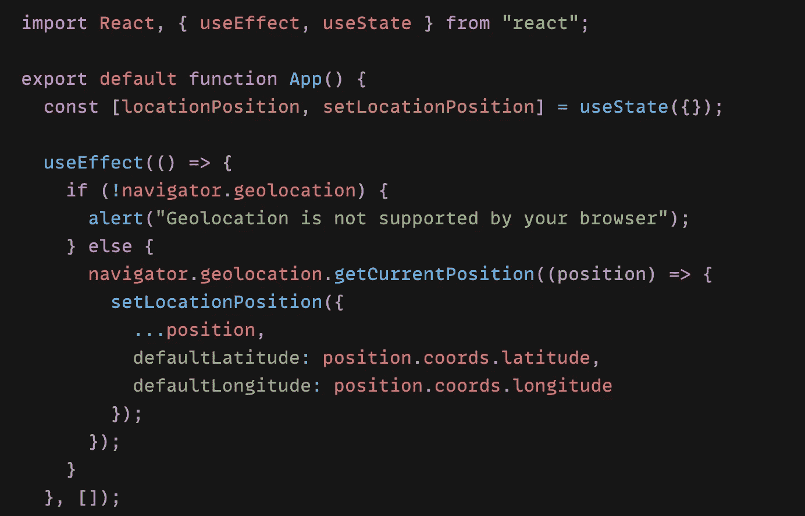
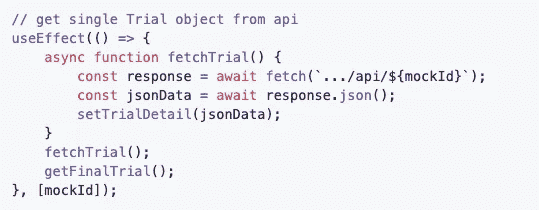
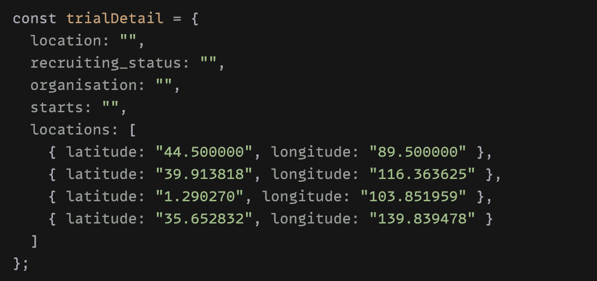
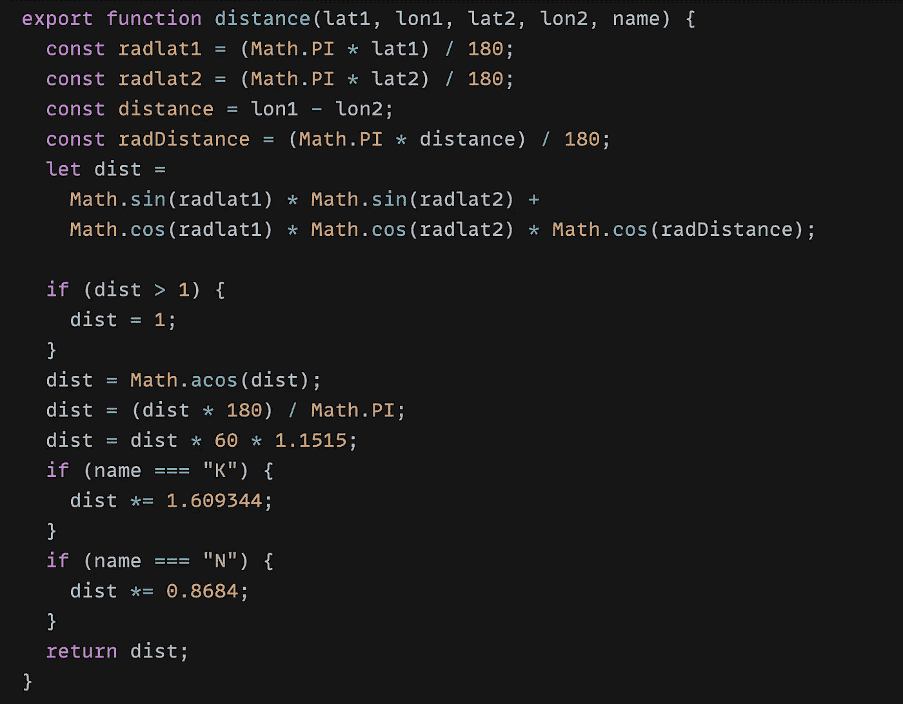
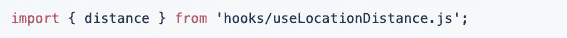
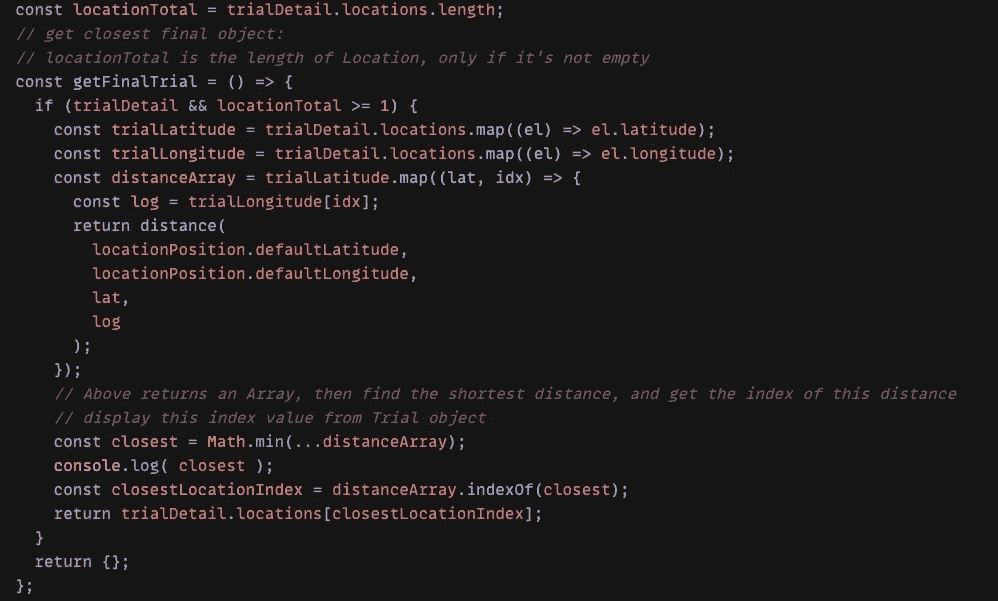
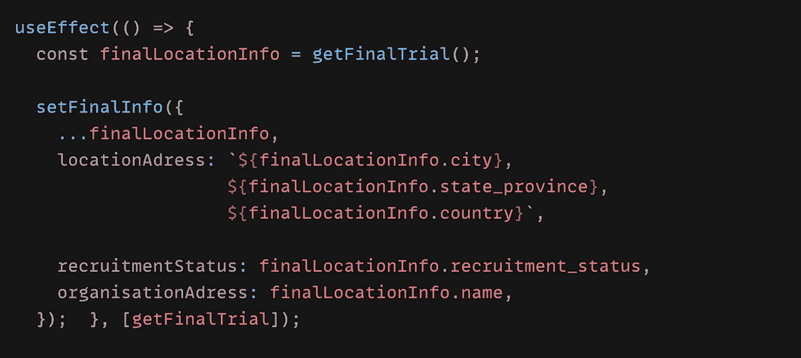
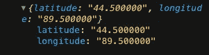

# 以反应的方式找到最近的位置

> 原文：<https://javascript.plainenglish.io/find-the-nearest-location-in-a-react-way-9ed51a999807?source=collection_archive---------3----------------------->

—️地理定位 API

Long way to go, keep learning — 路漫漫其修道远，吾将上下而求索

在我最近的一个 React 项目中，我需要从世界各地的医学研究机构(**试验**)中找到离用户最近的位置，并显示其内容。

这听起来很复杂。起初感觉很混乱，但仔细考虑后，我注意到这里实际上有 4 点:

*   *当前用户位置* *📍*
*   *全球试验📍*
*   *各试验点📍*
*   *距离这些位置最近的位置📍*

🤯

但是让我们一步一步地简化这件事:

**首先**用**地理定位 API** 获取我们用户的当前位置，以便以后可以和所有的试航地点进行比较:

🌐 *The Geolocation API returns* geographical position of a user, since this can compromise privacy, the position is not available unless the user approves it

*在我的项目中，有一个 Api 返回关于一个* ***单个*** ***试验、*** *的信息。首先，我提取了如下数据:*

📝但是对于这篇文章，我将使用模拟数据进行试验

single trial mock data, “location” refers to the trial name, “locations” refers to all the available locations within this trial

**其次**创建一个**自定义钩子**的功能，计算**用户**和**试验**位置之间的距离，使用 **lat** 和 **lon** 作为**纬度**和**经度**:

🎲 Calculate distance based on latitude and longitude

**接下来**，用以下命令在反应组件中导入该自定义钩子:

import hook within react component

**然后**创建一个**getfinallytrial()**函数，该函数使用这个自定义钩子并返回最近的试验位置:

find closest location between user and trial locations using custom hook

我在上面做的是:

1.  检查是否有从后端返回的 trialDetail 及其位置(在从 API 获取的真实项目中，对于本文，模拟数据来自第一步**“**trial detail”**)**
2.  **如果是，将**试验细节位置映射到**上，得到**试验纬度**和**试验经度**阵列(💥**键**在本例中省略，但在现实世界中应该明确使用**，例如可以是**id******
3.  ****取**三纬度**，“映射”它，得到一个包含每个试验纬度的数组，我使用每个纬度项的**索引**，**将它们对应到**三经度**数组中的每个**经度********
4.  **用这些**参数调用从 **useLocationDistance** **自定义钩子**导入的 **distance()** 函数，** this 返回一个数组，包含用户与每个试验位置之间的所有比较距离**
5.  **从该数组中找出距离**最短距离**的最小数字，将其定义为距离**最近的**，并使用其**索引**，以便从所有试验位置中找到相应的位置**

****最后一步:****

****

**call getFinalTrial() within useEffect and set the final info state**

***如果我们“console.log”了 finalLocationInfo，我们就得到这个最近的位置(在这个例子中是第一个来自* ***模拟审判*** *的位置)*👇**

****

**使用 **useEffect** 我们可以更新 **finalInfo** *(在上面的代码示例中省略了状态)* 和显示我们想要的任何内容，例如使用"**final info . recruitmentstatus "**等。在我们的**返回**体内以一种**的方式对**做出反应。**

**就是这样！**

**我觉得这个例子挺有意思的，但是基于我的编码经验不足，可能会有一些不足。我将非常感谢你的建议，谢谢你！**

***更多内容请看*[*plain English . io*](http://plainenglish.io/)**