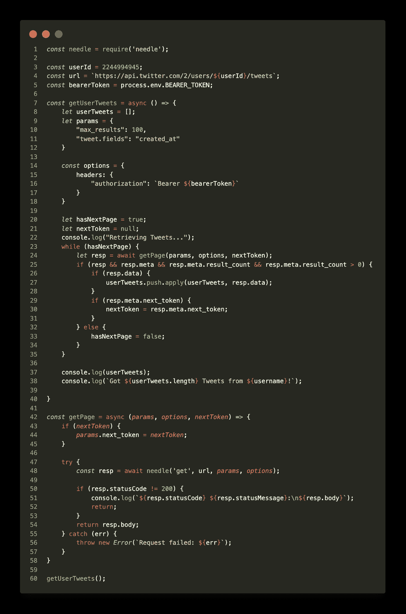
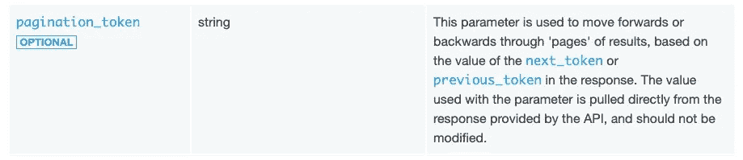
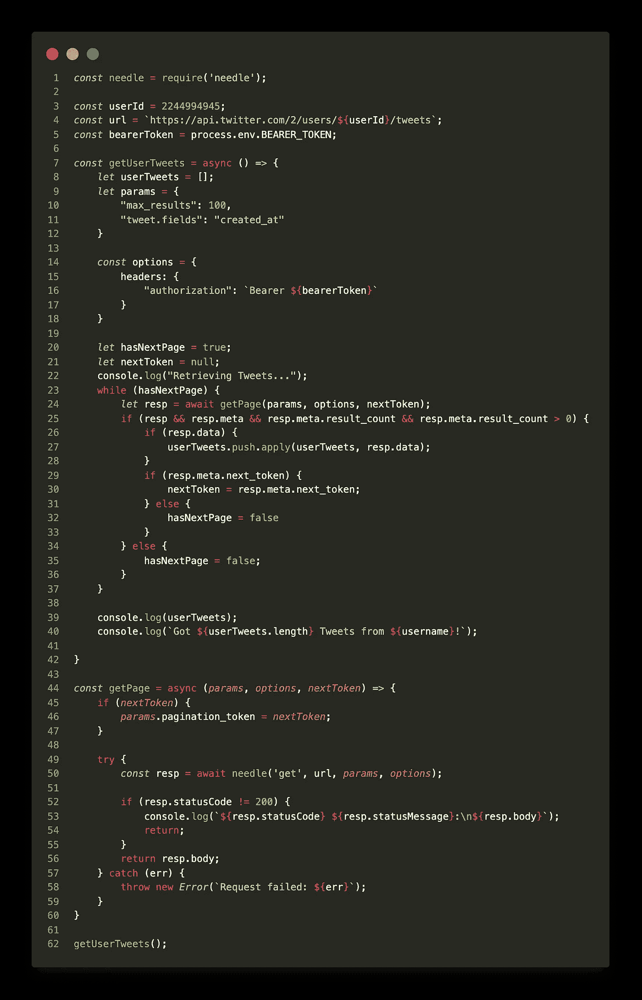
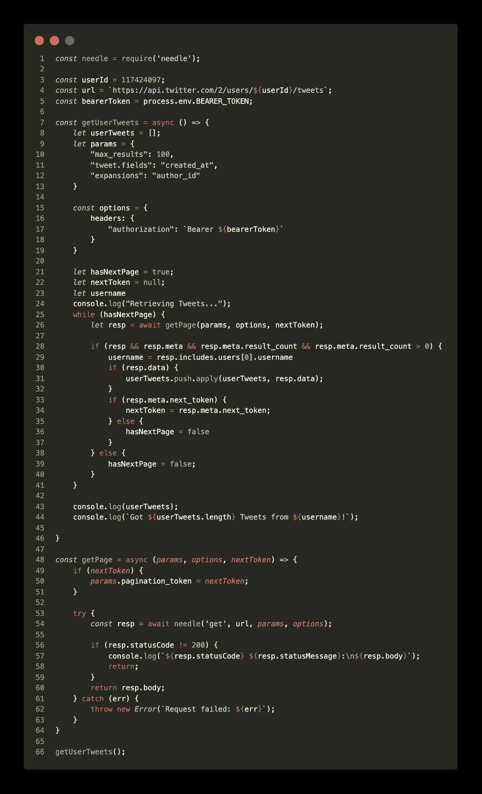

# 我在 Twitter 的 API 示例代码中发现了 3 个 bug

> 原文：<https://javascript.plainenglish.io/finding-3-cute-bugs-in-twitters-api-code-examples-614de08feea3?source=collection_archive---------8----------------------->

## 我发现的错误以及我如何修复它们

*更新:Twitter 开发者倡导者，*[*Andy Piper*](https://twitter.com/andypiper)*，主动通知我他们已经修复了这个问题。我保留这篇文章，作为当你陷入困境时如何解决问题的示范。伸出手来是不是很酷？！？！谢谢安迪。*


# 我在建造什么

对于任何一个在美国生活了十个月的人来说，事情变得……不同、出乎意料，而且我敢说:前所未有，应该不会感到惊讶。由于 COVID 和数百万人突然转向在家工作，或者更糟糕的是，你意外失业，导致住宅垃圾产量大幅上升。这导致费城出现了许多不可预测的延误，通常由街道部门的推文发出信号，表示将会出现延误，随后是估计何时恢复收集。

我想创建一个 NodeJS 应用程序，它可以在 [PhilaStreets](http://twitter.com/philastreets) 的推文中包含暂停、收集、恢复、延迟这些术语时，随时给我发邮件或发短信。第一步是注册 Twitter 的新 API(v2 ),这或多或少涉及一个详细说明我将如何使用 API 的应用程序，以及一个测谎仪，并承诺交出我的第一个孩子。经过一段时间的反复，我获得了一个授权持有人令牌，并开始研究文档。

̶a̶s̶̶o̶f̶̶t̶h̶i̶s̶̶w̶r̶i̶t̶i̶n̶g̶̶t̶h̶e̶̶e̶r̶r̶o̶r̶s̶̶i̶n̶̶t̶w̶i̶t̶t̶e̶r̶'̶s̶̶e̶x̶a̶m̶p̶l̶e̶̶c̶o̶d̶e̶̶a̶r̶e̶̶s̶t̶i̶l̶l̶̶u̶p̶̶o̶n̶̶g̶i̶t̶h̶u̶b̶.̶

# Twitter 的文档

为我的目的服务的端点被称为“用户 Tweet Timeline”，这是一个分页的响应，提供查询参数来缩小或扩大搜索范围。谢天谢地，他们在 Github 上提供了 Python、Ruby、Java 和 JavaScript 实现[。我将使用后者来获得更多在 NodeJS 生态系统中工作的经验。](https://github.com/twitterdev/Twitter-API-v2-sample-code/tree/master/User-Tweet-Timeline)

## 问题 1

下面你会看到功能`getUserTweets()`。它使用了我发现 bug 的`getPage()`函数。



Twitter’s GitHub example for User Tweet Timeline queries

注意`getPage()`定义中的第 44 行:如果在 API 的`resp.meta`中有一个`next_token`键，那么他们的 Github 代码示例说你需要在`next_token`的下一个请求中设置一个键，它等于返回的令牌，以利用它们的分页特性。我一直得到一个“错误:错误的请求”,虽然在刚刚收到第一页，并要求下一页。在他们的网站上对他们的 [API 文档进行了一些调查和交叉检查之后，我发现在后续请求中存储`next_token`值的键应该是`pagination_toke`。哎呀！](https://developer.twitter.com/en/docs/twitter-api/tweets/timelines/api-reference/get-users-id-tweets)



## 问题 2

在我压扁这只虫子后，另一只虫子抬起了头。它与由第 33 行`resp.meta.next_token`的真实度决定的`hasNextPage`变量的设置有关。当 API 的响应中没有收到`next_token`时，我希望将`hasNextPage`设置为 false，但是第 33 行从未被命中，它只是无休止地调用`while`循环中的所有内容，直到永远，阿门。原来我需要在第 31 行插入一个带有`hasNextPage = false`的`else`。答对了。特别注意第 31–32 行和第 46 行，检查下面的正确代码:



## 问题 3

他们的 GitHub 示例函数的最后一行，`getUserTweets()`记录了 tweets 的数量以及您正在查询的帐户的用户名，但是他们的代码从来没有声明 username 变量，分配它，甚至没有从 API 请求它。为此，您需要向`params`对象添加一个键/值对:

```
{"expansions": "author_id"}
```

`params`对象的基本示例如下所示:

```
let params = {
  "max_results": 100,
  "tweet.fields": "created_at",
  "expansions": "author_id"
}
```

这将指示 API 在其响应中返回一个带有`users`数组的`includes`对象。您可以在`resp.includes.users[0].username`访问用户名。针对这个特定的 bug，观察下面第 12、23 和 29 行中的变化。



# 下一步是什么

是时候提出问题并发起拉动请求了！

# 结论

感谢阅读！你可以在我的 Github 上查看我的[正在开发的 NodeJS 应用](https://github.com/d-otis/tweetStreets)。如有任何问题或反馈，请联系我。

我目前正在做一些 filo I/O 来保存我已经标记并发送给自己的 tweets 的 id。向我发送提醒的条件最初是基于`Date`的东西。我注意到他们在使用 HootSuite，他们在上午 10:01 发送那些预定的推文，但其他临时推文可能在任何时候发生。现在我通过 macOS `launchctl`每小时运行一次。编码快乐！