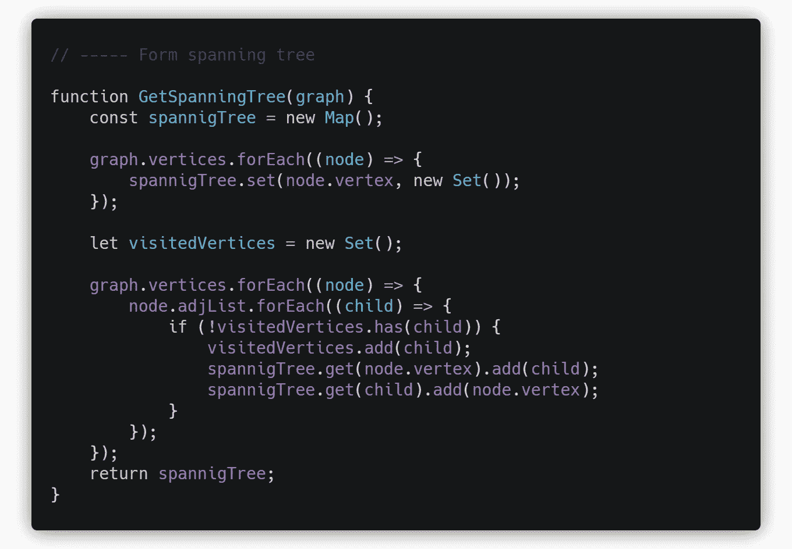

# 在无向图中寻找简单循环——一种 JavaScript 方法

> 原文：<https://javascript.plainenglish.io/finding-simple-cycles-in-an-undirected-graph-a-javascript-approach-1fa84d2f3218?source=collection_archive---------2----------------------->


Cycles in a Graph

这篇文章是为从[图论](https://en.wikipedia.org/wiki/Graph_theory)开始的初学者准备的。以下图形概念的基本知识是理解该算法的先决条件。

*   **简单圈:**简单圈是指图中没有重复顶点(除了开始和结束顶点)的圈
*   **深度优先搜索:**DFS 算法从[根节点](https://en.wikipedia.org/wiki/Tree_(data_structure)#Terminology)开始(在有图的情况下选择任意一个节点作为根节点)，在回溯之前尽可能地沿着每个分支进行探索。
*   **生成树:**无向图[G 的生成树 T 是一个子图，它是一棵包含 G 的所有](https://en.wikipedia.org/wiki/Undirected_graph)[顶点](https://en.wikipedia.org/wiki/Vertex_(graph_theory))的[树](https://en.wikipedia.org/wiki/Tree_(graph_theory))

该算法旨在找出图中重叠最少的所有圈。如果我们有一个图`**[ABCD]**`，算法返回的循环将是`**[ABD]**`和`**[BCD]**`。循环`**[ABCD]**`将不会返回。


# **算法设计**

该算法可以大致分为三个步骤。

1.  根据度数的降序对顶点进行排序。(这样做是为了实现边之间的最小重叠，如果不需要最小重叠的循环，则可以忽略此步骤)
2.  形成图的生成树，并获得移除边的列表。
3.  寻找连接被删除边的端点的环。


# **代表图形**

该算法涉及两个图。第一个是输入图，第二个是生成树。这两个图都使用邻接表表示。

输入图被建模为顶点对象的列表。每个顶点对象包含一个`**vertex**`和一个`**adjacencyList**`。这个图也可以实现为顶点对象的散列图，但是这里选择列表方法是为了便于排序。


生成树被建模为顶点对象的散列图。


# **详细步骤**

`**FindCircuits(graph)**` 方法是接受输入图并返回路径列表的算法的起点。


它由三个主要步骤组成，包括顶点排序、生成树和寻找环。

## **1。G** etSortedVertices **(图形)**

顶点的排序是使用 JavaScript `**Array.Sort()**`方法完成的。


## **2。GetSpanningTree(图形)**

接下来是`**GetSpanningTree(graph)**` 方法，该方法将排序后的图作为输入，并返回生成树。



映射数据结构用于存储生成树。输入图的所有顶点都被添加到生成树中。维护一个`**visitedVertices**`集合，以便在创建生成树时跟踪访问过的边。

生成树是通过循环遍历排序的图并在树中添加相邻的顶点(边)来构建的，如果它还没有被访问的话。(不在`**visitedVertices**`)

## **3。GetAllCycles(图形，生成树)**


我们可以通过在生成树上执行 **DFS** 遍历来获得输入图中存在的圈。

从图中删除的每条边都是某个循环的一部分。输入图中存在一条简单的路径，将已移除边的一端连接到另一端。因为生成树没有任何圈，所以可以从任何顶点到任何其他顶点追踪一条简单的路径。如果我们取被删除边的两端，在生成树中追踪两端之间的简单路径，我们得到一个圈。


边的`**start**`和`**end**`是通过用连字符`**"-"**`分割`**edgeKey**`得到的。

`**FindCycle(start, end, spanning)**` 方法在生成树上执行 DFS 遍历，并返回从`**start**`顶点开始到`**end**`顶点结束的循环。如果在开始和结束之间没有循环，则该方法返回 null。

## **3 . a . getrejectedges(graph，spanningTree)**


`**rejectedEdges**`是一组边，其中每个边由一个`**edgeKey**`表示。`**edgeKey**`是由连字符分隔的两个`**vertexKeys**`连接而成的字符串。

比如从`'**A'**`到`'**B'**`有一条边，那么它的`**edgeKey**`应该是`'**A-B'**`。

如果边不在生成树中，则通过遍历图并添加`**edgesKeys**`来填充`**rejectedEdges**`集。

## **3.b. FindCycle(start，end，spannigTree，parents，visited，current_node，parent_node)**


这是一种递归方法，它采用移除边的起点和终点，从起点开始递归地在生成树上执行 **DFS** 遍历，直到找到终点。

`**parents**`映射在遍历树时存储节点的直接父节点。这被初始化为一个空映射。

`**visited**`集合保存在遍历树时访问过的顶点的集合，以便找到一个循环。这在默认参数中被初始化为空映射。

`**current_node**`变量保存递归中当前顶点的名称。这被初始化为`**start**`。

`**parent_node**`变量保存递归中当前顶点的名称。这被初始化为`**" "**`。

这些变量被初始化为默认参数，并在以后的递归调用中被更改。

对于从当前顶点离开的每个未访问的边，`**FindCycle()**`被递归调用，其中`**current_node**`作为边目的地，`**parent_node**`作为当前节点。

当到达`**end**`顶点或访问完所有顶点时，递归结束。

每当到达一个`**end**`顶点时，到达该顶点的路径将是循环的。`**GetCyclePath(start, end, parent_node, parents)**`方法用于从`**end**`回溯到`**start**`。此方法返回循环路径。

## **3.b.i. GetCyclePath(start，end，parent_node，parents)**


该方法通过回溯从`**end**` 顶点到`**start**`顶点的生成树来捕捉`**start**`和`**end**`顶点之间的循环路径。`**parents**`图用于获取专利顶点的参考。

## 测试

可以通过将下面的输入图传递给`**FindCircuits(graph)**`方法来测试该算法

**输入:**

```
**let vertices = [
    {
        vertex: "A",
        adjList: ["B", "D"]
    },
    {
        vertex: "B",
        adjList: ["A", "C", "D"]
    },
    {
        vertex: "C",
        adjList: ["B", "D"]
    },
    {
        vertex: "D",
        adjList: ["A", "B", "C"]
    }
];****let graph = {
    vertices: vertices,
};**
```

**输出:**

该算法返回一个循环路径列表。对于给定的输入图，输出如下。

```
**[ [ 'A', 'B', 'D' ], [ 'C', 'B', 'D' ] ]**
```

该算法的完整代码可在 [GitHub](https://gist.github.com/savinuvijay/06de64299e23bbdea7e38d825e3ad774) 获得。

*更多内容请看*[***plain English . io***](http://plainenglish.io/)