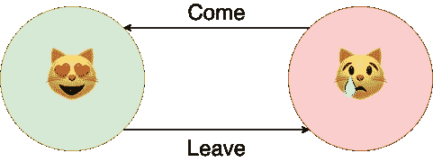
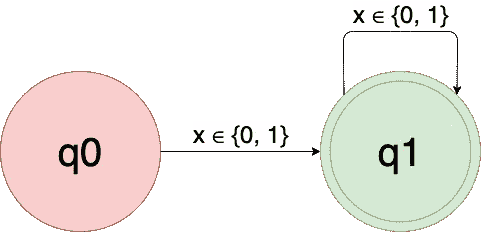
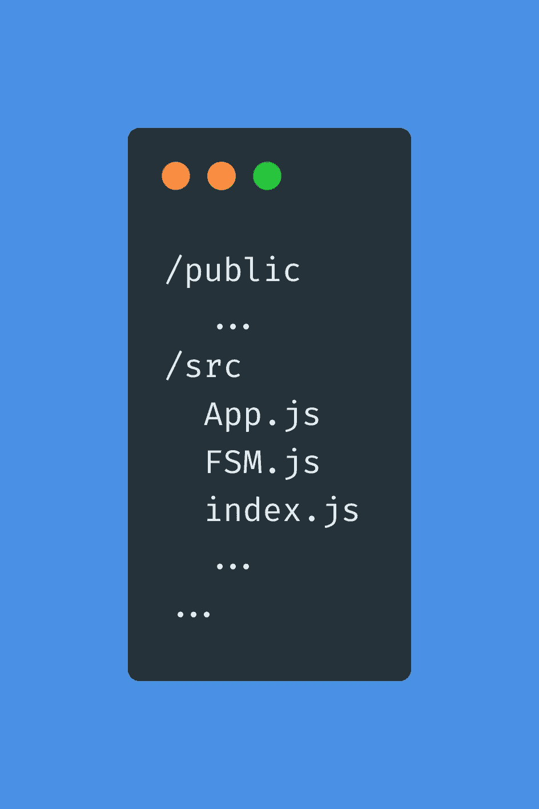
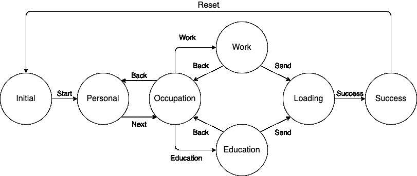
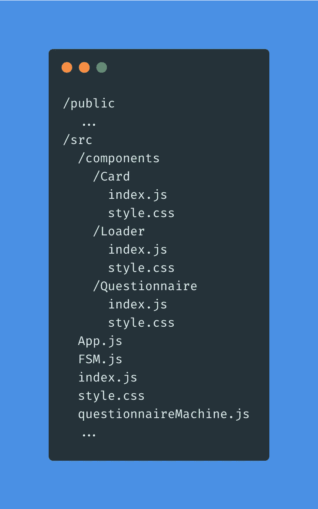

# 现实生活中的有限状态机

> 原文：<https://javascript.plainenglish.io/finite-state-machines-in-real-life-65370b1b091e?source=collection_archive---------7----------------------->

## 我们在哪里使用它们，为什么？


Photo by [Isabel Gonçalves](https://unsplash.com/@belgoncalves?utm_source=medium&utm_medium=referral) on [Unsplash](https://unsplash.com?utm_source=medium&utm_medium=referral)

我为 Yandex 主持了一个以有限状态机为主题的网络研讨会。前几天和我的同事[扎哈尔·奥夫查洛夫](https://www.linkedin.com/in/zakhar-ovcharov-a657a4197/)一起在 Praktikum 站台。网上研讨会已经在 Youtube 上发布。如果你熟悉俄语，看看这个！

2 hours of theory and coding

由于 Zakhar 是一位专家，这篇文章的存在归功于他。我的部分是写这篇文章，并在**复杂表单**部分创建一个基于 FSM 的复杂 React 组件。

既然一切都解决了，我们开始吧！

# 有限状态机

首先，定义:

> 一个**有限状态机** ( **FSM** )是一个抽象的机器，它在任何给定的时间都可以处于有限数量的状态中的一个。FSM 可以响应一些输入从一种状态改变到另一种状态；从一种状态到另一种状态的变化称为过渡。FSM 由其状态列表、初始状态和触发每个转换的输入来定义

就是这样。FSM 有有限数量的状态，每时每刻都停留在其中一种状态，并有一些从一种状态转换到另一种状态的规则。

为了清楚起见，想象一只名叫威利的猫。假设威利可能快乐也可能悲伤。现在，威利很开心。当你离开时，威利变得悲伤。当你回来的时候，威利又开心了。你可能会说，猫不太在乎你离开后再来，但我的小宝贝在乎。您可能已经看到了其中的联系:

1.  **状态。威利不是快乐就是悲伤，不可能两者都是**
2.  **初始状态。**我们默认威利是快乐的
3.  **转场。**你可以离开，也可以来，威利会改变它目前的状态

我们也可以用图表来描绘。



Happy (😻) and Sad (😿) Willy

这是我想到的最简单的有限状态机。在本文中，我们将讨论使用示例，并从头开始编写我们自己的 FSM 实现。我们还将使用它来解决几个任务。

我们走吧！

# 用法示例

有限状态机可以用来描述一种算法来处理一些任务或模拟几乎任何过程。几个例子:

1.  **语言检查。**这就是我们在**二进制代码检查**部分要做的事情
2.  **游戏的 AI 逻辑。**这里有一篇[文章](https://gamedevelopment.tutsplus.com/tutorials/finite-state-machines-theory-and-implementation--gamedev-11867)涵盖了这个想法
3.  **句法和词汇分析。**如果你想了解更多，请阅读这篇[文章](https://hackernoon.com/lexical-analysis-861b8bfe4cb0)
4.  **成分复杂。**本例也有一个[好的](https://medium.com/okcupid-tech-blog/modeling-ui-states-in-a-react-form-component-using-a-finite-state-machine-d12a6258cd06)，我们也将在**复合形**部分进行说明

如果您愿意，您可以很容易地扩展这个列表:FSM 用于许多不同的领域，包括语言学、计算机科学、生物学、数学，甚至哲学。

# 二进制代码检查

让我们创建我们的第一个 FSM！

查看[最终示例](https://codepen.io/kotosha/pen/OJpyQPx)或继续编码。

对于这一个，我们必须创建一个*确定性的有限态受体*。FSM 的目标是根据其定义接受或拒绝某些价值。我们已经讨论了状态、初始状态和转换，但是现在我们必须定义另外两个选项:

1.  **字母表。**可测试值必须具有的一组符号(除此之外没有其他符号)
2.  **有限状态。**现有状态的子集(可能为空)。当 FSM 完成工作时，如果这个子集包括当前状态，它接受可测试值，否则拒绝

让我们谈谈任务:

1.  我们必须创建 FSM 来测试随机值，以检查它是否是二进制代码
2.  我们接受包含字符 0 和 1 的非空字符串，拒绝任何其他字符串

为了处理这个问题，FSM 应该逐个字符地检查可测试的字符串。每个字符都应根据指定的字母表进行测试。每次迭代都应该产生转换。完成后，FSM 应该根据当前状态和指定的有限状态来决定是否接受可测试值。

以下是我们的 FSM:

Deterministic finite-state acceptor

这是一个基于类的 FSM，能够根据其定义测试随机值。要使用它，我们必须用所有必需的参数创建它的实例。让我们把它分解一下:

1.  **字母表。**这很容易。我们只接受字符 0 和 1
2.  **状态。**这也很容易。值是否为二进制。我们将状态命名为`q0`和`q1`，其中`q0`是**“值不是二进制码”**,`q1`是**“值是二进制码”**
3.  **初始状态。**我们不接受空字符串，所以初始状态是`q0`
4.  **有限状态。**有限状态将值标记为已接受。在我们的例子中，唯一合适的状态是`q1`
5.  **转场。**查看下图



Diagram for the binary code acceptor

每个状态都有字符 0 和 1 的转换。记住，转换发生在每次迭代中。你可以这样读:

1.  如果当前状态是`q0`状态并且当前符号是 0 或 1，则执行到状态`q1`的转换
2.  如果当前状态为`q1`状态且当前符号为 0 或 1，则执行转移*至相同状态*
3.  如果当前符号不是 0 或 1，无论当前状态如何，都拒绝可测试值

解释完一切之后，让我们最后创建一个 FSM 实例并测试它！

Usage and testing

有用！注意，我们没有为每个状态指定每个可能的符号。FSM 的实现让我们了解到——当符号不属于字母表时，FSM 会提前返回。

# 复杂形式

二进制检查的例子很简单。这不是你会经常做或根本不会做的事情。我还有另外一个例子。对于这一个，我们将使用面向 UI 的 FSM 构建一个多态表单。最终结果可在 [Codesanbox](https://codesandbox.io/s/finite-state-machine-6s69l) 获得。你可以一头扎进去或者跟着编码。

首先，创建一个新的 React 项目:

```
create-react-app questionnaire
```

项目结构应该如下所示:



Project boilerplate

`App.js`和`index.js`不需要任何改动。`FSM.js`将包含新的 FSM 实现。让我们把它写下来:

Function-based FSM

注意，我们已经去掉了字母表和州。现在，我们只有两个选项可以定义:

1.  **初始状态。FSM 必须从某个地方开始**
2.  **过渡。**我们将它们与状态合并，因此我们精简了实例化，但提供了同等的功能

它强调了有限状态机的多功能性——我们可以根据任务的需要定义它们。只要我们有状态，转换，和初始状态，我们就没事。

这个实现迫使我们使用方法`send`来改变状态。我们还提供了一个`subscribe`方法。如果我们想对状态变化做出反应，这是非常有用的。

让我们用威利的例子来测试一下。用以下内容创建`test.js`文件:

Willy testing

现在，运行它(确保您在文件目录中):

```
node test.js
```

控制台输出应该是:

```
happy
sad
happy
```

绝对管用！最后，让我们对威利的情绪变化作出反应:

Never leave your Willy

再运行一次。

```
happy
happy
```

威利现在总是很开心，因为我们不会真的离开他。如果转换后的状态是`sad`，那么我们发送`come`触发器，威利又高兴了。

看起来一切正常。我们去真正的任务吧！

我们要做一份多州问卷。会有一堆状态来控制问卷界面。假设我们想询问用户的姓名和职业。如果用户是学生，我们会询问他上的大学。否则，他可能有一份工作，所以我们会问它。用户可以从表单的教育/工作步骤返回到个人步骤。最后，用户可以在两种情况下提交问卷。

一个小图表，使讨论的条款清晰:



FSM that defines discussed questionnaire

现在已经清楚了我们有哪些状态以及它们之间的关系，我们可以开始我们的项目了！

首先，我们需要安装附加的依赖项:

```
npm i animate.css react-transition-group
```

安装完成后，添加`/components`目录，其中包含一些组件。我们还将在`/src`目录中创建`questionnaireMachine.js`文件。之后，项目结构应该是这样的:



Project structure

`questionnaireMachine.js`文件将创建并导出问卷 FSM 实例:

Questionnaire FSM

下一步是创建我们项目的表示层——问卷本身！我们要把它分成三个独立的部分:

1.  **问卷。**定义问卷流程的主要组件
2.  **卡。**用于显示问卷部分的可重用组件
3.  **装载机。**简单的动画圆点

让我们从问卷部分开始:

Questionnaire component with styles

首先，我们需要订阅 FSM 状态更改。每次有变化，我们就更新`uiState`。我们需要`uiState`来计算卡组件`active`的属性。该属性允许卡组件实例决定是否显示自身。

现在，卡组件:

Card component with styles

组件底部的按钮使用提供的动作作为单击事件侦听器。这就是我们传递改变 FSM 状态的函数的原因。问卷组件可以更新`uiState`，然后显示相应的卡片。

最后一个小东西是加载器组件。这里没有什么有趣的，只是一个动画点:

Loader component with styles

最后，让我们将问卷注入到 App 组件中:

Root component with styles

当它完成后，你应该有一些非常类似于[这个](https://6s69l.csb.app)的东西。如果你这样做了，拍拍自己的肩膀，你刚刚创建了基于 FSM 的问卷！如果你不知道，请将你的代码与这个[沙盒](https://codesandbox.io/s/finite-state-machine-6s69l)进行比较，你很快就会赶上来。

我们刚刚创建的问卷很好地分离了逻辑和表示，因此如果我们愿意，可以很容易地调整它的行为或外观。只要我们认为合适，FSM 的单个实现可以用在尽可能多的组件中。这种方法确保了应用程序的可预测性和一致性。

最后一件事。尽管这是从头创建我们自己的 FSM 的一个有用的经验，我强烈推荐使用生产就绪的包，比如 [XState](https://xstate.js.org/docs/) 。它有全面的文档和完成工作所需的所有工具(可能更多)。

# 结论

就是这样！在本文中，我们讨论了什么是 FSM，以及我们可能希望在哪里使用它。我们从头开始编写 FSM，并用它解决了两个不同的任务。FSM 在许多领域都很有用。这使得 FSM 成为解决特定问题的好方法，也是必须了解的技术。

希望这篇文章对你有帮助！如果你喜欢，请告诉我！

祝你今天开心！玩的开心！

*更多内容请看*[*plain English . io*](http://plainenglish.io/)