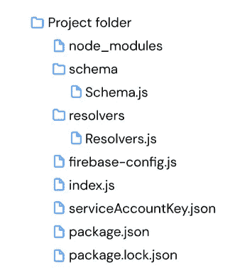
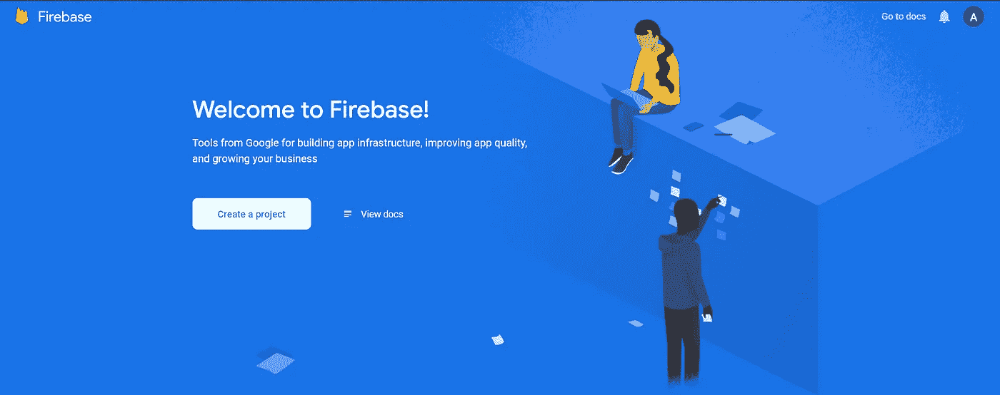
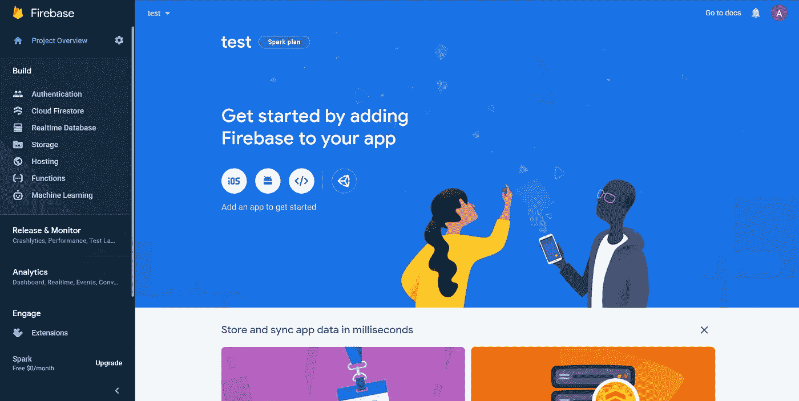
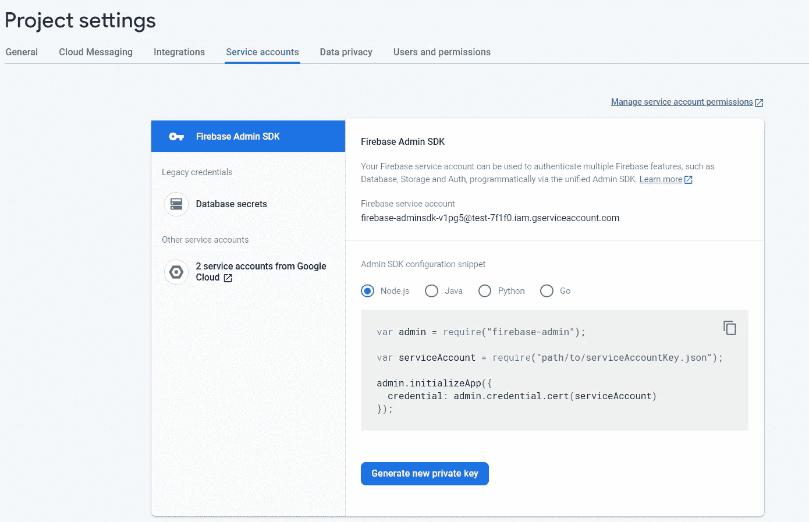
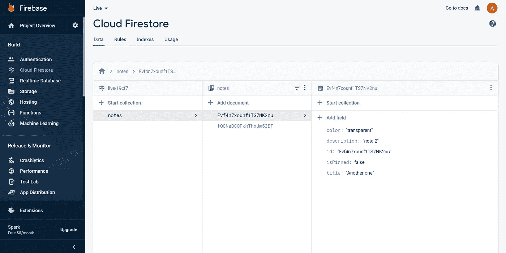

# 带 GraphQL 的 Firebase Admin SDK

> 原文：<https://javascript.plainenglish.io/firebase-admin-sdk-with-graphql-d8bc3ef11a5c?source=collection_archive---------12----------------------->


谷歌的人热衷于改善开发者体验。多年来，他们想出了各种各样的工具和技术来使原本复杂的流程变得简单得多，Firebase 就是其中之一。Firebase 在前端开发人员中非常受欢迎，因为它基本上消除了拥有独立后端的需要。从身份验证，到实时数据库，再到文件存储，您可以真正拥有一个健壮的后端，而无需从头开始构建。但这并不意味着你不能。Firebase 确实为后端服务提供了一个名为 **Firebase Admin SDK** 的解决方案。在本文中，我们将使用 GraphQL 和 Firebase Admin SDK 构建一个后端 notes 应用程序。

# 安装和设置

安装 [Node.js](https://nodejs.org/en/) 如果你还没有的话。在您的终端中，键入

```
npm init -y
```

这将使用 package.json 文件为您创建一个新的 Node.js 项目。现在安装项目所需的依赖项列表。

```
npm install express graphql express-graphql firebase-admin cors
```

安装完成后，在文件夹中创建 3 个文件

*   **index.js :** 主服务器文件
*   **Firebase-config . js:**Firebase 助手
*   **serviceaccountkey . JSON:**Firebase 服务帐户密钥

还要为我们的模式和解析器创建两个单独的文件夹，并在这些文件夹中创建它们各自的 Schema.js 和 Resolvers.js 文件。

你的文件夹结构应该是这样的。



Folder structure

暂时将所有这些文件保留为空，等我们创建了 firebase 项目后，我们会再回来处理它们。

## **步骤 2:创建 Firebase 项目**

[此](https://console.firebase.google.com/u/0/)链接将带您进入 firebase 控制台页面。如果您尚未登录您的 google 帐户，请先登录。



*   点击**创建一个项目。**
*   为您的项目添加一个**名称**。
*   为您的项目启用 google analytics(可选)

您的项目现在已经准备好了。下面的页面是您的项目仪表板。



在你的仪表盘左上角，你会发现**项目概述**旁边的**项目设置齿轮图标**。点击图标，进入**项目设置**。

在你的项目设置中，你会发现一个**服务账户标签。点击选项卡，你会找到你的 **Firebase Admin SDK 配置**。默认情况下会选择 Node.js 选项，所以保持原样。**



将您在 Firebase admin SDK 部分看到的配置代码(类似于上面的截图)复制到项目中的 **firebase-config.js** 文件中。将“**路径/到/service account key . JSON”**替换为“**”。/serviceAccountKey.json "。**

```
const admin = require("firebase-admin");
const serviceAccount = require("./serviceAccountKey.json");const app = admin.initializeApp({
  credential: admin.credential.cert(serviceAccount),
});const dataStore = app.firestore()
module.exports = {dataStore}
```

我还将从这个文件中导出 firebase 的数据存储服务，这样我们就可以在应用程序中的任何地方使用它。

在仪表板的同一个项目设置页面中，单击**生成新的私钥**。将自动下载一个 json 文件，其中包含您的 SDK 信息。这个 json 文件有一组保存私有配置信息的键值对。

在 Node.js 项目文件夹中，将这个 json 文件的所有内容复制到 **serviceAccountKey.json 文件中。**

```
{
  "type": "YOUR_TYPE",
  "project_id": "YOUR_PROJECT_ID",
  "private_key_id": "YOUR_PRIVATE_KEY_ID",
  "private_key": "YOUR_PRIVATE_KEY",
  "client_email": "YOUR_CLIENT_EMAIL",
  "client_id": "YOUR_CLIENT_ID",
  "auth_uri": "YOUR_AUTH_URI",
  "token_uri": "YOUR_TOKEN_URI",
  "auth_provider_x509_cert_url": "YOUR_AUTH_PROVIDER_CERT_URL",
  "client_x509_cert_url": "YOUR_CLIENT_CERT_URL"
}
```

至此，我们正式完成了项目设置。

**第三步:构建我们的应用** 我们将要构建的应用基本上是 Google Keep 的低级克隆([现场演示](https://ak-gkeep.netlify.app/))。打开您之前创建的 index.js 文件，复制以下代码。

```
const express = require('express')
const { graphqlHTTP } = require('express-graphql')
const cors = require('cors')
const { schema } = require('./schema/Schema')
const { root } = require('./resolvers/Resolver')
const { dataStore } = require('./firebase-config')const PORT = process.env.PORT || 5000
const app = express();app.use(cors());
app.use('/graphql', graphqlHTTP({
  schema: schema,
  rootValue: root,
  graphiql: true,
}));app.listen(PORT, () => console.log(`Open ${PORT}/graphql`));
```

我们通过传入我们的**模式**和**解析器**来配置 graphqlHTTP，并且还将 **graphiql** 设置为 true，这将让我们在类似邮递员的操场上测试我们的 API。

**模式**基本上是我们应用程序的骨架。它用于为我们的后端服务创建**定义。这些定义在创建解析器时用作参考。**

解析器为模式中定义的所有后端服务处理业务逻辑。一旦你看到一个例子，你会得到一个更好的画面。

## (计划或理论的)纲要

GraphQL 中的 Schema 本质上是用来为我们的应用程序构建一个框架。它建立了强有力的定义，这使得预测请求和响应类型变得更加容易。让我们看看我们的 Schema.js 文件

```
const { buildSchema } = require('graphql');const schema = buildSchema(`
  type Query {
    note(id : ID!) : Note!
    notes : [Note]!
  } type Mutation {
    addNote(title: String!, description: String) : Note!
    editNote(id: ID!, title: String, description : String) : SemiNote
    deleteNote(id: ID!) : ID!
    changeColor(id: ID!, color : String!) : String!
    setIsPinned(id: ID!, isPinned: Boolean!) : Boolean!
  } type Note {
    id: ID!
    title : String!
    description: String
    color : String
    isPinned : Boolean
  } type SemiNote{
    id: ID
    title : String
    description : String
  }
`);module.exports = { schema }
```

每个模式本质上都有两个主要部分，**查询**和**突变**。查询用于获取项目，而变异用于添加/更新/删除项目。还有**类型**，让你定义自己的自定义类型。在我们的例子中，我们有一个带有 5 个属性的主**注释**类型。(id、标题、描述、颜色和标识。)

**查询**
**备注**:返回特定 id 的备注。
**注释**:返回整个数组的注释。

**突变**
**addNote** :通过传入 title(string)&description(string)
**edit note**:修改注释(id)的标题或描述或两者都修改
**deleteNote** :删除注释(id)。
**changeColor** :编辑注释(id)的颜色(字符串)属性
**setIsPinned** :编辑注释(id)的 IsPinned(布尔)属性

## 下决心者

我们的模式定义的业务逻辑在解析器中处理。在 Resolvers 文件夹中，打开 resolvers.js 并粘贴以下代码。

```
const { dataStore } = require('../firebase-config')const root = {
  note: ({ id }) => notes.find(note => note.id == id), notes: async () => {
    const notes = []
    const snapshot = await dataStore.collection('notes').get();
    snapshot.forEach(note => notes.push({ id: note.id, ...note.data()
    }));
    return notes;
  }, addNote: async ({ title, description }) => {
    const newNoteRef = await dataStore.collection('notes').doc()
    const note = { id: newNoteRef.id, title, description, color: "transparent", isPinned: false }
    await newNoteRef.set(note)
    return note
  }, editNote: async ({ id, ...args }) => {
    await dataStore.collection('notes').doc(id).update({ ...args });
    return { id: id, ...args }
  }, deleteNote: async ({ id }) => {
    await dataStore.collection('notes').doc(id).delete()
    return id;
  }, changeColor: async ({ id, color }) => {
    await dataStore.collection('notes').doc(id).update({ color: color });
    return color;
  }, setIsPinned: async ({ id, isPinned }) => {
    await dataStore.collection('notes').doc(id).update({ isPinned: isPinned });
    return isPinned;
  },
};module.exports = { root }
```

对于模式文件中定义的所有查询/变异，我们都有它们对应的解析器。

**注释**:该解析器将一个 id 作为参数，**在 firebase store** **中搜索具有该 id 的注释**。(notes.find)

**注释**:这个解析器简单地从 firebase 存储中返回注释列表。(dataStore.collection('notes ')。get())

**addNote** :这个解析器首先创建一个带有引用 id 的空注释。(dataStore.collection('notes ')。doc() = " **doc** "这里指的是 firebase 中的文档，它只是存储在数据库中的一个典型的数据对象。)
**标题和描述**(由用户提供)连同初始**颜色**值、初始**固定状态**和一个**随机 id** 被映射到先前创建的引用。然后这个文档被**存储到 firebase 存储器**。

**editNote** :这个解析器最多带 3 个参数，id(必填)、标题和描述。它首先**获取具有匹配 id** 的笔记，然后**用它们各自的值更新标题和描述**，这些值在 firebase 存储中作为参数传递。(dataStore.collection("notes ")。文档(id)。更新({args}))

**deleteNote** :这个解析器获取一个 id，然后**删除 firebase 存储中具有匹配 id** 的注释。
datastore . collection(" notes ")。文档(id)。删除()

**changeColor** :这个解析器类似于 editNote 解析器。它将一个 id 作为参数，**用匹配的 id 更新便笺的颜色属性**。

**setIsPinned :** 同样，与 editNote 类似，这个解析器将一个 id 作为参数，**用匹配的 id 更新一个注释的 IsPinned 属性**。

这是我们所有的解决方案。现在打开您的终端并运行 npm start。因为我们在 index.js 文件中设置的端口是 5000，所以在浏览器上打开 localhost:5000/graphql。

你现在看到的页面是 graphiql 游乐场。您可以在这里测试所有的查询和变异。下面，我已经添加了一个所有查询和变异的例子。随意调整传递到这些操作中的数据。

```
{
  notes {
    id
    title
    description
    color
    isPinned
  } 
}{
  note(id:"1OFXc2SBszVlkt1Y4JzE") {
    title
    description
  } 
}mutation{
  addNote(title:"testsdasd3Ig", description:"testasd3desc"){
    id
    title
  }
}mutation{
  deleteNote(id:"1OFXc2SBszVlkt1Y4JzE")
}mutation{
  editNote(id:"t1",  title :"Hahaha"){
    id
  }
}mutation{
  setIsPinned(id:"x2cotRZLLxNJLpGqC3PY", isPinned:false)
}mutation{
  changeColor(id:"x2cotRZLLxNJLpGqC3PY", color:"#fff")
}
```

确保你正在添加的**id**存在于你的 firebase 商店中**。说到 firebase，一旦你从你的操场上运行任何变异，你可以在仪表盘部分查看你的云 firestore。将会有一个新的收藏，叫做有一些记录的笔记。**



仅此而已。现在，您有了一个 Node.js + GraphQL 应用程序，它通过基本的 CRUD 操作连接到 firebase 数据存储。如果你对这个项目有任何疑问，请随时写在评论里。干杯！

参考链接:

[工作演示](https://ak-gkeep.netlify.app/)
[Github repo](https://github.com/AkileshRao/gkeep-clone/tree/master/server)
[该应用的前端教程](https://akileshrao19.medium.com/google-keep-clone-with-vue-js-graphql-firebase-90b8b43a3903)
[Firebase Docs](https://firebase.google.com/docs)
[graph QL Docs](https://graphql.org/learn/)