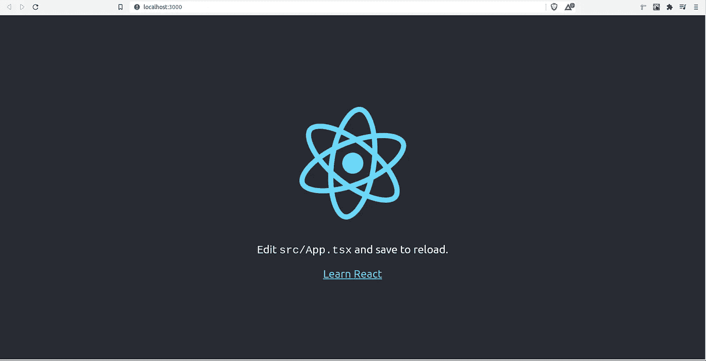
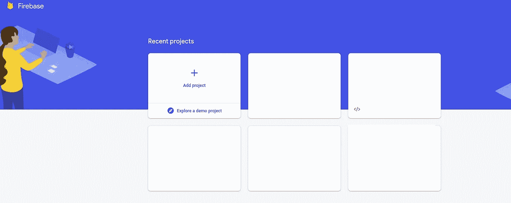
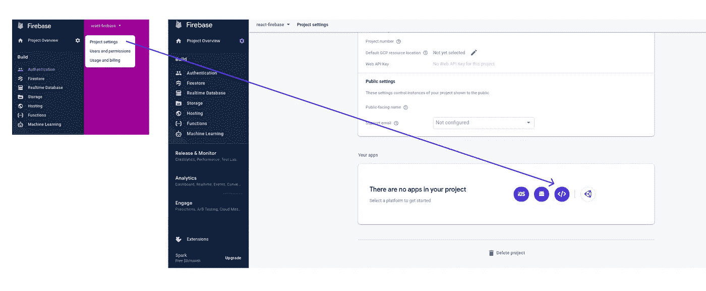
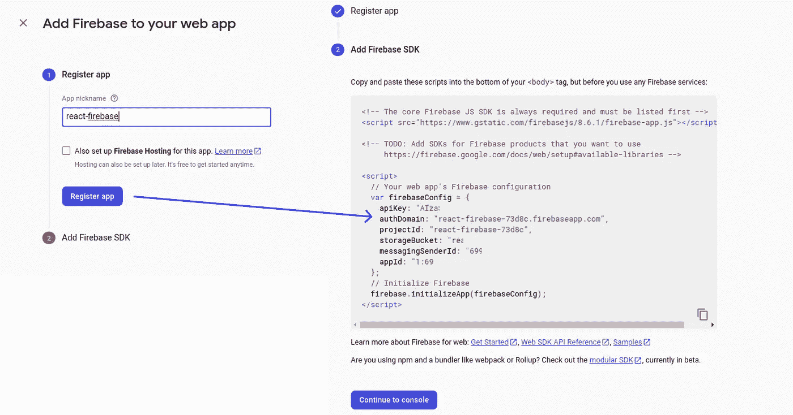
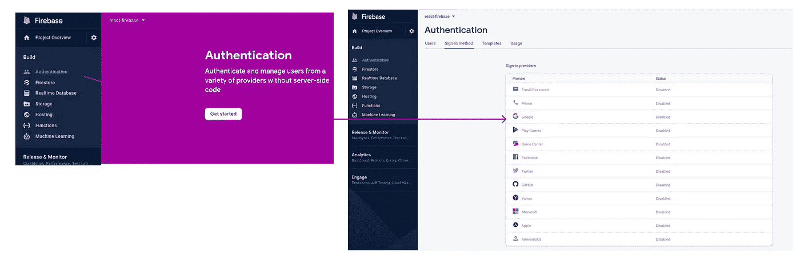
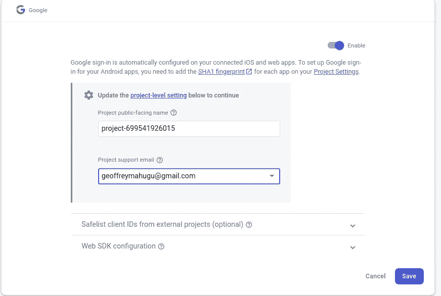
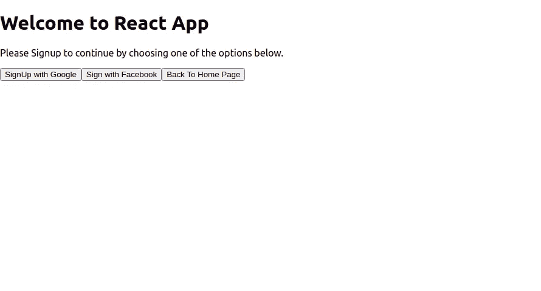
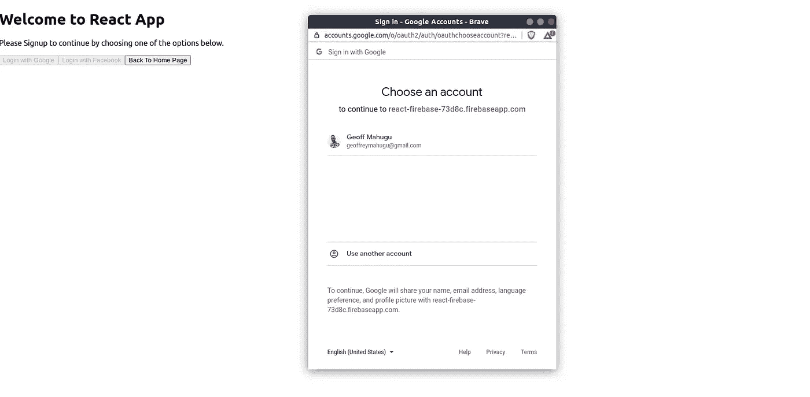

# 具有反应类型脚本的 Firebase Auth

> 原文：<https://javascript.plainenglish.io/firebase-auth-with-react-typescript-4b9d9605fa53?source=collection_archive---------0----------------------->

在本文中，我们将建立一个用 TypeScript 编写的生产就绪的 React 应用程序，使用 Firebase Auth 对用户进行身份验证。


## 这些是我们的主要目标:

1.  使用 TypeScript 实现类型安全。
2.  使用路由器保护来保护路由。
3.  保护和安全访问 Firebase 凭证。
4.  使用 Firebase 的社会认证。
5.  对已验证用户对象的全局访问。

## 先决条件。

一、[节点](https://nodejs.org/en/)安装完毕。

二。[反应的基本知识](https://reactjs.org/docs/getting-started.html)

# 项目设置

首先，我们将运行这个命令来创建 react-typescript 应用程序。

`npx create-react-app **APPLICATION_NAME** --template typescript`

**安装依赖项:**

```
npm install react-router-dom
```

[react-router-dom](https://reactrouter.com/web/guides/quick-start) 模块将帮助我们在应用程序中设置路由，并在以后使我们能够保护路由。

cd 放入项目文件夹并为应用程序提供服务:

```
npm start
```

现在可以在 [https://localhost:3000](https://localhost:3000) 上访问该应用程序



# Firebase 项目设置

接下来，我们需要建立一个新的 Firebase 项目来验证用户。
在 [Firebase 控制台](https://console.firebase.google.com/u/0/)中，创建一个新项目:



**安装 Firebase 依赖项:**

在项目的根目录下，安装 firebase:

```
npm install firebase
```

# Firebase 配置设置

接下来，我们需要从 firebase 获取项目凭证，并在我们的应用程序中安全地访问凭证。

I)注册 Firebase SDK 应用程序

要从 firebase 获取项目凭证，请转到 Firebase 控制台，然后单击**项目概述**(位于左侧菜单的最顶端)。在菜单选择上，选择**项目设置。**在项目设置页面选择 web，这是我们正在工作的平台，如下所示。



继续注册应用程序并获取凭证，如下所示。(复制详细信息，因为我们将在接下来的步骤中使用凭据。)



**ii)启用 Firebase 认证**

为了使用社交登录，我们需要启用 firebase 身份验证。在您的 [Firebase 控制台](https://console.firebase.google.com/u/0/)中，选择左侧菜单中的认证并进入**入门**，如下图所示:



现在，您可以选择要使用的提供程序，并继续启用它们。对于这个例子，我们将使用 **Google 认证。**



**iii)创造。环境文件**

为了保护您的 firebase 凭证并安全访问它们，我们会将它们存储在内存中，为此，我们需要创建一个**。env** 文件放在我们项目文件夹的根目录下。
曾经的**。/env** 文件已经创建，粘贴下面的细节并用您之前从 Firebase 控制台获得的凭证替换这些值。

**注意:**记住要排除。通过将 Git 中的 **/env** 文件添加到**来提交它。gitignore** 文件。

iv)创建配置文件。

在**中。/src** 文件夹中，我们将创建一个配置文件来保存我们所有的全局配置。
中的**。/src/config** 文件夹创建一个 **config.ts** 文件，该文件将从内存中导入 firebase 配置，并将其用于我们的应用程序。

v)创建 firebase.ts 文件

既然我们可以安全地访问 firebase 凭证，我们将需要在我们的应用程序中初始化 firebase，然后作为提供者提供社交登录方法。这些都是在如下所示的 **firebase.ts** 文件中完成的。

在**里。/src/config** 文件夹，创建一个 **firebase.ts** 文件，并粘贴以下详细信息:

在上面的代码中，我们使用了谷歌和脸书的提供者，这取决于您之前在 Firebase 控制台中启用的提供者。

# 受保护和不受保护的页面设置

我们将创建两个页面，一个受保护( **CartPage.tsx** )，另两个不受保护( **HomePage.tsx，SignUpPage.tsx** )，并启用路由。

**i)创建页面文件夹**

首先，创建一个**。/src/pages** 文件夹来包含应用程序的所有页面。

**ii)创建主页**

在 pages 文件夹中创建一个 **HomePage.tsx** 并粘贴下面的内容。

上面的代码用一个链接按钮定义了一个基本的 react 函数组件，它路由到受保护的 **CartPage.tsx**

**iii)创建接口文件夹**

在上面的代码中，我们在组件文件中定义了**页面接口**。然而，我们需要能够在整个应用程序中重用接口。为此，我们需要创建一个. **/src/interfaces** 文件夹来包含所有的类型定义。

**iv)创建页面界面文件**

在**中。/src/interface** 文件夹创建一个 **page.interface.ts** 文件，粘贴以下内容:

**注意:**替换 **HomePage.tsx** 中的界面，使用我们上面定义的界面。

**v)创建 CarPage.tsx**

在**中。/src/pages** 文件夹创建一个 **CartPage.tsx** 文件并粘贴以下内容:

上面的代码定义了一个 React 功能组件，带有一个返回到**主页的链接。**

**vi)创建 SignUpPage.tsx**

我们将首先创建一个**认证文件夹**来包含所有的认证页面。在**中。/src** 文件夹下创建一个**。/src/auth** 文件夹。
然后创建 **SignUpPage.tsx** 文件，该文件将包含社交登录，使我们能够注册应用程序。现在，我们将设置页面模板，稍后介绍社交登录。

# 授权模块

现在我们已经定义了所有的页面，我们将继续设置身份验证和路由逻辑。

我)创建一个授权模块。

认证模块文件夹将包含所有关于认证的逻辑。在**中。/src/modules** 文件夹，创建一个 **auth** 文件夹。

**ii)创建 index.ts 认证模块入口文件**

在**中。/src/modules/auth 文件夹，**创建一个 **index.ts** 文件作为身份验证模块的入口点，并粘贴以下详细信息:

该文件包含使用社交登录提供者对用户进行身份验证的逻辑。

**iii)创建 AuthRouter.tsx 文件**

在**中。/src/modules/auth** 文件夹创建一个 **AuthRoute.tsx** 文件，并粘贴以下详细信息:

该组件文件将作为所有页面的包装器，并将未经验证的用户重新路由到**注册页面。**

# 路由和路由器配置

现在我们已经定义了所有的**页面模板**和**认证模块**，我们将根据用户的认证状态来实现动态路由。

我)创建 route.interface.tsx

在**中。/src/interfaces** 文件夹中，创建一个 **route.interface.ts** 文件，该文件将包含路由的类型定义，如下所示:

**注意:**受保护的布尔变量将决定页面是否受保护。

**ii)创建 routes.ts 配置文件**

然后，我们将创建包含所有路由定义的路由配置文件。在**中。/src/config** 文件夹，创建一个 **routes.ts** 文件，粘贴以下内容:

在上面的配置文件中，我们将**主页**和**注册页面**定义为不受保护，而**卡丁车页面**将要求用户通过身份验证才能访问该页面。

# 应用程序路由配置

现在我们已经定义了**路由**和**路由配置**，我们将通过在**更新我们的根组件来将所有组件集合在一起。/src/App.tsx**

替换**的内容。/src/App.tsx** 内容如下:

在上面的代码片段中，我们使用 [**useEffect**](https://reactjs.org/docs/hooks-effect.html) 钩子来跟踪和更新用户的 auth 状态。在 render 方法中，我们映射路线列表，并根据路线的 **protected** 属性进行渲染。

现在，您应该能够测试所有页面路由:

**无保护** —主页:(http://localhost:3000)

**受保护的**—cart page:([http://localhost:3000/](http://localhost:3000/auth/signup)cart)

**无保护** —注册页面:([http://localhost:3000/auth/sign up](http://localhost:3000/auth/signup))

# 用户认证

既然我们已经定义了 **routes** 和 **routGaurd** ，我们将继续更新**注册页面**以验证用户，从而能够访问受保护的页面。

更新**。/src/pages/auth/sign up page . tsx**文件，内容如下:

在上面的代码片段中，我们使用了**signingwithssocialmedia**模块，并通过一个社交登录提供者来验证用户。

这就是你的**注册页面**应该看起来的样子:



在使用 google 注册时，当禁用注册按钮时，会出现一个弹出窗口，等待用户的凭证。



一旦用户通过身份验证，他们将能够访问受保护的页面。

# **访问用户对象。**

要访问任何经过身份验证的页面上的用户对象，请使用下面的代码片段:

```
import { auth } from '../config/firebase';
console.log(auth.currentUser)
```

我们首先导入 **auth** 模块，在 react 组件中，我们可以访问用户对象作为 **auth.currentUser**

# **结论**

希望你学到了新东西。请留下您的意见和建议。

该项目的源代码可以在以下位置找到:

[](https://github.com/GeoffMahugu/react-firebase.git) [## GeoffMahugu/react-firebase

### 这是一个使用 firebase 作为后端的 react 应用程序

github.com](https://github.com/GeoffMahugu/react-firebase.git) 

*更多内容尽在*[*plain English . io*](http://plainenglish.io/)