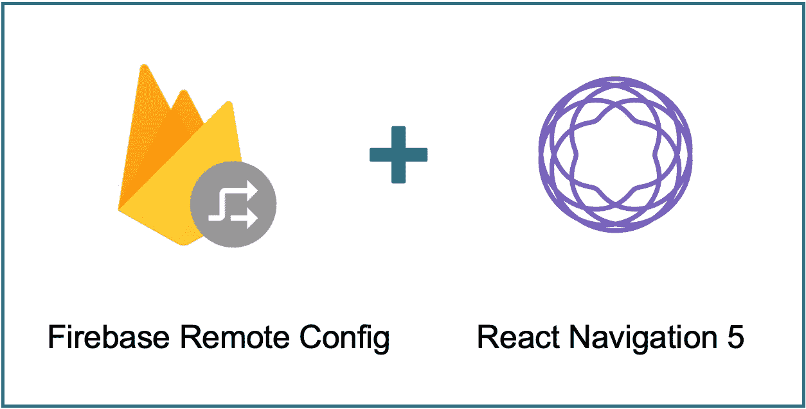
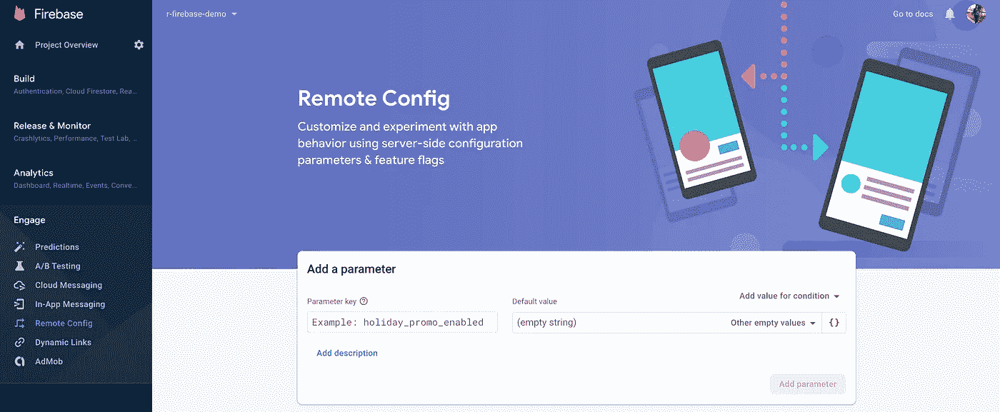
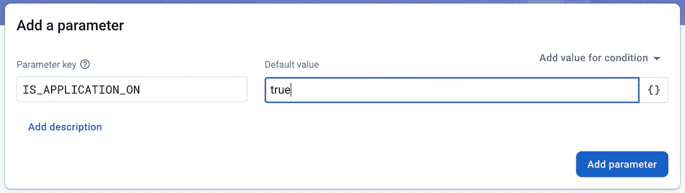
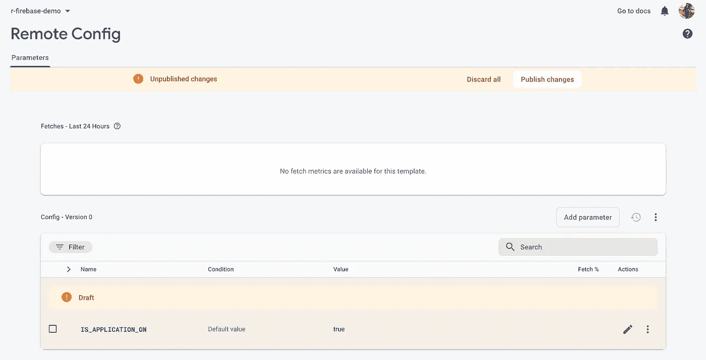
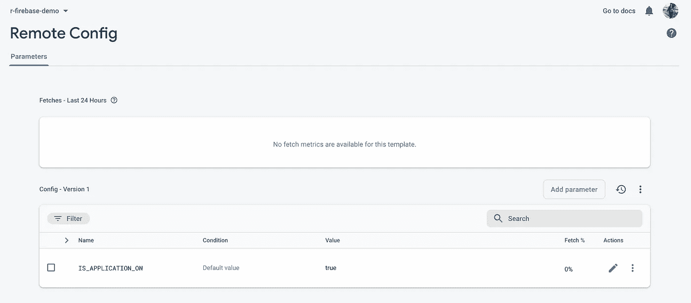
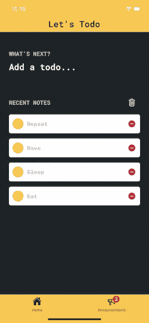
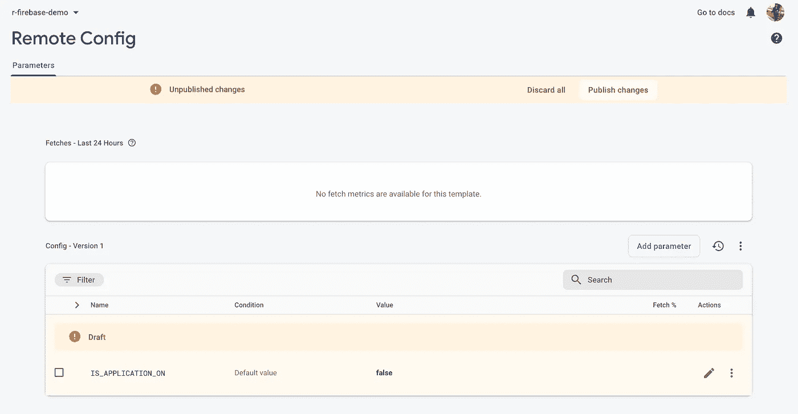
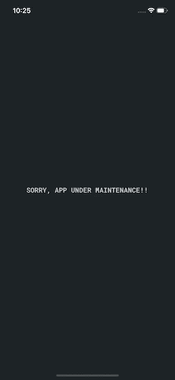

# 带 React 导航 5 的 Firebase 远程配置

> 原文：<https://javascript.plainenglish.io/firebase-remote-config-with-react-navigation-5-b430e0d7f39?source=collection_archive---------5----------------------->

*改变你的应用程序的行为和外观，无需发布应用程序更新，对无限的每日活跃用户免费。*这种技术被称为远程配置 **Firebase** 也提供了**远程配置**功能。

如果您不熟悉 **Firebase 远程配置用例**以及它如何帮助您节省数周/数月的工作量，您可以考虑阅读[探索 Firebase 远程配置](https://medium.com/trendyol-tech/exploring-firebase-remote-config-3d3bcd26494a)。



在本文中，我们将探索 Firebase 远程配置的最简单而复杂的用例: ***危机时刻的开关—*** 众所周知，危机会在最意想不到的时刻爆发，利用远程配置作为一个 ***终止开关*** 或者至少是一个 ***关闭开关*** 让您喘口气😅。

因此，让我们继续使用 React Navigation 5 实现 Firebase 远程配置，以便在危机时刻通过单击来*控制应用程序的行为。*

## 先决条件

1.  **反应原生**

如果您已经熟悉 React Native，那么您将能够快速使用 React 导航和 React Native Firebase！如果没有，你可能想先阅读第 1 到第 4 部分(包括第 1 和第 4 部分),然后在完成后回到这里。

2.**反应导航**

要在 React 原生应用中进行路由和导航，请跟随并尝试使用 [React 导航 5](https://betterprogramming.pub/react-navigation-5-stack-tab-drawer-all-in-one-ead723188056) 。它应该足以让您知道如何构建典型的小型移动应用程序，并为您提供深入研究 React 导航的更高级部分所需的背景知识。

## 反应本机 Firebase-服务器端或在 Firebase 控制台中

如果您完成了上述要求，那么打开 Firebase 项目控制台并导航到远程配置页面。(在接合下的左侧抽屉中)



现在，您将看到一个名为添加参数的窗口，其中包含两个主字段`Parameter Key`和`Default value`

在命名**参数键**时要小心，因为我们的应用程序将使用相同的键来获取数据。



对于我们的 ***kill switch*** 用例，我们将创建 1 个名为`IS_APPLICATION_ON`的布尔**参数**，并将其值指定为 true。



创建所需参数后，点击**发布变更**，您将得到一个确认提示*“一旦发布，变更将* ***立即对您的应用和用户可用****”*——但我们尚未连接应用，因此只需按 OK 即可。已发布的更改将如下所示:



现在我们已经完成了服务器端的配置。让我们转到客户端——React 原生代码库。

让我们检查一下 React 本地应用程序代码库，下面是目录结构:

```
todo-app
--> android
--> ios
--> index.js
--> src
-- --> App.container.js
-- --> routes
-- -- --> home.route.js
-- -- --> index.route.js
-- ...
```

**index.js**

```
import React, { Component } from 'react';
import { AppRegistry } from 'react-native';
import { Provider } from 'react-redux';
import { store } from './src/stores';
import App from './src/App.container';
import { name as appName } from './app.json';export default class todoApp extends Component {
    render() {
        return (
            <Provider store={store}>
            <App />
            </Provider>
        );
    }
}AppRegistry.registerComponent(appName, () => todoApp);
```

**应用程序.容器. js**

```
import 'react-native-gesture-handler';
import React from 'react';
import { StatusBar, View } from 'react-native';
import Proptypes from 'prop-types';
import { connect } from 'react-redux';
import { Route } from './routes/index.route';
import { enableScreens } from 'react-native-screens';
import { result } from 'lodash';
import { OverlaySpinner } from './components';
import { appContainerStyle, statusBarStyle } from './themes/application.styles';enableScreens();const App = ({ showSpinner }) => {
    return (
        <View style={appContainerStyle}>
            <StatusBar translucent {...statusBarStyle} />
            <Route />
            <OverlaySpinner showSpinner={showSpinner} />
        </View>
    );
};App.defaultProps = {
    showSpinner: 0
};App.propTypes = {
    showSpinner: Proptypes.number.isRequired
};export const mapStateToProps = ({ spinner }) => ({
    showSpinner: result(spinner, 'count', 0)
});export default connect(mapStateToProps, null)(App);
```

**index.route.js**

```
import React from 'react';
import { NavigationContainer } from '@react-navigation/native';
import HomeScreens from './home.route';export const Route = () => {
    return (
        <NavigationContainer>
            <HomeScreens options={{ animationEnabled: false }} />
        </NavigationContainer>
    );
};
```

**home.route.js**

```
import React from 'react';
import { createStackNavigator } from '@react-navigation/stack';
import Announcements from '../screens/Announcements/Announcements.screen';
import Home from '../screens/Home/Home.screen';
import { colors, fonts } from '../themes/constants.styles';const Stack = createStackNavigator();
const HomeStack = createStackNavigator();const HomeScreens = () => (
    <HomeStack.Navigator
        screenOptions={() => ({
            headerStyle: {
            backgroundColor: colors.PRIMARY_HEADER_BG
        },
        headerTitleStyle: {
            color: colors.PRIMARY_APP_BG,
            fontSize: fonts.FONT_SIZE_XL,
            fontFamily: fonts.FONT_FAMILY_BOLD
        }
        })}>
        <Stack.Screen
            name='Home'
            component={Home}
            options={{
                title: "Let's Todo"
            }}
        />       
        <Stack.Screen
            name='Announcements'
            component={Announcements}
            options={{
                title: "What's New?"
            }} 
        />
    </HomeStack.Navigator>
);export default HomeScreens;
```

我们的 todoApp 使用 React Navigation 5 设置了基本路线。让我们从 React Native Firebase 开始。

## React Native Firebase —客户端或应用程序中

请按照 React Native Firebase [入门指南](https://rnfirebase.io/)添加所需的包和附加条件:

*   [安装核心包](https://rnfirebase.io/#1-install-via-npm) — `@react-native-firebase/app`
*   [安装分析包](https://rnfirebase.io/analytics/usage)——`@react-native-firebase/analytics`
*   [创建新的 Firebase 项目](https://console.firebase.google.com/)
*   [安卓设置](https://rnfirebase.io/#2-android-setup)
*   [iOS 设置](https://rnfirebase.io/#3-ios-setup)
*   [自动链接&重建](https://rnfirebase.io/#4-autolinking--rebuilding)

在通常的 Firebase 设置(将 todoApp 添加到 Firebase 项目并粘贴`google-services.json`文件)之后，添加[远程配置包](https://rnfirebase.io/remote-config/usage#installation):

```
*# Install the remote-config module*
npm install --save @react-native-firebase/remote-config

*# If you're developing your app using iOS, run this command*
cd ios/ && pod install
```

您已经准备好在代码库中使用 firebase 远程配置模块了！！😎

*   在 *todoApp/src/configs/:* 中创建`firebaseRemoteConfig.config.js`

> [使用](https://rnfirebase.io/remote-config/usage#caching) `[**FETCH_INTERVAL**](https://rnfirebase.io/remote-config/usage#caching)` [定义缓存远程配置的持续时间:](https://rnfirebase.io/remote-config/usage#caching)
> 
> 在应用程序开发期间，您可能希望非常频繁地刷新缓存(每小时多次),以便在开发和测试应用程序时快速迭代
> 
> **远程配置的默认和推荐生产获取间隔是 12 小时，**这意味着在 12 小时的窗口内，配置不会从后端获取超过一次，无论实际进行了多少次获取调用。

```
// data is locally cached for FETCH_INTERVAL in seconds
export const FETCH_INTERVAL = 43200;// Feature names constants, use them to reference to a feature
export const IS_APPLICATION_ON = 'IS_APPLICATION_ON';const config = {};
config[IS_APPLICATION_ON] = false;export default config;
```

*   在 *todoApp/src/utils/:* 中创建`firebase.util.js`

> 检查 [**Firebase RemoteConfig 服务接口**](https://rnfirebase.io/reference/remote-config) 了解可用的方法、语法和用法，例如:`setDefaults()`、`fetch()`、`activate()`、`getAll()`、`asBoolean()`等。

```
import remoteConfig from '@react-native-firebase/remote-config';
import firebaseRemoteConfig, {
    FETCH_INTERVAL
} from '../config/firebaseRemoteConfig.config';// set defaults
remoteConfig().setDefaults(firebaseRemoteConfig);// fetch remote config
export const fetchRemoteConfig = () => { // data is locally cached for FETCH_INTERVAL
    const fetch = remoteConfig().fetch(FETCH_INTERVAL);
    return fetch
        .then(() => remoteConfig().activate())
        .then(() => {
            return remoteConfig().getAll();
        })
        .then(snapshot => {
            return {
                IS_APPLICATION_ON: snapshot
                    .IS_APPLICATION_ON
                    .asBoolean()
            };
        })
        .catch(() => firebaseRemoteConfig);
};export default fetchRemoteConfig;
```

*   在*to doapp/src/stores/actions:*内创建`firebase.action.js`

```
import { createAction } from 'redux-actions';
import { fetchRemoteConfig } from '../../utils/firebase.util';
import { showSpinner, hideSpinner } from './spinner.action';
export const SET_FIREBASE_REMOTE_CONFIG = 'SET_FIREBASE_REMOTE_CONFIG';
export const setFirebaseRemoteConfig = createAction(SET_FIREBASE_REMOTE_CONFIG);export const initializeFirebase = () => async dispatch => {
    try {
        dispatch(showSpinner());
        const firebaseRemoteConfigData = await fetchRemoteConfig();
        dispatch(setFirebaseRemoteConfig(firebaseRemoteConfigData));
        dispatch(hideSpinner());
    } catch (error) {
        console.log('Firebase init error', error);
    }
};
```

*   在*中创建`firebase.reducer.js`todo app/src/stores/reducers:*

```
import RemoteConfigDefault from '../../config/firebaseRemoteConfig.config';const initialState = { ...RemoteConfigDefault };export const firebase = (state = initialState, action) => {
    const { payload } = action;
    switch (action.type) {
        case 'SET_FIREBASE_REMOTE_CONFIG':
            return { ...payload };
        default:
            return state;
    }
};export default firebase;
```

*   现在在`App.container.js`中，获取远程配置，如下所示:

```
import 'react-native-gesture-handler';
import React, **{ useEffect }** from 'react';
import { StatusBar, View } from 'react-native';
import Proptypes from 'prop-types';
import { connect } from 'react-redux';
import { Route } from './routes/index.route';
import { enableScreens } from 'react-native-screens';
import { noop, result } from 'lodash';
import { OverlaySpinner } from './components';
**import { initializeFirebase } from './stores/actions/firebase.action';**
import { appContainerStyle, statusBarStyle } from './themes/application.styles';enableScreens();const App = ({ showSpinner, fetchFirebaseConfig }) => { **useEffect(() => {
        fetchFirebaseConfig();
    }, [fetchFirebaseConfig]);** return (
        <View style={appContainerStyle}>
            <StatusBar translucent {...statusBarStyle} />
            <Route />
            <OverlaySpinner showSpinner={showSpinner} />
        </View>
    );
};App.defaultProps = {
    showSpinner: 0,
    **fetchFirebaseConfig: noop**
};App.propTypes = {
    showSpinner: Proptypes.number.isRequired,
    **fetchFirebaseConfig: Proptypes.func.isRequired**
};export const mapStateToProps = ({ spinner }) => ({
    showSpinner: result(spinner, 'count', 0)
});**export const mapDispatchToProps = dispatch => ({
    fetchFirebaseConfig: () => dispatch(initializeFirebase())
});**export default connect(mapStateToProps, **mapDispatchToProps**)(App);
```

远程配置现在在 redux store 中可用。让我们用它来实现 **kill switch** 搭配 React 导航 5。

使用`react-redux`包中可用的`useSelector`模块从 redux 存储中读取`IS_APPLICATION_ON`的值。

我们将根据远程配置参数`isApplicationOn`添加条件，仅在`NavigationContainer`内注入`MaintenanceScreens`堆栈。

*   修改`index.route.js`如下图所示:

```
import React from 'react';
import { NavigationContainer } from '@react-navigation/native';
**import { useSelector } from 'react-redux';**
import HomeScreens from './home.route';
**import MaintenanceScreens from './appMaintenance.route';**export const Route = () => { **const isApplicationOn = useSelector(
        state => state.firebase[IS_APPLICATION_ON]
    );**return (
        <NavigationContainer>
            **{isApplicationOn ? (**
                <HomeScreens 
                    options={{ animationEnabled: false }} /> 
            ): ( 
                **<MaintenanceScreens 
                    options={{ animationEnabled: false }} />**
            **)}**
        </NavigationContainer>
    );
};
```

其中`MaintenanceScreens`栈相当简单，定义如下:

appMaintenance.route.js

```
import React from 'react';
import { createStackNavigator } from '@react-navigation/stack';
import AppMaintenance from '../screens/AppMaintenance/AppMaintenance.screen';const Stack = createStackNavigator();
const MaintenanceStack = createStackNavigator();const MaintenanceScreens = () => (
    <MaintenanceStack.Navigator>
        <Stack.Screen
            name='AppMaintenance'
            component={AppMaintenance}
            options={{ headerShown: false }}
        />
    </MaintenanceStack.Navigator>
);export default MaintenanceScreens;
```

Tada！现在，您可以在危机时刻控制您的应用程序可用性。

到目前为止，在 Firebase 控制台中，远程配置参数`IS_APPLICATION_ON`被设置为`true`，因此您应该能够看到如下所示的`AppScreens`:



让我们试着从 Firebase 控制台关闭应用程序:



一旦您发布这些更改，下次应用程序获取远程配置**时，它将重定向到维护堆栈，用户将无法导航到任何其他屏幕或使用应用程序中的任何功能—“**应用程序正在维护中！”**

* *这取决于应用程序中设置的`FETCH_INTERVAL`的值，例如，如果该值设置为 720 秒，则应用程序将在发出下一个请求之前缓存远程配置 720 秒。



***Firebase 远程配置是一个强大的功能；*** *从基本字符串到定制功能，你几乎可以配置任何你想要的东西。此外，您可以针对特定的受众，这是很棒的(将在我接下来的文章中介绍)*

## GitHub 中的项目

[](https://github.com/apurvajain/todo-app) [## apurvajain/todo-app

### 包括:react-native ":" 0 . 63 . 4 " react-navigation 及其依赖项 redux、redux persist 和 redux thunk react…

github.com](https://github.com/apurvajain/todo-app) 

## 参考

[](https://firebase.google.com/docs/remote-config/) [## Firebase 远程配置

### 无需发布应用程序更新，即可免费更改应用程序的行为和外观，每日活跃次数不限…

firebase.google.com](https://firebase.google.com/docs/remote-config/) [](https://rnfirebase.io/remote-config/usage#installation) [## 远程配置|反应本机 Firebase

### 远程配置的安装和入门。

rnfirebase.io](https://rnfirebase.io/remote-config/usage#installation) 

我希望我的教程足够清楚明白，对你有帮助🙌