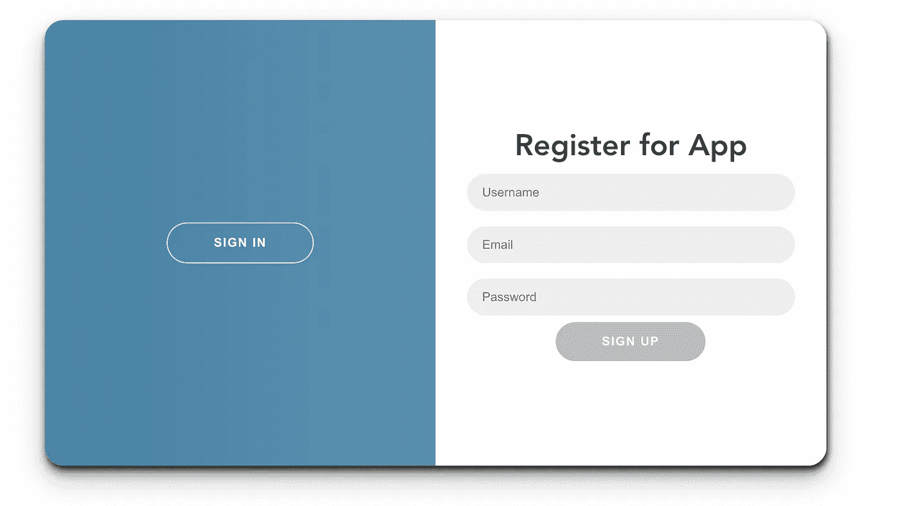
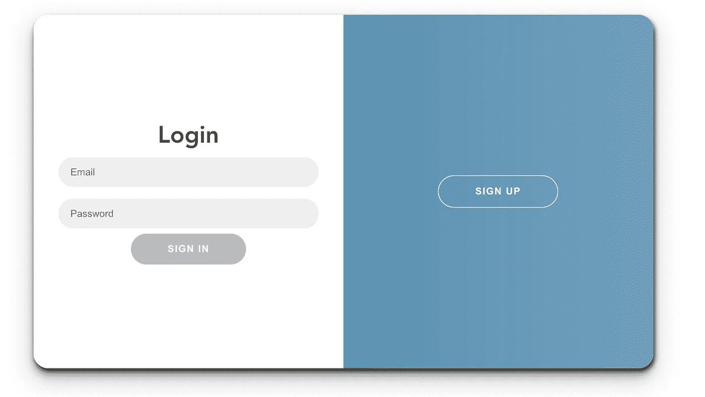

# 使用 Vue.js 3 的 Firebase 用户操作和 AuthGuard

> 原文：<https://javascript.plainenglish.io/firebase-user-actions-and-authguard-with-vue-js-3-69402e4fb1f3?source=collection_archive---------8----------------------->

## 您正在使用 Vue.js 构建一个应用程序。在将 Firebase 集成到应用程序中之后，您需要做的第一件事就是设置您的用户。继续这篇文章就足够了，你需要为页面重定向、用户注册、登录和注销做些什么。


Photo by [Franck](https://unsplash.com/@franckinjapan?utm_source=medium&utm_medium=referral) on [Unsplash](https://unsplash.com?utm_source=medium&utm_medium=referral)

首先，你好。我的帖子的基本构件是 Vue.js 3 和 Firebase。我们将使用这两种技术开发一个简单的应用程序。在本文中，我们将基本上做 Firebase 的登录和注册操作，然后是登录用户的信息，Auth Guard 和注销操作。

在我之前的文章中，我们将我们的项目与 Firebase 联系起来。在这个过程之后，我们将应用程序部署到 Firebase。您可以通过下面的链接找到必要的步骤。我也解释了为什么选择 Firebase。

[](/how-can-i-deploy-my-project-created-with-vue-js-3-to-firebase-78ec84de6781) [## 如何将我用 Vue.js 3 创建的项目部署到 Firebase？

### 如果你有一个没有太多负担的项目，并且你不想向非免费托管系统付费(在…

javascript.plainenglish.io](/how-can-i-deploy-my-project-created-with-vue-js-3-to-firebase-78ec84de6781) 

在我们连接到 Firebase 的地方，我们将在 ***中编写代码。js*** 文件。先从报名开始吧。让我们在 src 文件夹下创建一个文件夹。让我们在其中创建一个名为 ***SignUp.js*** 的文件。

提醒一下，我正在分享我们将应用程序链接到 Firebase 的文件内容。我们的行动将从引进这个地方开始。

如果我们的 *SignUp.js* 文件是，

我们将使用电子邮件、密码和显示名称功能注册 Firebase。我们导入的`firebaseAuth`中有`createUserWithEmailAndPassword`方法。使用这种方法，我们可以很容易地用从用户那里收到的电子邮件和密码创建一个用户。如果登录不成功，将向我们返回一条错误消息。我们使用它来查看这个错误消息。因为我们会将这个 ***SignUp.js*** 文件导入到 ***SignUp.vue*** 文件中。

**s gnUp**

我们在文件中创建了三个`ref`值。在`<template>`部分，我们将创建的三个值放在`<input v-model="...">`中。我们在 SignUp.js 文件中创建了这些值。我们创建我们想要发送的内容。

然后我们导入我们的 SignUp.js 文件，并从那里生成`{error, signup}`对象。

我们产生了一个方法，当我们点击按钮时，这个方法就会运行。`handleSubmit()`。这里我们将`email.value, password.value, displayName.value`的值带入`signup()`。这些值将通过我们的 SignUp.js 文件导入 Firebase。



**签到**

登录过程与注册几乎相同。我们使用的方法不同。您可以通过 FirebaseAuth 转到该文件夹来查看这些使用的方法。

我们用`signInEmailAndPassword(email, password)`方法提供用户登录。如果有错误，我们会再次收到错误消息。我们将在 ***Login.vue*** 文件中使用这个文件。

在这一部分，我们将生成`{ error, login }`对象。

我们使用`ref`生成`email, password`值。这些值将在`<template>`中使用，并将连接到 Firebase，提供来自`<input v-model"...">`的数据输入。我们用我们创造的`login(email.value, password.value)`发送我们的价值。

如果在我们的登录和注册系统中出现错误，这个`error`将与我们创建的错误一起反映在屏幕上。对于这个错误，我们没有在`.vue`端做任何事情，来自 Firebase 的错误消息显示在屏幕上。我们只是将错误导入到我们的`.vue`文件中，并创建它来使用它。



如果我们已经成功登录，让我们进入下一页。

Github 链接查看更多详细评论；

[](https://github.com/besteenurk/firebase-vue-3-app/tree/auth-pages) [## GitHub-besteenurk/firebase-vue-3-app at auth-pages

### 通过在 GitHub 上创建一个帐户，为 besteenurk/firebase-vue-3-app 开发做出贡献。

github.com](https://github.com/besteenurk/firebase-vue-3-app/tree/auth-pages) 

登录后，我们将向用户显示这样的屏幕。在本节中，将完成用户信息和注销过程。


先从用户信息说起。创建一个名为**getuser . js .的文件**

我们通过`firebaseAuth`获取用`currentUser`登录的用户信息。这里`onAuthStateChanged()`方法起作用，我们将收到的`user`信息分配给我们在该部分创建的`_user`。

**LogOut.js**

我们在注销部分使用了`signOut()`方法`firebaseAuth`。当我们触发它时，Firebase 执行注销操作。

我们用`@click="handleClick"`导入的`logout()`方法有效。

为了获取用户，我们导入了`GetUser()`方法。我们把它分配给用户对象。如果我们写任何标签为`{{ user.displayName }} {{ user.email }}`。

在这些过程之后，我们在屏幕上反映出谁是我们的用户。

此外，我们需要更改 main.js 文件，因为我们提供用户输入。

```
let appfirebaseAuth.onAuthStateChanged(() => {if (!app) {app = createApp(App).use(router).mount(‘#app’)}})
```

我们从 firebase 配置文件中导入`firebaseAuth`。

**火焰基地授权守卫**

Auth Guard 允许我们根据用户的角色来引导重定向页面的用户登录。对于这个项目，我们可以用几行代码来完成。
在 Vue.js 中，路由器位于 index.js 文件中。让我们将它们添加到文件中。

```
const requireAuth = (next) => {let user = firebaseAuth.currentUserif (!user) {next({ name: “Home” })} else {next()}}
```

`const routes`内部

```
{path: ‘/mainPage’,name: ‘mainPage’,component: MainPage,beforeEnter: requireAuth},
```

我们添加的时候说需要登录才能去***/主页面*** 。

我创建并部署 Firebase 的项目的现场版本；

 [## firebase-vue-3-app

### 编辑描述

fir-vue-3-app.firebaseapp.com](https://fir-vue-3-app.firebaseapp.com/)  [## firebase-vue-3-app

### 编辑描述

fir-vue-3-app.web.app](https://fir-vue-3-app.web.app/) [](/how-to-use-the-composition-api-to-get-data-from-service-with-vue-js-4da1eca19ad6) [## 如何使用组合 API 通过 Vue.js 从服务中获取数据

### 通过使用组合 API 而不是选项 API，可以使服务结构更加可用。

javascript.plainenglish.io](/how-to-use-the-composition-api-to-get-data-from-service-with-vue-js-4da1eca19ad6) [](https://bestte.medium.com/introduction-to-vue-js-fbe12ff58f86) [## Vue.js 简介

### 这里有一个答案，我该如何开始？

bestte.medium.com](https://bestte.medium.com/introduction-to-vue-js-fbe12ff58f86) [](https://medium.com/geekculture/developing-at-devtools-and-hot-reload-fault-after-that-what-can-you-do-a3d24c5b4414) [## 在 DevTools 开发，热重装故障，之后能做什么？

### 点击 CTRL+S 后，坐下来几秒钟，哭着，打开 Devtools，重新开始编码同样的东西。

medium.com](https://medium.com/geekculture/developing-at-devtools-and-hot-reload-fault-after-that-what-can-you-do-a3d24c5b4414) [](/how-can-i-create-a-search-box-from-a-json-file-with-the-composition-api-c36058753c07) [## 如何用组合 API 从 JSON 文件创建一个搜索框

### 如何使用 Composition API 制作搜索框，如何从 JSON 文件中读取数据，如何在屏幕上显示数据…

javascript.plainenglish.io](/how-can-i-create-a-search-box-from-a-json-file-with-the-composition-api-c36058753c07) 

*更多内容请看*[***plain English . io***](http://plainenglish.io/)