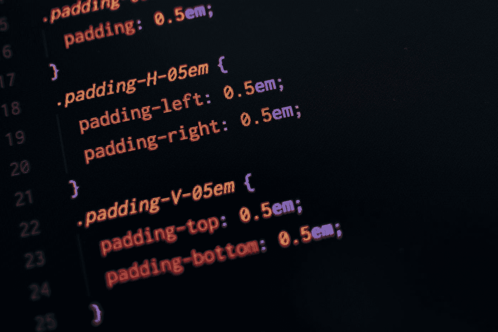
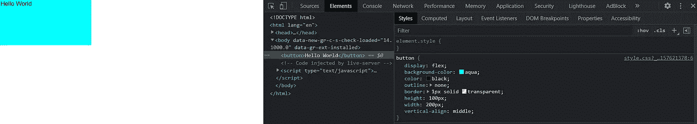
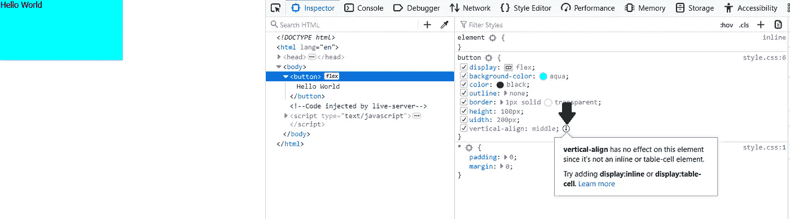
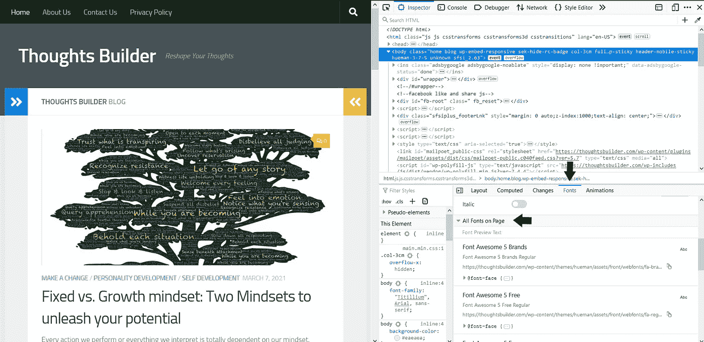
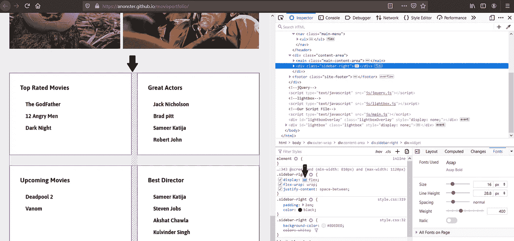
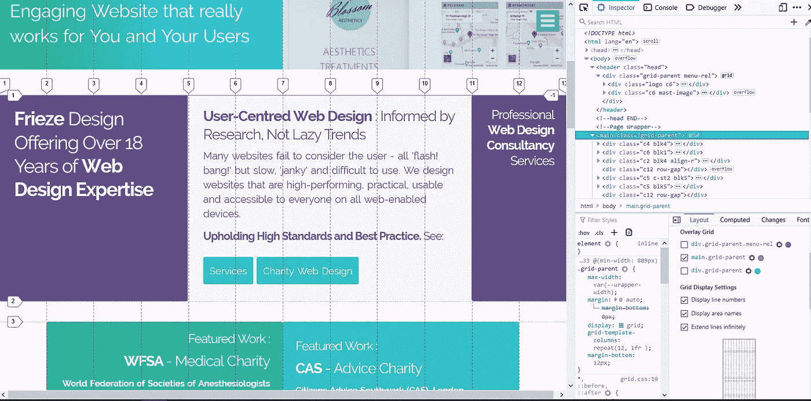
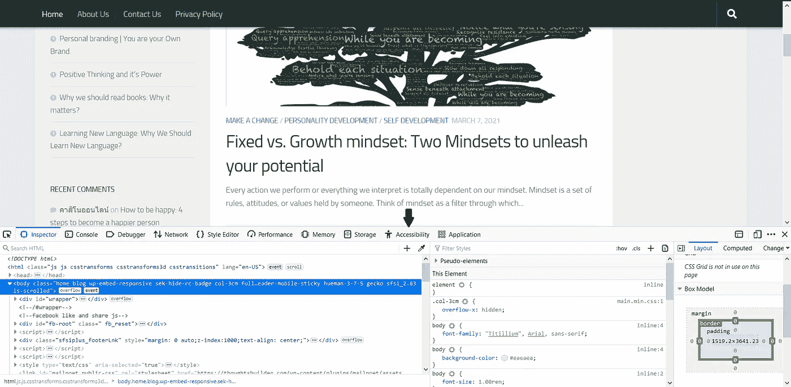

# Firefox 比 Chrome 更适合 CSS 调试

> 原文：<https://javascript.plainenglish.io/firefox-can-help-you-learn-css-better-7f56928d51c9?source=collection_archive---------8----------------------->

## 原因如下

Photo by [Pankaj Patel](https://unsplash.com/@pankajpatel?utm_source=medium&utm_medium=referral) on [Unsplash](https://unsplash.com?utm_source=medium&utm_medium=referral)

是的，你没看错。 ***停止使用 Chrome 或其他任何浏览器*** 。你们大多数人可能会觉得被冒犯了，但是我知道我在说什么。说到 JavaScript 和其他东西，Chrome 是最好的选择。连我都在用 Chrome 写这篇文章。那么，你为什么应该停止使用 Chrome 呢？嗯，当 CSS 没有按照我想要的方式工作时，我通常会很痛苦。这完全是我的错，但是我怎样才能得到帮助呢？或者我怎么知道我申请的 CSS 在这里是无效的？有时候，这些小小的 CSS 调整会让你吃很多苦。

经过大量搜索，我找到了一个有价值的资源来帮助我理解这些 CSS 调整。我找到了**火狐浏览器**。我将向你解释，为什么你应该在学习 CSS 的同时重新考虑你的浏览器并开始使用 Firefox。

## 如果某个东西不工作，它会告诉你为什么。

在学习 CSS 的时候，你可能会尝试 CSS。有时候，有些东西不起作用，你不知道它为什么不起作用。让 Firefox 来拯救我们吧。让我告诉你怎么做。

ScreenShot of Chrome Developer tool.

上面是 Chrome 的开发者工具，你可以看到我在按钮上应用了垂直对齐属性，但它不起作用。你可能知道为什么它不工作。新手呢，现在刚开始学？对他们来说，这可能很困难。现在让我们看看 Firefox 开发工具的屏幕截图。

ScreenShot of Firefox Developer tool.

你可以看到它告诉我什么是错误，我对按钮使用了 display flex，将其更改为 inline 将起作用。

## 网站使用的字体是什么？

作为一个初学 web 开发的人，你可能想知道不同网站的不同字体。当我刚开始的时候，我很好奇想知道一些著名网站使用的不同种类的字体。不幸的是一切都是徒劳，直到我发现了火狐。在 Firefox 开发者工具中，你实际上可以为字体。以下是方法。

转到网站，然后打开 Firefox 开发工具。导航到字体，然后选择页面上的所有字体。在那里你可以看到字体列表。

如果要查看特定标题或任何段落的字体，请选择该段落，然后查看重复相同的过程。

## FlexBox 检查器

CSS 柔性盒模型俗称 flexbox 模型，它是 CSS 布局模型。flexbox 布局允许根据屏幕大小自动排列 flex 容器中的响应元素。

如果你正在使用 flexbox 并且想要检查 flexbox 容器，那么 Firefox FlexBox inspector 可能是你需要的朋友。

您只需打开检查器并导航到 flex 项目。转到样式选项卡，您可能会看到 display flex 的属性。在 flex 前面，您可能会看到一个小网格图标，只需单击它，您就会看到 flex 容器被突出显示。当您使用 flexbox 属性(如 flex-wrap 等)时，这非常有用。

## CSS 网格检查器

跟踪 CSS 网格中的行和列是多么重要，Firefox CSS inspector 可以帮助你轻松做到这一点。要打开 CSS inspector，您只需按照打开 flexbox inspector 时的流程操作即可。打开网格检查器后，您可以看到突出显示的行和列。

This website is not affiliated with me. I just opened it to show you as an example.

## 辅助功能检查器

修复网站可访问性的最好方法之一是通过 Firefox 可访问性检查器进行检查。打开开发工具并导航可访问性，或者您可以使用快捷键 **(shift + F12)** 。您可以在那里扫描问题，它还会让您知道如何修复这些问题。

## 结论

正如你所看到的，Firefox 在学习 CSS 时是多么有帮助。除此之外还有很多，但我想这些功能几乎每次都会用到。这当然只是我的看法。如果你同意或者不同意，一定要在评论里让我知道。