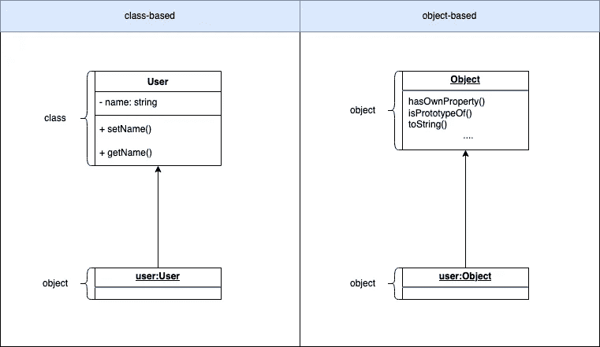
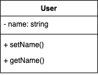
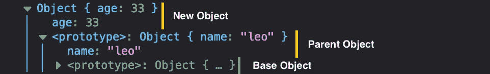
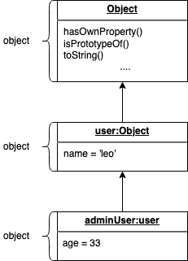

# JavaScript 中对象(原型)的首次介绍

> 原文：<https://javascript.plainenglish.io/first-introduction-to-objects-prototypes-in-javascript-46ddb6da3a5a?source=collection_archive---------15----------------------->


Photo by [James Harrison](https://unsplash.com/@jstrippa?utm_source=medium&utm_medium=referral) on [Unsplash](https://unsplash.com?utm_source=medium&utm_medium=referral)

理解和使用对象是 JavaScript 的关键部分，因为 JavaScript 中的几乎所有东西都是基于对象的。

首先，我们将经历**理论部分**，在那里我将解释基于类和基于对象的编程语言之间的区别，然后，我们将经历**实践部分**关于如何基本上使用对象。

## 理论部分



如果您使用过 Java 或 PHP 之类的语言，那么您已经知道什么是基于类的编程语言。

在**基于类的**语言中，你将逻辑封装在类中，这些类是你从中创建的对象实例的蓝图。



在左边，您可以看到一个简单的用户类。这是您的用户对象的蓝图。name 字段是私有的，只能通过方法访问。

在 JavaScript 等基于对象的语言中，对象实例是从其他对象中创建的。您继承的对象是新对象的所谓原型。这里有一个例子:

```
const user = { name: 'leo' };
const adminUser = Object.create(user);
adminUser.age = 33;console.dir(adminUser);
```

例如，您可以尝试在 [codepen.io](http://codepen.io) 上运行代码，并打开 dev-tools 控制台。具体可以看下面。显示了您新创建的对象 *adminUser* ，以及它的原型(继承的)结构。



原型是所创建对象的抽象。在上面这个简单的例子中，我们有两个抽象，pre build*object . proto ytpe*和我们的 *user* 对象。

对象可以保存简单的属性，这些属性有一个[原语类型](/primitive-and-reference-data-types-in-javascript-2b3916cae1ef)，你也可以**定义子对象或函数**。

```
const user = {
  calculateSum: function (operand1, operand2) {
    return operand1 + operand2;
  }, 
  address: {
    street: '',
    city: ''
  }
};
const adminUser = Object.create(user);console.dir(adminUser);
```

每个新对象都是基于 *Object.prototype* 的，如果你不像我们对 *adminUser* 对象那样指定你自己的原型，或者将原型设置为 null。

```
const adminUser = Object.create(null);
adminUser.age = 33;console.dir(adminUser);
```

对于这个例子，我们的控制台上的输出看起来非常短，因为我们将继承的原型设置为 null，所以我们的对象只获得 age 属性，其他什么都没有。


## 实用部分

如何获取对象的属性？

第一种选择是在对象上写属性名，用点分隔。

```
const name = adminUser.name;console.log(name);
// outputs: > "leo"
```

其次，使用方括号，只有在需要动态获取属性时，这种方式才有意义。

```
const propertyName = "age"; // set by a condition 
const age = adminUser[propertyName];console.log(age);
// outputs: > 33
```

我们**访问下面代码中的函数**并传递两个参数。

```
const sum = adminUser.calculateSum(3, 3);// toString() is a built in function of Object.prototype
console.log(sum.toString()); 
// outputs: > "6"
```

用于**检查所有属性在运行时**可用于赋值的简写代码。如果一起动态构建对象，应该通过检查属性来防止错误。

```
const user = {};
const userName = user && user.details && user.details.name;console.log(userName);
// outputs: > undefined
```

或者，您可以使用一个新特性[可选链接操作符](https://developer.mozilla.org/en-US/docs/Web/JavaScript/Reference/Operators/Optional_chaining)。

```
const user = {};
const userName = user?.details?.name;console.log(userName);
// outputs: > undefined
```

感谢您的反馈。请随意开始对话并发表评论。:)

*更多内容尽在*[plain English . io](http://plainenglish.io/)