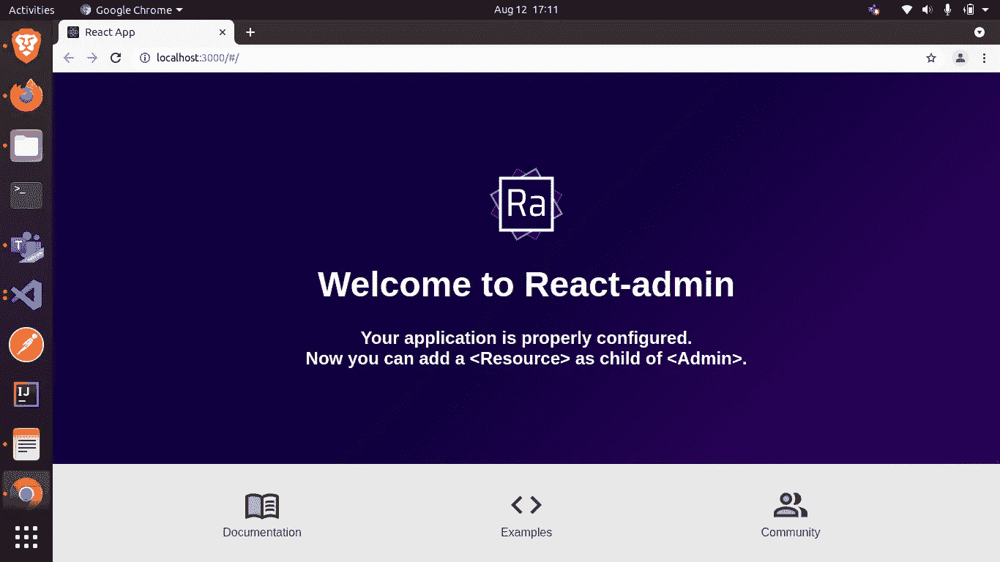
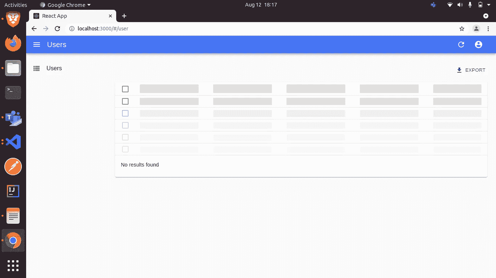

# React Admin 的第一步

> 原文：<https://javascript.plainenglish.io/first-steps-for-react-admin-72bec730c610?source=collection_archive---------8----------------------->

## React Admin 入门


The developer is no less than a magician

# 什么是后端面板？

“后端”是“管理面板”。使用后端(“管理面板”)，你可以添加/编辑/删除/更新网站上的任何内容，但你需要一个控制面板来管理你的内容，这个“控制面板”被称为“管理面板”或“后端面板”。

# 为什么选择 React Admin？

react-admin**是一个前端框架**，所以它是为了使用您的**现有* * REST/graph QL API 而构建的。它允许您轻松地创建前端管理应用程序，通过数据提供者以标准化的方式与后端交互。

它采用了一种数据提供者方法，在这种方法中，数据提供者作为框架和后端之间的接口，管理前端和后端 API 之间的查询和响应处理，允许您专注于模块化阶段中的仪表板开发。


# 入门指南

让我们首先创建一个新的 React 项目(名为`react-admin-app`)并将`react-admin`安装在它的目录中，如下所示:

```
npx create-react-app react-admin-app
cd react-admin-app
# install react-admin
npm install react-admin
```

让我们试着从 API 获取数据。为此，react-admin 使用其根组件<admin>来提供 API 和应用程序之间的数据交换。在`src/App.js`中，将默认语法替换为:</admin>

```
import React, { Component } from "react";
import { Admin } from "react-admin";
import customDataProvider from "./dataProvider/dataProvider";

const App = () => {
   return (
     <Admin dataProvider={customDataProvider} />
    );
   };
export default App;
```

在`src/dataProvider/dataProvider.js`中还定义了 **customDataProvider** 这是主要的部分，它作为一个服务员将我们的请求带到后端，并向我们提供它的响应，在`simpleRestProvider`中已经为 *create、delete、getAll、getOne* 预定义了函数。

```
import { fetchUtils } from 'react-admin';import simpleRestProvider from "ra-data-simple-rest"; const apiUrl = 'http://localhost:3000';const httpClient = fetchUtils.fetchJson;const dataProvider = simpleRestProvider(apiUrl, httpClient);const customDataProvider = {...dataProvider,};export default customDataProvider;
```

现在运行以下命令:

```
npm start
```

您将得到类似这样的结果:-



> 注意—这里的`apiUrl`来自 **dataProvider.js** 表示我们的后端正在运行的端点。

# 让我们开始修改与我们的 API 相关的内容

在`src/App.js`中添加资源标签。

```
.
.
.
import { UserList } from "./components/UserList.js";const App = () => {
     return (
       <Admin dataProvider={customDataProvider} >
         <Resource
          name="user"
          list={UserList}
         />
      </Admin>
    );
 };
.
.
.
```

并在`src/components/UserList.js`中创建`UserList`组件

```
import React from 'react';
import { List, Datagrid, TextField, EmailField, UrlField } from 'react-admin';export const UserList = props => (
 <List {...props}>
    <Datagrid rowClick="edit">
        <TextField source="id" lable="Identification" />
        <TextField source="name" />
        <TextField source="username" />
        <EmailField source="email" />
        <UrlField source="website" />
    </Datagrid>
 </List>
);
```

在这之后，我们的管理面板看起来像这样:



## 让我们分解上面的代码:-

**形式** `**src/App.js**` **:-**

`Resource` —这个标签用于通知 react-admin 我们想要获取并显示一个名为“user”的资源( **name="user"** )。这由 dataprovider 处理，然后 data provider 使用其接口向 ***apiUrl/resource 发出请求。*** 在这种情况下，它向我们的 **http://localhost:3000/user 发出请求。**然后使用`UserList`组件将其显示到桌面。这个" **list** "属性告诉 react-admin 使用 dataProvider 预定义函数中的`getAll()`，该函数获取资源接收的任何数据，并做出最佳猜测来格式化初始数据网格。

同 list prop call getAll()函数，create prop call create()函数，edit prop redirect call to update()/update one()/update many()函数根据我们的逻辑(我们总是可以通过用 **getList** 这样定义我们的同名方法来覆盖这个 [**函数**](https://marmelab.com/react-admin/Tutorial.html#connecting-to-a-real-api) )。

```
const customDataProvider = {
    ...dataProvider,
    getList: (resource: String) =>
       httpClient(`${apiUrl}/${resource}`, {
           method: "GET",
       }).then(({ json }) => {
           return ({ data: json, total: json.length })
       }),
 };
```

> **注意** —您可以在浏览器的检查模式下，通过网络部分，发现 react-admin 在不同操作上调用的更多端点。

**来自** `**src/components/UserList.js**` **:-**

`source` —来自 Textfield，表示我们从端点接收的参数，根据名称显示该参数，并且默认情况下也将自身作为标签组件。

`lable` —显示各个字段名称。

`UrlField` —使字段可点击。

要了解更多信息，您可以参考 Marmel 实验室文档。

# 结论

后端面板使管理和维护后端进程变得简单。我们可以使用 react-admin 提供带有身份验证的管理功能。React-Admin 的世界是巨大的，我们只是迈出了第一步。

*更多内容请看*[*plain English . io*](http://plainenglish.io/)