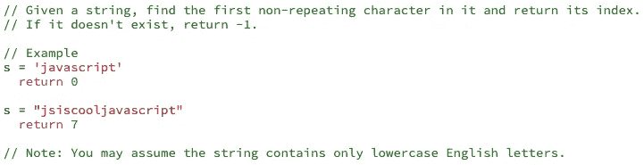
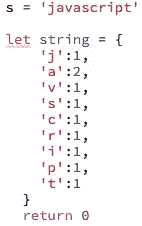
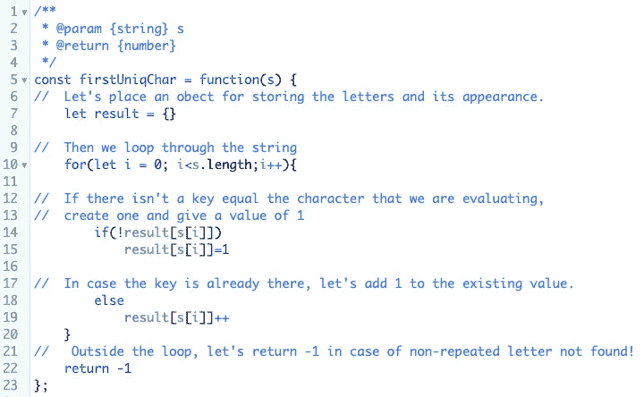
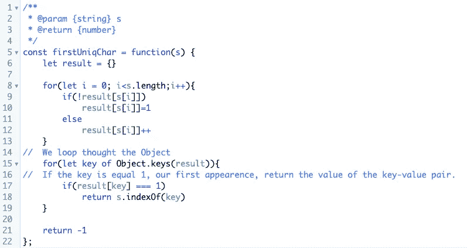
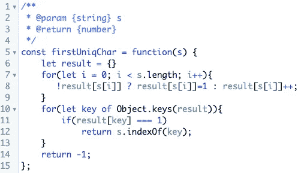

# 字符串中的第一个唯一字符 JavaScript

> 原文：<https://javascript.plainenglish.io/first-unique-character-in-a-string-javascript-43f277f995b1?source=collection_archive---------1----------------------->

## 让我们谈谈使用 JavaScript 的另一个常见的编码挑战。

这不仅是常见的，而且是一个非常棘手的问题。起初，这似乎很简单，只要方法正确，我们就能成功。

需要完成的说明如下:

在我上一篇标题为[如何反转整数](https://medium.com/javascript-in-plain-english/reverse-integer-in-javascript-8ec48721ccfb)的文章中，我利用了许多原生 JavaScript 函数来获得正确的结果。在这个挑战中，我们将通过算法的方式来得到正确的答案。

我们需要返回第一个不重复的字符，并返回它的索引。这意味着我们将接收一个**字符串**，我们需要找到出现一次的第一个字母或字符。如果没有唯一的字符，我们应该返回-1。

寻找不重复字符的最佳方法是跟踪每个字符的每次出现。说起来容易，但是怎么做呢？

我们可以使用对象，因为我们可以使用键-值对，所以每个键将代表一个字母，而值将代表一个整数，其中包含在字符串中出现的次数。例如:

如果我们收到“javascript ”,我们应该循环遍历字符串，并通过跟踪字母的外观来计数字母。因此，字母 ***j*** 出现一次，它在索引 0 上。

假设我们得到了单词‘javajscript’，现在第一个不重复的字符将是***‘v’。*** 因此我们应该**返回 2。**

编码时间！

这看起来很多，但是我们只有 10 行可执行代码，我们很快就要重构。

在第 7 行中，我们有一个对象，它将保存每个字符的*键值*对及其在字符串中的外观。在第 10 行，我们让**循环**遍历每个字符。在第 14 行，第一个**条件**，在对象不持有代表循环正在评估的字母的键的情况下，创建一个键并赋予值 1。在第 18 行，我们已经得到了对象的密钥，所以我们只是用*更新*当前金额+ 1 的值。最后，我们在第 22 行放置**回车**，以防发现不重复的字符。

现在我们已经得到了每个字符的轨迹，我们需要找到第一个不重复的。

现在，让我们重构以获得一个干净的代码。

漂亮又干净！我确实喜欢使用三元运算符，但是您可以使用 if / else。

既然您已经学会了完成这个挑战的方法，我建议您尝试使用 map()和 set()来解决这个问题。
["](https://developer.mozilla.org/en-US/docs/Web/JavaScript/Reference/Global_Objects/Map)*`[***Map***](https://developer.mozilla.org/en-US/docs/Web/JavaScript/Reference/Global_Objects/Map)`[*对象保存键-值对并记住键的原始插入顺序。任何值(对象和原始值)都可以用作键或值。*](https://developer.mozilla.org/en-US/docs/Web/JavaScript/Reference/Global_Objects/Map)*`[***Set***](https://developer.mozilla.org/en-US/docs/Web/JavaScript/Reference/Global_Objects/Set)`[*对象允许您存储任何类型的唯一值，无论是原始值还是对象引用。*](https://developer.mozilla.org/en-US/docs/Web/JavaScript/Reference/Global_Objects/Set)**

**非常感谢您的阅读！如果你有不同的方法来解决这个问题，请留言。此外，我将发布更多关于解决这些挑战的文章。**