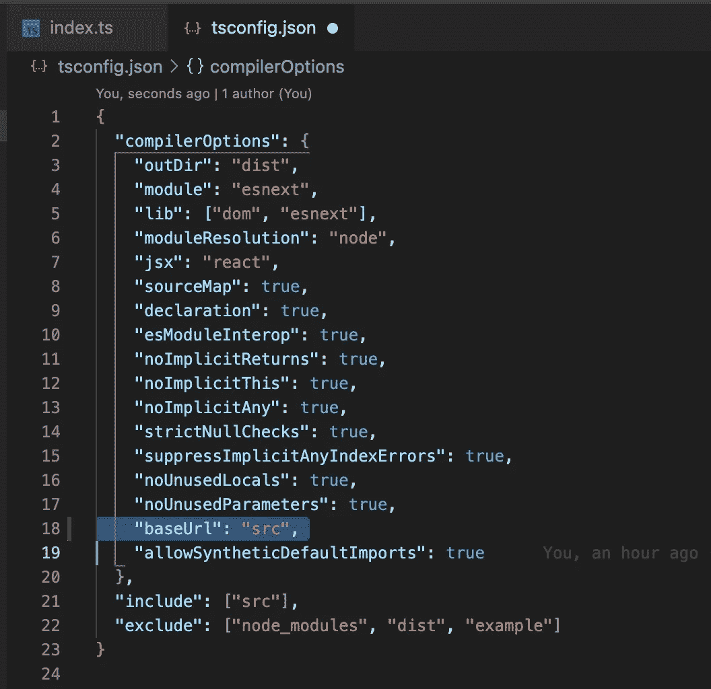
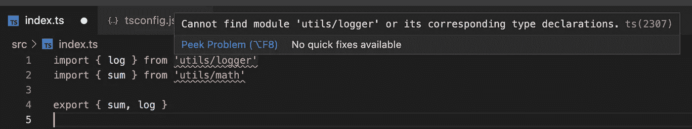
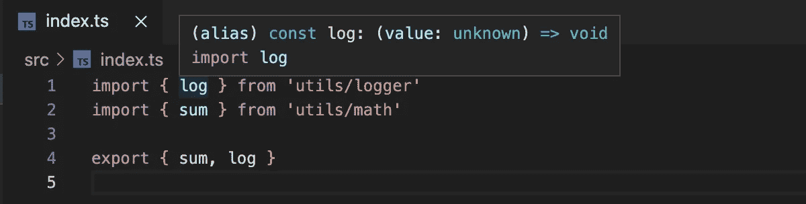
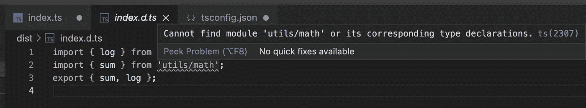
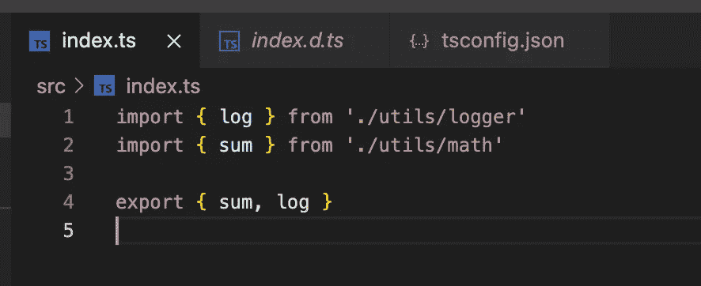
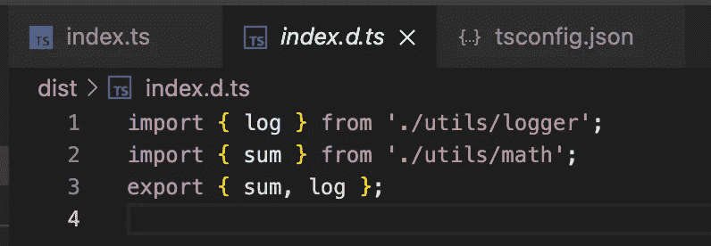
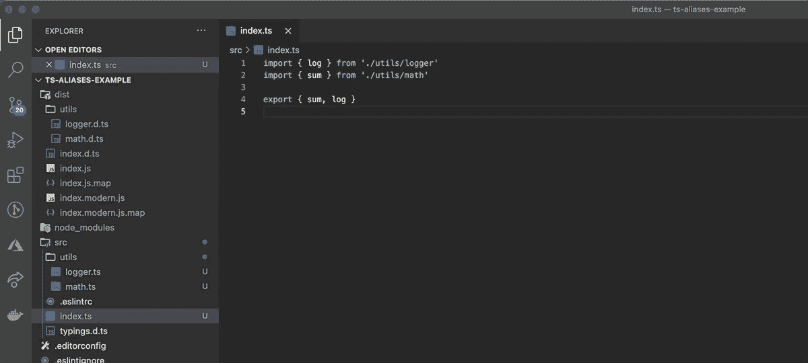
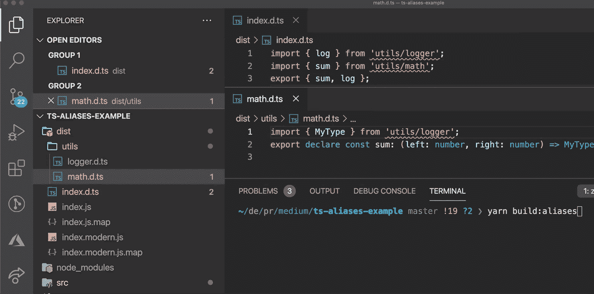

# 用一个 bash 命令修复 index.d.ts 导入路径

> 原文：<https://javascript.plainenglish.io/fix-index-d-ts-import-paths-with-one-bash-command-8ff61aee8464?source=collection_archive---------14----------------------->


Photo by [Pawel Nolbert](https://unsplash.com/@hellocolor?utm_source=medium&utm_medium=referral) on [Unsplash](https://unsplash.com?utm_source=medium&utm_medium=referral)

好的，所以你决定做一些漂亮而闪亮的东西，现在你正在开发 JavaScript 库，它实际上是用心爱的 TypeScript 编写的，不是吗？很好。


Source: [https://bonomi.io/blog/the-bonomi-tech-stack/](https://bonomi.io/blog/the-bonomi-tech-stack/)

# 路径的问题

让我们跳过所有的开发步骤，在一切都已经很好的时候登陆。您精心编写的代码正在运行，并且经过了很好的测试。你所有的组件和助手都有类型。构建是绿色运行的，因此`index.d.ts`也正在生成。而且…您出于自己的原因使用绝对导入路径。

在我们的团队中，在 Rolique，我们更喜欢在任何可能的时候使用绝对路径，似乎总是这样。

这是一个有问题的话题，所以，请将下面的文字视为我的个人观点。

带有绝对路径的导入看起来更干净，我们可以毫不犹豫地在项目内部移动文件，不需要更新它的导入。

所有这些都是非常方便和甜蜜的，直到你的库被添加到某个项目中，这就是问题出现的地方。

TypeScript 可以解析库 repo 内部的绝对路径，因为您确切地告诉了如何解析。它会在`tsconfig.json`中寻找`baseUrl`，并以此作为那条路径的基础。



tsconfig.json with baseUrl example



Code editor can’t resolve absolute import paths without baseUrl



Code editor resolves absolute import paths with baseUrl

嗯，但是你的`build`或者`dist`文件夹里没有`tsconfig.json`这个东西吧？对，没有。但是进口仍然是绝对的。

一旦您的库将被添加到任何 TypeScript 项目中，没有一个绝对导入将在库内部被解析，这仅仅是因为它不知道在哪里寻找您导入的文件。



index.d.ts generated with absolute paths

好吧，好吧。我们可以有库的根的相对路径，所以它可以解析所有的路径，不管它是在你的 repo 中还是在另一个使用你的库的项目的上下文中。



Relative paths in the library root



Relative paths in the library generated index.d.ts file

# 好吧，明白了！

问题在根源层面得到了修复，但并不完全。如果一些嵌套文件使用绝对导入，情况是一样的，它不会被解析。



Nested absolute import not being resolved

> 我们要在这里放弃吗？不要！而且很多次都没有！

# CLI TSC-别名救援！

`[tsc-alias](https://www.npmjs.com/package/tsc-alias)`是一个将所有绝对进口替换为相对进口的工具。给你的。自动地。

好了，我们走吧！安装软件包:

```
yarn add tsc-alias -Dornpm install tsc-alias --save-dev
```

然后，我们需要向`package.json`脚本添加神奇的命令:

Added build:aliases script

好了，现在让我们创建那个`tsconfig.aliases.json`文件，我们将专门为这个工具使用它，不要弄乱主配置。为了安全起见，我们实际上将扩展主配置。

现在，运行脚本，您就完成了，祝贺您！



# 摘要

`tsc-alias`是这项工作的好工具。尤其是当您不想或无法添加任何构建器配置(Webpack、Rollup 等)时。对我来说就是这样，因为图书馆是用`[create-react-library](https://github.com/transitive-bullshit/create-react-library)`样板文件管理的。

使用这种方法，您只需要做一点点工作就可以完成工作。那么为什么不考虑呢？

感谢阅读本主题！