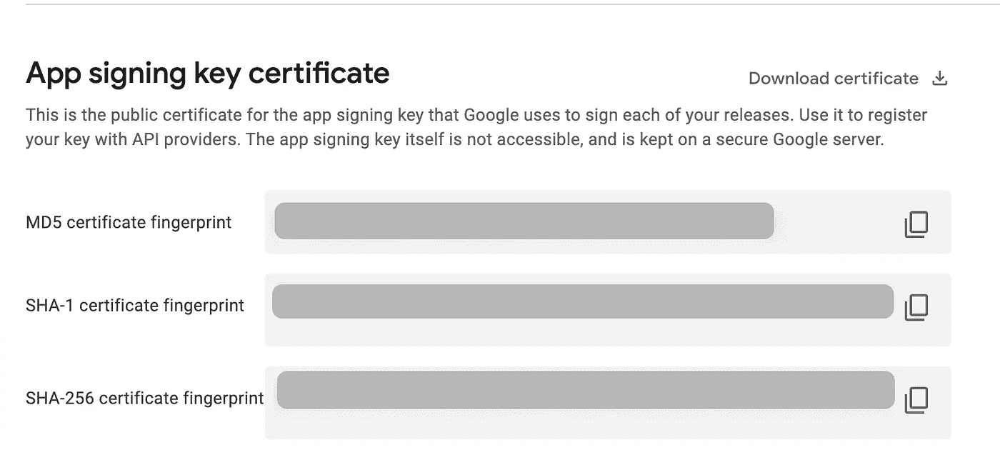

# 修复了脸书登录 w/ Android 上的“登录错误:您登录此应用程序时出错”

> 原文：<https://javascript.plainenglish.io/fix-login-error-there-is-an-error-in-logging-you-into-this-application-on-facebook-login-with-237e3baba116?source=collection_archive---------3----------------------->


Photo by [Elisa Ventur](https://unsplash.com/@elisa_ventur?utm_source=medium&utm_medium=referral) on [Unsplash](https://unsplash.com?utm_source=medium&utm_medium=referral)

大家好，在生产环境中运行应用程序时，您可能会遇到此错误**“登录错误:登录此应用程序时出错”**。(如果你在开发模式中遇到任何问题，请确保检查应用程序设置[此处](https://developers.facebook.com/docs/facebook-login/))只有当用户安装了脸书应用程序时才会出现此错误，所以以防万一，如果你的设备没有遇到任何问题，请确保也安装了脸书应用程序。

**背景资料:**

我一直在使用 react-native 的脸书登录，它在开发版本上工作得非常好，后来当我发布该应用程序时，当用户单击脸书登录按钮时，它显示如下所示的错误。


Facebook login error

所以这个有两个解决方案。第一种方法更容易，但不是一个实际的解决方案，我不鼓励你使用这种方法，但让我们检查这两种方法。

# **第一种方法:(不推荐，因为它可能会要求用户输入密码)**

当您发出这样的登录请求时:

```
await LoginManager.logInWithPermissions([“public_profile”, “email”])
```

在此之前，请确保添加以下代码:

```
if (Platform.OS === "android") {
    LoginManager.setLoginBehavior("web_only")
}

await LoginManager.logInWithPermissions(["public_profile", "email"])
```

这样，脸书登录将使用浏览器让用户登录，因此有可能会提示用户再次输入密码，因为不是每个人都在浏览器中登录他们的社交帐户。就是这样，这将使其工作，但更讨厌用户的应用内体验。

# **第二种方法:**推荐(**将应用签名密钥哈希添加到您的脸书开发者控制台)**

首先，让我们明白我们需要做什么。你可能知道，在开发者控制台上设置脸书应用程序时，你可能会看到“密钥哈希”字段。让我们首先了解什么是键散列，以及为什么需要它们。

**什么是密钥哈希？**

密钥哈希是 28 个字符，包括尾随的=并且仅限于以下字符:[a-zA-Z0–9+/=]

**为什么需要密钥哈希？**

因此，每当你的应用程序发出任何登录请求时，脸书都会使用密钥哈希来验证你的应用程序和脸书应用程序之间的交互。因此，如果您的关键散列没有被添加，它将不会允许登录管理器进一步进行，并保持为未经授权的访问。

**怎么修？**

要解决此问题，请确保您已经将应用程序上传到 play store 并启用了“Google Play 应用程序签名”。

*   登录您的[游戏控制台](https://play.google.com/console/)账户
*   点击您遇到问题的应用程序
*   现在从左边栏进入 Setup => App Signing，你会看到类似这样的内容



App signing key certificate

*   在“App 签名证书”下复制 **SHA-1 证书指纹**
*   现在，使用这些方法之一将您的 SHA-1 转换为有效的密钥哈希。

**方法一:在线工具。**

*   打开这个[在线工具](http://tomeko.net/online_tools/hex_to_base64.php)将其转换为有效的密钥哈希。
*   将 SHA-1 粘贴到第一个字段中
*   从**输出(base64)** 中复制文本

**方法二:命令行**

*   如果您不想使用在线工具来保护您的 SHA-1，您可以使用该命令，在执行该命令时，确保用您的 **SHA-1** 替换 **PASTE_YOUR_SHA1_HERE** 。

```
node -e 'console.log(Buffer.from(process.argv[1].split(":").map(hex => parseInt(hex, 16))).toString("base64"))' 'PASTE_YOUR_SHA1_HERE'
```

*   它会在控制台中打印你的 SHA-1，你可以从那里复制它。

生成密钥哈希后:

*   转到[developer.facebook.com/apps](https://developers.facebook.com/apps/)
*   打开你的应用程序，从左边栏进入“设置”->“基本”。
*   向下滚动到您看到键散列的地方，并将复制的**输出(base64)** 粘贴到这里&保存更改。
*   就是这样。

我只在谷歌签名的应用程序上试过。如果你自己签署你的应用程序，这种方法可能不起作用，但是你可以试着将你的 **SHA-1 证书指纹**转换成 **base64** 并粘贴到密钥散列中。如果这有效，请随意在下面添加评论，这样它也可以帮助其他人。

感谢阅读，请关注我，了解更多与全栈开发相关的内容。快乐编码，注意安全！

*更多内容请看*[***plain English . io***](http://plainenglish.io/)