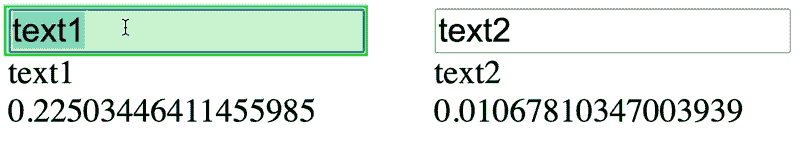
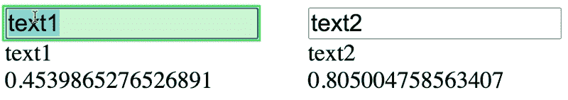

# 修复使用上下文性能问题

> 原文：<https://javascript.plainenglish.io/fixing-usecontext-performance-issues-bfc695f48192?source=collection_archive---------6----------------------->

因此，您希望使用 useState 和 useContext 作为状态管理解决方案，但是每次上下文提供者的值发生变化时，整个树都会重新呈现。你可以使用像[反冲](https://recoiljs.org/)、 [Valtio](https://github.com/pmndrs/valtio) 、 [Zustand](https://zustand.surge.sh/) 和 [Jotai](https://github.com/pmndrs/jotai) 这样的库来解决这个问题，但是你必须改变你存储和访问全局状态的方式。

有没有一种方法可以解决 useContext 的问题？很高兴你问了！是的有！这是 [react-tracked](https://react-tracked.js.org/) ，一个来自 Daishi Kato 的新库，他在 react 状态管理领域做了惊人的工作。


Banner image

# 设置 useState/useContext 全局存储

你需要做的第一件事是正确设置你的商店。Daishi 已经有了一些关于这个的优秀文档，但是让我们一步一步地浏览这个商店的打字版本。

首先，我们创建一个`store.tsx`文件，并以一些 React 导入、存储结构和一个创建`useState`钩子的函数开始该文件。

```
*import* React, { createContext, useState, useContext } *from* 'react';*const* initialState = {
  text1: "text1",
  text2: "hello",
};*const* useMyState = () => useState(initialState);
```

我们的初始存储非常简单，我们有几段文本，我们有一个函数调用带有初始状态的 React `useState`钩子。

为什么我们不直接调用`useState`并缓存结果呢？因为 React 挂钩需要从 React 组件内部调用，这样它们就可以绑定到组件实例。因此，我们需要一个能在需要时创建状态的函数。

下一步是创建上下文:

```
*const* MyContext = createContext<ReturnType<*typeof* useMyState> | *null*>(*null*);
```

这是一个标准的`createContext`调用，其中上下文要么保存`null`(启动时)，要么保存来自`useMyState`调用的返回类型。这将是带有当前值的数组的标准`useState`返回，以及一个 setter 函数。

之后，我们需要创建`SharedStateProvider` React 功能组件:

```
*const* MyContext = createContext<ReturnType<*typeof* useMyState> | *null*>(*null*);*export* *const* SharedStateProvider: React.FC = ({ children }) => (
   <MyContext.Provider value={**useMyState()**}>
      {children}
   </MyContext.Provider>
);
```

该组件位于 React 树的顶部，并向下提供上下文给任何使用它的子组件。注意，我们此时正在调用`useMyState`，因为我们在 React 组件的上下文中，这样做是安全的。

我们的最后一步是创建一个定制钩子来获取状态和状态设置器:

```
*export* *const* useSharedState = () => {
   *const* value = useContext(MyContext);
   *if* (value === *null*)
     *throw* *new* Error('Please add SharedStateProvider');
   *return* value;
};
```

这个定制钩子首先使用`useContext`来获取上下文。然后，它检查以确保它有那个上下文，如果没有，就抛出一个错误。最后，它返回上下文，这将是`useState`的输出，因此是一个带有值和 setter 的数组。

现在，我们的全球商店设置已经完成。没有图书馆。只是用钩子做一些基本的反应，并以一种非常简洁的方式构造。

# 使用商店

现在我们已经定义了我们的商店，我们首先导入`SharedStateProvider`，并将其添加到我们的`App`，如下所示:

```
import { SharedStateProvider } from "./store";const App = () => (
  <SharedStateProvider>
     ...
  </SharedStateProvider>
);
```

这不仅将为任何想要使用它的组件提供上下文，还将状态初始化为`initialState`中的值。

最后，我们可以添加一些使用该状态的组件，如下所示:

```
import { useSharedState} from "./store";const Input1 = () => {
  const [state, setState] = useSharedState();
  return (
    <input
      value={state.text1}
      onChange={(evt) =>
        setState({
          ...state,
          text1: evt.target.value,
        })
      }
    />
  );
};const Text1 = () => {
  const [state] = useSharedState();
  return (
    <div>
      {state.text1}
      <br />
      {Math.random()}
    </div>
  );
};const Text2 = () => {
  const [state] = useSharedState();
  return (
    <div>
      {state.text2}
      <br />
      {Math.random()}
    </div>
  );
};
```

现在这段代码可以正常工作了。但是您会注意到,`Text2`组件永远不需要更新，因为我们没有办法更新它所查看的`text2`值，它会在全局状态改变时更新。

这是因为 React 无法跟踪组件正在查看状态的哪一部分。它不会为你做这些工作，当你有很多全局状态时，这最终会成为一个性能问题。即使是最微小的变化，最终也会重新渲染一堆不需要重新渲染的组件。

你可以在这个例子中看到这一点，因为当你在`Input1`中输入字符时`Text2`上的随机数会不断变化。



GIF showing errant re-rendering of the Text2 component

正如你在上面看到的，我没有改变`text2`，但是显示`text2`值的组件正在重新呈现。

# 反应-跟踪救援

为了解决这个问题，我们引入了 5Kb 的`react-tracked`库，将其添加到我们的应用程序中:

```
npm install react-tracked
```

从那里我们返回到`store.tsx`文件并从库中导入`createContainer`函数:

```
import { createContainer } from "react-tracked";
```

然后**删除`useSharedState`和`SharedStateProvider`的定义**，并添加以下代码:

```
*export* *const* {
  Provider: SharedStateProvider,
  useTracked: useSharedState,
} = createContainer(useMyState);
```

`createContainer`函数取状态创建函数:

```
*const* useMyState = () => useState(initialState);
```

然后它返回一个`Provider`和一个`useTracked`，它们在导出时被重新映射到`SharedStateProvider`和`useSharedState`，这是组件所期望的。

结果是一种隔离，其中组件仅在它们“跟踪”的数据被更改时才重新呈现，如下所示:



GIF showing only the Text1 component rendering when text1 is changed

现在，当我改变`text1`时，只有`Text1`组件会改变。

对于 5 个 5Kb 的额外代码来说，这已经不错了。

# 结论

Daishi Kato 的`react-tracked`库是一种简单的方法，通过智能地跟踪状态的哪些部分被每个组件使用，来获得一个分解良好的`useState/useContext` 状态管理解决方案，并使其具有高性能。

# 视频版本

如果你想要这篇文章的视频版本，请查看 react-tracked 上的这个蓝领代码短片。

Link to a YouTube version of this article