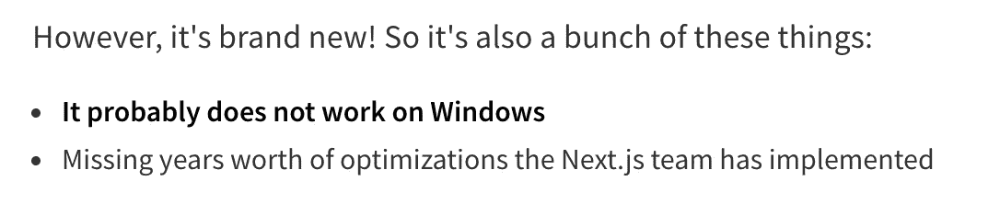
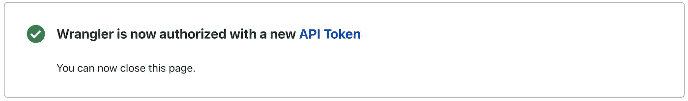

# 介绍 Flareact: Cloudflare 的全新 Next.js 替代方案

> 原文：<https://javascript.plainenglish.io/flareact-64a6ea185b8?source=collection_archive---------8----------------------->

## 不，你不需要付费计划


Image credits: [Cullan Smith](https://unsplash.com/@cullansmith?utm_source=medium&utm_medium=referral) on [Unsplash](https://unsplash.com?utm_source=medium&utm_medium=referral) & [GitHub](https://github.com/flareact/flareact)

几天前，我发现 Cloudflare 有多棒。

我过去认为它只提供 DDoS 保护，但我错了。你可以做更多的事情。通过 Cloudflare 网络托管静态页面是这些选项之一。另一个是用编程语言如 Go、Python 和 JavaScript 托管无服务器功能。

为了使事情变得更简单，有许多初学者模板可以满足您的所有需求。我发现的一个特别的程序叫做*Flareact*——它是一个基于 React.js 的无服务器启动器。别问我怎么念。(也许 Flare-act？)

坦率地说: **Flareact 是并且感觉像 Next.js.**

但是如果有 Next.js 我们为什么还需要它？

在开始实践之前，让我们先弄清楚这一点。

Next.js 是一个开发完善且稳定的 React.js 框架。如果您愿意，您可以将 Next.js 应用程序导出为静态页面，并将其托管在几乎任何地方。

除了静态托管，一个 Next.js app 可以在服务器上主动渲染，给你带来很多好处。为了实现这一点，可以将 Next.js 集成到 Node.js 应用程序中，或者将其作为云功能托管在 Vercel 等平台上。

Flareact 的理念是**而不是**静态托管。

目前，甚至没有静态导出页面的选项。Flareact 是并且仍然是 Cloudflare 的无服务器功能“workers”的启动器，因此它是基于云的。

如果您想利用在服务器上主动渲染应用程序的优势，请仅使用 Flareact。例如，动态路由或预取数据是服务器端呈现的独有功能。这两者在静态页面上技术上都是不可能的。

因此，Flareact 专注于 SSR，这需要运行后端功能。这说明了为什么它不仅仅是另一个不必要的框架。

当然，您可以在 Cloudflare 上使用 SSR 托管您的 Node.js + Next.js 应用程序(我完全爱上了这一点)，但为什么不让事情变得更简单，并使用 Flareact，它正是为此目的而优化的呢？

总而言之:Flareact 的目标是成为在 Cloudflare 服务器上渲染 React.js 的首选。开始吧！

在我们开始之前的两个提示，摘自[NPM 官方页面](https://www.npmjs.com/package/flareact):



Flareact 只有一岁，因此，请对它有点同情心。

当然，首先您需要在这里创建一个 Cloudflare Workers 帐户[。别担心，这不会花你什么钱。](https://workers.cloudflare.com/)

要构建新的 Flareact 项目，我们需要安装 Cloudflare 的无服务器 CLI:

```
npm i @cloudflare/wrangler -g
```

然后，您需要登录刚刚创建的 Cloudflare 帐户:

```
wrangler login 
```

按“y”确认—浏览器将打开，您将登录。如果过一会儿终端仍然显示“等待 API 令牌”,不要担心——我在两台不同的机器上遇到了这个错误。谢天谢地，我知道解决办法；)

再次运行`wrangler login`——然后，您应该会看到这个页面:



按下“API 令牌”点击您的令牌的 3 个条，并选择“滚动”然后，复制新令牌。在终端中运行`wrangler config`,手动输入您的 API 密钥——现在您已经登录了！

终于，我们可以做我们想做的事了。

# 创建我们的 Flareact 项目

找到您想要创建新项目的位置。然后，跑

```
wrangler generate my-project [https://github.com/flareact/flareact-template](https://github.com/flareact/flareact-template)
```

这将创建一个名为“my-project”的新目录选择名字由你决定。

现在是我想到另一个问题的时候了:不知何故，wrangler 只生成了一个使用 0.0.7 版 Flareact 依赖项的项目。因此，在初始化之后，确保检查 *flareact* 是版本 1.2.1 或更高版本。

项目创建完成后，终端应该会显示您的帐户 ID。
确保复制该值并将其粘贴到`wrangler.toml`中，此处“account_id”字段目前为空。这赋予了将您的应用即时部署到 Cloudflare 网络的权利。

最后但同样重要的是，确保在项目目录中运行`npm install`。

好了，在我们进行任何更改之前，让我们运行并部署它—我想让您知道它有多简单。

使用`npm run dev`创建开发服务器。你可以在它给你的端口上打开它(应该是端口 8080)。然后，在我们部署它之前，我们需要构建我们的生产版本。用`npm run build`可以做到这一点。

然后，要发布您的应用，运行`npm run deploy` —这将立即将您的应用发布到 Cloudflare 网络。

我们将构建一个 *Cloudflare Workers* 项目，这意味着我们将使用 Cloudflare 的无服务器功能。

# Flareact 与 Next.js 的相似之处

当你看到我们现在得到的东西时，它看起来非常类似于 Next.js 设置——这是有意的。下面是与 Next 类似的内容:

## 按指定路线发送

在 Next.js 中，所有具有唯一 URL 的页面都位于/pages 目录中。这同样适用于 Flareact。

## 动态路由

但是如果我们想要动态地提供页面，那么基于我们请求的 URL 呢？在 Next.js 中，可以让页面处理不同的请求——例如，`/pages/posts/[title].js`可以处理像`/posts/first-post`和`/posts/second-post`这样的请求。Flareact 提供了相同的功能。

## 自定义应用程序和文档页面

当我们想要在 Next.js 应用程序中进行更深入的更改时，我们可以在 pages 目录中实现一个自定义的`_document.js`和`_app.js`文件。通过这些文件，我们可以指定渲染，应用全局样式或围绕整个应用程序进行布局。在 Flareact 中，两者都有

## 设计我们的应用

像 Next.js 中一样，有许多选项来设计应用程序的样式。最基础的一个:把 css 写成. CSS 文件，导入。在 Next.js 中，这导致了一个问题:默认情况下，CSS 文件只能导入到`_app.js`中，而不能导入到 pages 文件夹中的文件中。

这就是 Flareact 实际上比 Next.js 有优势的地方:我们可以很容易地在任何地方导入 CSS 文件。

如果你像我一样，是一个风格组件的狂热爱好者，Flareact 会支持我们。就像在 Next.js 中一样，我们可以使用样式化的组件，甚至只需要很少的额外配置就可以在服务器上呈现它。GitHub 上有一个 [Flareact 样式组件示例](https://github.com/flareact/flareact/tree/canary/examples/with-styled-components)。

## 默认组件

说到默认组件可能会有点混乱。但是当我提到 Next.js 的`next/link`组件时，我相信你明白我的意思。

Flareact 提供了几乎相同的组件— `flareact/link`来支持其他站点的预取。然后是`flareact/head`来操作你的站点的头部区域。

# 最终想法

Flareact 与 Next.js 非常相似。如果你喜欢 Cloudflare(我绝对喜欢)，在某些情况下，它是 Next.js 的一个很好的替代选择。Flareact 针对 Cloudflare 网络进行了优化，使您的 SSR 应用程序变得非常容易。

另一方面，它是一项新生技术，因此存在一些问题。我注意到，开发模式下的性能和缺失的功能是主要原因。

感谢您的阅读！

## [加入我的时事通讯，了解最新消息](http://eepurl.com/hacY0v)

## *延伸阅读*

[](https://bit.cloud/blog/how-to-build-a-reusable-cloudflare-worker-component-l4bf0swo) [## 如何构建可重用的 Cloudflare Worker 组件

### 生成和部署无服务器 Cloudflare worker 的过程非常简单:派生一个现有的 Cloudflare…

比特云](https://bit.cloud/blog/how-to-build-a-reusable-cloudflare-worker-component-l4bf0swo) 

*更多内容请看*[***plain English . io***](https://plainenglish.io/)*。报名参加我们的* [***免费周报***](http://newsletter.plainenglish.io/) *。关注我们关于*[***Twitter***](https://twitter.com/inPlainEngHQ)[***LinkedIn***](https://www.linkedin.com/company/inplainenglish/)*[***YouTube***](https://www.youtube.com/channel/UCtipWUghju290NWcn8jhyAw)***，以及****[***不和***](https://discord.gg/GtDtUAvyhW) *对成长黑客感兴趣？检查* [***电路***](https://circuit.ooo/) ***。*****