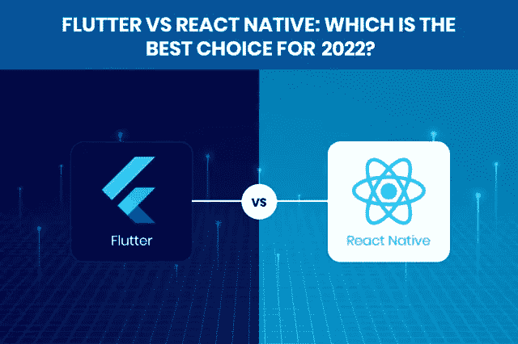
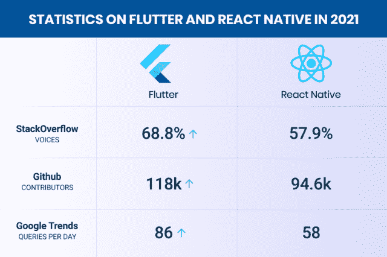
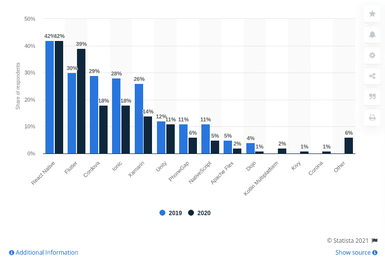
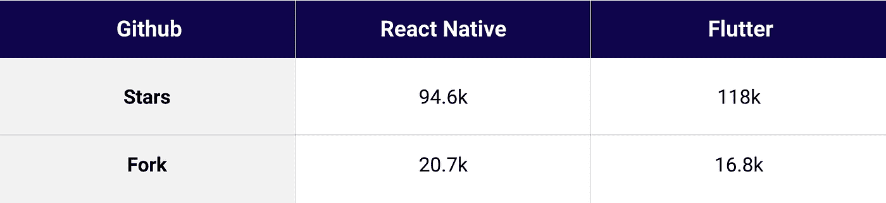
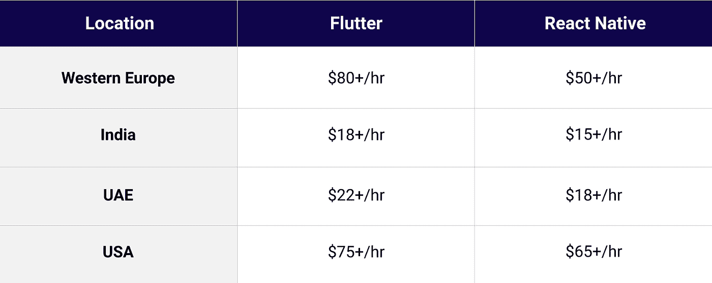
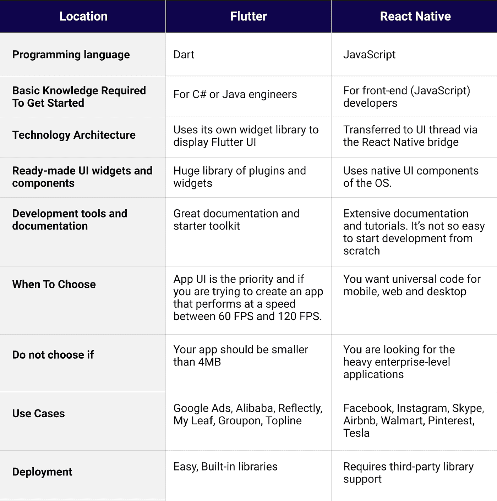

# flutter vs React Native:2022 选择哪个最好？

> 原文：<https://javascript.plainenglish.io/flutter-vs-react-native-which-is-the-best-choice-for-2021-e695e79c6707?source=collection_archive---------0----------------------->

计划在 2022 年实现快速响应？但是不确定应该选择哪种技术来快速开发应用程序，同时降低成本？如果你对这两个问题的答案都是肯定的，那么你就只剩下两个主要的选择了:扑动或者自然反应！

但是，对于跨平台应用程序开发来说，哪种技术是最好的选择仍然是一个亟待解决的问题！

虽然互联网上有大量的信息可以向您解释每种技术的基本原理、优点和缺点。但是，您将如何比较所有这些优点和缺点，以决定哪种技术最适合您的应用程序开发需求呢？

一个大问题！

凭借使用这两种技术的经验，我可以帮助您在这两种最流行和最常用的技术之间划清界限，以构建跨平台的移动应用程序。

现在是 2022 年，疫情的影响导致移动应用需求激增。

[***“根据调查报告***](https://www.statista.com/statistics/269025/worldwide-mobile-app-revenue-forecast/) ***，移动应用已经产生了 5819 亿美元的收入，预计到 2023 年将产生 9350 亿美元的收入。”***

通过这种统计分析，所有垂直行业的企业都在用户的手机中为自己开拓空间。

企业迫切需要创建一个快捷的移动应用程序，以便为个人客户提供全面和定制的解决方案，这促使他们寻找跨平台的应用程序开发解决方案。但是，为什么不是原生的 iOS 和 Android 应用呢？

由于本地应用程序的开发非常耗时且成本高昂，因此跨平台应用程序开发的概念近年来获得了发展势头，对跨平台应用程序开发公司的需求也在增加。在过去的几年里，Flutter/React native 一枝独秀，成为社区最受欢迎的流行语。

跨平台应用程序的开发速度更快，因为它使用相同的代码库来创建可以在多个平台上无缝运行的应用程序。但是不同的跨平台应用开发框架提供了不同的特性和优势。因此，利用我在使用 Flutter 和 React Native 进行应用程序开发方面的经验，我试图在常见的笔记上比较这些领先的技术或框架，以帮助您了解在什么情况下什么选项会适合您的需求。

## **颤振与反应原生:并排比较**

在您深入研究 Flutter 与 React 原生比较之前，有必要知道这两个框架都是构建跨平台移动应用程序的首选。但是，有时做出正确的决定取决于对业务用途的看法。

## ***所以这里有几个重要的参数，我已经选择了比较:***

*   *Flutter Vs React Native:谁在背后支持？*
*   *颤振与反应本地:实际统计数据的市场份额*
*   *Flutter Vs React Native:最受喜爱和欢迎*
*   *Flutter Vs React Native:Dart Vs JavaScript*
*   *Flutter Vs React Native:技术架构*
*   *颤振与反应原生:性能*
*   *Flutter Vs React Native:易于采用和社区支持*
*   *Flutter Vs React Native: UI 组件和定制*
*   *Flutter Vs React Native:代码可维护性*
*   *Flutter Vs React Native:开发人员的每小时成本*
*   *信息图对比做出最终决定*
*   *结论:游戏的赢家！*

让我们一个一个开始，详细了解每一点！

## **1。颤振 Vs 反应原生:谁在背后支持？**

***结论:*** *这两个框架都是由业界最大的科技巨头谷歌和脸书分别制定和支持的，所以它们都将留在未来。*

谷歌的宝贝，2017 年推出的 Flutter，是一个高级的应用软件开发工具包(SDK)，由所有的小部件和工具组成，让你的开发过程更容易、更简单。小部件的广泛选择使开发人员能够使用单一代码库轻松构建和部署视觉上有吸引力的本机编译应用程序，用于多种平台，包括移动、web 和桌面。因此，有更好的机会，颤振应用程序开发公司可以确保你更快，更快，更可靠的 [**应用程序开发解决方案**](https://www.xicom.ae/services/mobile-app-development/) 。但是这种说法有多真实呢？下面就用它的特点来评价一下吧。

## **下面是颤振的快速卖点:**

*   它是免费和开源的。
*   该架构基于流行的反应式编程，因为它遵循与反应式相同的风格。
*   多亏了 widget 体验，Flutter 应用程序有一个令人愉快的 UI，可以转化为外观和感觉都很棒的应用程序。

React Native 也是脸书在 2015 年推出的跨平台原生移动应用开发框架。React Native 主要使用 JavaScript，在使用相同代码库为 iOS 和 Android 开发应用程序时非常方便。此外，它的代码共享特性可以加快开发速度，减少开发时间。像任何其他跨平台技术一样，Flutter 允许您使用相同的代码基础来构建单独的应用程序，因此，react 本机应用程序更容易维护。

## **让我们快速浏览一下 React Native 的特性:**

*   React Native 包括一个热重新加载功能，通过允许开发人员在运行的应用程序中直接添加或更正代码，而不必保存应用程序，从而加速开发过程。
*   React Native 基于一种非常流行的语言——JavaScript，许多开发人员已经很熟悉了。
*   React 组件包装现有的本机代码，并通过 React 的声明式 UI 范式和 JavaScript 与本机 API 进行交互。React Native 的这一特性让开发人员的工作速度大大提高。

## **2: Flutter Vs React Native:真实统计的市场份额**

**结论:**在总结 2019 年和 2020 年全球软件开发公司使用的最佳[跨平台移动应用开发框架](https://www.statista.com/statistics/869224/worldwide-software-developer-working-hours/)时，结果是 42%的开发者更喜欢使用 React Native，而 39%的开发者选择了 Flutter。

但是不同的市场报告有不同的数据来揭示你。但是在你开始寻找 [**招聘 flutter 应用开发者**](https://www.xicom.ae/services/hire-cross-platform-app-developers/) 之前，有必要评估一下真实的市场数据，以便做出明智的决定。

**市场趋势#1:** 根据 [StackOverFlow](https://insights.stackoverflow.com/survey/2020) 的数据，68.8%的开发人员喜欢使用 Flutter 进行进一步的开发项目，而 57.9%的开发人员对使用 React 原生技术进行应用程序开发更感兴趣。

**市场趋势#2:** 根据[谷歌趋势](https://trends.google.com/trends/explore?q=Flutter,React%20Native)，通过过去 12 个月的分析，Flutter 正在引领市场并击败 React Native。

**市场趋势#3:** 尽管是一个年轻的框架，但 Flutter 在 [Github](https://github.com/flutter) 上拥有 168000 名成员和 118000 名明星。而 React Native 有 [20.7k 叉和 94.6k 星](https://github.com/facebook/react-native)。

## **3。Flutter Vs React Native:最受喜爱和流行的框架**

***结论:*** *两者都是年轻的跨平台应用开发框架，都有谷歌和脸书的支持，很明显，随着时间的推移，两者都会受到欢迎和喜爱。但如果考虑到 2019 年同样的 Github 知识库调查，旋舞已经采取了势头与* [*118k 颗*](https://github.com/flutter) *超过* [*94.6 颗*](https://github.com/facebook/react-native) *的反应原生。*

[Image Source](https://www.statista.com/statistics/869224/worldwide-software-developer-working-hours/)

回到故事的另一面，[根据 Statista](https://www.statista.com/statistics/869224/worldwide-software-developer-working-hours/) 的说法，React Native 已经是 42%的全球开发者的选择，而在 2020 年有 39%的开发者在使用 Flutter。但是如果你比较一下这两个框架的增长，那么 Flutter 在一年内已经从 30%的开发者跃升到 39%,并且有望在不久的将来统治这个行业。

## **4。flutter Vs React Native:Dart Vs JavaScript**

***结论:*** *Flutter 基于 Dart，而 React Native 使用的是已经统治 IT 行业很久的 JavaScript，迎合了后端开发过程中的重要角色。但这并不意味着你低估了 Flutter 的编程语言。让我们学习如何！*

Flutter Vs React Native，2022 年移动 app 开发哪个最好？这是开发人员最常见的问题之一。框架的选择主要取决于技术所基于的编程语言，因为您需要进一步评估该编程语言的复杂程度或灵活性。

Dart 是 2011 年推出的一种更新的语言。但作为谷歌的内部编程语言，它还有很大的使用空间。此外，由于它是一种新的编程语言，所以跨平台应用程序开发公司可以在应用程序开发解决方案中利用它的现代性。

其次，这种语言比 JavaScript 快两倍，同时具有超前(AOT)和实时(JIT)编译器。如遇颤振，需要 [**聘请 app 开发者**](https://www.xicom.ae/solutions/hire-developers/) ，熟悉 Java 或 C++。但另一方面，JavaScript 是 React 本地移动应用开发的开发者社区中最受欢迎的语言之一。因此，如果任何人知道 JavaScript 已经可以很容易地学习 React 并开始应用程序开发。

## **5。Flutter Vs React Native:技术架构**

**结论:**如果从技术上来说，Flutter 是一个高级的 SDK，它提供了一个分层的架构来确保高度的定制化，其中 React Native 依赖于其他软件来构建 React 组件，并使用 JavaScript 来桥接与本机模块的连接。即使发生微小的变化，网桥也会影响性能，而 Flutter 可以在没有网桥的情况下管理一切。

Flutter 有一个分层的架构，为简单快速的用户界面定制铺平了道路。据信，它可以让你完全控制屏幕上的每个像素，并允许移动应用程序开发公司集成叠加和动画图形、文本、视频和控制，而没有任何限制。

在比较 Flutter 与 React Native 的优缺点时，性能和技术架构是组织评估应用程序的业务增长和进一步可伸缩性的最大关注点。

## **6。颤振 Vs 反应原生:性能**

***结论:*** *在质疑自己的时候，哪种框架适合你，那么 2022 年业绩可以成为你最大的决策驱动因素。在比较这些框架的性能时，Flutter 比 React Native 占了上风。*

不管你是从 MVP 开始还是从高级应用程序结构开始，选择 [**雇佣一个移动应用程序开发人员**](https://www.xicom.ae/services/mobile-app-developers/) 总是有意义的，他们在确保高性能的技术方面工作，使你在这个蓬勃发展的行业中获胜。

在技术方面，Flutter 被编译成 ARM 或 x86 本地库，这使得它的速度大大加快，并增加了相对于其他产品的优势。另一方面，React Native 没有编译成本机代码，仍然有 JavaScript 层，这使得它的性能不如 Flutter。

## 7。Flutter Vs React Native:易于采用和社区支持

***结论:*** *说到构建企业应用，社区支持是必须检查的因素。React Native 和 Flutter 已经在行业中发展了多年，并带来了最新的技术更新。*

随着每个增量版本和技术更新，社区中对框架的兴趣和需求逐渐增加。当涉及到社区参与时，让我们了解两个框架之间的情况。

> React Native 于 2015 年推出，其社区一直处于增长阶段，Github 上该框架的贡献者数量就是证明。尽管年轻且更新，但 Flutter 正在迅速接管这个行业。

## **8。Flutter Vs React Native: UI 组件和定制**

***结论:*** *由于 Flutter 自带一套 UI 组件和小部件，而 React Native 只提供一个基本的小部件盒子，因此，Flutter 提供了更好的 UI 定制，并使其跨平台一致。*

从框架发布之初，Flutter 就以其漂亮的 UI 原生小部件而闻名，这些小部件由框架的图形引擎渲染和管理。此外，它还支持开箱即用的材料设计。你所需要做的就是 [**雇佣应用程序开发人员**](https://www.xicom.ae/solutions/hire-developers/) ，他们在使用 Flutter 方面有着出色的技能，可以使用预制的小部件创建大部分视图，这些小部件可以轻松地满足项目的需求。

另一方面，React native 提供了适应平台的基本工具，如按钮、滑块、加载指示器等等。但是 React Native 提供了许多第三方组件，可以帮助您定制该应用程序令人愉快的 UI。

## 9。颤振 Vs 反应原生:代码可维护性

***结论:*** *无论你开发了一个多么辉煌的 app，要想让它流畅运行，不断的升级调试是必须的。与 Flutter 相比，用 React Native 维护代码真的很难。*

在 React Native 中，当您分叉代码以适应您的应用程序时，它会干扰框架的逻辑，从而减慢开发过程。此外，在 React 本机应用程序中，大多数本机组件都依赖于第三方库，因此维护这些过时的库确实是一项具有挑战性的任务。

在 Flutter 的情况下，维护代码要容易得多，因为代码非常简单，允许移动应用程序开发人员轻松发现问题，获得外部工具和支持-第三方库。

此外，与使用 React Native 的热重新加载功能相比，在 Flutter 中发布高质量更新和立即更改应用程序所需的时间表现更好。

## 10。Flutter Vs React Native:开发者的每小时成本

***结论:*** *无论你是一家初创公司还是领先的企业家，开发者的每小时成本永远是你严重关注的问题。因此，当你选择雇佣 react 本地开发公司或 Flutter 应用工程师时，你可能会想知道他们的费率，不同的地点有不同的小时费率。让我们检查一下！*

无论是为了 Flutter 还是 React Native，在雇佣应用程序开发人员时，都需要考虑许多因素，如经验、专业知识、项目处理等，以评估开发人员的实际小时成本。但在所有因素中，开发商的位置是最重要的因素，可以带来每小时成本的巨大变化。

如果您仍然不确定何时为开发项目选择 Flutter 或 React Native，那么最好快速浏览一下 Flutter 与 React Native 之间的信息图比较:

# **结论**

开发跨平台应用程序，Flutter 和 React Native 都是主流技术，因为它们都有一些特殊的功能，如实时刷新或用适应性软件构建图形用户界面。框架的选择主要取决于项目需求，不同的项目类型需要不同的优势。因此，宣布一个获胜者意味着超越一个领先框架的品质，这实际上没有任何意义。

此外，您可以与 [**移动应用程序开发公司**](https://www.xicom.ae/services/mobile-app-development/) 合作，分析您的项目需求，并在为您的项目选择任何框架之前向专业程序员寻求有价值的建议。他们将他们最好的专业知识带到项目中，使您能够用最适合的方法构建应用程序。因此，不要浪费您在称重框架方面的努力，因为专家拥有根据项目需求实施合适技术的最佳知识。

*更多内容看* [***说白了. io***](http://plainenglish.io)