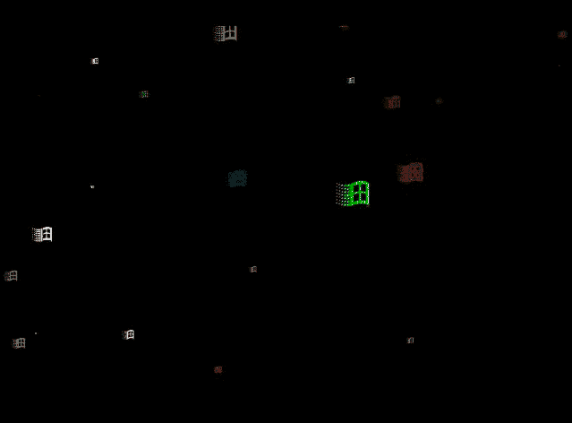
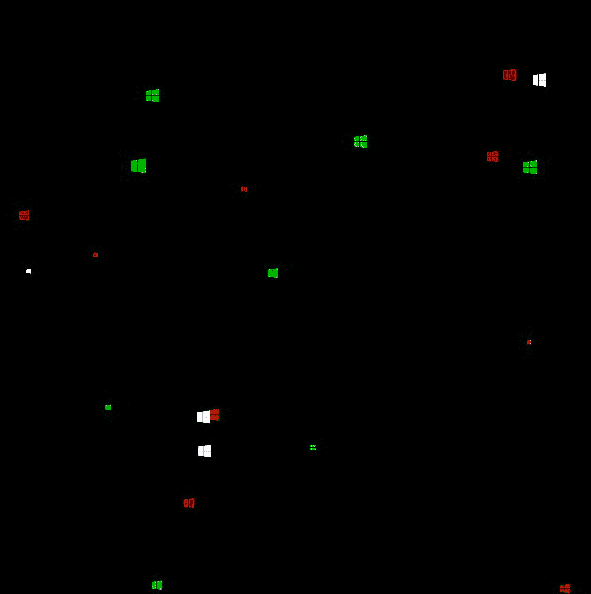
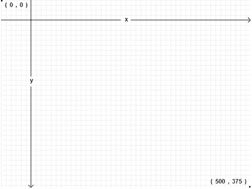
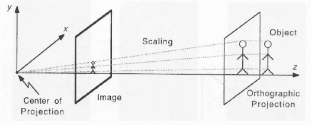
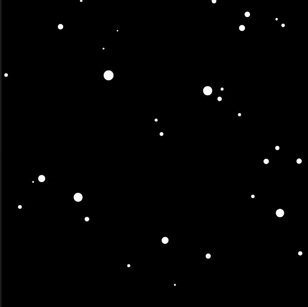
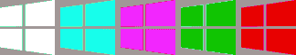

# 我用 JavaScript 重新创建了“飞行窗口”屏保

> 原文：<https://javascript.plainenglish.io/flying-windows-screensaver-in-javascript-6682c9244916?source=collection_archive---------7----------------------->

## 使用 p5.js 库创建

我将向您展示如何使用名为 **p5.js** 的库在画布上创建 3D 效果。我看了一些演示这个库的用法的视频，我还发现这个[编码挑战](https://www.youtube.com/watch?v=17WoOqgXsRM&feature=emb_logo)(创建星域)正在处理中。我决定用 JavaScript 重写，然后稍微改进一下。你还记得旧的 Windows 屏保吗？其中一个是这样的:



old Windows screensaver

上面的动画是基于星际模拟，或[曲速驱动](https://en.wikipedia.org/wiki/Warp_drive)。我们可以看到飞行的窗户，而不是“星星”。让我们重新创建这个，但是使用最新的 Windows 徽标，所以结果看起来像这样。



flying Windows logo created in p5.js (**Check out the** [**DEMO**](https://editor.p5js.org/miresk/sketches/DzxMND-Rw))

# P5.js

p5.js 是一个用于创造性编码的 JavaScript 库，致力于使艺术家、设计师、教育工作者、初学者和其他任何人都可以访问和包容编码！

它是处理的[的 JavaScript 实现，这是一个灵活的软件 sketchbook 和一种用于学习如何在视觉艺术的环境中编码的语言。入手非常容易，因为还有一个在线的](https://processing.org/) [p5.js 编辑器](https://editor.p5js.org/)。当您打开它时，您将只看到 3 个文件:

*   index.html
*   草图. js
*   style.css

Index.html 链接了这个库，sketch.js 是我们将要使用的文件。默认情况下，它包含两个主要功能:

**setup()** 用于初始化，只运行一次，而 **draw()** 函数重复运行，用于动画。这就是你现在需要知道的关于 p5.js 的全部内容。

# 视窗模拟曲速驱动

曲速引擎基本上意味着超光速旅行，你可能在《星际迷航》系列中对它很熟悉。我们想创建窗口而不是星星，所以让我们先创建几个变量。

然后在 setup()函数中，我们可以遍历窗口的数量，并用新创建的窗口对象填充数组。

窗口对象是什么样子的？让我们用类来定义它

窗口有几个属性: **x** 、 **y** 、 **z** (坐标)和 **pz** ，是之前的 z 位置。**宽度**和**高度**是定义画布尺寸的系统变量。

[**Random()**](https://p5js.org/reference/#/p5/random) 函数返回一个随机浮点数，我们用它在屏幕上随机重新分配我们的窗口(x，y，z)。

## 更新()

还有 *update()* 函数我们可以看看:

只是这里发生了一些事情。

在画布中，“x”和“y”从左上角开始。



[Canvas coordinates system](https://diveinto.html5doctor.com/canvas.html)

即使我们没有启用 WEBGL (3D)模式，我们也有“z”坐标。我们想模拟轴上的运动。在 *update()* 函数中，我们通过减去速度来更新坐标，这样物体看起来会向我们走来。

```
this.z = this.z - speed;
```

如果“z”小于 1，则对象在画布之外，因此我们重置坐标。

## 显示()

在 *show()* 函数中我们有:

丹尼尔·希夫曼在他的[源代码](https://github.com/CodingTrain/website/blob/main/CodingChallenges/CC_001_StarField/Processing/CC_001_StarField/Star.pde)的注释中解释了上述内容:

> *有了这些“地图”，我得到了新的恒星位置
> 除法 x / z 得到了一个介于 0 和一个非常大的数之间的数，
> 我们在 0-宽度/2 的范围内映射这个数(按比例映射到 0-1 的范围内)。
> 通过这种方式，我们可以确定新坐标“sx”和“sy”在每一帧移动得更快，并且它们在画布外完成了它们的行程*

我想在这里指出两点:

*   [**map()**](https://p5js.org/reference/#/p5/map) 函数将一个数字从一个范围重新映射到另一个范围。

```
map(value, start1, stop1, start2, stop2)
```

*   **x/z 和 y / z 的划分**代表弱透视投影方程。换句话说，将世界空间坐标(x，y，z)转换到屏幕空间(u，v)

```
u = x / z; 
v = y / z;
```



[Weak Perspective Projection](https://www.cse.unr.edu/~bebis/CS791E/Notes/PerspectiveProjection.pdf)

## 绘制()

现在我们可以更新主 draw()函数:

我们遍历窗口数组，并在每个对象上调用我们之前定义的函数。您应该看到这个:



快到了！但是我们想要窗户！

## [加载图像](https://p5js.org/reference/#/p5/loadImage)

我下载了 Windows 徽标，并准备了几种不同的颜色:



Windows logos

我们需要创建一个 *preload()* 函数，并创建一个新变量 *imgs*

我准备了 5 张图片，给它们起了相同的名字，加上了数字后缀，这样很容易在循环中加载它们。现在我们可以向构造函数添加另一个属性，在这里我们可以再次使用 random 函数。我们在那里传递一个数组，所以会选择一个随机的图像变量。

> *注意:我尝试用*[*【tint()*](https://p5js.org/reference/#/p5/tint)*函数改变图像的颜色，而不是创建几个图像，但是性能受到了很大的影响。*

然后，我们只需将 *show()* 函数中的 *ellipse()* 替换为图像()，如下所示:

```
image(**this.img**, sx, sy, r, r);
```

耶！我们重新创建了 Windows 屏保。不过，我觉得好像少了点什么。

## 加载(错误)声音

我想循环播放 windows 错误声音，就好像飞出屏幕的 Windows 正在制造错误一样。P5 有一个额外的库叫做 **p5.sound.js** ，我们可以用它来做这件事。

我们只需像这样更新预加载函数:

并更新主 setup()函数:

做得好，你应该会得到这个 [**结果**](https://editor.p5js.org/miresk/sketches/DzxMND-Rw) 。

感谢您的阅读！

[](https://miro.substack.com/) [## 是米罗的错！

### 关于 web 前端技术的时事通讯

miro.substack.com](https://miro.substack.com/)