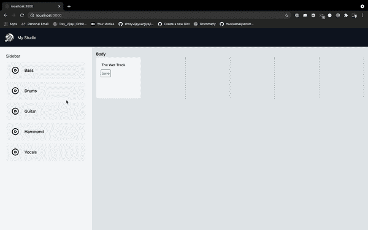

# 在 Web 应用程序中开发拖放功能

> 原文：<https://javascript.plainenglish.io/forget-the-browser-drag-drop-api-this-library-is-perfect-to-add-drag-and-drop-feature-f2a1a9e7d8e3?source=collection_archive---------5----------------------->

## 与“反应 DnD”合作，为您的网站添加拖放功能


Demo of the project we will be developing

# 在后台

去年，我致力于 web 应用程序中的拖放功能，那时候，我使用简单的浏览器 API 来创建两个组件拖放组件，并使用浏览器拖放 API 手动处理每一种情况。

我并不讨厌这个 web API，但是为了开发一个简单的项目，必须编写大量的代码，并且必须覆盖边缘案例。

今年我得到了一个项目，一个现实世界的问题，解决方案是向用户提供拖放功能。我不想回到那些 Web API，因为这一次项目稍微大了一点，在添加拖放功能的同时要处理很多情况。

我知道从头开始开发每件东西会让高度可伸缩的解决方案更有优势，但有时需要花费时间和大量精力。所以在寻找替代者后，我找到了一个，最好的，反应 DnD。

# 概观

今天我们将与[**react and**](https://react-dnd.github.io/react-dnd/docs/overview)图书馆合作。这使得添加拖放功能变得非常简单。出于样式和 SSR 的目的，我将再次使用 Next JS 和 Tailwind CSS。添加链接以创建您自己的安装信息库。

[](https://medium.com/nerd-for-tech/2-minute-2-steps-for-installing-tailwind-css-in-react-8dd420d81647) [## 在 React 中安装 Tailwind CSS 需要 2 分钟和 2 个步骤

### 在下一个 JS 项目中开始使用 Tailwind CSS

medium.com](https://medium.com/nerd-for-tech/2-minute-2-steps-for-installing-tailwind-css-in-react-8dd420d81647) 

克隆存储库后，安装 reactor DnD 软件包。

```
yarn add react-dnd react-dnd-html5-backend
```

您需要 **HTML5** 后端包作为浏览器依赖和兼容性。

# 反应 DnD 原料药

为了执行拖放功能，反作用 DnD 提供了两个高阶组件(ad)，一个是拖放，另一个是拖放。每个拖放组件都是可以拖动的组件，而单个拖放组件是收集这些拖动组件的组件。

为了执行拖放反应，DnD 提供了钩子，一个可重用的函数如下-

*   **使用拖动**-使用类型帮助拖动元素及其内容
*   **useDrop**-使用类型帮助收集被拖动的元素及其内容
*   **监视器**-帮助存储道具并将道具传递给被拖动的元素和掉落的组件。
*   **收集器** —不言自明，收集器帮助收集被拖动元素的细节。
*   **ItemTypes** —每个被拖动的元素都应该用被拖放的组件容易识别的类型来定义。

# 反应 DnD 逻辑

反应 DnD 在引擎盖下使用 Redux。您有 2 个组件，例如-

*   **拖动源** —包含待拖动元素或可拖动元素的组件。
*   **Drop Targets** —组件收集并呈现拖放到其中的元素。

Redux 用于将元素从拖动源转移到拖放目标，并且拖放目标通常不会在元素被拖放后改变状态，这意味着拖放目标不会在元素被拖放后重新呈现。

# 理解建筑

我画了一个图像，让你理解 DnD 遵循的架构反应，并在编写代码时执行。


# 编写代码

我们将创建一个简单而基本的例子，从元素列表中拖动一个元素，并将它们放到拖放目标中。

在 modules 文件夹中，我们将定义一张卡作为我们的可拖动卡，这意味着我们可以拖动这张卡。为了使这张卡可以拖动，我们将使用一个挂钩。

我们简单的卡代码看起来像这样-

我们已经使用了 ItemTypes 来定义 useDrag API 中的卡类型。所以 ItemTypes 是标识被拖动的项的方法。反应 DnD 不玩浏览器节点或元素，它只是记录元素作为一个对象。一旦在拖动源中设置了项目类型，我们就可以在接受它之前收集并确保拖放目标中的项目类型。当你有 2 张卡和 2 个放卡的地方时，这个功能更有用，特别是在棋盘的情况下。在拖放之前，我们总是检查拖放目标中拖动的项目类型。

一旦使用项目类型拖动并定义了项目，我们就可以仅使用项目类型在拖放目标中收集项目及其属性。将此项目类型视为区分对象的单个 id。

```
export const ItemTypes = {
  CARD: 'card',
};
```

所以我们的项目已经准备好拖动，我们现在可以简单地拖动项目。

对于拖放目标，我创建了一个组件来收集元素及其属性，比如名称和 id。

在我们的项目中，我们有 5 个拖放目标，每个拖放目标接受并呈现拖放的项目。为了收集拖放目标中的拖动项，我们将使用 useDrop 钩子。

在 useDrop hook 中，我们首先使用我们在可拖动卡中使用的相同项目类型来定义接受的项目类型。然后，我们简单地使用 useDrop 的 hover 方法，一旦用户将项目悬停在拖放目标上，hover 方法就会被调用，我只是简单地更改相应拖放目标的背景颜色。

现在我们需要在应用程序中使用这些拖放目标和可拖动的卡片。

我创建了一个侧边栏和一个主体组件。侧边栏有所有需要拖动的可拖动组件，主体有拖放目标。


Current page with sidebar and body

在正文中，我们有 5 个拖放目标，所以每个拖放目标必须被映射，并且创建了 5 个不同的拖放目标。每个拖放目标都有定义的悬停属性，一旦项目被拖放，每个拖放目标都会呈现项目名称。



Final product gif

# 摘要

*   我们首先创建一张卡片，并使用 useDrag hook 将其设置为可拖动
*   在 useDrag hook 中，我们定义了单卡的类型，并设置了它的属性，如 name。
*   然后，我们创建一个单一的拖放目标元素，它将通过使用 useDrag API 检查相应的条目类型来接受被拖放的元素
*   然后，所有拖放目标在 body 组件中映射在一起
*   一旦项目被悬停在拖放目标上，相应的拖放目标背景颜色将会改变。

```
Code repository => [https://github.com/shreyvijayvargiya/iHateReadingLogs/tree/main/TechLogs/WorkingWithReactDnD](https://github.com/shreyvijayvargiya/iHateReadingLogs/tree/main/TechLogs/WorkingWithReactDnD)
```

下次再见，祝大家愉快。

[](https://shreyvijayvargiya26.medium.com/make-a-habit-not-goals-430cef847c5d) [## 养成习惯而不是目标

### 我已经开始养成习惯，一个每天都在延续的习惯，而不是目标。

shreyvijayvargiya26.medium.com](https://shreyvijayvargiya26.medium.com/make-a-habit-not-goals-430cef847c5d) [](https://medium.com/nerd-for-tech/3-minute-roadmap-to-master-the-next-js-in-2021-e022fee244b0) [## 掌握 2021 年下一个 JS 的 3 分钟路线图

### 2021 年掌握下一个 JS 的完整指南

medium.com](https://medium.com/nerd-for-tech/3-minute-roadmap-to-master-the-next-js-in-2021-e022fee244b0) [](https://shreyvijayvargiya26.medium.com/there-are-high-chances-that-redux-will-be-replaced-98f1c469bcce) [## redux 很有可能被取代

### 看看 redux 的竞争对手，redux 很有可能在未来被取代。

shreyvijayvargiya26.medium.com](https://shreyvijayvargiya26.medium.com/there-are-high-chances-that-redux-will-be-replaced-98f1c469bcce) 

*更多内容看*[***plain English . io***](http://plainenglish.io)