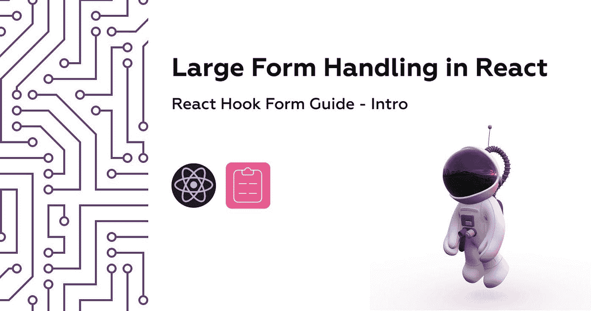
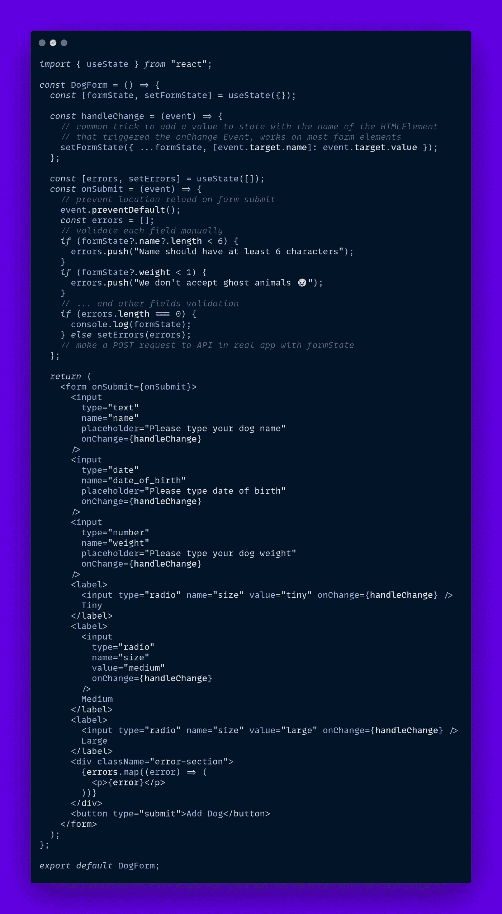
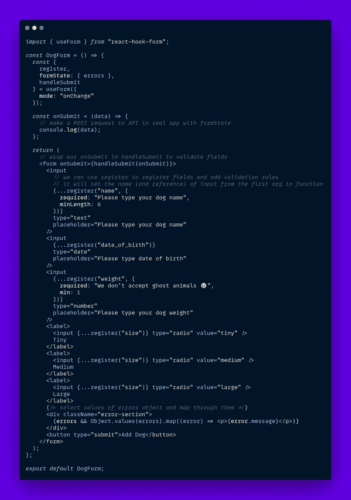
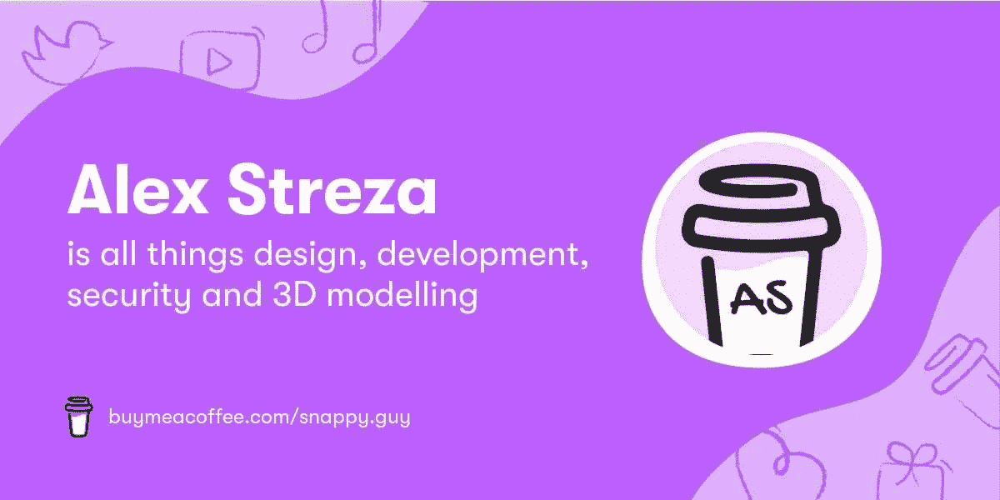

# 在 React 中像专业人员一样处理表单

> 原文：<https://javascript.plainenglish.io/form-handling-in-react-9e605416f1af?source=collection_archive---------14----------------------->

## React Hook 表单指南—简介

每个前端开发人员都会在他们的旅程中的某个时刻编写一个大得不像话的表单，并且经常花无数个小时质疑它们的存在。序列化字段、错误处理、验证、字段交互和显示/隐藏切换是每个 web 开发人员职业生涯的祸根，但它不一定是这样的。

在这篇文章中，我将展示 react-hook-form 相对于无库方法的优势，在以后的文章中，我将涉及更多高级主题，如嵌套表单、向导表单以及与第三方库的集成。

让我们为一个宠物商店网站写一个普通的(经典的)[反应](https://reactjs.org/)表单，在那里你可以为你的宠物找一个保姆🐶你不在时的朋友。

这对于较小的表单很有效，但是随着表单的扩展，必须添加字段验证和手动处理错误会变得非常麻烦。

## 🥁…，请敲鼓

# 介绍[反应钩形态](https://react-hook-form.com/)

我知道还有很多其他的表单管理库，但是我个人更喜欢使用 react-hook-form，比如像 [Formik](https://formik.org/) 、 [redux-form](https://redux-form.com/) 或 [react-final-form](https://final-form.org/react) ，因为它的钩子 API 很简单。

钩子在可重用性方面很棒，并且只要求你在某个组件中想要的功能数量，而反作用钩子形式的钩子正是这样做的。

让我们使用 react-hook-form(版本 7)钩子来转换后者，并对它们的有效性保持敬畏:

通过允许 react-hook-form 管理状态和验证字段，我们以一种更容易理解的方式实现了同样的事情，对于任何刚接触我们项目的人来说都是如此。

要了解更多关于 useForm hook 和更多特性，请查看令人惊奇的 [react-hook-form 文档](https://react-hook-form.com/api/useform/)。

我将在未来编写另一部分，为**嵌套表单**、**向导表单、**以及**第三方组件**使用高级反应挂钩表单策略，敬请关注🚀。

如果你想检查本文中的代码，这里是 [CodeSandbox](https://codesandbox.io/s/react-hook-form-hjb5w?file=/src/App.js) 。

> 我希望你喜欢这个 React 中现代形式的简短指南，如果你给它一个🦄！

如果你想支持我在发展领域的努力，你可以帮我买一只毛茸茸的🐶。

## 进一步阅读

 [## 如何构建自己的调查并使用定制的 JavaScript 扩展它们

### 这是一本关于如何使用自己的 JS 函数来扩充 SurveyJS 附带的条件逻辑和验证器的入门书。

javascript.plainenglish.io](/how-to-build-your-own-surveys-extend-them-with-custom-javascript-b4c7eb5648c4) 

*更多内容看* [***说白了。报名参加我们的***](https://plainenglish.io/) **[***免费周报***](http://newsletter.plainenglish.io/) *。关注我们关于* [***推特***](https://twitter.com/inPlainEngHQ)[***LinkedIn***](https://www.linkedin.com/company/inplainenglish/)*[***YouTube***](https://www.youtube.com/channel/UCtipWUghju290NWcn8jhyAw)*[***不和***](https://discord.gg/GtDtUAvyhW) *。*****