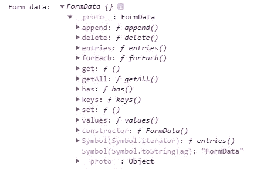
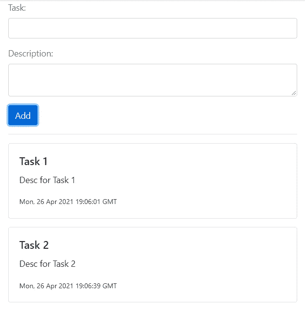

# 什么是 FormData 接口？

> 原文：<https://javascript.plainenglish.io/formdata-interface-fe86ec02e01f?source=collection_archive---------7----------------------->

## 它是什么以及如何与 React 一起使用。


根据 [MDN](https://developer.mozilla.org/en-US/docs/Web/API/FormData) 的说法，FormData 是一个“接口(它)提供了一种方法来轻松地构造一组表示表单字段及其值的键/值对”。它是一个简单的数据结构，保存对应于 HTML 表单的键/值对。因此，它有一个构造函数 `FormData()`和[几个方法](https://developer.mozilla.org/en-US/docs/Web/API/FormData#methods)，用于操作收集的数据。



Methods available to FormData interface

对于任何开发人员来说，在 React 中处理表单都是一项众所周知的艰巨任务。代码很容易被破坏，理解它变得很困难。以至于引入了几种解决方案( [Formik](https://jaredpalmer.com/formik) 是最流行的)。

在 ReactJS 中管理表单时，FormData 可以增加代码的清晰度。

## 简单待办事项列表

让我们构建一个简单的待办事项列表，从 [create-react-app](https://reactjs.org/docs/create-a-new-react-app.html) 开始，利用 react 钩子，使用 FormData 接口。我们还利用 [react-bootstrap](https://react-bootstrap.github.io/getting-started/introduction) 库，准备好使用 css 类。

## 创建组件

对于我们的待办事项列表，我们需要几个组件:

*   待办事项列表
*   AddTodo -用于将待办事项添加到列表中的表单

这两个组件都应该被导入到你的主 **App.js** 文件中。

## ToDos.js

在`/components`文件夹下，添加 ToDo.js，代码如下:

它包含一个 todo 组件，外加一个 Todo 列表(Todos)。

## AddTodo.js

这是一个利用 FormData 接口的组件。

在第 8 行，我们创建了一个新的 FormData 对象:

`const formData = new FormData(e.target);`

然后在从 App.js 传递的`addTodo`方法中使用它(第 12–16 行)。

```
addTodo({
  text: formData.get('text'),
  description: formData.get('description'),
  createdOn: new Date().toUTCString()
});
```

## App.js

最后，App.js 将所有这些整合在一起:

注意，在第 6 行，我们使用解构(用 [useState](https://reactjs.org/docs/hooks-state.html) hook)，稍后(第 11 行)，我们使用`updateTasks()`函数将一个新任务添加到现有的待办事项列表中。

整个应用程序应该是这样的:



## 摘要

*   FormData 是一个很好的内置 JS 接口，用于管理表单数据。
*   它简化了 HTML 表单的处理。
*   FormData 是 JS 的一个核心特性，是现成可用的，所以它可以用于所有流行的 JS 框架。
*   它还可以用于更复杂的场景，比如[获取异步数据](https://javascript.info/formdata#sending-a-form-with-blob-data)

## 资源

*   https://developer.mozilla.org/en-US/docs/Web/API/FormData
*   【https://javascript.info/formdata 
*   [https://reactjs.org/docs/forms.html](https://reactjs.org/docs/forms.html)
*   [https://www.techiediaries.com/formdata/](https://www.techiediaries.com/formdata/)
*   [https://www.valentinog.com/blog/form-data/](https://www.valentinog.com/blog/form-data/)

我希望这篇文章对你有用。谢谢，祝您愉快！

[*更多内容尽在 plainenglish.io*](http://plainenglish.io/)