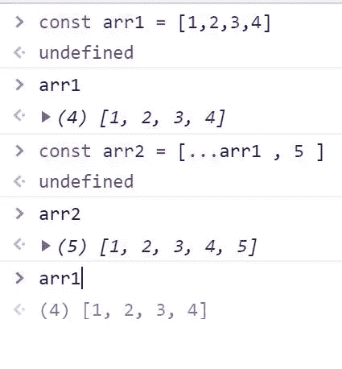
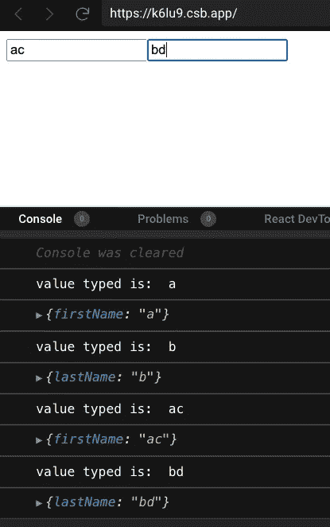

# 与钩子反应的形式

> 原文：<https://javascript.plainenglish.io/forms-in-react-with-hooks-809a3f38ed4?source=collection_archive---------6----------------------->

## 编程、前端、反应

## 如何使用扩展运算符和钩子来处理 React 中的表单


在[之前的教程](/react-component-props-and-state-734d36d52610)中，我们学习了 React 的基础知识以及如何使用钩子来改变状态。本教程将从这里继续，在这里我们将看到如何使用钩子来更新 reactor 中的表单。

然而，在继续之前，我想介绍一个将在您将要构建的大部分 React 应用程序中使用的主题。这个话题已经传开了，接线员。

## 扩展运算符(…)

假设您有一个数组，arr1，您想在不影响 arr1 数组的情况下将 5 加到这个数组中。

```
const arr1= [1,2,3,4]
```

现在你想在最后加 5。我们可以使用 push()方法，但是这会改变 arr1 数组。我们在这里可以做的是创建第二个数组 arr2，并存储其中的所有元素，最后加上 5。我们可以在 JavaScript 中使用扩展运算符来实现这一点。



## 添加联系人应用程序

这一部分将展示如何使用钩子在 reactor 中使用表单。如何使用扩展运算符在输入表单中正确显示用户提供的值。

在这个应用程序中，我们将使用 React useState 钩子将一个人的名字和姓氏添加到联系人列表中。将会有一个表单，有两个名字和姓氏输入，以及一个添加这些名字的按钮。

**App.js**

```
export default function App() {**const [inputValue, setInputValue] = useState({firstName:"",lastName:""})**function handleChange(){}
return (<div> <form> <input placeholder="first name" name = "firstName" value ={inputValue.firstName} onChange = {handleChange} /> </form></div>);
```

# 更新输入状态

因此，首先我们在表单中添加了一个名为的输入字段。我们也会对姓做同样的处理。在我们的状态下，我们使用 useState 来获取用户输入值并在屏幕上显示。

***注意*** *:按照惯例，我们使用了输入值和设置输入值的数组。请始终记住，输入值是一个对象(或者可以是一个布尔值、数字或字符串)，而设置输入值始终是一个会改变输入值的函数。*

`handleChange`功能处理输入值的变化。不管你在盒子里打什么，它都会盯着你。借助`handleChange`功能，我们可以得到输入框中输入的值。我们可以从`event.target`那里获得名字和价值:

```
function handleChange(event){
    const {name, value } = event.target
}
```

现在让我们也添加姓氏输入字段:

```
<form><input placeholder="first name" name = "firstName" value ={inputValue.firstName} onChange = {handleChange}/><input **placeholder="last name"** **name = "lastName"** **value ={inputValue.lastName}** **onChange = {handleChange}**/></form>
```

`console.log()`本`handleChange`功能:

```
function handleChange(event){ const {name, value } = event.target setInputValue ({ [name]:value}) **console.log("value typed is:", value)**}
```

我们可以通过按钮和添加事件监听器`handleSubmit`来处理提交:

```
function handleSubmit(event) { event.preventDefault(); setAddContact((prevContact) => [...prevContact, inputValue]);}
```

现在，如果我们看到控制台，它将只记录名字或姓氏。我们不想那样。我们需要稍微改变我们的代码才能正常工作。



通过改变`handleChange`功能，我们可以看到名字和姓氏:

```
function handleChange(event){const {name, value } = event.target **setInputValue ( prevState =>{** **return {** **...prevState,** **[name]: value****}**})console.log("value typed is:",value)}
```

我们在这里使用扩展运算符来获得值。

**App.js**

`addContact`将是用户添加的联系人数组。我们映射那些数组元素(名和姓),在花括号内，我们显示名字。

代码笔链接:

在接下来的教程中，我们将看到如何在 React 中使用不同的钩子，比如 useEffect。

> 你可以在我的 YouTube 频道上找到更多关于编程的教程，[https://www.youtube.com/channel/UCOHJCOprtOf4caI50lJlHSQ](https://www.youtube.com/channel/UCOHJCOprtOf4caI50lJlHSQ)

图为[亚当·张](https://unsplash.com/@sametomorrow?utm_source=unsplash&utm_medium=referral&utm_content=creditCopyText)在 [Unsplash](/s/photos/winter?utm_source=unsplash&utm_medium=referral&utm_content=creditCopyText)