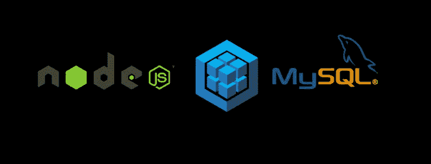
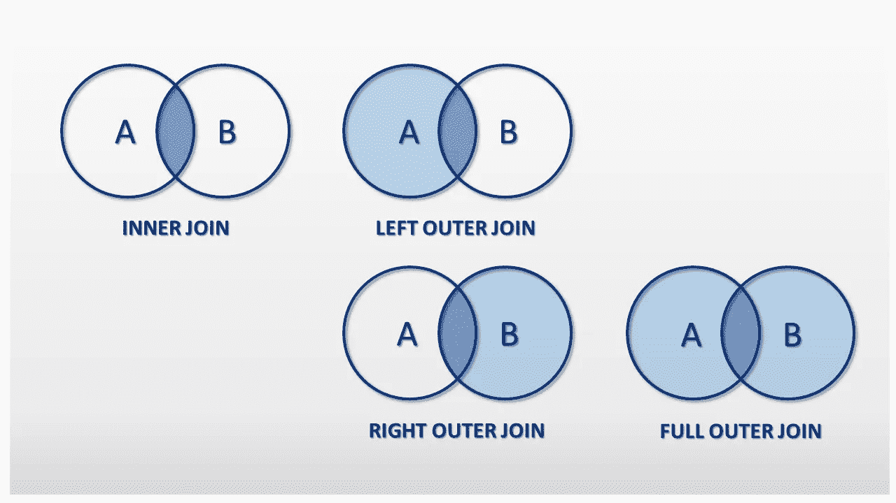
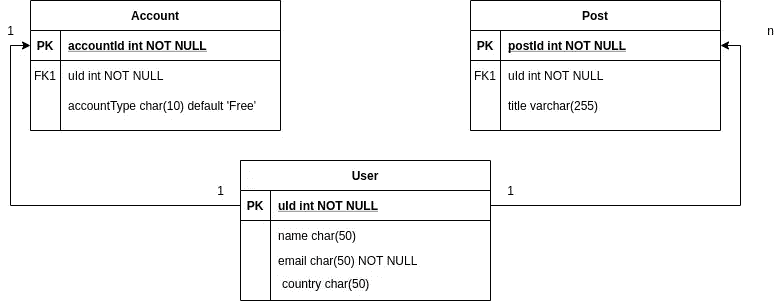
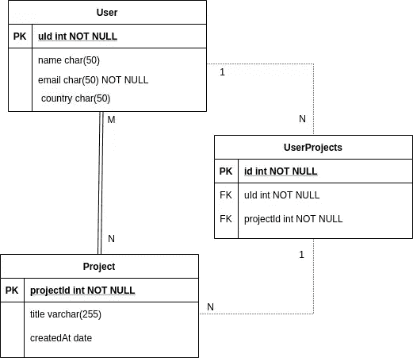

# 您应该了解的四种 Sequelize 关联

> 原文：<https://javascript.plainenglish.io/four-sequelize-associations-you-should-know-415d8d413e1e?source=collection_archive---------0----------------------->



Sequelize 是 Postgres、MySQL、MariaDB、SQLite 和 Microsoft SQL Server 的基于承诺的 Node.js ORM。它具有可靠的事务支持、关系、急切和惰性加载、读复制等特性。数据库表中的联接对于将所有相关信息集合在一起非常常见。在前一篇文章中，我们已经介绍了 Sequelize 的[基础知识。](/save-time-learn-sequelize-in-7-mins-part-1-3e4fde67d037)

在今天的帖子中，我们将学习 Sequelize 关联，热切加载和懒惰加载。但在此之前，让我们了解一下什么是 SQL 中的联接。

## SQL 联接

SQL 中的联接用于在查询结果中组合两个或多个表。因为不可能把所有东西都放在一张桌子上。使用联接，您可以使用外键和主键的概念来连接表。有 4 种类型的连接，

*   内部联接:返回两个表中具有匹配值的记录
*   LEFT OUTER JOIN:返回左(from)表中的所有记录，以及右(JOIN)表中的匹配记录&如果未找到，则为 Null
*   右外连接:返回右(连接)表中的所有记录，以及左(来自)表中的匹配记录&如果未找到，则为空
*   完全外部联接:当左表或右表中有匹配项时，返回所有记录



Joins in SQL

## Sequelize 协会

Sequelize 中的关联是指两个表之间的关系。有 4 种类型的关联，

*   “HasOne”协会
*   “归属”协会
*   “哈斯多”协会
*   “BelongsToMany”协会

在开始联想之前，让我们考虑一下有 3 张表
1。用户(存储用户信息，如姓名、性别、国家、电子邮件、uId、UUID 等。)
2。帖子(店铺帖子信息)
3。账户(存储账户信息，如付费、免费、每月、年度用户等。)

要创建关联，表之间应该存在某种关系。表 1 之间基本上存在三种类型的关系。*一对一* 2。*一对多* & 3。*多对多*。现在每个关系定义了表之间的关联，如
1。**一对一**关系总是有*有* & *到*的联想。
2 .**一对多**关系总是有*有很多* & *隶属于*关系。
3 .**多对多**关系总是有两种*到*的关联。



one to one/many relationship diagram

## 一对一的关系:

假设一个用户只能有一个账户。为了识别哪个表将有 ***有一个*** &哪个表将有 ***属于*** 关联，问一个问题:一个帐户是否存在而没有用户/用户是否存在而没有帐户？答案是用户可以在没有帐户的情况下存在，这意味着用户充当父表&帐户充当子表。首先创建用户简档&，然后基于计划创建账户。
这意味着帐户表将保存用户表的主键作为外键，例如 *uId* 是用户表中的主键。所以关联将是
*User . hasone(Account)&Account . belongs to(User)*

```
const User = sequelize.define('User', { name: DataTypes.STRING }); const Account = sequelize.define('Account', { packageType: DataTypes.STRING }); 
User.hasOne(Account); 
Account.belongsTo(User);
```

## 一对多关系:

假设一个用户可以发布多篇文章。为了识别哪个将有 ***有多个*** &哪个表将有 ***属于*** 关联，问一个问题:一个帖子是否存在而没有用户/用户是否存在而没有帖子？答案是用户可以在没有帖子的情况下存在，这意味着用户充当父表&帖子充当子表。首先创建用户简档&，然后用户可以发布帖子。
这意味着 post 表将保存用户表的主键作为外键，例如 *uId* 是用户表中的主键。所以联想将
*User . has many(Post)&Post . belongs to(User)*

```
const User = sequelize.define('User', { name: DataTypes.STRING }); const Post = sequelize.define('Post', { title: DataTypes.STRING }); 
User.hasMany(Post); 
Post.belongsTo(User);
```



many to many relationship diagram

**多对多关系:** 多对多关联将一个源与多个目标连接起来，而所有这些目标又可以连接到第一个源之外的其他源。这不能像其他关系那样通过向其中一个表添加一个外键来表示。相反，使用了[连接模型](https://en.wikipedia.org/wiki/Associative_entity)的概念。这将是一个额外的模型(和数据库中的额外表)，它将有两个外键列，并将跟踪关联。连接台有时也称为*连接台*或*直通台*或*枢纽台*。

```
const User = sequelize.define('User', { name: DataTypes.STRING }); const Project = sequelize.define('Project', { name: DataTypes.STRING }); 
User.belongsToMany(Project, { through: 'UserProjects' }); Project.belongsToMany(User, { through: 'UserProjects' });
```

在上面的例子中，一个用户可以是多个项目的一部分&一个项目可以有多个用户。

**获取关联:** 获取关联有两种方式 1。*急切装载* & 2。*懒加载*。急切加载意味着关联包含在主查询中，所以所有内容都被提取一次。而延迟加载仅在需要时才引用获取关联。

例如，急于装货

```
const userDetail = await User.findOne({
   where: {     
    email: "testuser@example.co"   
   },
   include: Account
 });
```

例如，延迟装载

```
const userDetail = await User.findOne({
   where: {     
    email: "testuser@example.co"   
   },
 });
const userAccount = await userDetail.getAccount();
```

*   *注意:上面使用的* `getAccount*()*` *实例方法是 Sequelize 自动添加到* `*User*` *实例的方法之一。*

***为什么在父&子表中指定关联很重要？***当两个模型之间定义了一个顺序关联时，只有“源**”**模型知道。例如，在上面的例子中，当定义 User.hasOne(Account)时，用户是源模型，只有用户表知道与帐户的关系，而没有定义 Account.belongsTo(User)帐户表不知道与用户的关系。如果您没有在两个表中定义一个关系，并试图用一个 Account 表获取用户信息，Sequelize 将给出一个错误“SequelizeEagerLoadingError:用户没有关联到 Account！”。这就是为什么有必要成对定义关系

现在让我们看看在急切加载时如何生成 SQL 查询。

```
// Inner where, with default `required: true`
await User.findAll({
  include: {
    model: Post,
    as: 'Posts',
    where: {
      status: { [Op.ne]: 'draft' }
    }
  }
});SELECT * FROM `users` AS `user`
INNER JOIN `posts` AS `Posts` ON
  `user`.`uId` = `Posts`.`uId`
  AND `Posts`.`status` != 'draft';// Inner where, `required: false`
await User.findAll({
  include: {
    model: Post,
    as: 'Posts',
    where: {
      status: { [Op.ne]: 'draft' }
    },
    required: false
  }
});SELECT * FROM `users` AS `user`
LEFT OUTER JOIN `posts` AS `Posts` ON
  `user`.`uId` = `Posts`.`uId`
  AND `Posts`.`status` != 'draft'; // Top-level where, with default `required: false`
await User.findAll({
  where: {
    '$Posts.status$': { [Op.ne]: 'draft' }
  },
  include: {
    model: Post,
    as: 'Posts'
  }
});SELECT * FROM `users` AS `user`
LEFT OUTER JOIN `posts` AS `Posts` ON
  `user`.`uId` = `Posts`.`uId`
WHERE `Posts`.`status` != 'draft';// Top-level where, `required: true`
await User.findAll({
  where: {
    '$Posts.status$': { [Op.ne]: 'draft' }
  },
  include: {
    model: Post,
    as: 'Posts',
    required: true
  }
});SELECT * FROM `users` AS `user`
INNER JOIN `posts` AS `Posts` ON
  `user`.`uId` = `Posts`.`uId`
WHERE `Posts`.`status` != 'draft';User.findAll({   
 include: [{    
  model: Post,     
  where: { 
   status: { 
    [Op.ne]: 'draft' 
   } 
  },     
  required: false     
  right: true // will create a right join   
 }] 
});
```

Sequelize 自动将“必需”选项设置为“真”。这意味着执行的不是“外部连接”,而是“内部连接”,只返回至少有一个匹配子模型的父模型。还要注意，所使用的 where 选项被转换为内部连接的 on 子句的条件。

如果一个表包含同一个父表的两个外键，则可以定义与别名的关联。并且在包含模型时使用相同的别名。

就是这样，这是 Sequelize 中关联如何工作的基础。你可以在官方文档 [*这里*](https://sequelize.org/master/manual/assocs.html) 了解更多。

***感谢阅读。***

*更多内容请看*[*plain English . io*](http://plainenglish.io/)