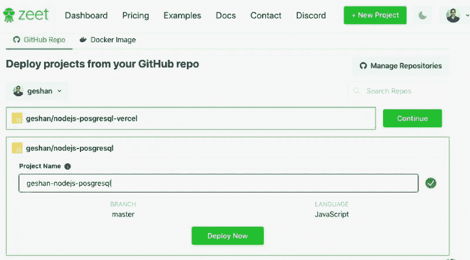

# 3 个免费的 Node.js 托管服务，你今天应该尝试一下

> 原文：<https://javascript.plainenglish.io/free-node-js-hosting-ba585c4c4e39?source=collection_archive---------12----------------------->

## (所有 3 种产品都有分步部署示例)

托管 Node.js 应用程序很容易，但找到一个完全免费且可靠的 Node.js 托管服务却不容易。在这篇文章中，我们将讨论 3 种托管服务，你可以免费托管你的 Node.js 应用程序或 API，现在你应该开始使用了。

我们还将在这 3 个平台上逐步部署一个演示应用。我希望能找到 3 个以上的，但即使是 3 个也不容易。

# 目录

[目录](#5fb3)
[免费 Node.js 托管选项](#a85d)
[先决条件](#3261)
[免费 Node.js 托管服务](#1bc4)
[这些服务的问题](#aa0c)
[免费 Node.js 托管平台部署您的应用](#ee2b)
[heroku](#e9de)
∘[deploy node . js 向 Heroku](#01fb)
[Vercel 引用 API Zeet](#cff9)
[免费 Node.js 托管服务的快速对比](#5ac3)
[免费 Node.js 托管的其他选项](#b0d0)
[结论](#6992)

# 免费 Node.js 托管选项

这篇文章是关于可以完全免费托管 Node.js 应用程序的服务，是的，每月 0 美元。当然，当你不支付任何费用时，你需要做出一些取舍。尽管如此，这不是一个只有几个免费选项和大量付费选项的列表，就像我看过和读过的其他帖子一样。

> *我自己已经尝试了所有这 3 种服务，它们对于演示和小型应用程序来说都非常有效。*

不用说，我们不会使用免费服务来托管中型或生产级应用程序。所有这三个主要的服务都不需要你的信用卡，即使是为了备份，所以把它们放在你的钱包里。

我将包括 3+其他服务，要求信用卡或有相当便宜的计划接近尾声，使名单更全面一点。

# 先决条件

我们将在接下来的章节中介绍的所有这 3 种服务。在我们开始实际部署 Node.js 应用程序之前，下面是一些先决条件:

1.  您有一个 GitHub 帐户，并且知道如何派生存储库
2.  您的应用程序代码可以在 GitHub 上找到
3.  您可以向您的 GitHub 帐户添加第三方应用程序。

是时候开始展示我们的免费 Node.js 托管服务了:

# 免费 Node.js 托管服务

免费的 Node.js 托管服务有 Heroku(免费层)、Vercel(永远免费的爱好计划)和 Zeet。所有这些服务都可以以每月 0 美元的价格托管 Node.js 应用程序，完全免费。出于备份或安全考虑，甚至不需要添加信用卡。但是有附加条件，这将在下面讨论。

# 这些服务的问题

Heroku 免费 dynos 睡眠，如果他们不活跃 30 分钟。

> 有一种变通方法叫做**每 30 分钟调用一次你的 Heroku 服务。**

*或者你可以使用类似 Cron-Job.org 的东西每 20 分钟 ping 你的 Heroku 服务，让它保持清醒。Heroku 在免费层最多有 5 个应用程序可用。*

*Vercel 是一个令人惊叹的服务，你可以在同一个存储库中同时托管你的后端 API 和前端应用程序。它更关注事物的前端。*

> **缺点是 Vercel 使用无服务器功能。它就像是 AWS Lambda 上的一个伟大的包装器。它只允许个人 GitHub 库免费，而不是组织库。**

*对于无服务器功能，冷启动和丢失应用程序状态的问题就出现了。*

*Zeet 是另一个很棒的服务，如果你 30 分钟没有收到请求，它既不会休眠，也没有服务器。*

> **这里的问题是，你只能免费获得一个应用程序，但它可以获得 1 个共享 CPU 和 1 GB 的共享内存。**

*如果您只有一个[编码挑战](http://markdown-to-medium.surge.sh/blog/2020/09/take-home-coding-challenges-outshine-competition/)要部署，这仍然比上面两个选项要好。*

# *免费 Node.js 托管平台来部署您的应用*

*好了，让我们停止咆哮，开始部署一个演示应用程序。对于这个示例，我将使用一个 [node.js Express API](http://markdown-to-medium.surge.sh/blog/2021/01/nodejs-postgresql-tutorial/) ，它与 [ElephantSQL](https://www.elephantsql.com/) 上的 PostgreSQL 数据库进行对话。*

*这是一个简单的报价 API，你可以在 Github 上找到开源代码。是时候看看 Heroku 上免费托管的这个应用程序了。*

# *赫罗库*

*[Heroku](https://heroku.com/) 是一家 salesforce 公司，也是第一批做大的平台即服务(PaaS)公司之一。自 2007 年以来，它一直存在，在过去的 15 年里，它已经发展并很好地适应了不断变化的技术环境。我们可以托管多种语言，比如 Heroku Dynos 和 Node.js 肯定是其中之一。*

> **甚至在 11 年前的 2010 年，Heroku 更像是把你的应用扔给我，我会为你运行它，那是在 Docker 和 containers 出现之前。**

*现在是 2021 年，他们有很多服务，幸运的是免费计划仍然在他们的[定价](https://www.heroku.com/pricing)页面上。是时候继续学习如何在 Heroku 上部署演示应用了:*

## *将 Node.js 报价 API 部署到 Heroku*

*你需要在 Heroku 上有一个[免费账户](https://signup.heroku.com/)才能开始。注册后，请按照以下步骤在 Heroku 上运行 Node.js 应用程序:*

*   *登录你的 Heroku 账户*
*   *转到:[https://github.com/geshan/nodejs-posgresql](https://github.com/geshan/nodejs-posgresql)*
*   *点击“部署到 Heroku”按钮*
*   *在 Heroku 的“创建新应用程序”页面上，给应用程序起一个名字，如`nodejs-heroku-try`或其他可用的名字*
*   *然后点击“部署应用程序”*
*   *等待一两分钟，它将构建并部署应用程序，如下所示:*

**

*   *之后，点击“查看”按钮，您应该会看到如下内容:*

**

*   *将`/quotes`添加到 URL，您应该会看到 JSON 格式的引号，如下所示:*

**

*这并不容易，你已经有了用 Node.js 和 Express 构建的 quotes API，运行在第一个免费的 Node.js 托管平台:Heroku 上。*

*不过它并没有神奇地运行，设置已经存在于 repo 的 [app.json](https://github.com/geshan/nodejs-posgresql/blob/master/app.json) 文件中。这告诉 Heroku 如何部署应用程序。对于现实生活中的应用程序，我们需要设置正确的环境变量，主要是像数据库凭证这样的秘密。*

*为了做得更好，你可以分叉这个库并连接 [Github 作为 Heroku 的部署方法](https://devcenter.heroku.com/articles/github-integration)。*

*此外，您可以建立[管道](https://devcenter.heroku.com/articles/pipelines)来在 Heroku 创建登台和生产环境。您还可以使用 [Heroku CLI](https://devcenter.heroku.com/articles/heroku-cli) 对您的应用程序进行更多控制。我把进一步的探索留给你。接下来，让我们看看如何在 Vercel 上部署相同的应用程序。*

# *韦尔塞尔*

*Vercel (之前被称为 Zeit)是一个部署前端应用的好地方。作为无服务器功能之上的一层，它也可以运行一些其他语言，Node.js 包含在列表中。在其他好的特性中，Vercel 的一个非常方便的特性是为每个 pull 请求获得一个唯一的 URL，这使得测试特定的分支变得轻而易举。他们称之为部署预览。*

> *[*Vercel 定价*](https://vercel.com/pricing) *相当直截了当。个人项目免费运行，它与 GitHub、BitBucket 和 GitLab 集成。**

*让我们看看如何在 Vercel 上部署我们的 Quotes API Node.js 应用程序。*

## *在 Vercel 上部署 Node.js 报价 API*

*将[注册到 Vercel 并登录到 Vercel 后，执行以下步骤:](https://vercel.com/signup)*

*   *拜访 https://github.com/geshan/nodejs-posgresql(你甚至不需要叉回购)*
*   *单击蓝色的“部署”按钮*
*   *在 Vercel UI 中为其命名，如下所示:*

**

*   *然后点击“继续”*
*   *您可以从下面的屏幕在 Github 上创建自己的回购:*

**

*   *之后，选择根作为项目的源代码，然后点击“继续”*

**

*   *随后，在下一个屏幕中单击部署:*

**

*   *它将构建并部署应用程序，您将看到如下屏幕:*

**

*   *现在，单击“访问”按钮，您应该会看到如下内容:*

**

*   *将`/quotes`添加到 URL，您应该会看到 JSON 格式的引号，如下所示:*

**

*这是现在设置得非常好，你应该去应用程序的设置页面，如果你想调整什么。您可以在设置中添加环境变量和做其他事情。您甚至可以查看函数的日志。*

*每当您在存储库中打开一个新 pull 请求时，Vercel 都会为您提供一个部署预览 URL，这非常方便。你可以在下面看到它的样子:*

**

*在合并到主/主分支时，它会自动将代码部署到主 URL。您可以使用 [Vercel CLI](https://vercel.com/docs/cli) 进行重新部署、设置环境变量和许多其他事情。*

*Heroku 和 Vercel 都有强大的 CLI，让你部署应用程序和做其他事情更容易，如从 CLI 查看应用程序日志。*

*接下来，我们来看看 Zeet 与 Heroku 和 Vercel 相比如何。*

# *泽特*

*Zeet 将自己标榜为最简单的部署方式。它支持来自 Github 或公共 docker 容器的代码。Zeet 不像 Heroku 或 Vercel 那样受欢迎，但它以其简单性而著称。*

> *由于 Zeet 不运行无服务器功能，也不在 30 分钟内休眠，因此免费托管一个应用程序看起来是一个很有前途的选择。*

*根据其[定价](https://zeet.co/pricing)页面，我们可以用有限的共享资源免费运行一个项目。是时候深入了解 Zeet 了:*

## *将 Node.js 报价 API 部署到 Zeet*

*假设您已经用 GitHub 在 Zeet 上注册了[和](https://zeet.co/new),并且您已经登录 Zeet，请遵循以下步骤:*

*   *将`https://github.com/geshan/nodejs-posgresql`库分支到您的 GitHub 帐户*
*   *进入 Zeet，点击 Zeet 右上角的绿色“+新项目”按钮*
*   *然后点击“GitHub”并点击“试用$0”选项下的绿色“继续”按钮*
*   *之后，单击刚才分叉的“Nodejs-posgresql”repo 旁边的“Continue ”,然后单击“Deploy Now ”,如下所示:*

**

*   *随后，在“构建方法”上选择“Node.js 14”并点击“保存”，如下所示:*

**

*   *给它一些时间来构建和部署，之后，您将看到如下所示的内容:*

**

*   *如果您单击绿色的“访问”按钮，现在将不起作用。还有一个小配置。点击“设置”,然后点击左侧的“网络”链接，然后如下图所示将“端口”设置为`3000`,之后点击右下角的“保存”,如下图所示:*

**

*   *这应该会重新部署应用程序，如果您返回到“部署”点击它应该是部署/已部署。*
*   *因此，再次单击“访问”按钮，您应该会看到如下内容:*

**

*   *接下来，将`/quotes`添加到 URL，您应该会看到类似下面的内容:*

**

*和 Vercel 一样，Zeet 也为每个 pull 请求提供了一个部署预览 URL。我有一种感觉，他们想与 Zeet 竞争 Zeit:)，如果你知道我的意思。下面是部署预览 URL 在您的请求中作为注释的预览:*

**

*无论如何，如果你想部署自己的应用程序，你需要删除这个演示应用程序，并添加自己的应用程序。Zeet 只允许 1 个免费应用。他们的 GitHub 账户中有更多的演示。Zeet 没有 CLI 应用程序，我想这很好，因为它想让事情变得简单和干净。*

*现在你有了它，同样的 Node.js API 部署在所有 3 个免费的 Node.js 托管服务上，甚至不需要从钱包里掏出信用卡。*

# *免费 Node.js 托管服务的快速比较*

*下面是 Heroku、Vercel 和 Zeet 的快速对照表。*

**

*对比之后，让我们看看其他一些免费的选项，但仍然需要你的信用卡作为备份选项，如果你使用更多的资源，他们可以收费。*

# *免费 Node.js 托管的其他选项*

*你可以免费或几乎免费地托管 Node.js 应用程序，但你需要放入你的信用卡的其他一些服务如下:*

1.  *fly . io——相当不错，后端就像 CDN。[自由计划](https://fly.io/docs/about/pricing/)有 3 个共享 CPU-1x 虚拟机，内存为 256 MB。登记时要求信用卡。*
2.  *Google Cloud Run——你可以在 [Google Cloud Run](https://cloud.google.com/run) 上托管你的 Node.js 应用，作为[无服务器容器](https://geshan.com.np/blog/2019/11/why-use-google-cloud-run-5-compelling-reasons/)。你可以每月免费获得 200 万个请求。但这将涉及设置谷歌云注册表和其他工具。谷歌云平台的一部分，注册时需要信用卡。*
3.  *open ode . io——如果你有一个开源项目，你可以向他们要一个免费计划。最便宜的 50MB 内存套餐每月仅需 0.75 美元。*
4.  *Glitch — [Glitch](https://glitch.com/pricing) 可以免费托管你的一个 Node.js 应用。它更适合用于协作编码，而不是托管 Node.js 应用程序或 API。*

> **你可以将 Node.js 应用托管在三大云提供商 AWS、Azure 和 GCP 和/或它们的功能即服务(FAAS)无服务器选项上，甚至是永久免费的虚拟机上。但是，他们会问你的信用卡。**

*你甚至可以探索其他云提供商，如 IBM Cloud 或阿里巴巴，以每月 0 美元的价格托管你的 Node.js 应用程序。我会把深入挖掘的部分留给你。*

# *结论*

*用 Node.js 托管一个小的测试项目应该不是一件麻烦的事情。*

> *使用以上三种服务中的任何一种，你都可以轻松做到，而且完全免费，不需要信用卡。*

*你也可以使用其他免费的服务，但要求你写下你的信用卡号码。选择权在你！*