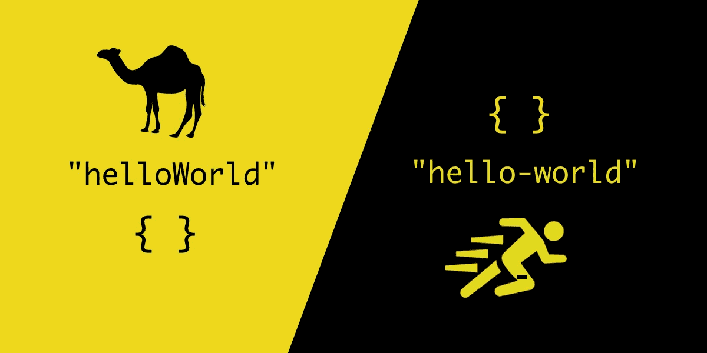

# 从骆驼案到烤肉串案

> 原文：<https://javascript.plainenglish.io/from-camel-case-to-dash-syntax-in-javascript-c685206ee682?source=collection_archive---------7----------------------->



在本文中，我们将用几行代码将 camel case 中的字符串转换成 kebab case。

```
**camel case:** nevinKatz**kebab case:** nevin-katz
```

当您想在 JavaScript 中使用类似于`dataCost`的对象属性，并将其映射到 DOM 元素中的类似属性(在本例中为`data-cost`)时，这种转换会很方便。

在本文中，我们将看看`camelToDash`，一个执行转换的函数，然后研究它是如何工作的。

# 该功能

这五行代码中发生了很多事情。让我们首先确定其中的编码技术。

The camelToDash function.

上面的解决方案使用了[逻辑 NOT](https://developer.mozilla.org/en-US/docs/Web/JavaScript/Reference/Operators/Logical_NOT) ( `!`)运算符、在[字符串](https://developer.mozilla.org/en-US/docs/Web/JavaScript/Reference/Global_Objects/String)数据类型上找到的两个[实例方法](https://developer.mozilla.org/en-US/docs/Web/JavaScript/Reference/Global_Objects/String#instance_methods)、一个[正则表达式](https://developer.mozilla.org/en-US/docs/Web/JavaScript/Guide/Regular_Expressions)和一个[箭头函数表达式](https://developer.mozilla.org/en-US/docs/Web/JavaScript/Reference/Functions/Arrow_functions)。它还使用一元加号(`+`)运算符连接两个单字符字符串。

第 3 行的主要逻辑是从 [Ibrahim Mahrir](https://stackoverflow.com/users/9867451/ibrahim-mahrir) 的工作解决方案(#33)借用来解决 [StackOverflow 上的这个问题。](https://stackoverflow.com/questions/47836390/how-to-convert-a-camel-case-string-to-dashes-in-javascript/47836484)谢谢，易卜拉欣！

# 它是如何工作的

这个代码片段有相当多的步骤，所以让我们仔细看看这种神奇是如何发生的。

在第 1 行，函数接受一个名为`str`的字符串参数。

```
function camelToDash **(str)** {
```

在第 2 行，我们立即检查传入的参数。

```
if (str != str.toLowerCase()) {
```

使用我们的`if`语句，我们测试`str`是否与其小写版本不同。如果是这样，这意味着我们有一个或多个大写字母，所以我们在第 3 行有工作要做。

让我们看看如果第 3 行中的逻辑起作用会发生什么。

```
str = str.replace(/[A-Z]/g, m => "-" + m.toLowerCase());
```

我们可以看到它在我们的字符串上调用了`replace`方法。在该方法中，有两个参数:

*   一个正则表达式，`/[A-Z]/g`
*   一个回调函数，`m => "-" + m.toLowerCase()`

我们的正则表达式将匹配字符串中的每个大写字母，因为它有两个组成部分:

*   `[A-Z]`，它给出了我们要寻找的大写字母的范围。
*   `g`，意思是全局搜索——在所有事件中寻找匹配。

## 改变字符串

每个大写字母都被这个正则表达式捕获，并作为变量`m`传递给回调函数:

```
m => "-" + m.toLowerCase());
```

回调函数通过组合两个单字符字符串，将每个大写字母转换为双字符字符串:

*   破折号(`"-”`)
*   通过`m.toLowerCase()`字母的小写等价

所以在单词`camelCase`中，大写字母`C`会变成`-c`。

然后，我们通过结束`if`条件、返回完成的字符串并关闭函数来结束我们的逻辑。

```
 }
  return str;
}
```

就是这样！您可以通过尝试下面的 CodePen 来查看我们的功能。

# 思考下一步措施


Photo by [Mariam Soliman](https://unsplash.com/@mariamsoliman?utm_source=unsplash&utm_medium=referral&utm_content=creditCopyText) on [Unsplash](https://unsplash.com/s/photos/camel-desert?utm_source=unsplash&utm_medium=referral&utm_content=creditCopyText)

*   既然我们已经讨论了这个代码片段是如何工作的，那就想想如何在你自己的 web 或应用程序开发中使用这个语法，以及其他什么方法也可以工作。
*   一旦你理解了一个片段，你就可以尝试优化它。在下面的文章中，探索上述方法与其他三种方法的性能比较。

[](/camel-to-dash-revisited-optimizing-a-javascript-string-conversion-df6610dc6804) [## Camel 案例回顾:优化 JavaScript 中的字符串转换

### 让我们看看是否可以用三元运算符和预定义的常数来提高性能。

javascript.plainenglish.io](/camel-to-dash-revisited-optimizing-a-javascript-string-conversion-df6610dc6804) 

我希望这个函数背后的基本概念的演练对您有所帮助。感谢阅读！

## 参考

[](https://stackoverflow.com/questions/47836390/how-to-convert-a-camel-case-string-to-dashes-in-javascript/47836484) [## 如何在 JavaScript 中将骆驼字符转换成破折号？

### 感谢贡献一个堆栈溢出的答案！

stackoverflow.com](https://stackoverflow.com/questions/47836390/how-to-convert-a-camel-case-string-to-dashes-in-javascript/47836484) [](https://developer.mozilla.org/en-US/docs/Web/JavaScript) [## JavaScript | MDN

### JavaScript (JS)是一种轻量级、解释型或即时编译的编程语言…

developer.mozilla.org](https://developer.mozilla.org/en-US/docs/Web/JavaScript) 

## 在别处

[](https://betterprogramming.pub/7-approaches-to-rewriting-javascript-from-my-early-days-c6ada526d55f) [## 我早期用来重写 JavaScript 代码的 7 个技巧

### 3.移除过多的中间函数返回

better 编程. pub](https://betterprogramming.pub/7-approaches-to-rewriting-javascript-from-my-early-days-c6ada526d55f) 

*更多内容请看*[***plain English . io***](http://plainenglish.io)