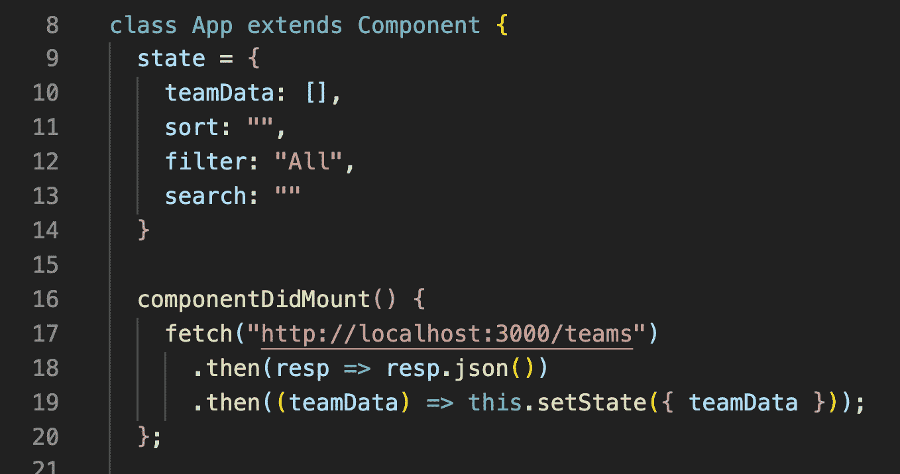
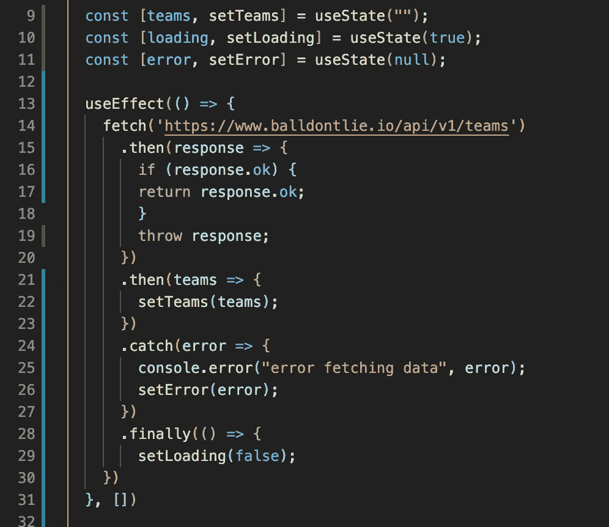
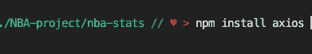
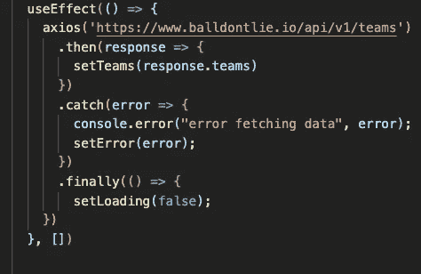

# 获取 API 数据的多种方式

> 原文：<https://javascript.plainenglish.io/from-fetch-api-to-useeffect-and-axios-the-many-ways-of-fetching-api-data-367757ea5ac6?source=collection_archive---------9----------------------->

## 从获取 API，到使用 Effect 和 Axios

最近，随着我在不同项目中的工作，我一直在尝试扩展我的数据获取能力。实际上有很多方法可以获取 API 数据。在这篇博客中，我将介绍最简单的方法，比如使用 Fetch API，然后介绍使用`useEffect()`的方法，然后是 Axios 方法。这些是最常用的方法。实际上，除了这三种方法，还有很多其他方法，但是如果您是 JavaScript 或 React 新手，这是一个很好的开始。

# 首先，什么是 API？

**API** 代表**应用编程接口**。你可以把它想象成一个用来请求和获取信息的链接，或者像一个叫外卖的菜单。API 给了我们获取数据的能力，并允许应用程序相互通信。

一个例子是，如果我想建立一个 NBA 统计应用程序。我会使用像 [**balldontlie**](https://www.balldontlie.io/#introduction) 这样的免费 API，它允许我访问 NBA 相关的数据，如球员信息，比赛统计数据，如每场比赛的得分，每场比赛的盖帽等。API 让我们避免了大量收集数据的工作！

让我们继续获取这个 API 数据吧！

# Fetch()—Fetch API 方法

几个月前，我主要使用 JavaScript 获取数据，并使用 fetch() API 进行反应。这是最简单、最容易获得数据的方式，因为它内置于大多数现代浏览器中(除了我写这篇博客时的 Internet Explorer)。fetch() API

上面是一个在**componentdimount()**方法中的基本获取请求的例子。它调用 **fetch()** 方法，该方法接受一个参数，即资源。这是您要获取的数据的路径。这可以是您的 API 数据，如链接或请求对象。然后它返回一个承诺，其中包含一个响应对象。因为我们得到的响应只是一个 HTTP 响应，所以我们将 **json()** 方法附加到响应中，这样我们就可以得到实际的 json 格式的数据作为我们的响应。

另外，fetch API 的一个主要缺点是处理错误。在我上面的例子中，我没有考虑让我的代码处理错误。这可能是不好的，因为即使 url 向我发送 404 错误(意味着没有找到页面)，我们仍然会发送该错误作为响应，而不会破坏我们的代码。我将在下面的两个方法中向您展示如何处理获取错误。

# useEffect( ) —获取 useEffect 挂钩方式

因为钩子在我们使用 React 时变得越来越常见，所以钩子获取数据的方式是使用`useEffect`方法。Effect Hook 增加了与第一个例子中的`componentDidMount`相同的功能，或者执行其他副作用，但是是在一个函数组件中。

如上例所示，我们使用了一个类组件。`useEffect()` 让我们可以在类中、在函数组件中使用`componentDidMount`、`componentDidUpdate`、`componentDidUnmount`，但是它们都被打包到一个 API 中——use effect！

在`useEffect()`中，就像我们上面的第一个例子一样，我们的 fetch 接受一个参数，也就是资源。这一次，我使用来自 balldontlie 的 NBA stats API 作为我的 API 数据。在第一次`.then()`回调时，我们得到我们的响应。**如果**我们的响应没问题，我们继续并返回那个响应。然而，如果我们的响应不好，比如说我们的响应中有一个错误，我们会将响应作为一个错误抛出，我们的`.catch` 回调会处理这个错误。

然后在。最后是回调，我们用它作为一个函数，显示我们的数据或错误，我们的响应是好是坏。

这是我们的输出:

# Axios

Axios 是一个用于提出数据请求的开源库。为了使用 axios，你必须首先安装它，因为它不像 React 中的 fetch 或 useEffect 那样内置。你可以用 yarn 或 npm 这样的包管理器来安装它。下面我有`npm install axios`，或者`yarn add axios`如果你用纱的话。

Axios 支持所有现代浏览器，甚至是 Internet Explorer。

也可以在 vanilla JavaScript、React、Vue.js 和 Angular 中使用。

Axios 也有更好的错误处理和自动转换功能。它让我们减少了很多代码！

这是我们在上面的 useEffect 方法中的代码。我们能够减少响应，因为 Axios 处理第一次回调，我们检查响应是否正常，如果不正常，就给我们一个错误。

# **结论**

获取数据的方式还有很多。如果您只接触过获取数据，希望您能够扩展您的知识。

你的获取方式是什么？请在评论中告诉我们。

*更多内容看* [***说白了***](http://plainenglish.io)