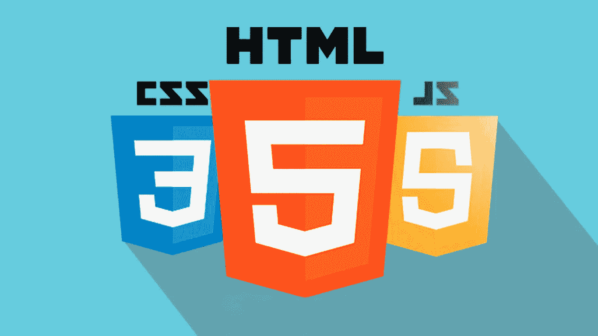
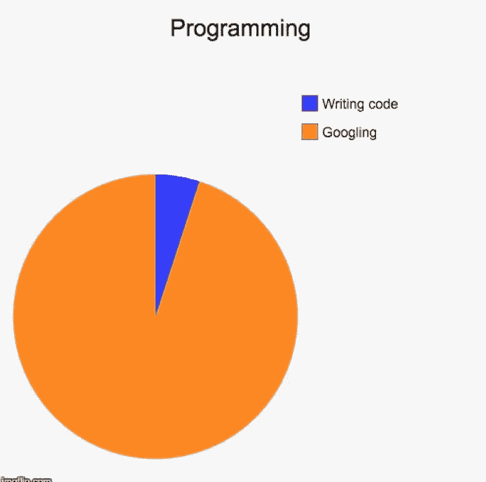
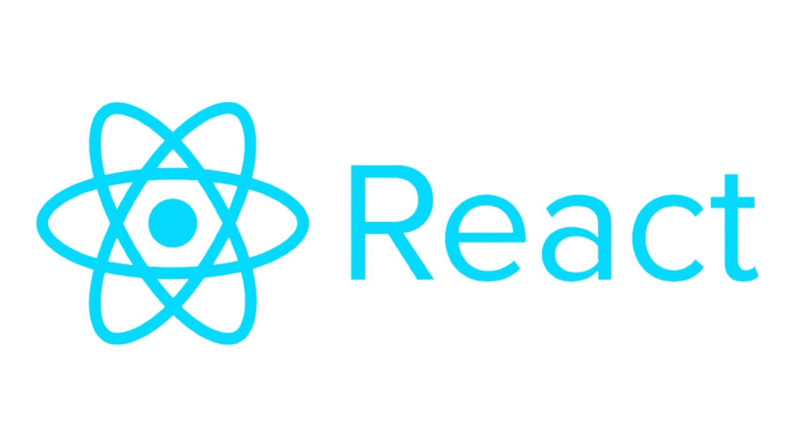
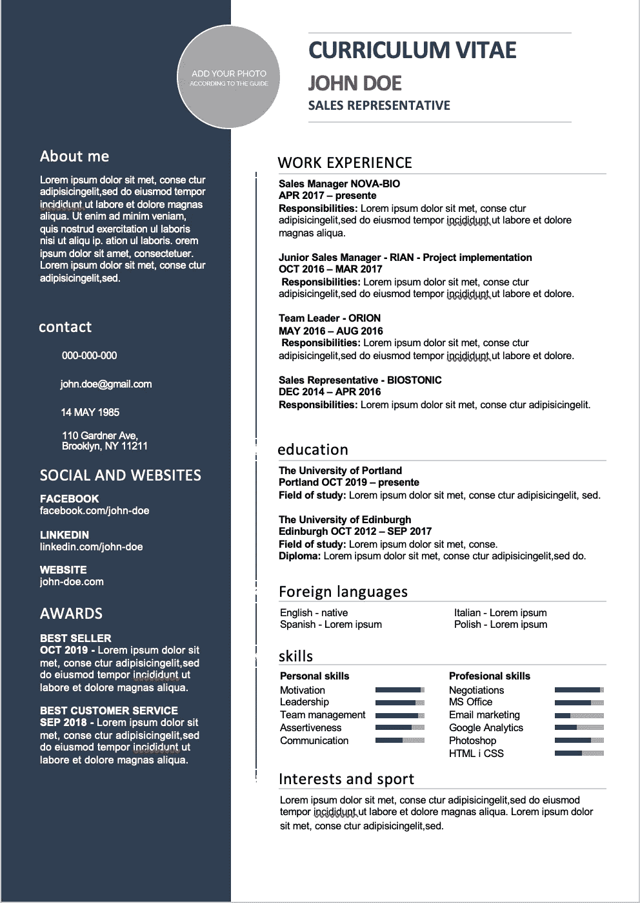

# 我在 3 个月内找到了一份高薪的网络开发工作。我是这么做的。

> 原文：<https://javascript.plainenglish.io/from-zero-experience-to-landing-a-job-in-web-dev-in-only-3-months-c9fede77ec91?source=collection_archive---------1----------------------->

## 从零经验到在 3 个月内找到一份网页开发的工作

标题是不是听起来好得不真实？嗯，通过大量的努力工作和明确的计划，每个愿意投入时间的人都能够实现和我一样的目标。阅读这个故事，找到帮助我**仅用 3 个月就找到工作的**路线图**。**

首先，让我简短地告诉你一些关于我个人的事情。我目前是汉堡(德国北部)一名 26 岁的电子商务硕士学生，在我进入 web 开发之前，我有一些 python 方面的经验(主要是数据科学相关的)，但没有 JavaScript、HTML 或 CSS 方面的经验。

现在，我在德国最大的媒体公司做软件开发的**勤工俭学学生，每月挣近**1500€**(同时我还是一名全日制学生！).**

## **1。学习 HTML、CSS 和 JavaScript**

所以三个月前，我在学校注册了一门叫做网络技术的课程。在那个过程中，我们最终不得不自己编写一个在线商店的代码。

起初我们不得不用仅仅 **HTML 和 CSS** 来编码**前端**。仅此而已。这也是我的建议，如果你正在考虑进入 web 开发。从 HTML 和 CSS 开始。其次，我们必须用**普通 JavaScript** 实现一些**客户端**功能。例如，我们必须编码一个复活节彩蛋(点击某个图片 5 次会改变图片)，一个 10 秒后出现的模态和一个产品过滤器(名称、价格和可用性)。最后，我们用 Node.js 和 Express.js 编写了我们自己的**认证流。**

因此，这是你应该从文章的这一部分学到的:观看一些关于 HTML、CSS 和 JavaScript 的编码教程，然后开始你自己的小项目，在那里应用你的知识。在某些时候，你可能会卡住，但要有耐心和毅力，并使用你的谷歌技能！要知道谷歌也是编程的一个巨大部分，相信我！

## **2。选择一个 JavaScript 框架，如 React、Vue 或 Angular**

另一步，我决定继续我的 React 之旅。Js 加速前端开发。我不是说 ReactJs 是最好的选择，我只是从它开始并坚持下去。请随意查看其他基于 javascript 的流行 web 框架，如 Angular 或 Vue。

React.js 的好处是，你可以很容易地进入 React Native，这是一个为 IOS 和 Android 开发本地应用的框架。这样你可以轻松拓展你的技能，提高你在就业市场上的价值。

故事的其余部分很简单:继续用你喜欢的 web 框架构建项目，首先将**集中在前端**开发上，如果你觉得足够自信，就继续进行 web 开发的后端方面的**！在这种情况下，我强烈推荐 Next.js，它允许你轻松地构建 SEO 友好的全栈 web 应用。点击这里，查看我关于 Next.js 和 MongoDB [入门的帖子。](/integrating-mongodb-to-nextjs-f7038f90051a)**

## 此时，我的个人投资组合包括:

1.  全栈会议策划，
2.  全栈博客，
3.  新闻 app，
4.  登陆页面，
5.  Spotify 播放器应用程序
6.  网店 app。

都是用 React.js/React Native/next . js 写的

这些是帮助我找到工作的项目！

## 3.如何成功推销自己

随着你的投资组合项目成为一个强大的基础，你几乎准备好了。此时只剩下**两步**了。

1.  建立你自己的网站，展示你的项目，并提供一些关于你个人的一般信息。也购买你自己的域名——这真的有助于给人留下专业的印象。请随时查看我的个人网站[https://www.kevin-tomas.com](https://www.kevin-tomas.com)。
2.  创建一份现代的、好看的简历。你可以从 [etsy](https://www.etsy.com) 得到便宜又非常酷的模板。下面你可以看到我使用的模板。

就是这样！我只提到了**我的简历和我的个人网站**，我没有附上任何形式的求职信或其他任何东西！我申请的每一个职位都是关于用 JavaScript 进行 web 开发的软件开发。

在 7 份申请中，我只收到了一份否定的答复，其中 6 份最终被邀请参加面试。10 月 2 日星期四，我发出了申请，10 月 6 日星期一，我已经得到了第一份工作邀请！

## 结论

所以我希望这篇文章能激励你开始成为一名 web 开发人员。如果你遵循这些步骤，很有可能你很快就会在这种背景下找到一份工作。

如果你喜欢这篇文章，请随时关注我，让我知道你的想法！

干杯！

*更多内容看* [***说白了. io***](http://plainenglish.io)