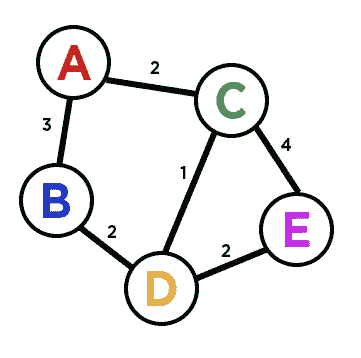

# 从零到迪克斯特拉

> 原文：<https://javascript.plainenglish.io/from-zero-to-dijkstra-10a19301f299?source=collection_archive---------6----------------------->

## 第 3 部分:图表

如果你一直追溯到本博客系列的第 1 部分，你会记得我们最初学习优先级队列的全部原因是为了解决 Dijkstra 算法。Dijkstra 算法的要点是找出图上任意两点之间的最短路径。所以，瞧，我们已经到达了我们的基本数据结构:**图。**


Photo by [Thomas Kinto](https://unsplash.com/@thomaskinto?utm_source=medium&utm_medium=referral) on [Unsplash](https://unsplash.com?utm_source=medium&utm_medium=referral)

在编程中，图是一个简单的数据结构，包含了**顶点**和它们的连接。就像地图上的道路如何连接城市并可以向许多方向分支一样，图节点可以根据需要连接到任意多或任意少的其他节点。

有**加权的**和**未加权的**图，这意味着连接，或者我们将称之为**边**，可以保持一个值，也可以不保持。例如，州地图将被加权，因为连接城市的道路之间有距离。正如你可能猜到的，Dijkstra 的算法处理的是加权图，但是我们将从一个未加权的图开始。

# 此博客的目标

*   创建一个**图形**类
*   将**顶点**和**边**添加到图形中
*   移除顶点和边
*   **遍历**图形


Example Graph

这是一个简单的图表。你可以看到图上的每个点都至少与另外一个点相连。如果我们为此构建一个 Javascript 类，我们将如何跟踪每个顶点和边呢？答案比你想象的要简单。我们可以使用一个**邻接表**。

# 邻接表

跟踪每个顶点及其连接的一个简单方法是使用邻接表。这是一个普通的 Javascript 对象，其中每个键是一个顶点，值是一个数组，保存所有它们的直接连接。这里有一个例子:

```
this.adjacencyList = 
{
    A: [B, C],
    B: [A, D],
    C: [A, D, E],
    D: [B, C, E],
    E: [C, D]
}
```

现在，如果我们需要添加一个顶点或边，我们可以简单地添加另一个键，或者将另一个值推入邻接表。所以我们的图构造器实际上变成了一个邻接表。我们可以通过遍历对象来检查顶点，也可以通过检查相应的数组来检查边。

```
class Graph {
    constructor() {
        this.adjacencyList = {};
    }
}
```

就是这样！添加顶点和边的操作并不困难。要添加一个顶点，我们检查它是否已经存在于邻接表中，如果不存在，我们用一个空数组的值将它添加到我们的对象中。要添加边，我们需要两个顶点，并将它们的值放入彼此的数组中。

```
addVertex(vertex) {
    if (!this.adjacencyList[vertex]) this.adjacencyList[vertex] = []
}addEdge(v1, v2) {
    this.adjacencyList[v1].push(v2);
    this.adjacencyList[v2].push(v1);
}
```

要从我们的图中删除一个顶点，先删除一条边会更容易。我们可以对数组使用 **filter** 函数来从相邻数组中移除每个顶点。然后，要删除一个顶点，我们可以使用 **removeEdge()** 函数来删除顶点列表中的每条边，并通过使用 Javascript 对象的经常被遗忘的 **delete** 属性来完全删除顶点。

```
removeEdge(v1, v2) { this.adjacencyList[v1] = this.adjacencyList[v1].filter(el => el !== v2) this.adjacencyList[v2] = this.adjacencyList[v2].filter(el => el !== v1);}removeVertex(vertex) {
    while(this.adjacencyList[vertex].length) {
        const adjacentVertex = this.adjacencyList[vertex].pop();
        this.removeEdge(vertex, adjacentVertex);
    }
    delete this.adjacencyList[vertex];
}
```

# 遍历图形

现在有趣的部分来了。有很多方法可以遍历一个图(广度优先/深度优先，递归/迭代)，但是我们只选择一种并坚持下去。如果你愿意，你可以查一下其他选项。最终的结果是一样的，我们将有一个数组，包含图上的每个顶点，从一个点开始。


Example Graph

在我们的示例图中，我们可以从 **A、**开始，并访问它的每个邻居。然后，我们将访问它们的每个邻居，依此类推，将每个新顶点推入一个**结果**数组，直到我们已经看到每个顶点。

“但是我们怎么知道什么时候结束了呢？”你可能会问。我们可以有一个**堆栈**(遵循先入后出的顺序)来跟踪我们正在查看的顶点，并有一个**访问过的**对象来轻松检查我们以前是否访问过一个顶点，以免遇到重复的顶点。

让我们从初始化我们的一些值开始。

```
DepthFirst(start) {
    let stack = [start];
    let result = [];
    let visited = {};
    let currentElement; visited[start] = true;
```

我们用起始顶点初始化了堆栈，在这种情况下，让我们使用 **A** 。我们还有我们的**结果**数组和我们的**访问过的**对象。因为我们已经访问了我们的 **start** ，我们可以将被访问对象中的 start 的值设置为 **true** 。我们还设置了一个 **currentElement** 变量，它将在我们每次访问一个顶点时发生变化。

现在，我们应该初始化一个循环，直到堆栈为空才会结束。我们将从**开始**并拜访每一个邻居。我们应该检查它们是否被访问过，如果没有，将它们添加到堆栈中。然后，我们将它们的“已访问”值设置为 **true** ，这样我们就不会返回。最后，当循环重新开始时，我们应该在堆栈中有一个新的顶点来重复这个过程。

```
while(stack.length) {
    currentElement = stack.pop();
    result.push(currentElement); this.adjacencyList[currentElement].forEach(neighbor => {
        if (!visited[neighbor]) {
            visited[neighbor] = true;
            stack.push(neighbor);
        }
    })
}return result;
```

就是这样！循环的每次迭代从堆栈中弹出一个元素，并将其添加到我们的结果数组中。然后，我们查看该元素的邻接数组中的每个邻居，如果它是未访问的，它将被设置为已访问并添加到堆栈中。如果每个邻居都被访问过，循环将跳过并弹出堆栈中的另一个元素。最终，每个元素都将被访问，堆栈将为空，结束循环，我们返回我们的**结果**数组。

这是我们到目前为止一起展示的所有东西:


Graph construction, add/remove, and traversal

# 加权图

就像优先级队列和二进制堆一样，从无权重图到有权重图的跨越并不是一件难事。唯一改变的是，每个顶点不再是一个值，而是一个包含值和权重的对象。


Weighted Graph

所做的改变是我们的 **addEdge()** 函数现在接受一个权重，我们将这个权重添加到一个对象中，以推入每个顶点的邻接数组。



Weighted Graph

这是我们添加了一些权重的示例图。从 **A** 到 **E** 的最短距离是多少？你也许可以很容易地通过一些排列，看到它来自 A-C-D-E，但是如果我们的图是由成千上万的顶点和边组成的呢？这就是 Dijsktra 的用武之地。

但是，那将是一个完全不同的博客。加入我的下一部分，我们最终解决 Dijkstra 的算法。一如既往，如果你有任何问题，请留言。

感谢阅读和快乐编码！

*更多内容请看*[***plain English . io***](http://plainenglish.io)