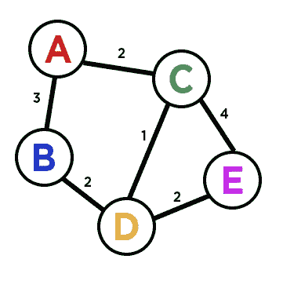
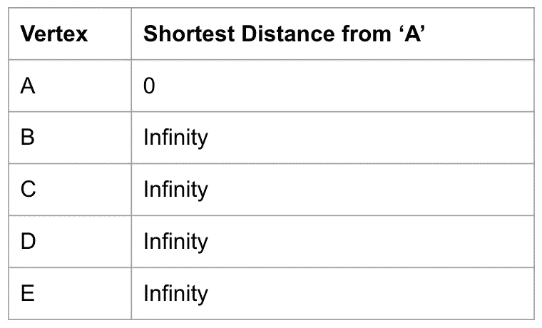
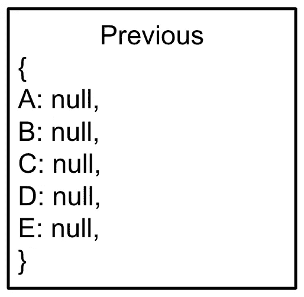
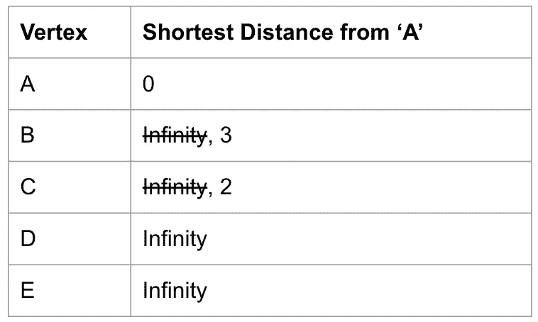
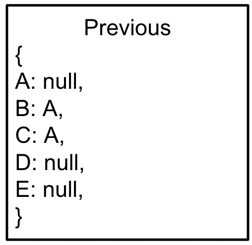
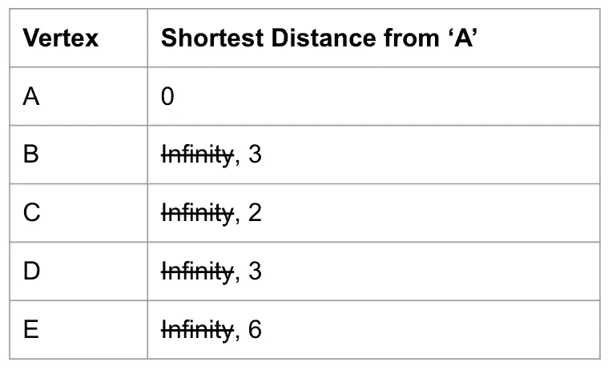
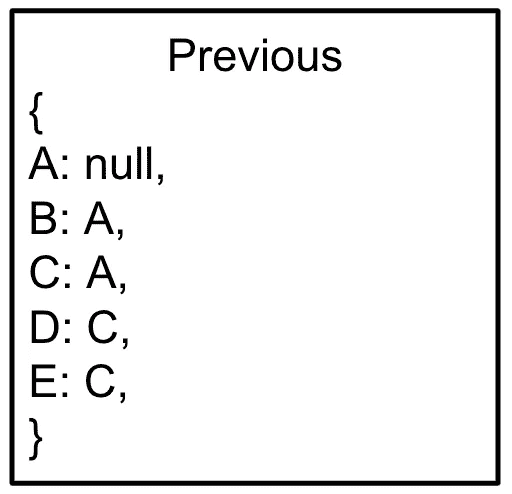
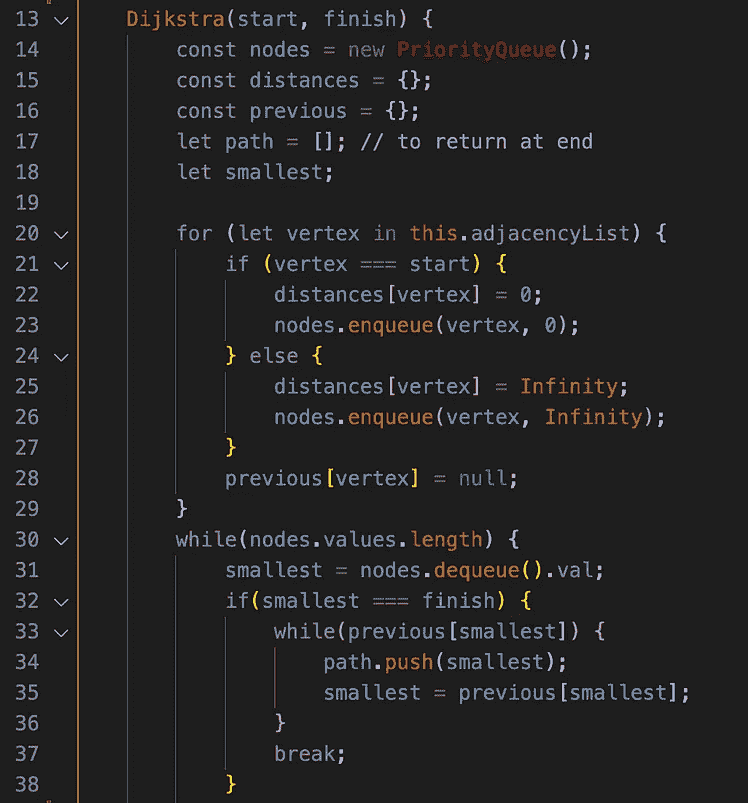
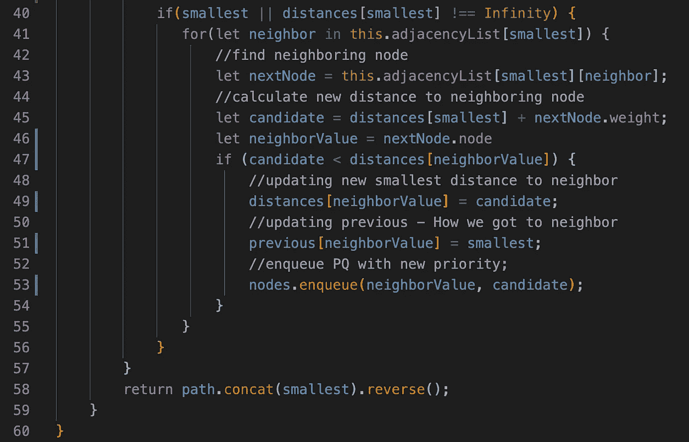

# 从零到迪克斯特拉

> 原文：<https://javascript.plainenglish.io/from-zero-to-dijkstra-5c00c929ceab?source=collection_archive---------9----------------------->

## 第四部分:结束


Photo by [Josh Riemer](https://unsplash.com/@joshriemer?utm_source=medium&utm_medium=referral) on [Unsplash](https://unsplash.com?utm_source=medium&utm_medium=referral)

我们到了。祝贺你在博客系列中走到这一步，但是最艰难的战斗还在后面。让我们看看到目前为止我们已经实现了什么。

# 我们学到了什么

*   二进制堆
*   优先级队列
*   图表(加权和未加权)
*   图形遍历

有了所有这些知识，我们应该只需要一点计划和预先考虑就能够实现 Dijkstra 算法。让我们用伪代码和图表来完成一些步骤。

# 设置



Weighted Graph

这是我们的加权图。为了我们算法的目的，假设我们想要找到从 **A** 到 **E.** 的最短距离，这些是我们 Dijkstra 算法需要的自变量，a **开始**和 a **结束**。我们如何着手解决这个问题？嗯，我们需要实现一个修改过的图遍历方法，查看 A 的每个邻居，找到 A 和邻居之间的最短距离。然后，我们对每个*的邻居*重复这个过程，总是更新从 A 到顶点的最短距离。



Tracking our shortest distance and the pathway to get there

在左边，我们正在记录从 A 开始到任意顶点的最短距离。到目前为止，我们只知道从 A 到 A 的距离是 0。其余的可以使用**无穷大**作为占位符，因为当我们穿越图表时，我们将用当时最小的距离替换那个无穷大(当找到更短的路线时，它可以改变多次，但我们只是从无穷大开始)。

右侧在记录我们正在走的路线。因为我们是邻居到邻居的旅行，我们只需要跟踪**前一个**节点。因为从 A 到 D 的最短路径是通过 C，所以我们的对象应该是这样的:

```
{
'A': null,
'C': 'A',
'D': 'C'
}
```

为了更清楚起见，我省略了其他节点，但是您可以看到，如果我们沿着路径中的“前一个”节点，我们最终会回到 A(它总是将 **null** 作为它的前一个节点，这让我们可以打破我们的一个循环)。

# 演练

让我们通过第一次迭代来查看 A 的邻居，看看这如何改变我们的图表。


Weighted Graph

还记得第三部分中的**邻接表**吗？我们可以通过遍历键“A”处的邻接表来遍历 A 的邻居。我们前往 **B** ，记录到达那里的距离。我们看到目前是 **3** 。然后，我们检查 3 是否小于最短距离表中的值。嗯，这是我们第一次通过，所以它是当前的无限和 3 小于无限。我们更新我们的表并更新我们的**先前的**对象。

我们做的最后一件事是**将**这段距离放入**优先级队列中。**优先级队列很有帮助，因为每当我们将一个节点排入队列时，它都会重新排列自己，使其始终具有到顶端的最短距离**【bubble up()】**。现在，当我们选择下一个要看的顶点时(在看了 A 的所有邻居之后)，它将是离 A 的下一个最短距离。

在查看了 A 的两个邻居后，我们来看看我们的表:



Updated Distances and Previous Object

让我们再看一遍，看看它是如何更新我们的表的。查看我们的图表，我们可以看到 **C** 目前是距离 A 的下一个最短距离(A 在这一点上已经**出列**，所以下一个最短距离是 2)。现在，我们对 C 的邻居重复这个过程。

我们知道 A 到 C 已经更新了，所以不会改变，但是我们可以追踪到 D 和 e 的距离。记住，我们追踪的是从 A 到 D 的最短距离**！**因此，我们在挨家挨户拜访时，必须将其他短距离加起来。C →D 是 1，C →E 是 4，因此，加上我们已知的“C 距离”,我们的新表将如下所示:



Updated Charts

你可以看到，当我们比较时，如果我们注意到有更好的路径，我们将更新我们的最短距离。比如，我们可以看到，到 E 的最短距离显然是从 A-C-D-E，一旦迭代 D 的邻居，图表就会更新。

**重要提示:**一个可能难以理解的重要概念是“我们何时知道何时停止循环？”我们必须确保我们只将被发现为**更短路径的邻居排队，**这样我们就可以不断地重新检查最短路径，看看它是否比我们当前的路径更有效。我们当前到 E 的路径似乎是完整的，但是当我们迭代 B 和 D 的邻居时，我们将很快看到 E 将被更新。一旦 E 到达队列的顶部，我们将结束，因为我们知道 E 是在最短的距离(优先级队列将没有更短的距离来检查)。

让我们将已经采取的步骤改写成一些(非常宽泛的)伪代码:

# 伪代码

1.  该函数应该接受一个**开始**和**结束**顶点作为参数
2.  创建一个**距离**对象，看起来像我们的初始距离表
3.  创建一个类似上面的**前一个**对象
4.  将每个顶点添加到**优先级队列**
5.  只要优先级队列有值，就开始一个循环

*   让一个顶点出列，并遍历它的每个邻居(使用**邻接表**)。如果顶点是我们的**终点，**我们就大功告成了！
*   计算**起点**和我们当前顶点之间的距离
*   如果该距离小于我们存储的距离:

1.  更新**距离**和**先前的**对象，并用新的更小的距离将该顶点排队。

**代码**

首先，让我们设置我们的对象和变量。

```
function Dijkstra(start, finish) {
    const queue = new PriorityQueue();
    const distances = {};
    const previous = {};

    let path = []; // to return at the end
    let smallest;
```

如果你遵循伪代码，这是很容易理解的，但是我们正在初始化我们的临时**最小**变量，以便在测试不同路径时与我们的**距离**对象进行比较。

```
for (let vertex in this.adjacencyList) {
    if (vertex === start) {
        distances[vertex] = 0;
        queue.enqueue(vertex, 0);
    } else {
        distances[vertex] = Infinity;
        queue.enqueue(vertex, Infinity);
    }
    previous[vertex] = null;
}
```

这个块只是初始化我们的**先前的**和**距离**对象，看起来像上面的图表。它使我们的起始顶点的距离保持为 0，而其他顶点的距离为无穷大。

```
while (queue.values.length) {
    smallest = queue.dequeue().val; if (smallest === finish) {
        //INSERT CODE TO END THE LOOP. WE'RE DONE
    }    if (smallest || distances[smallest] !== Infinity) {           for (let neighbor in this.adjacencyList[smallest]) {
            let nextNode = this.adjacencyList[smallest][neighbor] ................ 
```

现在我们开始循环。我们出列并设置最小的等于该节点的*值*。记住，队列中的节点看起来像`{val: 'A', priority: 0}`

我们为我们将返回的`smallest === finish`设置一个占位符。然后，我们检查以确保我们实际上是将一个值出队，并且距离不是无穷大(以处理可能出现的错误，并确保我们的循环不会永远继续下去)。

最后，我们遍历当前顶点的邻接表中的每个`neighbor`。我们创建了一个名为`nextNode`的变量，看起来有点像`{node: 'B', weight: 3}`

```
..............
// Calculate the distance between this node and 'start'let candidate = distances[smallest] + nextNode.weight;
let neighborValue = nextNode.node;if (candidate < distances[neighborValue]) {
    // update 'distances' object
    distances[neighborValue] = candidate; // update 'previous' object
    previous[neighborValue] = smallest; // enqueue priority queue with new smallest distance
    queue.enqueue(neighborValue, candidate)
}
```

这个部分通过添加当前顶点的最小距离并将其添加到`nextNode.weight`来创建一个`candidate`变量，T6 是当前顶点和我们正在循环的邻居之间的距离。

然后，它检查这个`candidate`是否小于我们当前拥有的。如果是这样，它更新**距离**和**先前的**对象，以显示我们新的最短路径，并且**将该顶点排队**回到队列中。我们将它加入队列，因为现在我们已经更新了到我们所在节点的一条更短路径的信息，所以我们将想要再次循环通过那个顶点，即使我们之前已经到达过它。

最后，让我们回到完成循环的代码块:

```
if (smallest === finish) {
    while(previous[smallest]) {
        path.push(smallest);
        smallest = previous[smallest];
    }
    break;
}.............return path.concat(smallest).reverse();
```

我们看到，我们只是循环遍历我们的**前一个**对象，并沿着最短路径向后，将每个值推入我们的`path`数组。最后，我们必须连接**开始**变量(它将是 while 循环结束时最小的**变量),然后反转它，因为我们向后进行了操作。**

在函数结束时，`path`数组将从`['E', 'D', 'C']`到`['A', 'C', 'D', 'E']`显示最短的路径。

唷！这需要考虑很多，并且可能会与`neighborValue`和`nextNode`变量混淆，但是如果你在自己构建时`console.log()`这些变量，你会看到一切是如何组合在一起的。

让我们最后看一下组合在一起的代码。



Dijkstra’s Algorithm

就是这样！如果你通过了这个博客系列，我祝贺你。Dijkstra 的算法很难理解，但是你花在数据结构和算法上的时间越多，它就越有意义。对于真实世界的应用程序来说，这是一个很棒的工具，它可能会帮助你搞定下一次编码面试。

一如既往，我很乐意回答你在评论中提出的任何问题。编码快乐！

*更多内容请看*[***plain English . io***](http://plainenglish.io)