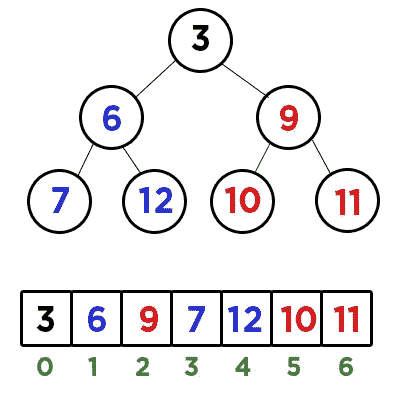
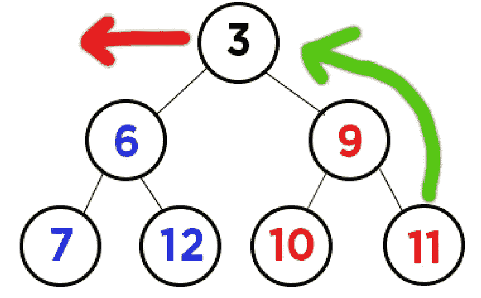
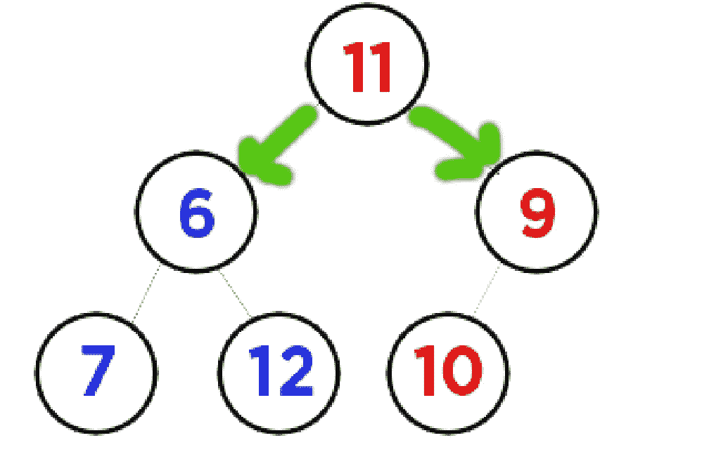
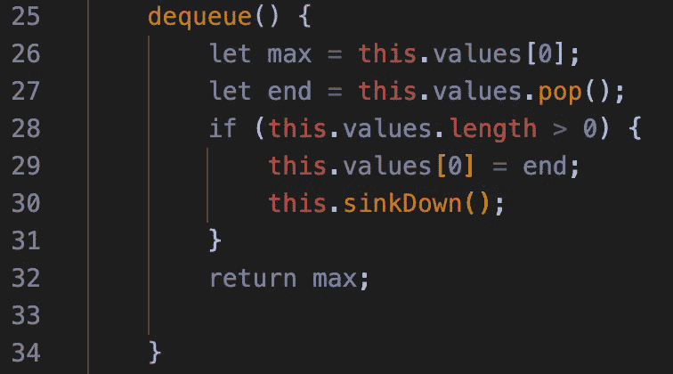
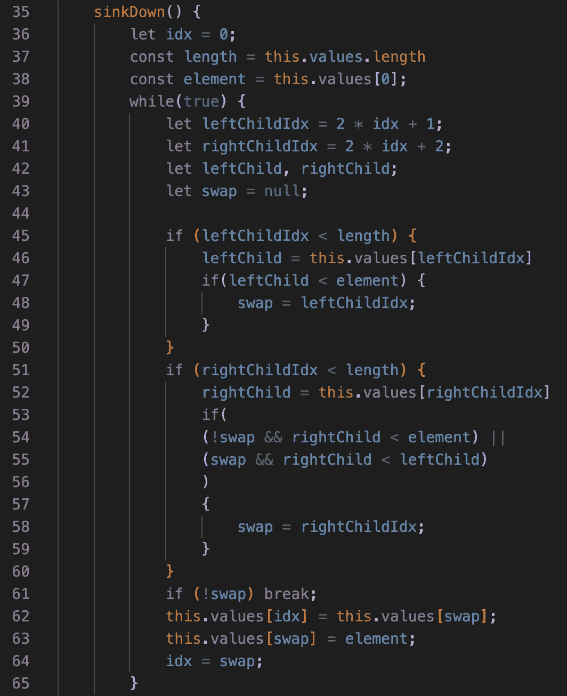
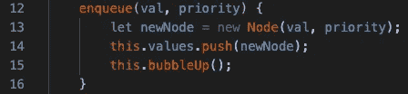
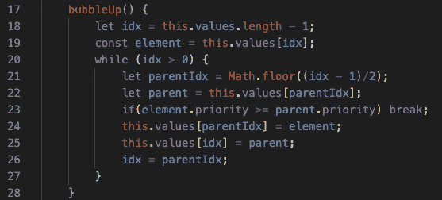
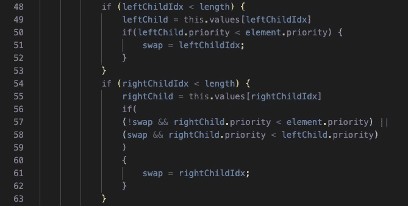

# 从零到迪克斯特拉

> 原文：<https://javascript.plainenglish.io/from-zero-to-dijkstra-part-2-a09e92a5ba8a?source=collection_archive---------11----------------------->

## 第 2 部分:出队和优先级队列

欢迎回来。这是我解构 Dijkstra 算法的博客系列的第 2 部分。如果你还没看过第 1 部分，我强烈建议你[回去](/from-zero-to-dijkstra-the-shortest-path-to-the-shortest-path-algorithm-f070e224f99e)看一遍，不然你会很失落。对于那些已经读过的人，我将快速回顾一下我们目前所知道的。

*   Dijkstra 算法用于查找图上任意两点之间的最短距离。
*   这意味着它可以广泛应用于谷歌地图、航班计算器，甚至电视流媒体“你可能也喜欢……”页面。
*   Dijsktra 的算法涉及到使用一个**优先级队列**，它可以用一个修改过的 min 二进制堆来实现。
*   **最小二进制堆**是树结构，其中每个父节点最多有 2 个子节点，并且每个子节点大于其父节点。
*   我们可以**将**值放入我们的堆中，方法是将它们推到数组结构的末尾，并允许它们**冒泡**到顶部。



Our Min Binary Heap w/ Array

# 出列介绍

当从最小二进制堆中出列时，我们将提取树的根(在我们的例子中是 **3** )。因为根总是最小值，所以需要用下一个最小值替换它，整个树需要重新排列，以确保它保持基本结构。

修正树的最简单的方法是用具有最少依赖性的项替换根(在我们的例子中是 **11** ，因为它是数组的结尾，所以它肯定没有子元素)。



Visualization

一旦 **11** 处于根位置，我们需要通过与它的两个子节点进行比较，让它**下沉到正确的位置。根据 min 二进制堆的性质，其中一个子堆将是新的最小值，并且可以牢牢地占据它作为根的位置。然后我们的 floating **11** 值重复这个与其子节点进行比较和交换的循环，直到它到达它所属的位置。**



Comparing Our New Root With Its Children

现在，我们的 **11** 元素将把自己与其子元素进行比较。较小的将成为新的根，并且 **11** 将继续其向下的旅程，直到它在正确的位置结束。

让我们对代码做一些初步的设置。就像**入队**一样，我们将使用一些基本代码来设置初始出队，并使用强大的“下沉”帮助函数来完成剩下的工作。

```
dequeue() {
    let min = this.values[0];
    let end = this.values.pop();
    if (this.values.length > 0) {
        this.values[0] = end;
        this.sinkDown();
    }
    return min;
}
```

就是这样！我们在根处初始化最小值，并在数组的末尾弹出替换值。然后，我们检查数组中只有一个值的边缘情况(if 语句)。最后，我们将最终值替换到根位置，并开始下沉的过程。最后，我们返回出列的“min”值。

# 沉落

沉下心来有点疯狂，但是一旦你掌握了伪代码，这就很有意义了。所以，我们需要做的是:

*   初始化我们的下沉元素。树的新**根**
*   开始一个循环。
*   初始化我们的 **11** 元素的左右子索引。
*   如果 **11** 大于我们左边的孩子，记住，它可能会交换。
*   如果 **11** 大于左子代，也大于右子代，我们将比较左子代和右子代，并与最小值交换。
*   如果 **11** 小于它的两个子节点，那么它到达了正确的位置，我们完成了循环。

让我们来看看它的实际应用:

```
sinkDown() {
    let idx = 0;
    const length = this.values.length; // Easier to reference length
    const element = this.values[0];

    while(true) {
        let leftChildIdx = 2 * idx + 1;
        let rightChildIdx = 2 * idx + 2;
        let leftChild, rightChild;
        let swap = null;
```

在开始循环之前，我们初始化了堆根的索引和元素。这样我们可以引用元素 **11** 的值和它的索引号。一旦我们开始交换，指数将会改变。

然后，我们开始一个无限循环，当我们的“swap”值保持为空时，这个循环将会中断。请记住，如果没有可交换的值，我们就到达了正确的位置。我们通过使用在[上一部分](/from-zero-to-dijkstra-the-shortest-path-to-the-shortest-path-algorithm-f070e224f99e)中学到的技巧找到了 **leftChildIdx** 和 **rightChildIdx** :父节点的( **n)** 左右子节点的索引将分别等于 **2n+1** 和 **2n+2** 。

让我们看看如何为我们的左孩子设置交换支票:

```
if (leftChildIdx < length) { leftChild = this.values[leftChildIdx];

    if (leftChild < element) {
        swap = leftChildIdx;
    }
}
```

首先，我们检查 **leftChildIdx** 是否小于长度，这意味着它的值在数组 **this.values** 中。然后，我们使用索引号初始化 **leftChild** 的值，并将其与我们的原始元素 **11** 进行比较。


Checking if 6 is less than 11

由于 **6** 小于 **11** ，也就是它，我们新的**交换**值变为 6。现在我们要和右侧进行对比。为了保持我们的二进制堆尽可能的干净，我们要确保左边的孩子不要比右边的孩子大，因为我们希望总是与最小的孩子交换。

所以，概括一下:如果有一个**交换**值，我们检查右边的孩子是否更小。如果是这样，正确的孩子将成为新的交换对象。如果没有**交换**值，我们应该检查父元素是否小于正确的子元素。如果是这样，合适的孩子将成为新的交换对象**。**否则，没有理由交换，因为父元素小于它的两个子元素。

```
if (rightChildIdx < length) { rightChild = this.values[rightChildIdx]

    if ( 
    (!swap && rightChild < element) || 
    (swap && rightChild < leftChild)
    ) 
        {
        swap = rightChildIdx;
        }
    }
```

这看起来很吓人，但这正是我们刚刚讨论过的。它检查是否没有交换**和**right child**小于父元素。这意味着应该有一个合适的孩子交换。**或**如果有交换，但右孩子比左孩子小**。这意味着还有一个孩子交换。****

**最后:**

```
if (!swap) break;this.values[idx] = this.values[swap];
this.values[swap] = element;
idx = swap;
```

**如果没有交换值(记得我们将它初始化为空值)，那么我们就退出循环。元素在正确的位置！**

**否则，我们通过使元素的值等于交换值来就地改变数组，反之亦然。然后我们的元素 **idx** 将成为**交换**值，因为我们必须在新的位置重新开始循环。**

**这太多了，让我们在一个块中获得代码的完整视图:**

****

**Dequeue**

****

**Sinkdown**

**现在，我们制作的这个**最小二进制堆**和一个**优先级队列**之间的唯一区别是，优先级队列包含**节点**，它们同时保存一个值和一个优先级。让我们看看节点的类构造函数。**

```
class Node {
    constructor(val, priority) {
        this.val = val;
        this.priority = priority;
     }
}
```

**很简单。我们只有一个节点数组，而不是数字数组。这只改变了我们堆的一些东西。下面是 enqueue 方法。**

****

**Enqueue w/ Priority Queue**

**唯一的区别是，我们将一个节点推入值数组，而不仅仅是一个值。这将是未来的不同之处。当我们使用 **bubbleUp()** 和 **sinkDown()** 方法时，我们只是比较每个节点上的 **priority** 属性，而不是它们的值。**

**示例:**

****

**bubbleUp w/ Priority Queue**

**您可以看到这里唯一的区别是第 23 行使用了**元素。对于 **sinkDown()也是如此。******

****

**sinkDown w/ Priority Queue**

**同样，唯一的变化在第 50、57 和 58 行。**

**好了，这部分到此为止。内容很多，但我试图尽可能详细地解释每一行代码以及我们为什么要这样做。现在我们已经有了一个优先级队列，我们实际上可以继续我们最终的数据结构:**图。****

**谢谢你走到这一步，如果你有任何问题，请在评论中告诉我。编码快乐！**

***更多内容看*[***plain English . io***](http://plainenglish.io)**