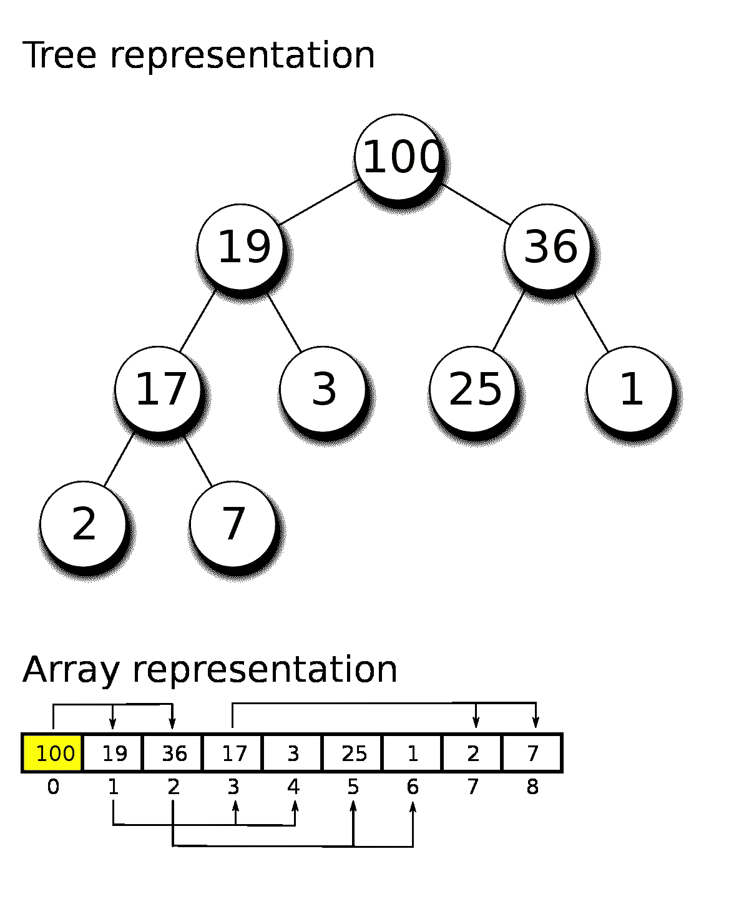
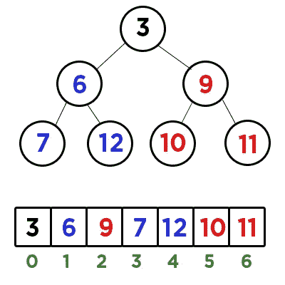

# 从零到 Dijkstra 最短路径到最短路径算法

> 原文：<https://javascript.plainenglish.io/from-zero-to-dijkstra-the-shortest-path-to-the-shortest-path-algorithm-f070e224f99e?source=collection_archive---------7----------------------->

## 第 1 部分:二进制堆和排队

任何花时间研究数据结构和算法的程序员都听说过臭名昭著的“Dijkstra 算法”。这是一种由荷兰计算机科学家 Edsger Dijkstra 发现的复杂算法，它可以找到图上任意两点之间的最短路径。


Edsger Dijkstra (image from Wikipedia)

任何基本的 DS&A 课程都可能以重新创建 Dijkstra 算法而告终，因为它需要许多不同的数据结构和问题解决模式的知识，这些知识最终形成最终产品。

这个博客系列的目标是教你如何从几乎没有数据结构的知识开始解决这个算法。在我们开始之前，您应该有一些基本的必备知识:

*   Javascript 基础——数组和对象
*   [JS 中的类](https://developer.mozilla.org/en-US/docs/Web/JavaScript/Reference/Classes)

就是这样！其余的可以在对任何其他数据结构一无所知的情况下教授。让我们从 Dijkstra 之旅的第一部分开始:优先级队列和二进制堆。

# 什么是优先级队列？


Photo by [Mael BALLAND](https://unsplash.com/@mael_balland?utm_source=medium&utm_medium=referral) on [Unsplash](https://unsplash.com?utm_source=medium&utm_medium=referral)

优先级队列对 Dijkstra 算法很重要，原因将变得显而易见，但现在，让我们只讨论它们是什么。“队列”是遵循**先进先出(FIFO)** 规则的数据结构。这意味着，首先放入队列的数据将首先被处理。想象一下在熟食店排队，你拿着一张票，你的号码按照你收到票的顺序被叫出来。

优先级队列是一种特殊类型的队列，其中每条数据(在本例中是一个**节点**)都有一个优先级。把它想象成一家医院:你两个小时前因胃痛入院。尽管你已经等了很长时间，但受枪伤的人会被第一个看到。他有更高的优先权。

因为队列一次处理一个数据(**入队**和**出队**)，所以唯一重要的问题是“最高优先级的项目是什么？”因此，数据结构知道什么要出列，新节点在哪里排队。实现这一点的简单方法是使用**二进制堆。**

# 什么是二进制堆？

这是一个好问题。二进制堆是一种**树**结构。不要害怕，你以前见过树(DOM 像树一样设置)。树只是父母和孩子的集合。


Photo by [Adarsh Kummur](https://unsplash.com/@akummur?utm_source=medium&utm_medium=referral) on [Unsplash](https://unsplash.com?utm_source=medium&utm_medium=referral)

二进制堆是一棵树，其中每个父节点最多只有两个孩子。在**最大二进制堆**中，每个子堆的值都小于父堆的值。参见下面的例子。



Max Binary Heap

一个 **min 二进制堆**也是同样的想法，除了在孩子比父母大的时候。您可能会看到这对于优先级队列是多么有用。如果我们有一个最小二进制堆，我们将能够推断出**最低值节点**必须总是树的根。如果我们总是在甲板上有最低的价值，那么这听起来像一个优先队列。

如果我们总是让**从顶部的**出列，我们将总是取**的最低值**。这意味着，如果我们将优先级设置为最低值是最重要的，我们可以始终确保将优先级最高的节点出队。让我们开始吧。

# **实现最小二进制堆**

让我们从最小二进制堆开始，因为它比直接进入优先级队列稍微简单一些，并且从一开始就更有意义。



Min Binary Heap and Corresponding Array

正如您在这张图片中看到的，我们有一个最小二进制堆。节点可以用一个简单的数组来表示。只要我们保持最小二进制堆的规则稳定，我们就可以用数组来表示它:

*   根是最小值
*   每个节点最多有 2 个子节点
*   孩子总是比他们的直系父母大。
*   在创建另一个层之前，填充每个子节点。

你会注意到我用颜色标记了父母和孩子，以便更容易看到他们在阵列上的位置。如果进一步推断该模式，您会注意到父索引与其子索引之间的关系是*(其中 n = parent index)****2n+1****(*左子 *)* 或***2n+2****(*右子*)。*

我们可以使用这种关系来“交换”数组中的值，本质上是改变堆的布局，同时只操纵数组结构。

## **入队(二进制堆)**


Min Binary Heap

假设我们想将数字“4”添加到我们的堆中。我们可以断定它不会成为根(它大于 3！)但它应该作为“3”的直接子级，因为它是堆中下一个最小的值。我们可以通过在数组结构的末尾添加“4 ”,并编写一个算法来比较/交换它的值和它的父值，直到它将堆“冒泡”到正确的位置。

这很简单。让我们首先编写一个名为“最小二进制堆”的类，并使用这个“冒泡”功能创建一个简单的“入队”函数。

```
class MinBinaryHeap {
    constructor() {
        this.values = [];
    }

    enqueue(element) {
        this.values.push(element);
        this.bubbleUp();
    }
```

如您所见，我们的 MinBinaryHeap 只是一个由 **this.values.** 引用的数组。我们的 enqueue 函数只是将新元素推到数组的末尾，然后调用我们方便的 **bubbleUp()** 函数来确定放置位置。要是 **bubbleUp()** 是一个内置函数就好了！但是不行，我们必须自己建造它！

首先，我们需要一种识别“新”元素的方法，以及它的父节点是什么。还记得公式 *2n+1 或者 2n+2 吗？*好吧，我们可以反过来用以下方法找到父节点:

```
//Reference 'new' Element
let idx = this.values.length - 1;
const element = this.values[idx];//Find 'parent' element
let parentIdx = Math.floor( (idx-1) / 2 );
let parent = this.values[parentIdx];
```

“new”元素的索引是数组中的最后一个索引。由于我们正在反转 *2n+1 | 2n+2* 公式，我们可以“Math.floor”找到单亲索引，不管我们是在左边还是右边的孩子。

现在，我们可以实现一个“while”循环，在父元素和子元素之间进行交换，直到我们的“new”元素到达一个点，在这个点上，它要么到达堆的顶部，要么比它的父元素大(这样就不需要进一步交换)

```
//while the index is NOT the top of the heapwhile(idx > 0) {
// if the child element is greater/equal to the parent, exit the loop

    if (element >= parent) break;// else, swap parent and child and reassign the 'new' element's index to be what the parent's was. if (element > parent) {
        this.values[parentIdx];
        this.values[idx] = parent;
        idx = parentIdx;
}
```

让我们来看看整个 **enqueue()** 和 **bubbleUp()** 函数是如何写出来。


enqueue() and bubbleUp()

还不算太糟，是吧？这个教程有点长，但是让我们回顾一下我们已经学了什么和我们还需要学什么。

## 我们学到了什么

*   什么是优先级队列？
*   什么是最小/最大二进制堆？
*   我们如何将新值放入二进制堆？

在下一节中，我们将处理更复杂的 **dequeue()** 函数，然后看看如何将这个二进制堆变成传说中的优先级队列(提示:这比您想象的要简单得多)。

感谢您的阅读，如果您有任何问题或有其他数据结构/算法主题希望我介绍，请在评论中告诉我。

*更多内容请看*[***plain English . io***](http://plainenglish.io)