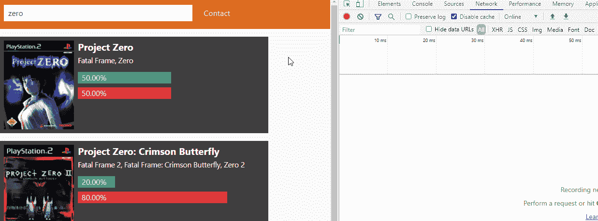

# 从零到网络英雄[3] —详细页面

> 原文：<https://javascript.plainenglish.io/from-zero-to-webhero-3-detail-page-f755c2904a85?source=collection_archive---------18----------------------->

## 今天，我们将开发游戏详情页面，这将显示如何回溯兼容一个游戏，它将允许用户分享他们的游戏体验。


Photo by [Gabriel Tovar](https://unsplash.com/@gabrielrana?utm_source=medium&utm_medium=referral) on [Unsplash](https://unsplash.com?utm_source=medium&utm_medium=referral)

上周我们开发了游戏列表，包括后台和前台，将根据用户的查询显示所有游戏。如果你想看，我会等你。

本周，我们将开发游戏详情页面。该页面将显示用户对某个游戏的回溯兼容性的投票和评论，如果游戏没有被锁定，它将允许这些用户分享他们的体验。

如果想直接跳到代码，可以在这里找到[。](https://github.com/omirobarcelo/retro-ps5/blob/part3)

# 游戏详情页面

为了创建后端路由，我们遵循与列表相同的过程:我们用路由的名称创建一个文件，在本例中，`/game`中的`[id].json.ts`。`[id]`将被动态替换为游戏 id。`.json`很重要，因为没有它，Sapper 将无法区分前端`/game/[id].svelte`路线和后端`/game/[id].ts`路线。有了‘route’集合，我们声明 GET 函数并测试它。


Response from GET

因为我们是在 TypeScript 世界中，所以我们为我们的后端响应定义了一个类型。

在游戏详情页面中，Sapper 允许我们添加一个脚本来预取路线数据，从而加速页面的加载和渲染。这个脚本返回模板使用的数据。

为了激活预取，我们需要将`rel=prefetch`添加到指向我们路线的链接中。在我们的场景中，这将告诉 Sapper 在用户悬停在游戏卡上时执行预取脚本。

```
<a rel="prefetch" href="game/{game._id}">
  <div class="card">
    ...
  </div>
</a>
```



Prefetching in action

对于游戏详情页，我们有更多的空间展示用户投票的结果；饼图将是他们的一个很好的代表。我的渲染图是一个 SVG 饼图，来自于这篇文章。

下一步是显示游戏的评论。对于每条评论，我们将显示其发布日期。当格式化日期时，我们遇到一个错误:`comment.date`不是一个日期对象。

原来 fetch 的`res.json`没有将日期字符串解析成日期对象。`JSON.parse`接受一个 reviver 函数，一个将 JSON 字符串解析成 JavaScript 对象的函数，但不接受`res.json`，并且我们不能在`res.json`之后执行`JSON.parse`，因为我们不能解析对象。有一个解决方法:使用`res.text`，然后使用`JSON.parse`和 reviver 函数来解析日期字符串。

可以在[这里](https://mariusschulz.com/blog/deserializing-json-strings-as-javascript-date-objects)和[这里](https://stackoverflow.com/questions/58463173/how-to-use-reviver-function-with-fetch-response-json)找到该解决方案的有用资源。

但是一个流行的游戏可能有很多评论，所以我们需要为它们实现某种分页。我们将使用 Svelte 的反应声明来决定显示评论列表的哪一部分。

投票区将包括两个按钮，正面或负面评价，一个可选评论的文本区，和一个发送按钮。如果游戏被锁定，这个区域将被隐藏。在选择投票类型之前,“发送”按钮将保持禁用状态。

# 投票和评论

视图集和投票区实现后，下一步是创建更新游戏的后端路径，并用更新后的数据重新呈现视图。

我们可以使用与获取游戏细节相同的更新路径`/game/[id].json`，所以我们只需要在`[id].json.ts`中定义一个`put`或`patch`函数。

Mongoose 提供了执行原子更新的`findOneAndUpdate`。为了能够使用这个函数，我们需要用`useFindAndModify: false`更新我们的数据库连接。

```
const connectDb = (db: string) => {
  return connect(db, { useNewUrlParser: true, useUnifiedTopology: true, useFindAndModify: false });
};
```

随着连接的更新，我们实现了一个`patch`函数，在这个函数中，我们更新了投票计数，并在发送评论时添加评论。

对于客户端，我们也需要用 reviver 解析补丁的响应。

此外，我们需要将所有的评论、投票文本和饼图数据更改为反应性陈述，以便它们相应地更新。


Game Detail page showcase

我们又一次到达了终点。下次我们将创建联系页面。现在，用户有能力与我们的网站互动，他们可能有一些问题或想法。

你可以在[https://github.com/omirobarcelo/retro-ps5/blob/part3](https://github.com/omirobarcelo/retro-ps5/blob/part3)中看到到目前为止的所有代码。

谢谢你陪我走过这段旅程！我希望你喜欢他的系列，下周[见](/lets-build-a-svelte-app-a4050db53e79)！

# 参考

[](https://medium.com/hackernoon/a-simple-pie-chart-in-svg-dbdd653b6936) [## SVG 中的简单饼图

### 学习三角学三重奏——sin cos 和 tan——是我 reverso 愿望清单的第一项(我希望……

medium.com](https://medium.com/hackernoon/a-simple-pie-chart-in-svg-dbdd653b6936) [](https://mariusschulz.com/blog/deserializing-json-strings-as-javascript-date-objects) [## 将 JSON 字符串反序列化为 JavaScript 日期对象

### 使用自定义约定，JSON.parse()函数可以将 JSON datetime 字符串转换成正确的 JavaScript 日期…

mariusschulz.com](https://mariusschulz.com/blog/deserializing-json-strings-as-javascript-date-objects) [](https://stackoverflow.com/questions/58463173/how-to-use-reviver-function-with-fetch-response-json) [## 如何通过 fetch.response.json()使用 reviver 函数

### 感谢贡献一个堆栈溢出的答案！请务必回答问题。提供详细信息并分享…

stackoverflow.com](https://stackoverflow.com/questions/58463173/how-to-use-reviver-function-with-fetch-response-json)