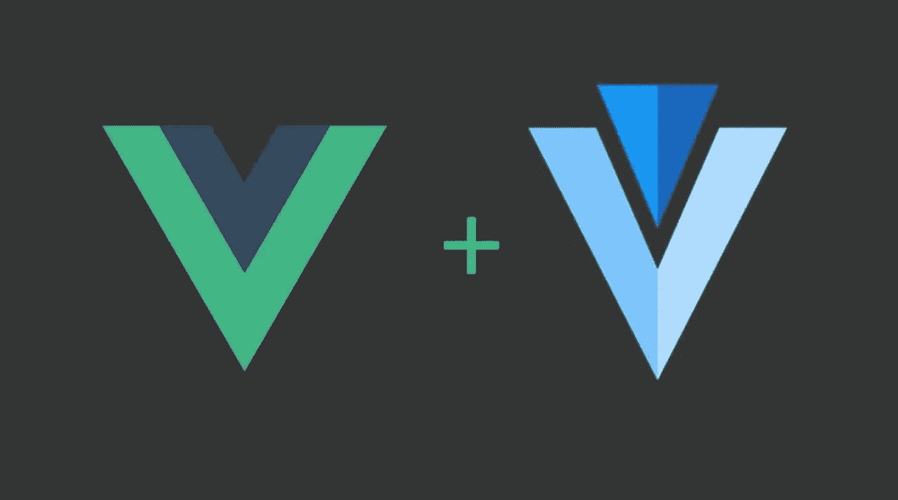

# 带有 Vuetify 的 Scaffold Vue.js 应用程序

> 原文：<https://javascript.plainenglish.io/front-end-scaffolding-with-vuetify-aebea69ce313?source=collection_archive---------15----------------------->

搭建是前端应用程序最重要的方面之一，涉及用户体验、响应能力和组件可重用性。Vuetify 是一个令人惊叹的 Vue UI 库，用于开发令人惊叹的前端应用程序。当我开始学习一个新的 UI 库时，有时会遇到这样的错误:从 UI 组件开始。但是很快我就需要回过头来深入了解脚手架是如何工作的，以最少的努力来布局我的应用程序，而不需要编写特定的代码。

# 线框

验证线框(定义见[官方文件](https://vuetifyjs.com/en/getting-started/wireframes/#examples))“*是模板，旨在为布局、分层和阴影*提供一致的方法。

线框建立在 4 个基本布局系统组件上:

*   *v-app-bar*；位于用户界面顶部的应用程序栏，带有应用程序图标、导航菜单等；
*   *v 型主*；放置用户界面内容的位置；
*   *v 形页脚*；放置在用户界面的底部，用于特定于页面上下文的其他操作。

> 当你开发 UI 时，你总是问自己的主要问题是这 3 个块的位置；滚动用户界面或者改变它的内容不应该影响你的视图，而是要适应它。Vuetify 提供了一个特定的简单属性，您必须在顶层和底层组件上声明它，这样就不用费力了。

# 应用程序属性

Vuetify，*"定义的 app 属性将组件指定为应用程序布局的一部分。用于动态调整内容大小。使用此道具的组件应该驻留在* `*v-main*` *组件的* *之外的* ***中才能正常工作。您可以在* [*应用页面*](https://vuetifyjs.com/en/components/application/) *找到更多关于布局的信息。”***

**注意:**该道具自动将**位置:固定**应用于布局元素。您可以使用`absolute`属性覆盖该功能。

所以，你只需要在你的<v-app-bar>中声明 app 属性(对于<v-footer>也是一样)，内容就会调整它的大小，保持 app-bar 在顶部，并在后面滚动。</v-footer></v-app-bar>

*更多内容请看*[***plain English . io***](http://plainenglish.io)