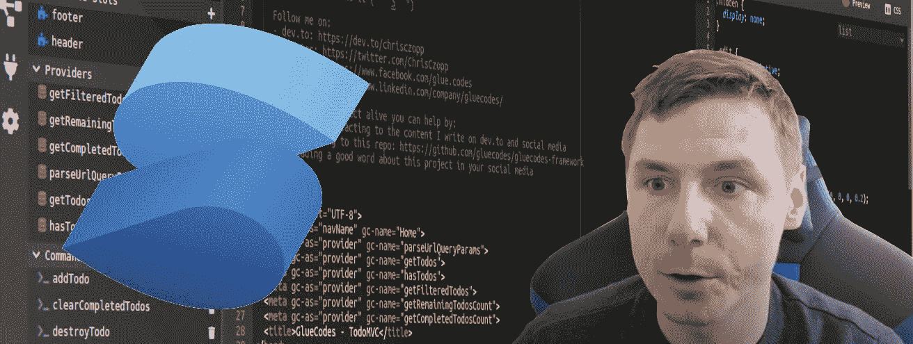
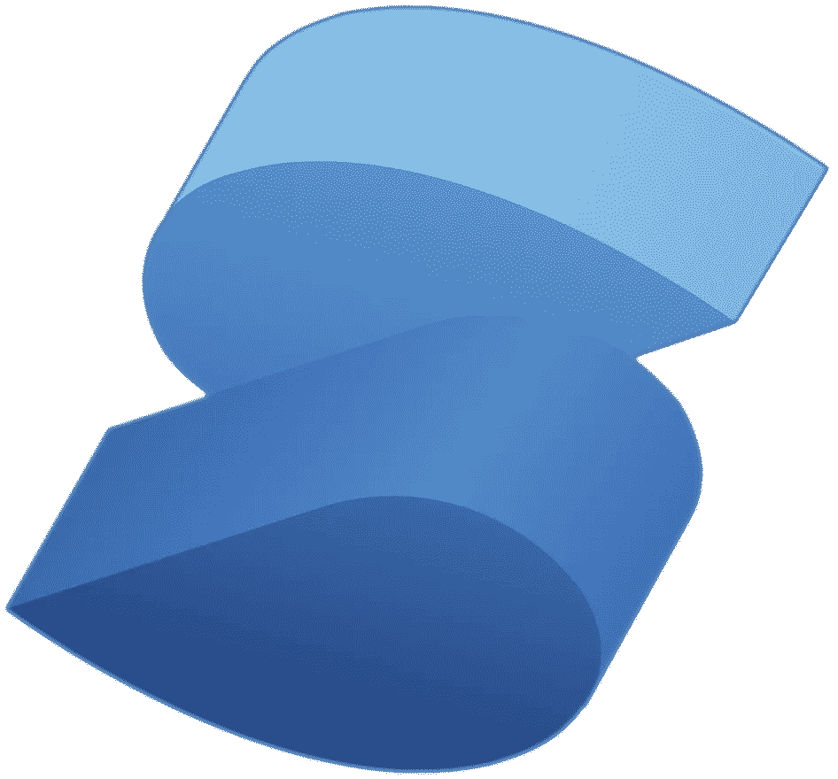
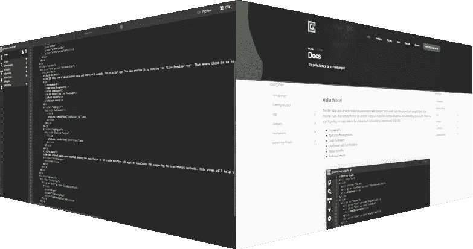
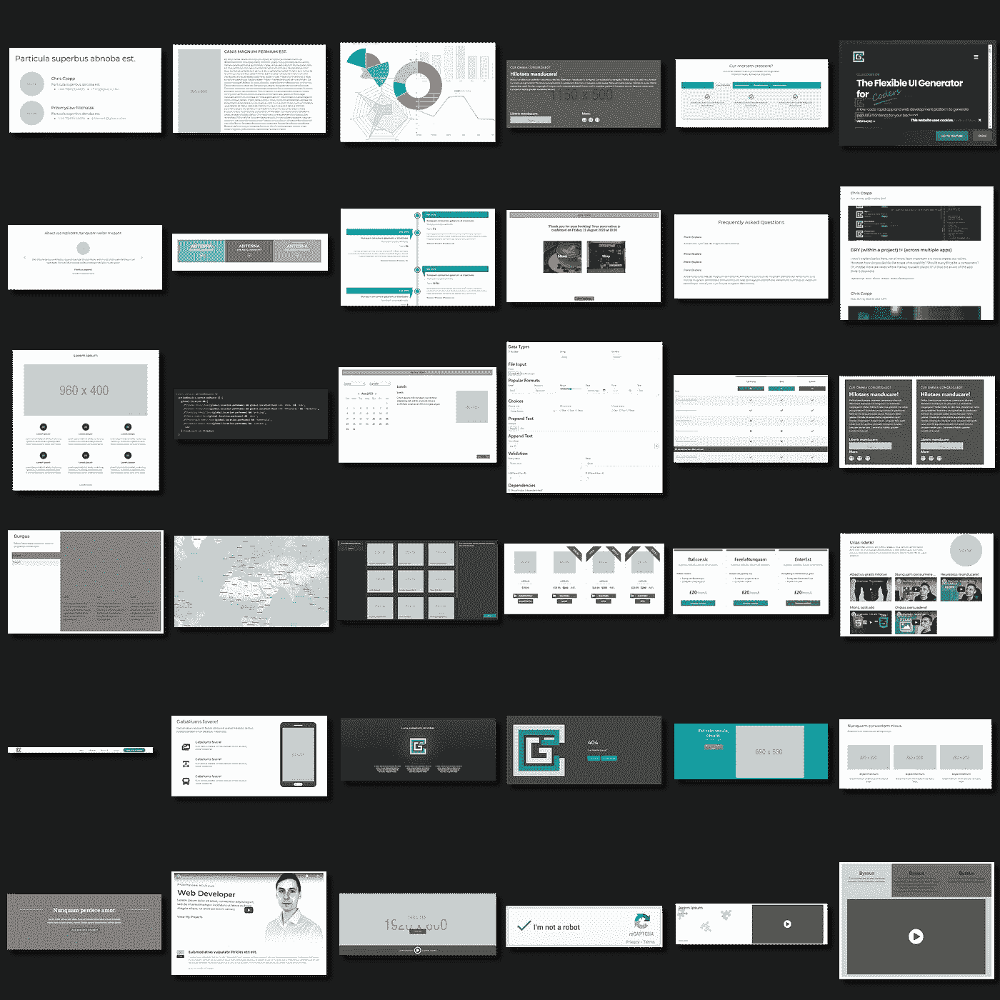
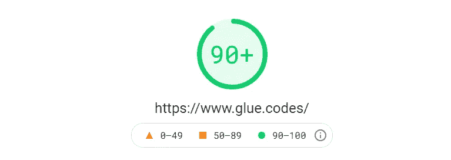

# GlueCodes:由 SolidJS 支持的前端工作室

> 原文：<https://javascript.plainenglish.io/front-end-studio-powered-by-solidjs-2840934730b?source=collection_archive---------8----------------------->



我想展示一下我过去一年一直在做的项目。这是一个工作室，有一个内置的 IDE，一个小部件的仓库，它自己的元框架，它由 SolidJS 提供支持，并输出代码以清理 JSX。

这只是我们设法实现的所有功能的一小部分，所以你可以在下面阅读更多内容，或者直接观看我上传到 YouTube 上的视频

## SolidJS

首先也是最重要的——它运行 SolidJS。当我们一年前开始构建第一个原型时，我们使用的是虚拟世界。由于该库似乎已经被放弃，其性能也不是最大的，我们决定在年初用 SolidJS 替换它。这不仅给了我们工作室和导出代码巨大的性能提升，还允许我们为开发人员实现更多的功能，如 UI 信号。



## 你所需要的只是你的浏览器…

…一切都在本地进行。该工作室不仅将你的项目存储在你的硬盘上以确保其安全，还将代码直接传输到你的 PC 上，这使得它很快，因为它不需要任何云服务来显示。


## 现场预览

无需安装，从一开始就准备就绪。只需打开带有实时预览的新标签，将它拖到不同的屏幕上，就可以一边打字一边欣赏所有的修改。



## 实施助理

现在让我们深入了解一下工作室是如何快速开发 web 应用程序的。Implementation Assistant 会在您键入时扫描您的代码，并向您提供关于项目内部需要完成哪些工作的上下文通知。当开发人员触发 Implementation Assistant 时，它会创建所有必要的文件夹、文件、粘合代码，并将所有内容放入项目结构中，只暴露您键入代码的文件，以便为您的 web 应用程序添加新功能。

## 小工具

请不要期望这里有简单的下拉菜单、按钮、输入或者天知道你还能想到什么简单的元素。小部件是独立的 UI 块，让您在几分钟内就可以原型化简单的登录页面或高级管理面板。目前，我们开发了 70 多个，从简单的块演示器一直到高级的数据表和表单。所有这些都可以通过一次点击安装到您的项目中。

您可以通过使用一个简单的 JSON 对象来编辑它们的内容，并使用限定范围的 CSS 或全局样式对它们进行样式化(我们还计划使用社区创建的预制全局样式来打开存储库)。当然，在安装之前，它们完全可以响应，并且它们的文档可以在工作室内找到。



## 可重复使用的插槽

导航、页脚、cookie 同意通知、弹出窗口——您认为应该在多个页面上重用的所有内容都可以在可重用插槽中开发(也可以在那里安装小部件),并通过粘贴一行 HTML 来重用:

```
<div gc-as=”slot” gc-name=”footer”></div>
```

## HTML 指令

循环、条件、错误提示等等都可以使用简单的“gc”指令来完成。这绝对是一个太广泛的主题，在这里写更多。所以，在不久的将来，我一定会单独写一篇关于它的博客。但是如果你好奇，看看我们的[文件](https://www.glue.codes/docs.html)

## 式样

对于所有的小部件、插槽或可重用插槽，Studio 会创建单独的 CSS 文件，您可以使用这些文件来设计 web 应用程序的各个部分，而不会干扰其他部分。另一方面，你可以使用全局样式一次编辑整个应用程序，这有助于保持一致的设计。

由于作用域文件总是优先于全局样式，你可以在你的页面上创建 10 个标题，全局设置它们的大小、边距和填充，并使用作用域 CSS 改变每个标题的颜色。

## 自举和字体真棒

由于这两个库非常受欢迎，我们决定在工作室内部实现它们。因此，您可以从一开始就使用它们，而不需要寻找它们的依赖关系等等。如果你不是它们的忠实粉丝，或者你只是在做一个不会用到它们的项目，没问题。您可以很容易地从依赖项中删除它们。

## 导出的代码

代码被输出到由 SolidJS 支持的整洁有序的 JSX。它还带有 docker 和 webpack 设置。你可以将它直接部署到你的主机服务中，或者使用终端构建它，然后在工作室之外继续开发。

我最近制作了一个视频，展示了导出的代码在 Google Insights 中的表现。您可以在这里找到它:



是的，这只是我们在工作室开发的所有东西的一小部分，但我不想保留太久。我们肯定会继续制作新的视频和博客，展示关于特定功能的更多细节，但适应社区对我们来说很重要。因此，任何建议将不胜感激。

我将留下一个 GlueCodes 工作室演示的小视频，向您展示这里描述的一切在实践中是如何工作的。

你也可以试试这里的工作室:

[www.glue.codes](https://www.glue.codes)

*更多内容尽在*[*plain English . io*](http://plainenglish.io/)