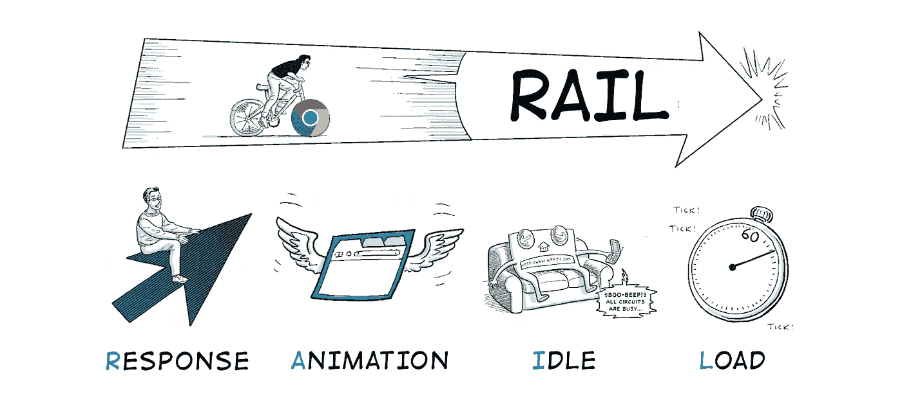
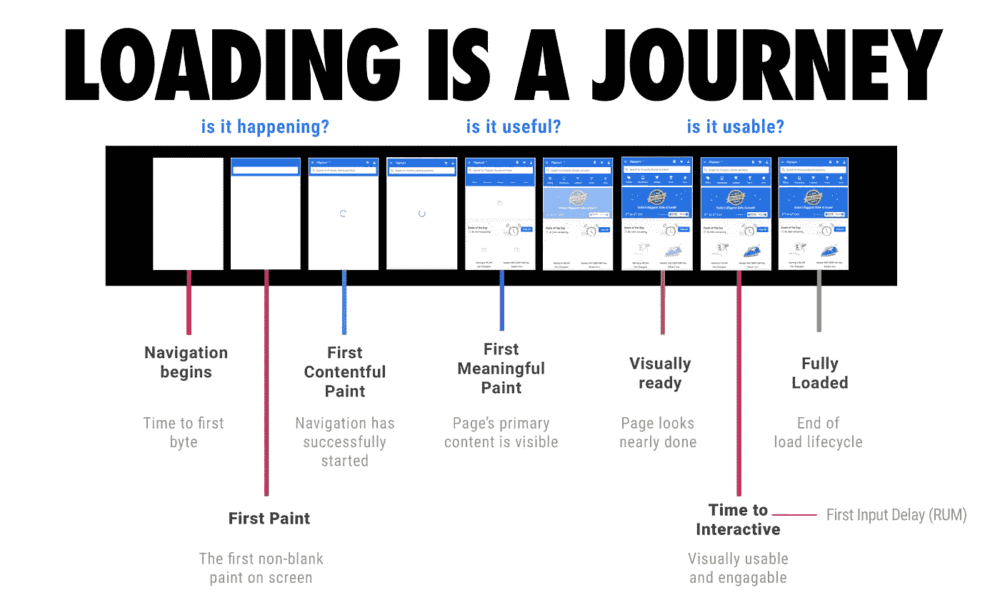
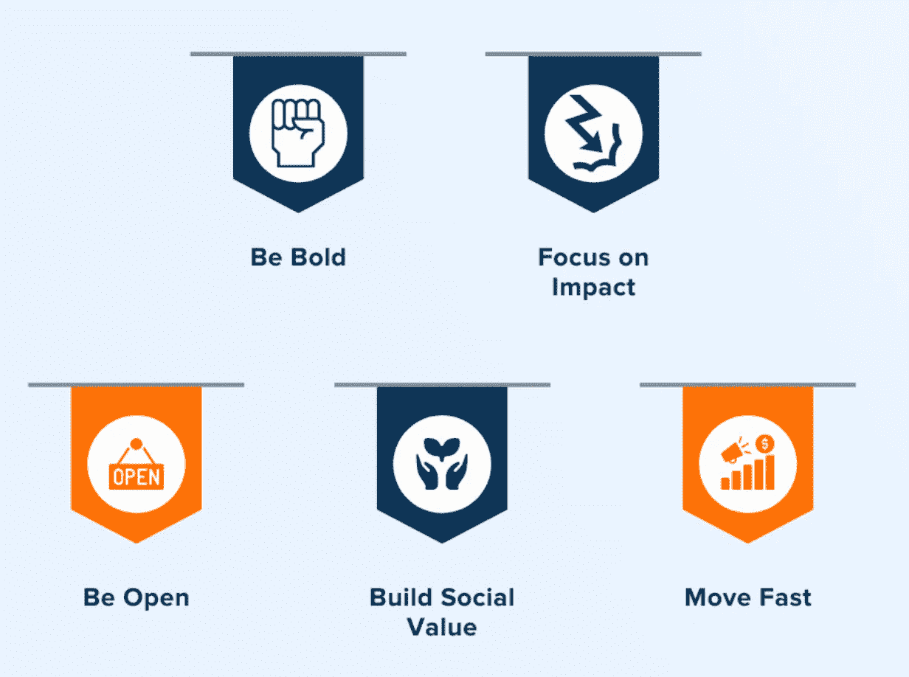

# 前端系统设计指南

> 原文：<https://javascript.plainenglish.io/front-end-system-design-guide-9a11381f5e81?source=collection_archive---------1----------------------->

## Web 开发人员面试备忘单

# 什么是系统设计？

> **系统设计**是设计系统元素的过程，如架构、模块和组件、这些组件的不同接口以及通过该系统的数据。

系统设计过程的目的是提供关于系统及其系统元素的足够详细的数据和信息，以使实现与系统架构的模型和视图中定义的架构实体一致。

# 系统的要素

*   **架构** —这是定义系统的结构、行为和更多视图的概念模型。我们可以使用流程图来表示和说明架构。
*   **模块—** 这些是处理系统中一个特定任务的组件。这些模块的组合构成了这个系统。
*   **组件—** 这提供了一个特定的功能或一组相关的功能。它们由模块组成。
*   **接口—** 这是共享的边界，系统的组件通过它交换信息和进行关联。
*   **数据—** 这是信息和数据流的管理。

# 系统设计过程中执行的主要任务

让我们列出一个给定系统设计问题所涉及的主要任务。这些任务适用于从前端角度设计产品或功能。

## 1)了解它是什么

首先，我们需要理解这个问题。我们必须确定面试官想知道什么，并与他们一起检查我们是否正确理解了问题陈述。

*   有望创造什么？
*   我们说的是同样的服务吗？

## 2)确定适合的范围

理解问题之后，我们需要决定范围是什么。我们无法设计一个完美的系统，因为时间有限，只有 45 分钟到 1 小时。所以我们需要选择那些我们更有信心的部分。不要做自己不擅长的部分。

*   范围不能是完美的服务，但核心部分应该在 45 分钟内吸引面试官。
*   列出该做和不该做的事情(与面试官核实)。不应该做的事情也应该列出来，以表明我们知道不应该做的事情，但由于时间限制，我们无法做到这一点。

## 系统设计的基本步骤:

1.  该功能的基本目标是什么？—基本上，你想达到什么目的。
2.  你的特性的非功能目标是什么？
3.  什么是数据流(API) /用户流——所有 API 的列表，即我们需要什么样的 API 和一般用户流，用户将点击哪里，以及会发生什么。
4.  什么是 MVP(最小可行产品)——核心特性列表，如核心 API、核心交互和核心接口。
5.  UI 组件的状态是什么？
6.  你如何将它们分成几个部分并组合在一起(UI/逻辑)——分离状态和逻辑，并将 UI 与状态同步
7.  核心规范是什么(基于 MVP)——我们需要处理的问题是什么，边缘情况是什么，棘手的部分是什么。

## 产品设计的基本步骤:

1.  web 服务或 web 应用程序的目标是什么？
2.  和原生 app 有什么关系？如果你已经有了一个 app，那么 web 应用只是复制品吗？还是升版(app 的 MVP 版)？如果没有原生应用，那么使用 PWA 还是混合技术创建？
3.  目标平台是什么。移动或桌面或可安装的应用程序？
4.  大多数东西都是移动的——首先，我们需要一个桌面设计吗？
5.  SEO 值得关注吗？是的——我们支持服务器端渲染(SSR ),否则单页应用程序(SPA)就足够了。
6.  服务的量是多少，有多少团队成员。
7.  什么是 MVP——核心特性列表，如核心 API、核心交互和核心接口。
8.  服务的闪光点是什么&也是开发者体验(DX)——开发者也可以做出很多改进。
9.  未来的路线图是什么？—待办事项和非待办事项列表

## 3)背景假设

*   假设服务的日活跃用户(DAU)/月活跃用户(MAU)。
*   假设一天发生多少次交互。
*   假设 300KB 是可以忍受的(性能)
*   假设平均 API 响应是 100 毫秒。等等

## 4)大局

对于系统设计来说，可能不需要画图表，但是对于产品来说，这是必须的。

*   画一张图或列出提纲。
*   数据流/用户交互流(与采访者核实)

## 5)主要挑战和瓶颈

现在我们需要解决两个具体的挑战。基本上就是关于性能调优:
1。平滑度
2。速度

**平滑度:基本目标是让它没有裂缝。**

1.  即时返回(页面堆栈/全局状态/API 缓存)
2.  即时前进(骨架/装载指示器/折叠上方)
3.  即时交互响应(可访问性— A11y，被动听众，支持设计指南)
4.  让它像原生动画/过渡/手势
5.  使其成为类似本机的 UI 组件。

**速度/性能:我已经在另一篇文章中全面介绍了 13 种加速应用程序的技术—** [**网站性能优化:权威指南**](https://ayushv.medium.com/website-performance-optimization-267b28b877df) **。** 下面列出了要考虑的要点:

1.  预加载/预取
2.  代码拆分+骨架加载
3.  静态资源的缓存/CDN
4.  用于缓存的服务工作者(离线)
5.  惰性负载
6.  自动寻呼机
7.  无限卷轴
8.  SSR/初始数据馈送(改进第一次有意义的描绘)
9.  在视口内更新(API。等等)

**优化图像:**

1.  压缩
2.  惰性加载/占位符
3.  渐进图像(模糊图像)
4.  精灵图像
5.  对图标使用 SVG 可缩放
6.  缓存/ HTTP2(浏览器缓存、CDN 缓存)

**关于 API:**

1.  对于实时 web 应用程序中的数据更新，有三种方法:

*   长/短轮询(客户端拉取)—用于股票应用程序
*   WebSockets(服务器推送)—用于聊天应用程序
*   服务器发送的事件(服务器推送)—用于股票应用程序

2.后端对前端(BFF) — API 聚合
BFF 将执行以下操作:

*   调用相关的微服务 API 并获取所需的数据
*   基于前端表示来格式化数据
*   将格式化的数据发送到前端

3.graph QL——它为您的 API 中的数据提供了一个完整的、可理解的描述，让客户能够准确地询问他们需要什么

4.缓存/ HTTP2 —缓存获取 API

## 6)权衡、替代、待办事项

*   没有什么是完美的。
*   试着列出可能的改进想法
*   以及如果给你更多时间你想做的事情。

既然我们已经讨论了系统设计过程，我们还需要一些模型或度量来评估我们的应用程序。我们将涵盖铁路模型，关键指标，以跟踪每个被访问的网页和脸书的核心价值。

# 谷歌的铁路模型

RAIL 是一个以用户为中心的性能模型，提供了考虑性能的结构。

RAIL 是“**响应、动画、空闲和负载**的缩写该模型将用户交互分为这四个领域。每当用户点击、点击或滚动各种页面元素时，他们都有不同的期望。因此，RAIL 模型用不同的特定于上下文的目标来度量每个用户的交互。

1) **响应:**在 50 毫秒内处理事件

*   要确保在 100 毫秒内有可见的响应，请在 50 毫秒内处理用户输入事件。这适用于大多数输入，如单击按钮、切换表单控件或启动动画。这不适用于触摸拖动或滚动。
*   虽然这听起来可能违反直觉，但立即响应用户输入并不总是正确的。您可以使用这个 100 ms 的窗口来做其他昂贵的工作，但是注意不要阻塞用户。如果可能的话，在后台工作。
*   对于完成时间超过 50 毫秒的行动，请始终提供反馈。

2) **动画**:10 毫秒产生一帧

*   在 10 毫秒或更短时间内制作动画中的每一帧。从技术上来说，每帧的最大预算是 16 毫秒(每秒 1000 毫秒/ 60 帧≈ 16 毫秒)，但浏览器需要大约 6 毫秒来渲染每帧，因此每帧 10 毫秒的准则。
*   以视觉流畅为目标。当帧速率变化时，用户会注意到。

3) **空闲**:最大化空闲时间

*   最大化空闲时间以增加页面在 50 毫秒内响应用户输入的几率。

4) **加载**:在 5 秒钟内交付内容并开始互动

*   当页面加载缓慢时，用户的注意力会分散，用户会觉得任务被打断了。加载速度快的网站平均会话时间更长，跳出率更低，广告可视度更高。

# 跟踪每个访问页面的关键指标

1.  DOMContentLoaded **-** 让您感受一下加载 HTML 需要多长时间，页面才能开始呈现内容。
2.  load——加载所有资源时(在 DOMContentLoaded 之前解析资源并得到确认)
3.  **第一个内容丰富的绘画(FCP)**——事件与 DOM 中的第一个元素出现在用户浏览器中的时刻相关。
4.  **第一次有意义的描绘**(已弃用)——页面主要内容出现在屏幕上所需的时间。
5.  速度指数 -显示页面内容可视填充的速度。
6.  **第一次 CPU 空闲**(准备好交互，已弃用)——标志着页面的主线程第一次安静到足以处理输入。
7.  **(完全)交互时间(TTI)** -页面完全交互所需的时间。
8.  **首次输入延迟(FID)** -测量从用户第一次与页面交互到浏览器实际能够响应交互的时间。
9.  总阻塞时间——测量从第一次内容丰富的绘制(FCP)到交互时间(TTI)之间的总时间，在交互时间中，主线程被阻塞的时间长到足以阻止输入响应。
10.  最大内容绘画(2.5s)-测量视窗中最大的内容元素何时可见。它可用于确定页面的主要内容何时在屏幕上完成呈现。

# **脸书的**五大主张**核心价值观**

1.  勇敢- 需要承担在快速变化的世界中完成伟大事业所需的风险。
2.  关注影响- 旨在解决“最重要的问题”，而不是在次要问题上浪费时间。
3.  **保持开放-** 反映了“见多识广的人会做出更好的决定”这一坚定信念。
4.  **建立社会价值-** 通过让世界更紧密地联系在一起。
5.  **动作快-** 反映了这样一种信念:动作快犯错误比动作慢错过机会好。

# 结论

我们已经介绍了一个应用程序的整个系统设计过程。此外，我们还讨论了评估我们申请的方法。

我希望你已经发现这是有用的。感谢您的阅读。

*更多内容请看*[***plain English . io***](http://plainenglish.io/)